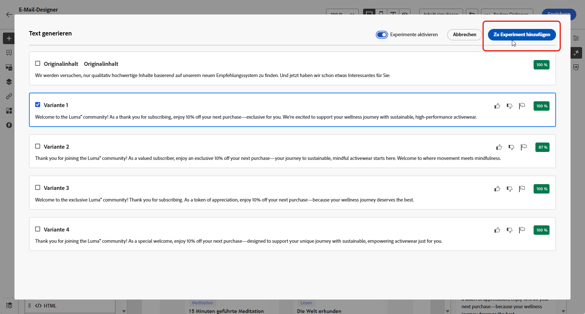

# Inhaltsexperiment mit dem KI-Assistenten {#generative-experimentation}

>[!BEGINSHADEBOX]

**Inhaltsverzeichnis**

* [Erste Schritte mit dem KI-Assistenten](gs-generative.md)
* [Generierung von E-Mails mit dem KI-Assistenten](generative-email.md)
* [Generierung von SMS mit dem KI-Assistenten](generative-sms.md)
* [Push-Generierung mit dem AI-Assistenten](generative-push.md)
* Inhaltsexperiment mit dem KI-Assistenten

>[!ENDSHADEBOX]

Nachdem Sie Ihre Nachrichten erstellt und personalisiert haben, heben Sie Ihren Inhalt mit dem AI-Assistenten in Adobe Journey Optimizer auf, der die Funktion &quot;Inhaltserstellung&quot;enthält. Mit diesem Tool können Sie mehrere Versandbehandlungen mit unterschiedlichem Inhalt definieren, um die Leistung Ihrer Zielgruppe zu messen.

1. Erstellen Sie Ihre Kampagne und generieren Sie Ihre Varianten mit dem KI-Assistenten.

   In diesem Beispiel haben wir eine Bestätigungs-E-Mail für ein Abonnement mit einem Angebotscode generiert.

   

1. Durchsuchen Sie die generierten **[!UICONTROL Varianten]** und klicken Sie auf **[!UICONTROL Vorschau]**, um eine Vollbildversion der ausgewählten Variante anzuzeigen.

   

1. Auswählen **[!UICONTROL Experiment aktivieren]** zur Erstellung **[!UICONTROL Behandlungen]** für Ihr Experiment.

1. Wählen Sie die Varianten aus, die Sie in Ihr Experiment aufnehmen möchten.

1. Klicks **X Behandlungen hinzufügen**.

   

1. Rufen Sie im Fenster &quot;Inhaltserstellung&quot;die **[!UICONTROL Experimenteinstellungen]** -Schaltfläche, um Ihr Experiment zu konfigurieren. [Erfahren Sie mehr über das Inhaltserlebnis](../campaigns/content-experiment.md)

   

1. Wenn Ihr Inhaltsexperiment fertig ist, können Sie auf Ihrer Kampagnenzusammenfassungs-Seite auf **[!UICONTROL Aktivieren]** um eine Zusammenfassung der Kampagne anzuzeigen. Warnhinweise werden angezeigt, wenn ein Parameter falsch ist oder fehlt. [Weitere Informationen](../campaigns/content-experiment.md#treatment-experiment)

1. Überprüfen Sie vor dem Start Ihrer Kampagne, ob alle Konfigurationen korrekt sind, und klicken Sie auf **[!UICONTROL Aktivieren]**.

Nach erfolgreicher Konfiguration und Personalisierung Ihrer Kampagne können Sie Ihre Kampagne im Kampagnenbericht verfolgen. [Weitere Informationen](../reports/campaign-global-report.md)
