# Vollständigen Inhalt mit dem KI-Assistenten generieren {#generative-full-content}

>[!IMPORTANT]
>
>Bevor Sie mit der Verwendung dieser Funktion beginnen, lesen Sie die entsprechenden Informationen zu [Leitlinien und Einschränkungen](gs-generative.md#generative-guardrails).
> 
>
>Sie müssen einer [Benutzervereinbarung](https://www.adobe.com/de/legal/licenses-terms/adobe-dx-gen-ai-user-guidelines.html) zustimmen, damit Sie den KI-Assistenten in Journey Optimizer verwenden können. Weitere Informationen erhalten Sie beim Adobe-Support.

Verwenden Sie den KI-Assistenten in Journey Optimizer, um vollständige Inhaltserlebnisse für E-Mail, Web, Landingpages und Push-Benachrichtigungskanäle zu generieren. Der KI-Assistent hilft Ihnen, die Wirkung Ihrer Sendungen zu optimieren, indem er umfassende Inhalte erstellt, die Ihre Audience ansprechen.

## Für E-Mail- und Web-Kanäle {#email-web-channels}

Der KI-Assistent kann vollständige Inhaltserlebnisse für E-Mail-Kampagnen, Web-Seiten und Landingpages erstellen und dabei sowohl Text als auch Bilder generieren. Mit dieser robusten Funktion können Sie ansprechende, markeninterne Inhalte erstellen, die über alle digitalen Touchpoints hinweg mit Ihrer Audience verbunden sind.

### Zugreifen auf und Konfigurieren {#access-configure}

Bevor Sie mit der Erstellung von Inhalten mit dem KI-Assistenten beginnen, müssen Sie Ihre Kampagne oder Journey einrichten und den Inhaltseditor öffnen. Gehen Sie wie folgt vor, um Ihren Arbeitsbereich vorzubereiten und auf das Bedienfeld KI-Assistent zuzugreifen.

1. Erstellen und konfigurieren Sie Ihre Kampagne oder Journey:
   * **E-**: Nachdem Sie Ihre E-Mail-Kampagne erstellt und konfiguriert haben, klicken Sie auf **[!UICONTROL Inhalt bearbeiten]**. [Weitere Informationen](../campaigns/create-campaign.md)
   * **Web**: Klicken Sie nach dem Erstellen und Konfigurieren Ihrer Web-Seite auf **[!UICONTROL Web-Seite bearbeiten]**. [Weitere Informationen](../web/create-web.md)
   * **Landingpage**: Klicken Sie nach dem Erstellen und Konfigurieren Ihrer Landingpage auf **[!UICONTROL Designer öffnen]**. [Weitere Informationen](../landing-pages/create-lp.md)

1. Wählen Sie im Menü rechts die Option **[!UICONTROL KI-Assistent]** (oder **[!UICONTROL Inhaltsassistent anzeigen]** für Web) aus.

   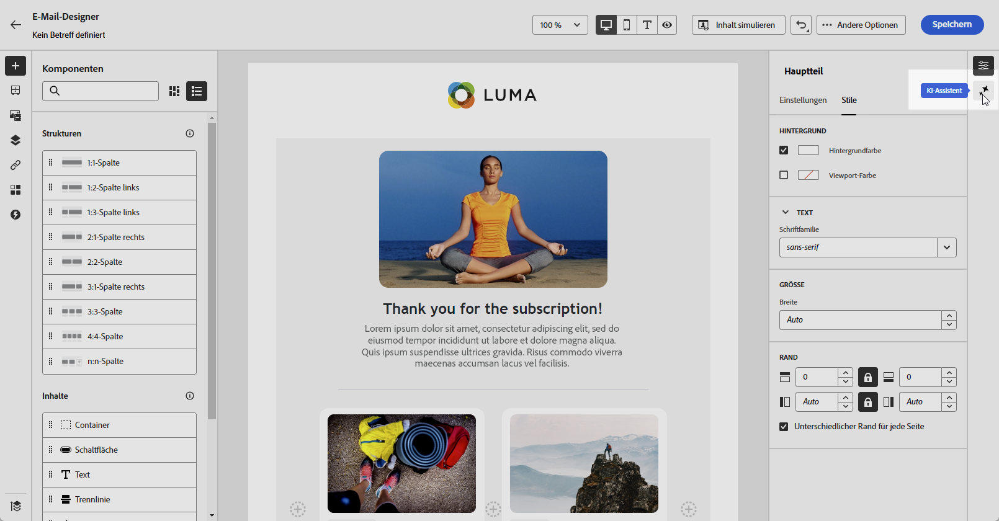{zoomable="yes"}

### Inhalt generieren {#generate-content}

Wenn der KI-Assistent geöffnet ist, können Sie jetzt die Generierungseinstellungen so konfigurieren, dass Inhalte erstellt werden, die Ihren Marken- und Kampagnenzielen entsprechen. Passen Sie Text- und Bildparameter an, fügen Sie Marken-Assets hinzu und geben Sie Aufforderungen an, um die KI bei der Generierung relevanter Varianten für Ihre Audience zu unterstützen.

1. Wählen Sie Ihre **[!UICONTROL Marke]** aus, um sicherzustellen, dass die KI-generierten Inhalte Ihren Markenspezifikationen entsprechen. [Erfahren Sie mehr](brands.md) über Marken.

1. Passen Sie den Inhalt an, indem Sie im Feld **[!UICONTROL Prompt]** beschreiben, was Sie generieren möchten.

   Wenn Sie Hilfe bei der Erstellung Ihrer Eingabeaufforderung benötigen, rufen Sie die **[!UICONTROL Eingabeaufforderungsbibliothek“ auf]** die eine Vielzahl von Ideen für die Eingabeaufforderung zur Verbesserung Ihrer Kampagnen bietet. [Erfahren Sie mehr über Best Practices zur Eingabeaufforderung](ai-assistant-prompting-guide.md)

   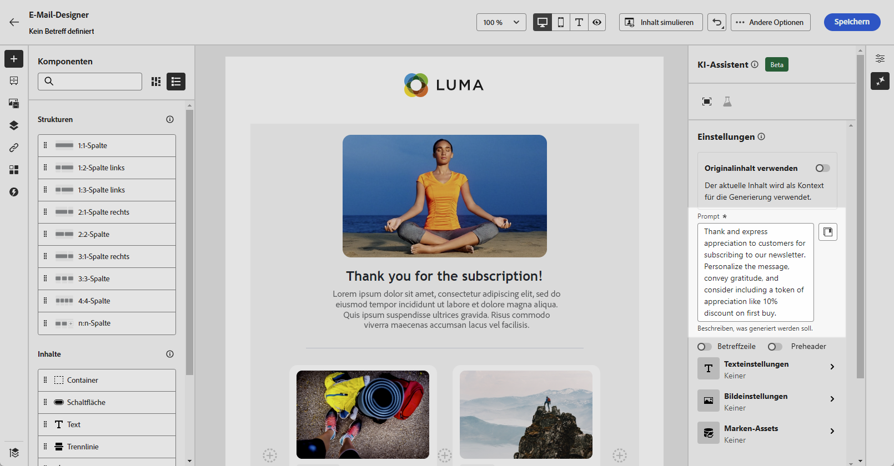{zoomable="yes"}

1. **Bei E** Mails können Sie die Optionen **[!UICONTROL Betreffzeile]** und **[!UICONTROL Preheader]** umschalten, um sie in die Variantengenerierung aufzunehmen.

1. Passen Sie Ihr Prompt mit der Option **[!UICONTROL Texteinstellungen]** an:

   * **[!UICONTROL Kommunikationsstrategie]**: Wählen Sie den am besten geeigneten Kommunikationsstil für den generierten Text aus.
   * **[!UICONTROL Sprachen]**: Wählen Sie die Sprache Ihrer generierten Inhalte.
   * **[!UICONTROL Ton]**: Der Ton sollte bei Ihrer Audience Anklang finden. Ob Sie nun informativ, humorvoll oder überzeugend klingen möchten, der KI-Assistent kann die Nachricht entsprechend anpassen.

     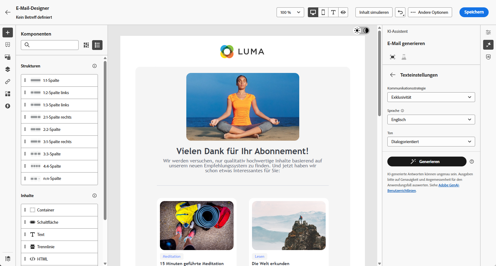{zoomable="yes"}

1. Wählen Sie die **[!UICONTROL Bildeinstellungen]**:

   * **[!UICONTROL Content-Typ]**: Hiermit wird die Art des visuellen Elements kategorisiert, wobei zwischen verschiedenen Arten der visuellen Darstellung wie Fotos, Grafiken oder Kunst unterschieden wird.
   * **[!UICONTROL Visuelle Intensität]**: Sie können die Wirkung des Bildes durch Anpassen seiner Intensität steuern. Eine niedrigere Einstellung (2) sorgt für ein weicheres, zurückhaltenderes Erscheinungsbild, während eine höhere Einstellung (10) das Bild lebendiger und visuell kräftiger macht.
   * **[!UICONTROL Farbe und Ton]**: Die Gesamterscheinung der Farben in einem Bild und die Stimmung oder Atmosphäre, die diese vermittelt.
   * **[!UICONTROL Beleuchtung]**: Dies bezieht sich auf die Beleuchtung in einem Bild, die dessen Atmosphäre prägt und bestimmte Elemente hervorhebt.
   * **[!UICONTROL Komposition]**: Dies bezieht sich auf die Anordnung der Elemente innerhalb des Rahmens eines Bildes.

     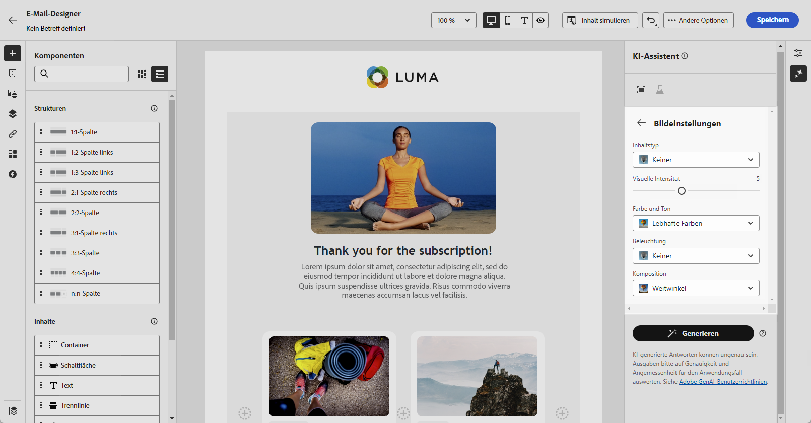{zoomable="yes"}

1. Klicken Sie im Menü **[!UICONTROL Referenzinhalt]** auf **[!UICONTROL Datei hochladen]**, um jedes Marken-Asset hinzuzufügen, das Inhalte enthält, die zusätzlichen Kontext-KI-Assistenten bereitstellen können oder ein zuvor hochgeladenes Asset auswählen.

   Zuvor hochgeladene Dateien sind in der Dropdown **[!UICONTROL Liste „Hochgeladener]**&quot; verfügbar. Wählen Sie einfach die Assets aus, die bei der Generierung berücksichtigt werden sollen.

   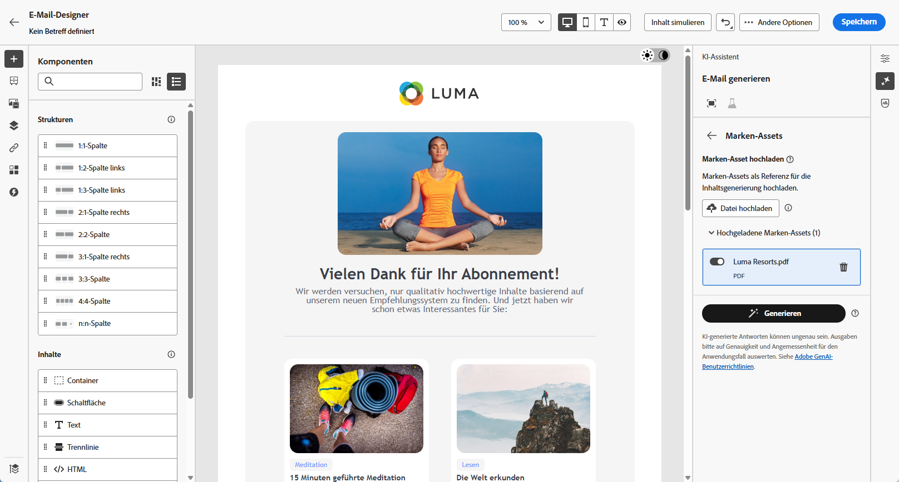{zoomable="yes"}

1. Wenn der Prompt fertig ist, klicken Sie auf **[!UICONTROL Generieren]**.

### Verfeinern und abschließen {#refine-finalize}

Nachdem Sie Inhaltsvarianten generiert haben, können Sie die Ergebnisse optimieren, um sicherzustellen, dass sie genau Ihren Anforderungen entsprechen. Überprüfen Sie die Markenausrichtung, passen Sie den Ton und die Sprache an und bereiten Sie den Inhalt für die Aktivierung in Ihrer Kampagne oder auf Ihrem Journey vor.

1. Navigieren Sie nach der Generierung durch **[!UICONTROL Varianten]**.

1. Klicken Sie auf das Prozentsymbol, um den **[!UICONTROL Markenausrichtungswert]** anzuzeigen und Abweichungen von Ihrer Marke zu identifizieren.

   Weitere Informationen finden Sie unter [Markenausrichtungswert](brands-score.md).

   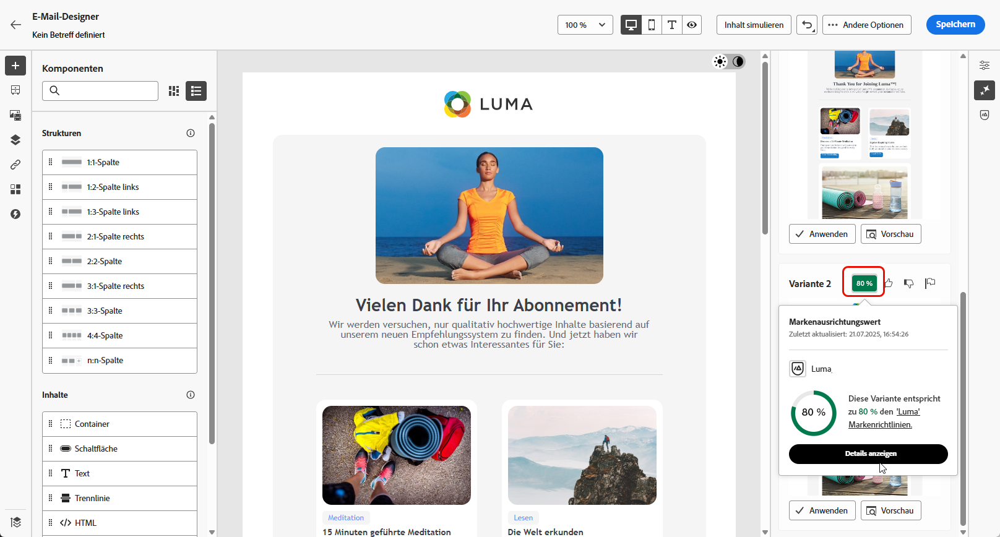{zoomable="yes"}

1. Klicken Sie auf **[!UICONTROL Vorschau]**, um eine Vollbildversion der ausgewählten Variante anzuzeigen, oder auf **[!UICONTROL Anwenden]**, um Ihren aktuellen Inhalt zu ersetzen.

1. Navigieren Sie im Fenster **[!UICONTROL Vorschau]** zur Option **[!UICONTROL Verfeinern]**, um auf zusätzliche Anpassungsfunktionen zuzugreifen:

   * **[!UICONTROL Umformulieren]**: Schreiben Sie die Nachricht neu, ohne ihre Bedeutung zu verlieren. Mit dieser Option können Sie alternative Formulierungen erstellen, den Fluss verbessern oder die Formulierungen anpassen, ohne die Kernbotschaft zu ändern.

   * **[!UICONTROL Einfachere Sprache verwenden]**: Nutzen Sie den KI-Assistenten, um Ihren Text zu vereinfachen, damit er für eine breitere Zielgruppe verständlich und zugänglich ist.

   * **[!UICONTROL Übersetzen]**: Vereinfachen Sie Ihre Sprache, um einer breiteren Zielgruppe Klarheit und Zugänglichkeit zu verschaffen.

   * **[!UICONTROL Ton ändern]**: Passen Sie den Ton der Nachricht an Ihren Kommunikationsstil an, d. h. sie freundlicher, professioneller, dringender oder inspirierender zu gestalten.

   * **[!UICONTROL Kommunikationsstrategie ändern]**: Ändern Sie den Messaging-Ansatz basierend auf Ihren Zielen, z. B. der Schaffung von Dringlichkeit oder der Betonung aufregender Attraktivität.

     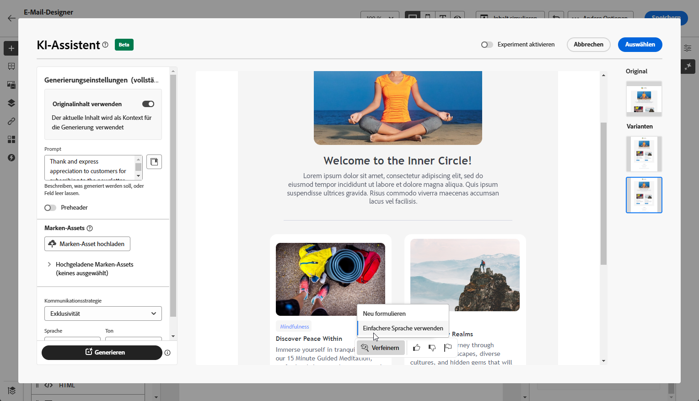{zoomable="yes"}

1. Öffnen Sie die Registerkarte **[!UICONTROL Markenausrichtung]**, um zu sehen, wie gut Ihr Inhalt mit Ihren [Markenrichtlinien](brands.md) abgestimmt ist.

1. Klicken Sie auf **[!UICONTROL Auswählen]**, sobald Sie den passenden Inhalt gefunden haben.

   Sie können auch ein Experiment für Ihren Inhalt aktivieren. [Weitere Informationen](generative-experimentation.md)

1. Fügen Sie Personalisierungsfelder ein, um Ihren Inhalt auf der Grundlage von Profildaten anzupassen. Klicken Sie danach auf die Schaltfläche **[!UICONTROL Inhalte simulieren]**, um das Rendern zu steuern, und überprüfen Sie die Personalisierungseinstellungen mit Testprofilen. [Weitere Informationen](../personalization/personalize.md)

1. Überprüfen und Aktivieren Ihres Inhalts:
   * **E** Mail: Wenn Sie Inhalt, Zielgruppe und Zeitplan definiert haben, können Sie Ihre E-Mail-Kampagne vorbereiten. [Weitere Informationen](../campaigns/review-activate-campaign.md)
   * **Web**: Nachdem Sie Ihre Web-Kampagneneinstellungen definiert und Ihren Inhalt nach Bedarf bearbeitet haben, können Sie Ihre Web-Kampagne überprüfen und aktivieren. [Weitere Informationen](../web/create-web.md#activate-web-campaign)
   * **Landingpage**: Sobald Ihre Landingpage fertig ist, können Sie sie veröffentlichen, um sie für die Verwendung in einer Nachricht verfügbar zu machen. [Weitere Informationen](../landing-pages/create-lp.md#publish-landing-page)

## Für mobile Kanäle {#mobile-channels}

Der KI-Assistent unterstützt auch die Inhaltserstellung für mobile Push-Benachrichtigungen und ermöglicht Ihnen so die Erstellung ansprechender Titel, Nachrichten und Bilder für Ihre Mobile Apps. Dies hilft Ihnen, eine konsistente, hochwertige Kommunikation über alle Kunden-Touchpoints hinweg aufrechtzuerhalten, einschließlich mobiler Geräte.

### Zugreifen auf und Konfigurieren {#mobile-access-configure}

Um den KI-Assistenten für Push-Benachrichtigungen zu verwenden, richten Sie zunächst Ihre Push-Kampagne ein und öffnen Sie den Inhaltseditor. Die folgenden Schritte führen Sie durch die Vorbereitung Ihrer Kampagne und den Zugriff auf die KI-Assistenten-Tools.

1. Nachdem Sie Ihre Push-Benachrichtigungs-Kampagne erstellt und konfiguriert haben, klicken Sie auf **[!UICONTROL Inhalt bearbeiten]**.

   Weitere Informationen zur Konfiguration Ihrer Push-Benachrichtigungs-Kampagne finden Sie auf [dieser Seite](../push/create-push.md).

1. Füllen Sie die **[!UICONTROL grundlegenden Details]** für Ihre Kampagne aus. Klicken Sie abschließend auf **[!UICONTROL Inhalt bearbeiten]**.

1. Personalisieren Sie Ihre Push-Benachrichtigung nach Bedarf. [Weitere Informationen](../push/design-push.md)

1. Rufen Sie das Menü **[!UICONTROL KI-Assistenten anzeigen]** auf.

   {zoomable="yes"}

### Inhalt generieren {#mobile-generate-content}

Nachdem Sie auf den KI-Assistenten für Push-Benachrichtigungen zugegriffen haben, können Sie die Erzeugungseinstellungen konfigurieren, um ansprechende Inhalte für Mobilgeräte zu erstellen. Definieren Sie Ihre Text- und Bildvoreinstellungen, wählen Sie Marken-Assets aus und verwenden Sie Eingabeaufforderungen, um Push-Benachrichtigungs-Varianten zu generieren, die Ihre Mobile-Benutzer ansprechen.

1. Aktivieren Sie für den KI-Assistenten die Option **[!UICONTROL Originalinhalt verwenden]**, um neue Inhalte basierend auf dem ausgewählten Inhalt zu personalisieren.

1. Wählen Sie Ihre **[!UICONTROL Marke]** aus, um sicherzustellen, dass die KI-generierten Inhalte Ihren Markenspezifikationen entsprechen. [Erfahren Sie mehr](brands.md) über Marken.

   Beachten Sie, dass die Marken-Funktion als Private Beta veröffentlicht und in zukünftigen Versionen schrittweise allen Kundinnen und Kunden zur Verfügung gestellt wird.

1. Passen Sie den Inhalt an, indem Sie im Feld **[!UICONTROL Prompt]** beschreiben, was Sie generieren möchten.

   Wenn Sie Hilfe bei der Erstellung Ihres Prompts benötigen, finden Sie in der **[!UICONTROL Prompt-Bibliothek]** eine Vielzahl von Ideen für Prompts, mit denen Sie Ihre Kampagnen verbessern können.

   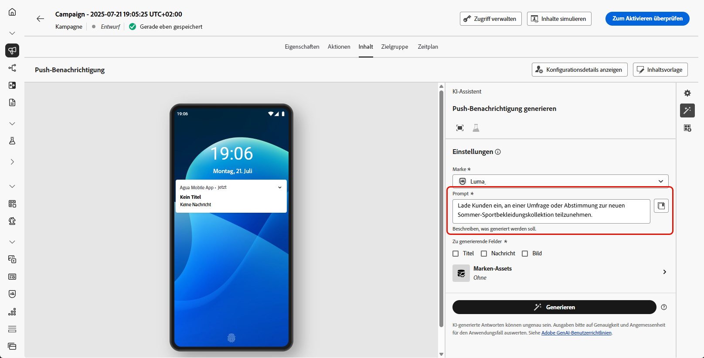{zoomable="yes"}

1. Wählen Sie das zu generierende Feld aus: **[!UICONTROL Titel]**, **[!UICONTROL Nachricht]** und/oder **[!UICONTROL Bild]**.

1. Passen Sie Ihr Prompt mit der Option **[!UICONTROL Texteinstellungen]** an:

   * **[!UICONTROL Kommunikationsstrategie]**: Wählen Sie den am besten geeigneten Kommunikationsstil für den generierten Text aus.
   * **[!UICONTROL Sprachen]**: Wählen Sie die Sprache Ihrer generierten Inhalte.
   * **[!UICONTROL Ton]**: Der Ton der Push-Benachrichtigung sollte bei Ihrer Zielgruppe ankommen. Ob Sie nun informativ, humorvoll oder überzeugend klingen möchten, der KI-Assistent kann die Nachricht entsprechend anpassen.

     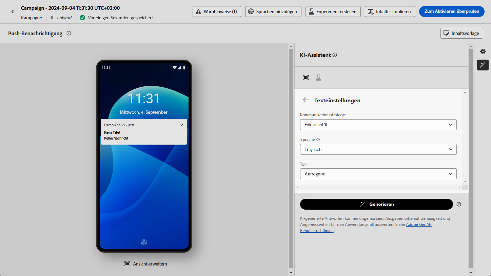{zoomable="yes"}

1. Wählen Sie die **[!UICONTROL Bildeinstellungen]**:

   * **[!UICONTROL Content-Typ]**: Hiermit wird die Art des visuellen Elements kategorisiert, wobei zwischen verschiedenen Arten der visuellen Darstellung wie Fotos, Grafiken oder Kunst unterschieden wird.
   * **[!UICONTROL Visuelle Intensität]**: Sie können die Wirkung des Bildes durch Anpassen seiner Intensität steuern. Eine niedrigere Einstellung (2) sorgt für ein weicheres, zurückhaltenderes Erscheinungsbild, während eine höhere Einstellung (10) das Bild lebendiger und visuell kräftiger macht.
   * **[!UICONTROL Farbe und Ton]**: Die Gesamterscheinung der Farben in einem Bild und die Stimmung oder Atmosphäre, die diese vermittelt.
   * **[!UICONTROL Beleuchtung]**: Dies bezieht sich auf die Beleuchtung in einem Bild, die dessen Atmosphäre prägt und bestimmte Elemente hervorhebt.
   * **[!UICONTROL Komposition]**: Dies bezieht sich auf die Anordnung der Elemente innerhalb des Rahmens eines Bildes.

     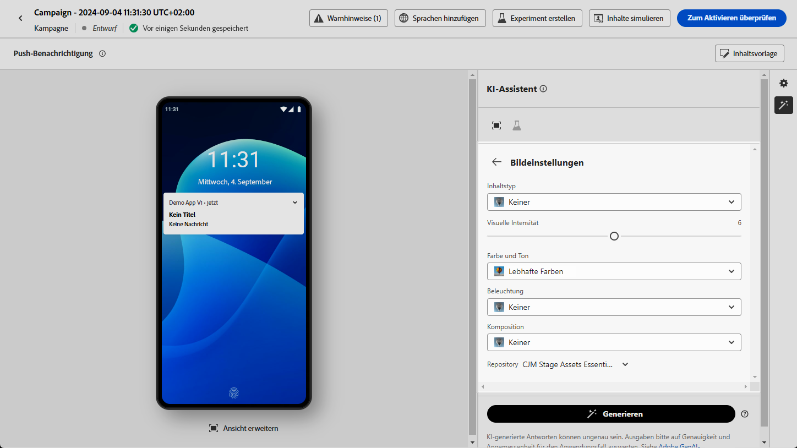{zoomable="yes"}

1. Klicken Sie im Menü **[!UICONTROL Referenzinhalt]** auf **[!UICONTROL Datei hochladen]**, um jedes Marken-Asset hinzuzufügen, das Inhalte enthält, die zusätzlichen Kontext-KI-Assistenten bereitstellen können oder ein zuvor hochgeladenes Asset auswählen.

   Zuvor hochgeladene Dateien sind in der Dropdown **[!UICONTROL Liste „Hochgeladener]**&quot; verfügbar. Wählen Sie einfach die Assets aus, die bei der Generierung berücksichtigt werden sollen.

1. Wenn das Prompt fertig ist, klicken Sie auf **[!UICONTROL Generieren]**.

### Verfeinern und abschließen {#mobile-refine-finalize}

Nachdem Sie Ihre generierten Push-Benachrichtigungs-Varianten überprüft haben, können Sie den Inhalt bis zur Perfektion polieren. Verwenden Sie Verfeinerungs-Tools, um Sprache und Ton anzupassen, die Markenausrichtung zu überprüfen und den Inhalt zu personalisieren, bevor Sie Ihre Push-Kampagne aktivieren.

1. Durchsuchen Sie die generierten **[!UICONTROL Varianten]**.

1. Klicken Sie auf das Prozentsymbol, um den **[!UICONTROL Markenausrichtungswert]** anzuzeigen und Abweichungen von Ihrer Marke zu identifizieren.

   Weitere Informationen finden Sie unter [Markenausrichtungswert](brands-score.md).

   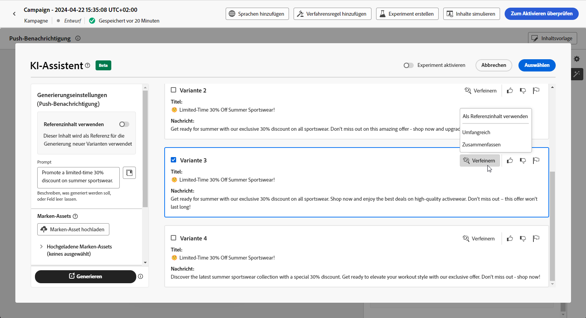{zoomable="yes"}

1. Klicken Sie auf **[!UICONTROL Vorschau]**, um eine Vollbildversion der ausgewählten Variante anzuzeigen, oder auf **[!UICONTROL Anwenden]**, um Ihren aktuellen Inhalt zu ersetzen.

1. Navigieren Sie im Fenster **[!UICONTROL Vorschau]** zur Option **[!UICONTROL Verfeinern]**, um auf zusätzliche Anpassungsfunktionen zuzugreifen:

   * **[!UICONTROL Als Referenzinhalt verwenden]**: Die gewählte Variante dient hierbei als Referenzinhalt für die Generierung anderer Ergebnisse.

   * **[!UICONTROL Umformulieren]**: Schreiben Sie die Nachricht neu, ohne ihre Bedeutung zu verlieren. Mit dieser Option können Sie alternative Formulierungen erstellen, den Fluss verbessern oder die Formulierungen anpassen, ohne die Kernbotschaft zu ändern.

   * **[!UICONTROL Einfachere Sprache verwenden]**: Nutzen Sie den KI-Assistenten, um Ihren Text zu vereinfachen, damit er für eine breitere Zielgruppe verständlich und zugänglich ist.

   * **[!UICONTROL Ton ändern]**: Passen Sie den Ton der Nachricht an Ihren Kommunikationsstil an, d. h. sie freundlicher, professioneller, dringender oder inspirierender zu gestalten.

   * **[!UICONTROL Kommunikationsstrategie ändern]**: Ändern Sie den Messaging-Ansatz basierend auf Ihren Zielen, z. B. der Schaffung von Dringlichkeit oder der Betonung aufregender Attraktivität.

     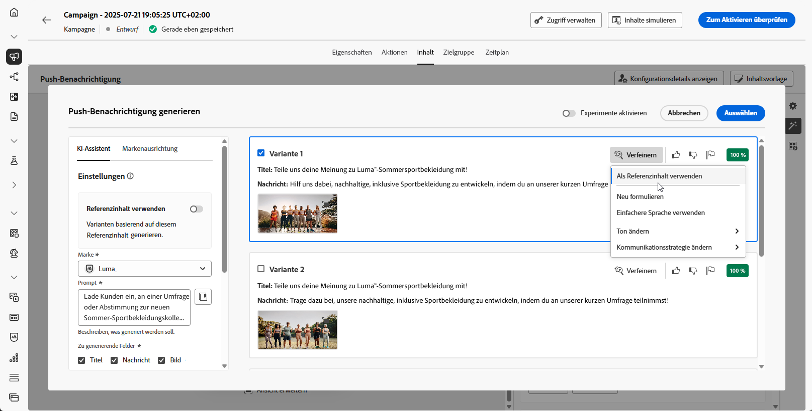{zoomable="yes"}

1. Öffnen Sie die Registerkarte **[!UICONTROL Markenausrichtung]**, um zu sehen, wie gut Ihr Inhalt mit Ihren [Markenrichtlinien](brands.md) abgestimmt ist.

1. Klicken Sie auf **[!UICONTROL Auswählen]**, sobald Sie den passenden Inhalt gefunden haben.

   Sie können auch ein Experiment für Ihren Inhalt aktivieren. [Weitere Informationen](generative-experimentation.md)

1. Fügen Sie Personalisierungsfelder ein, um Ihre Push-Benachrichtigung auf der Grundlage von Profildaten anzupassen. Klicken Sie danach auf die Schaltfläche **[!UICONTROL Inhalte simulieren]**, um das Rendern zu steuern, und überprüfen Sie die Personalisierungseinstellungen mit Testprofilen. [Weitere Informationen](../personalization/personalize.md)

Wenn Sie Inhalt, Zielgruppe und Zeitplan definiert haben, können Sie Ihre Push-Benachrichtigungs-Kampagne vorbereiten. [Weitere Informationen](../campaigns/review-activate-campaign.md)

## Anleitungsvideo {#video}

Erfahren Sie, wie Sie mit dem KI-Assistenten in Journey Optimizer vollständige Inhaltserlebnisse generieren können.

>[!VIDEO](https://video.tv.adobe.com/v/3433552)
