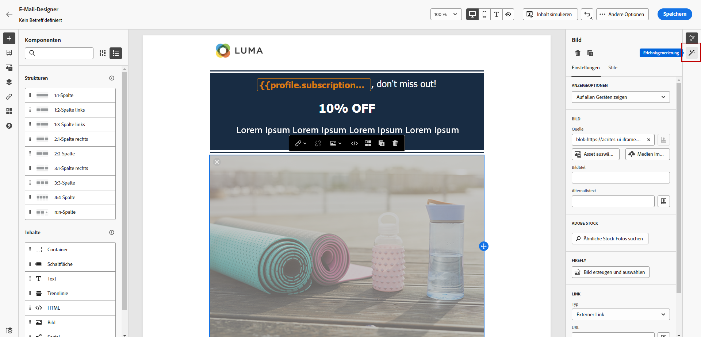
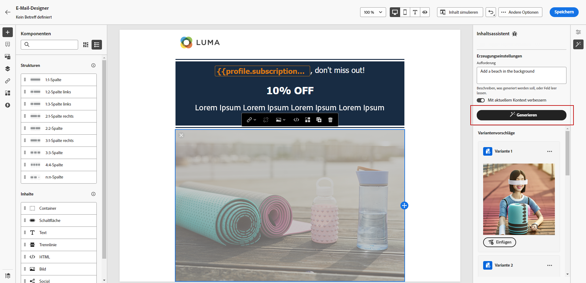
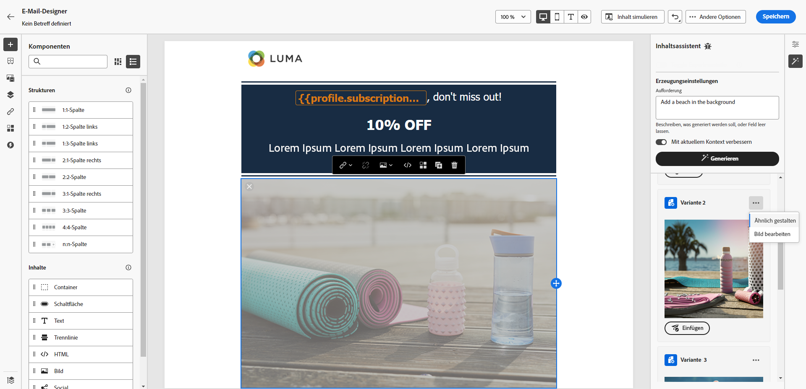
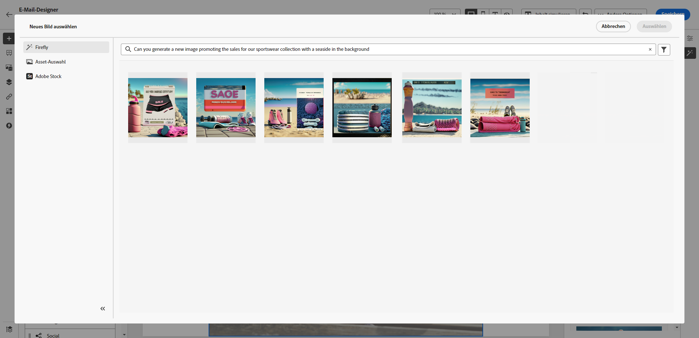
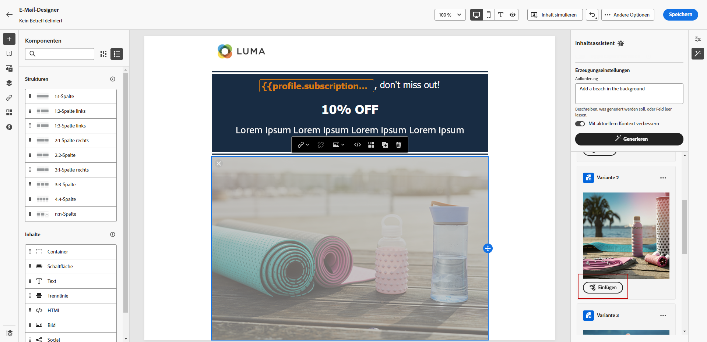
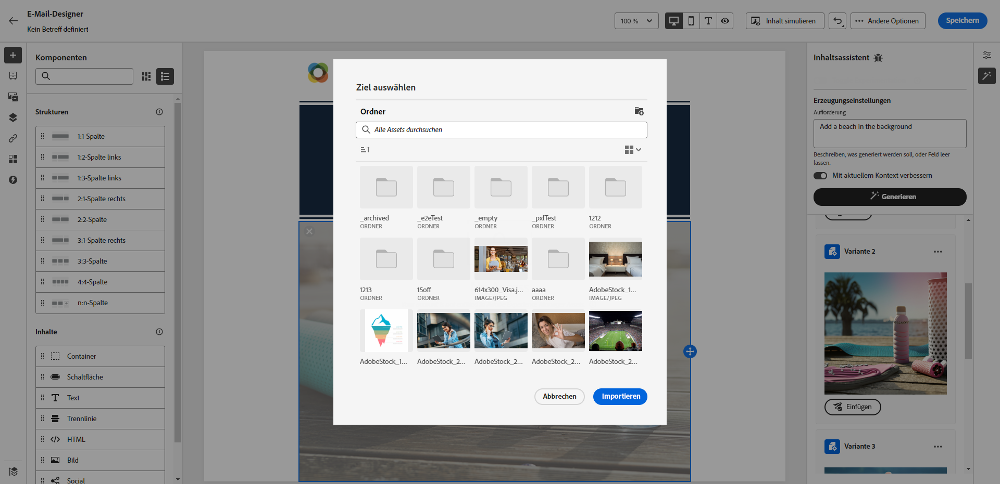

# Generieren von Bildern mit dem Inhaltsassistenten {#image-content-assistant}

>[!BEGINSHADEBOX]

**Inhaltsverzeichnis**

* [Erste Schritte mit dem Inhaltsassistenten](gs-generative.md)
* [Generieren von Text mit dem Inhaltsassistenten](generative-title.md)
* **[Generieren von Bildern mit dem Inhaltsassistenten](generative-image.md)**

>[!ENDSHADEBOX]

Nachdem Sie Ihre E-Mails oder Webseiten erstellt und personalisiert haben, stellen Sie Ihren Inhalt mit dem Inhaltsassistenten auf die nächste Stufe. Mit diesem leistungsstarken Tool können Sie Ihre Inhalte mühelos personalisieren und erweitern.

Im folgenden Beispiel erfahren Sie, wie Sie mit dem Inhaltsassistenten Ihre Assets aktualisieren und verbessern können, um ein besseres Benutzererlebnis zu erzielen. Führen Sie folgende Schritte aus:

1. Klicken Sie nach der Erstellung und Konfiguration Ihrer Nachricht auf **[!UICONTROL Inhalt erstellen]** und personalisieren Sie sie nach Bedarf.

1. Wählen Sie mit dem Inhaltsassistenten das Asset aus, das Sie ändern möchten.

1. Wählen Sie aus dem Kontextmenü die Option **[!UICONTROL Erlebniserzeugung]**.

   

1. Fügen Sie eine Eingabeaufforderung hinzu, um Ihre Ergebnisse besser anzupassen, und klicken Sie auf **[!UICONTROL Erzeugen]**.

   Aktivieren Sie die **[!UICONTROL Erweiterung mit aktuellem Inhalt]** -Option, damit der Inhaltsassistent neue Assets basierend auf Ihrer Nachricht, dem Kampagnennamen und der ausgewählten Zielgruppe personalisieren kann.

   

1. Durchsuchen Sie die **[!UICONTROL Variantenvorschläge]** , um das gewünschte Asset zu finden.

1. Sobald Sie Ihre **[!UICONTROL Variante]**, öffnen Sie das erweiterte Menü Ihres ausgewählten Assets.

   

1. Sie können **[!UICONTROL Ähnliches machen]** um je nach ausgewählter Variante eine weitere Variante zu generieren.

1. Klicks **[!UICONTROL Bild bearbeiten]** , um auf die **[!UICONTROL Neues Bild auswählen]** Menü.

1. Über dieses Menü können Sie ein neues Asset generieren oder ein vorhandenes Asset aus Ihren Assets-Ordnern verwenden.

   

1. Klicks **[!UICONTROL Einfügen]** , um das generierte Asset zu Ihrem Inhalt hinzuzufügen.

   

1. Wählen Sie aus, in welchem Ordner Sie das generierte Asset speichern möchten, und klicken Sie auf **[!UICONTROL Import]**.

   

1. Klicken Sie nach der Definition des Nachrichteninhalts auf die Schaltfläche **[!UICONTROL Inhalt simulieren]** zur Steuerung des Renderings und zur Überprüfung der Personalisierungseinstellungen mit Testprofilen. [Weitere Informationen](../email/preview.md)

1. Wenn Ihre Nachricht fertig ist, können Sie auf Ihrer Kampagnenübersichtsseite auf **[!UICONTROL Aktivieren]** um eine Zusammenfassung der Kampagne anzuzeigen. Warnhinweise werden angezeigt, wenn Parameter falsch sind oder fehlen.

1. Überprüfen Sie vor dem Start Ihrer Kampagne, ob alle Konfigurationen korrekt sind, und klicken Sie auf **[!UICONTROL Aktivieren]**.

Nach erfolgreicher Konfiguration Ihrer Experimentierung und Kampagne können Sie Ihre Kampagne im Kampagnenbericht verfolgen. [Weitere Informationen](../reports/campaign-global-report.md#experimentation-report)