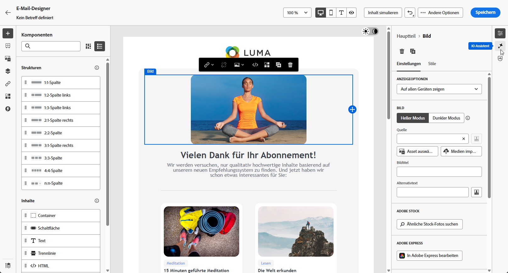
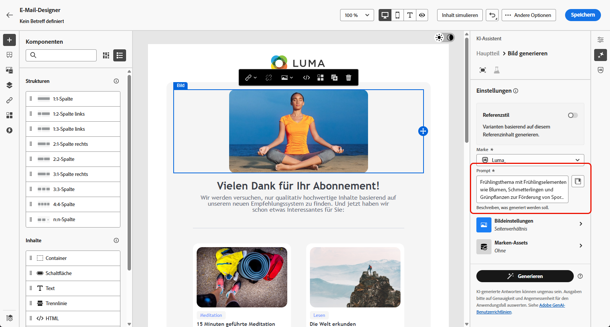
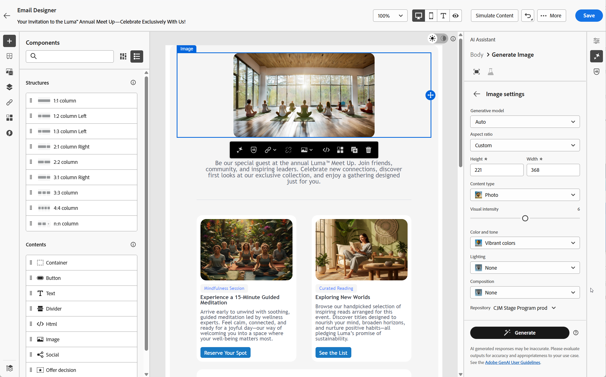
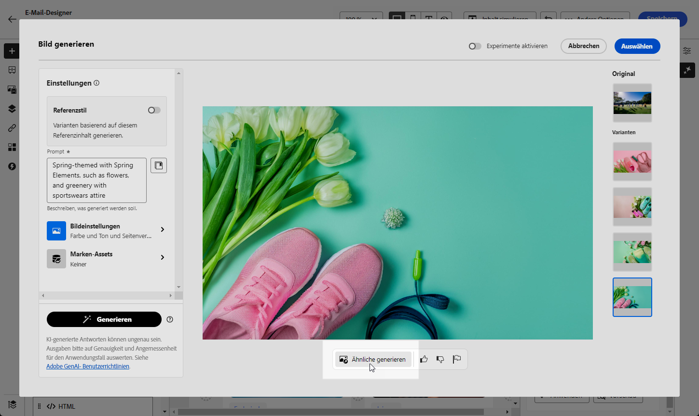
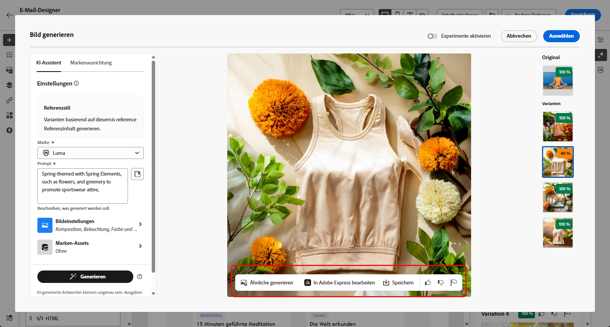
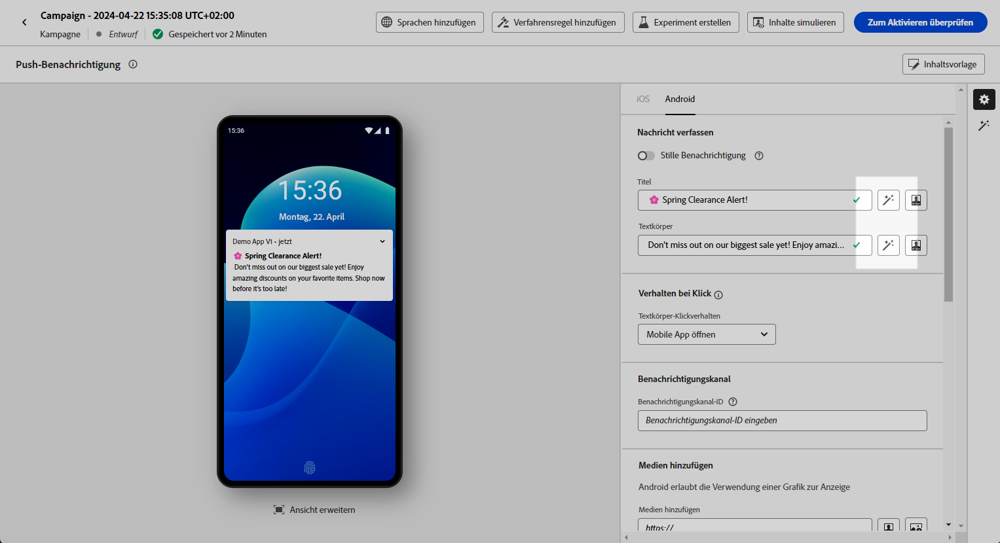
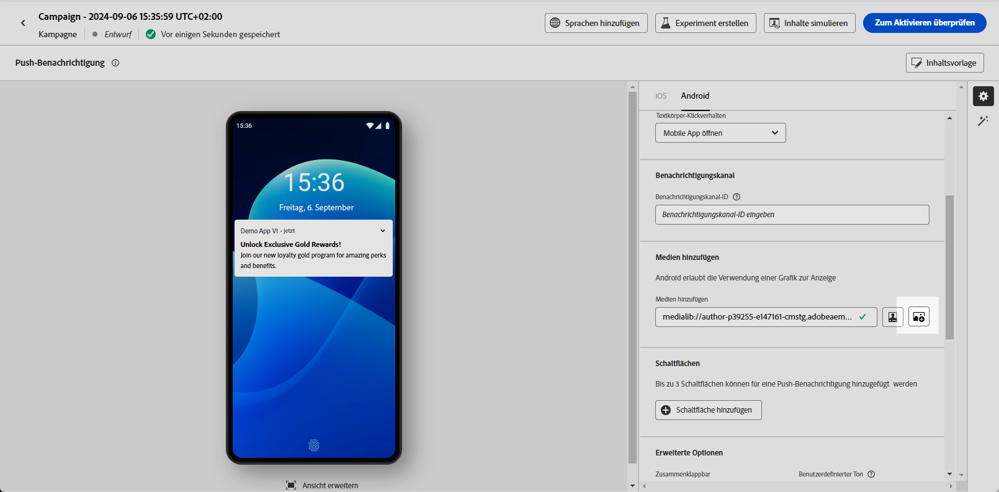
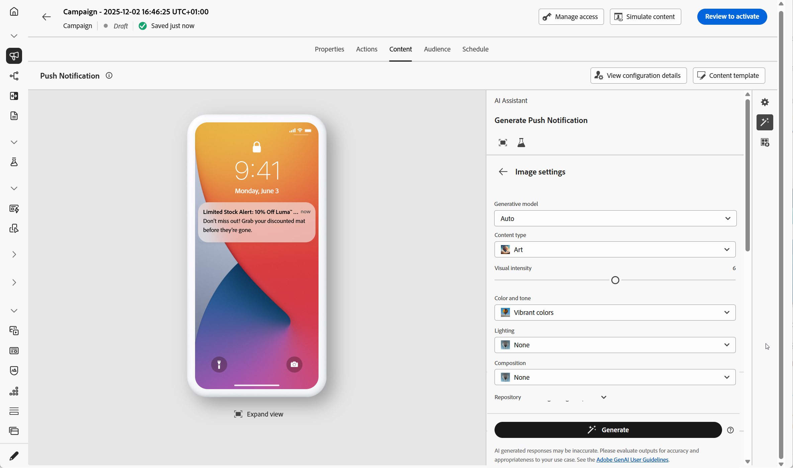
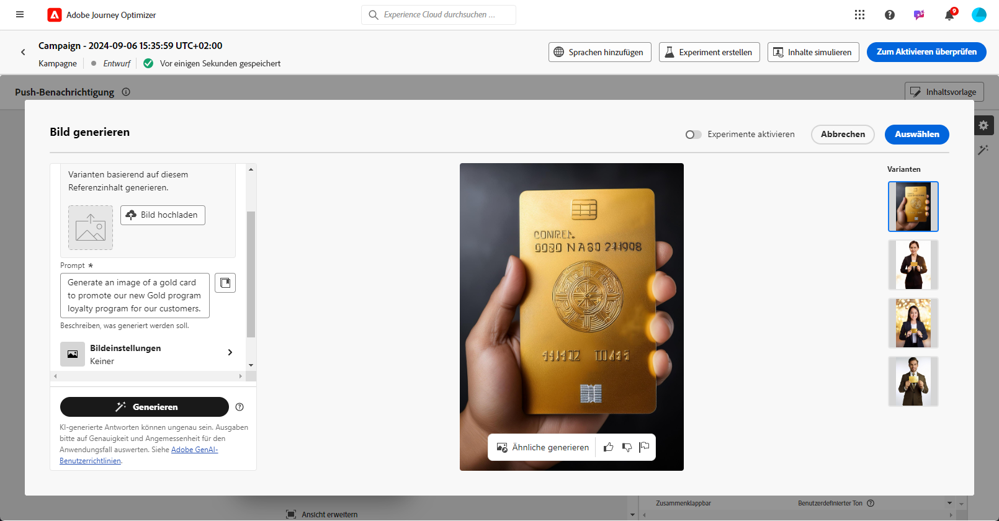

# Generieren von Bildern mit dem KI-Assistenten {#generative-image}

>[!IMPORTANT]
>
>Bevor Sie mit der Verwendung dieser Funktion beginnen, lesen Sie die entsprechenden Informationen zu [Leitlinien und Einschränkungen](gs-generative.md#generative-guardrails).
> 
>
>Sie müssen einer [Benutzervereinbarung](https://www.adobe.com/de/legal/licenses-terms/adobe-dx-gen-ai-user-guidelines.html) zustimmen, damit Sie den KI-Assistenten in Journey Optimizer verwenden können. Weitere Informationen erhalten Sie beim Adobe-Support.

Verwenden Sie den KI-Assistenten in Journey Optimizer, um ansprechende visuelle Inhalte zu erstellen, die Ihre Nachrichten für E-Mails, Web, Landingpages und Push-Benachrichtigungen optimieren. Der KI-Assistent hilft Ihnen, Ihre Assets zu optimieren und zu verbessern, um Ihrer Zielgruppe ein benutzerfreundlicheres und ansprechenderes Erlebnis zu bieten.

## Für E-Mail- und Web-Kanäle {#email-web-channels}

Der KI-Assistent kann vollständige visuelle Erlebnisse für Ihre E-Mail-Kampagnen, Web-Erlebnisse und Landingpages generieren. Mit dieser Funktion können Sie markenkonforme, aufmerksamkeitserregende Bilder erstellen, die über digitale Touchpoints hinweg bei Ihrer Zielgruppe Anklang finden.

### Zugriff und Konfiguration {#access-configure}

Um mit dem Generieren von Bildern mit dem KI-Assistenten zu beginnen, richten Sie zunächst Ihre Kampagne oder Journey ein und öffnen Sie den Inhaltseditor. Gehen Sie wie folgt vor, um Ihren Arbeitsbereich vorzubereiten und auf das Panel „KI-Assistent“ zuzugreifen.

1. Erstellen und konfigurieren Sie die Kampagne oder Journey:
   * **E-Mail:** Nachdem Sie Ihre E-Mail-Kampagne erstellt und konfiguriert haben, klicken Sie auf **[!UICONTROL Inhalt bearbeiten]**. [Weitere Informationen](../email/create-email.md)
   * **Web:** Nachdem Sie Ihre Web-Seite erstellt und konfiguriert haben, klicken Sie auf **[!UICONTROL Web-Seite bearbeiten]**. [Weitere Informationen](../web/create-web.md)
   * **Landingpage:** Nachdem Sie Ihre Landingpage erstellt und konfiguriert haben, klicken Sie auf **[!UICONTROL Designer öffnen]**. [Weitere Informationen](../landing-pages/create-lp.md)

1. Wählen Sie das Asset aus, das mit dem KI-Assistenten geändert werden soll.

1. Wählen Sie im Menü rechts die Option **[!UICONTROL KI-Assistent]** aus (bzw. **[!UICONTROL Inhaltsassistent anzeigen]** für Web).

   {zoomable="yes"}

### Generieren von Inhalt {#generate-content}

Erfahren Sie, wie Sie effektive Prompts erstellen und Bildeinstellungen konfigurieren können, um visuell überzeugende Bilder mit dem KI-Assistenten zu generieren. Passen Sie Parameter wie Seitenverhältnis, visuelle Intensität und Beleuchtung an, um Bilder zu erstellen, die Ihren Marken- und Kampagnenzielen entsprechen.

1. Aktivieren Sie für den KI-Assistenten die Option **[!UICONTROL Referenzstil]**, um neue Inhalte basierend auf dem Referenzinhalt zu personalisieren. Sie können auch ein Bild hochladen, um Ihrer Variante Kontext hinzuzufügen.

1. Wählen Sie Ihre **[!UICONTROL Marke]** aus, um sicherzustellen, dass die KI-generierten Inhalte Ihren Markenspezifikationen entsprechen. [Erfahren Sie mehr](brands.md) über Marken.

1. Passen Sie den Inhalt an, indem Sie im Feld **[!UICONTROL Prompt]** beschreiben, was Sie generieren möchten.

   Wenn Sie Hilfe bei der Erstellung Ihres Prompts benötigen, finden Sie in der **[!UICONTROL Prompt-Bibliothek]** eine Vielzahl von Ideen für Prompts, mit denen Sie Ihre Kampagnen verbessern können.

   {zoomable="yes"}

1. Passen Sie Ihr Prompt mit der Option **[!UICONTROL Bildeinstellungen]** an:

   * **[!UICONTROL Generatives Modell]**: Wählen Sie aus dem einsatzbereiten **[!UICONTROL Adobe-]**, dem **[!UICONTROL Partnermodell]** für spezielle Funktionen oder **[!UICONTROL Benutzerdefinierte Modelle]**, die auf Ihren Marken-Assets trainiert wurden. [Weitere Informationen](generative-models.md). Um das Partnermodell (**Gemini**) mit **Textüberlagerungen** auf generierten Bildern zu verwenden, siehe [Verwenden von Gemini als generatives Modell für Textüberlagerungsbild](generative-uc.md#generative-gemini).
   * **[!UICONTROL Seitenverhältnis]**: Dadurch wird die Breite und Höhe des Assets bestimmt. Sie können aus gängigen Verhältnissen wie 16:9, 4:3, 3:2 oder 1:1 wählen oder eine benutzerdefinierte Größe eingeben.
   * **[!UICONTROL Content-Typ]**: Hiermit wird die Art des visuellen Elements kategorisiert, wobei zwischen verschiedenen Arten der visuellen Darstellung wie Fotos, Grafiken oder Kunst unterschieden wird.
   * **[!UICONTROL Visuelle Intensität]**: Sie können die Wirkung des Bildes durch Anpassen seiner Intensität steuern. Eine niedrigere Einstellung (2) sorgt für ein weicheres, zurückhaltenderes Erscheinungsbild, während eine höhere Einstellung (10) das Bild lebendiger und visuell kräftiger macht.
   * **[!UICONTROL Farbe und Ton]**: Die Gesamterscheinung der Farben in einem Bild und die Stimmung oder Atmosphäre, die diese vermittelt.
   * **[!UICONTROL Beleuchtung]**: Dies bezieht sich auf die Beleuchtung in einem Bild, die dessen Atmosphäre prägt und bestimmte Elemente hervorhebt.
   * **[!UICONTROL Komposition]**: Dies bezieht sich auf die Anordnung der Elemente innerhalb des Rahmens eines Bildes.

     {zoomable="yes"}

1. Klicken Sie im Menü **[!UICONTROL Referenzinhalt]** auf **[!UICONTROL Datei hochladen]**, um beliebige Marken-Assets mit Inhalten hinzuzufügen, die zusätzlichen Kontext für den KI-Assistenten liefern können. Alternativ können Sie ein zuvor hochgeladenes Asset auswählen.

   Zuvor hochgeladene Dateien sind in der Dropdown-Liste **[!UICONTROL Hochgeladener Referenzinhalt]** verfügbar. Wählen Sie einfach die Assets aus, die bei der Generierung berücksichtigt werden sollen.

1. Sobald Sie mit der Konfiguration des Prompts zufrieden sind, klicken Sie auf **[!UICONTROL Generieren]**.

### Verfeinern und Fertigstellen {#refine-finalize}

Nachdem Sie Bildvarianten generiert haben, können Sie die Ergebnisse anzeigen, die Markenausrichtung prüfen, Bearbeitungen in Adobe Express durchführen und die beste Option für Ihren Inhalt auswählen.

1. Durchsuchen Sie die **[!UICONTROL Variantenvorschläge]**, um das gewünschte Asset zu finden.

1. Klicken Sie auf das Prozentsymbol, um den **[!UICONTROL Markenausrichtungswert]** anzuzeigen und Abweichungen von Ihrer Marke zu identifizieren.

   Weitere Informationen finden Sie unter [Markenausrichtungswert](brands-score.md).

   {zoomable="yes"}

1. Klicken Sie auf **[!UICONTROL Vorschau]**, um eine Vollbildversion der ausgewählten Variante anzuzeigen, oder auf **[!UICONTROL Anwenden]**, um Ihren aktuellen Inhalt zu ersetzen.

1. Navigieren Sie im Fenster **[!UICONTROL Vorschau]** zur Option **[!UICONTROL Verfeinern]**, um auf zusätzliche Anpassungsfunktionen zuzugreifen:

   * Mit **[!UICONTROL Ähnliche generieren]** können Sie verwandte Bilder für diese Variante anzeigen.
   * Mit **[!UICONTROL In Adobe Express bearbeiten]** können Sie Ihr Asset weiter anpassen.

[Weitere Informationen zur Adobe Express-Integration](../integrations/express.md)

   * Mit **[!UICONTROL Speichern]** können Sie die Assets für den späteren Zugriff speichern.

     {zoomable="yes"}

1. Klicken Sie auf **[!UICONTROL Auswählen]**, sobald Sie den passenden Inhalt gefunden haben.

   Sie können auch ein Experiment für Ihren Inhalt aktivieren. [Weitere Informationen](generative-experimentation.md)

1. Klicken Sie nach dem Definieren des Nachrichteninhalts auf die Schaltfläche **[!UICONTROL Inhalt simulieren]**, um das Rendern zu kontrollieren und die Personalisierungseinstellungen mit Testprofilen zu überprüfen. [Weitere Informationen](../personalization/personalize.md)

1. Überprüfen und aktivieren Sie Ihren Inhalt:
   * **E-Mail**: Wenn Sie Inhalt, Zielgruppe und Zeitplan definiert haben, können Sie die E-Mail-Kampagne vorbereiten. [Weitere Informationen](../campaigns/review-activate-campaign.md)
   * **Web**: Nachdem Sie Ihre Web-Kampagneneinstellungen festgelegt und Ihren Inhalt wie gewünscht bearbeitet haben, können Sie Ihre Web-Kampagne prüfen und aktivieren. [Weitere Informationen](../web/create-web.md#activate-web-campaign)
   * **Landingpage**: Sobald Ihre Landingpage fertig ist, können Sie sie veröffentlichen, um sie für die Verwendung in einer Nachricht verfügbar zu machen. [Weitere Informationen](../landing-pages/create-lp.md#publish-landing-page)

## Für Mobile-Kanäle {#mobile-channels}

Der KI-Assistent ermöglicht es Ihnen, ansprechende Bilder für Push-Benachrichtigungen zu generieren, sodass Sie visuell überzeugende Mobile-Kommunikation erstellen können, die die Aufmerksamkeit Ihrer Zielgruppe auf sich zieht und sie anspricht.

### Zugriff und Konfiguration {#mobile-access-configure}

Um den KI-Assistenten für Push-Benachrichtigungen zu verwenden, müssen Sie zunächst Ihren Push-Versand einrichten und anschließend zum Inhaltseditor navigieren. Diese Schritte führen Sie durch die Erstellung Ihres Versands und den Zugriff auf die Funktionen des KI-Assistenten.

1. Nachdem Sie den Versand Ihrer Push-Benachrichtigung erstellt und konfiguriert haben, klicken Sie auf **[!UICONTROL Inhalt bearbeiten]**.

   Weitere Informationen zur Konfiguration Ihres Push-Versands finden Sie auf [dieser Seite](../push/create-push.md).

1. Personalisieren Sie Ihre Push-Benachrichtigung nach Bedarf. [Weitere Informationen](../push/design-push.md)

1. Rufen Sie das Menü **[!UICONTROL KI-Assistenten anzeigen]** auf.

   {zoomable="yes"}

### Generieren von Inhalt {#mobile-generate-content}

Nachdem Sie auf den KI-Assistenten zugegriffen haben, können Sie die Generierungseinstellungen anpassen, um Bilder zu erstellen, die Ihrer Marke entsprechen und Ihre Push-Benachrichtigungsziele unterstützen. Konfigurieren Sie die Prompt- und Bildparameter, um für Mobile-Displays optimierte Visualisierungen zu generieren.

1. Wählen Sie Ihre **[!UICONTROL Marke]** aus, um sicherzustellen, dass die KI-generierten Inhalte Ihren Markenspezifikationen entsprechen. [Erfahren Sie mehr](brands.md) über Marken.

   Beachten Sie, dass die Marken-Funktion als Private Beta veröffentlicht und in zukünftigen Versionen schrittweise allen Kundinnen und Kunden zur Verfügung gestellt wird.

1. Passen Sie den Inhalt an, indem Sie im Feld **[!UICONTROL Prompt]** beschreiben, was Sie generieren möchten.

   Wenn Sie Hilfe bei der Erstellung Ihres Prompts benötigen, finden Sie in der **[!UICONTROL Prompt-Bibliothek]** eine Vielzahl von Ideen für Prompts, mit denen Sie Ihre Kampagnen verbessern können.

   {zoomable="yes"}

1. Wählen Sie **[!UICONTROL Bild]** als zu generierendes Feld aus.

1. Wählen Sie die **[!UICONTROL Bildeinstellungen]**:

   * **[!UICONTROL Generatives Modell]**: Wählen Sie aus dem einsatzbereiten **[!UICONTROL Adobe-]**, dem **[!UICONTROL Partnermodell]** für spezielle Funktionen oder **[!UICONTROL Benutzerdefinierte Modelle]**, die auf Ihren Marken-Assets trainiert wurden. [Weitere Informationen](generative-models.md). Um das Partnermodell (**Gemini**) mit **Textüberlagerungen** auf generierten Bildern zu verwenden, siehe [Verwenden von Gemini als generatives Modell für Textüberlagerungsbild](generative-uc.md#generative-gemini).
   * **[!UICONTROL Content-Typ]**: Hiermit wird die Art des visuellen Elements kategorisiert, wobei zwischen verschiedenen Arten der visuellen Darstellung wie Fotos, Grafiken oder Kunst unterschieden wird.
   * **[!UICONTROL Visuelle Intensität]**: Sie können die Wirkung des Bildes durch Anpassen seiner Intensität steuern. Eine niedrigere Einstellung (2) sorgt für ein weicheres, zurückhaltenderes Erscheinungsbild, während eine höhere Einstellung (10) das Bild lebendiger und visuell kräftiger macht.
   * **[!UICONTROL Farbe und Ton]**: Die Gesamterscheinung der Farben in einem Bild und die Stimmung oder Atmosphäre, die diese vermittelt.
   * **[!UICONTROL Beleuchtung]**: Dies bezieht sich auf die Beleuchtung in einem Bild, die dessen Atmosphäre prägt und bestimmte Elemente hervorhebt.
   * **[!UICONTROL Komposition]**: Dies bezieht sich auf die Anordnung der Elemente innerhalb des Rahmens eines Bildes.

     {zoomable="yes"}

1. Klicken Sie im Menü **[!UICONTROL Referenzinhalt]** auf **[!UICONTROL Datei hochladen]**, um beliebige Marken-Assets mit Inhalten hinzuzufügen, die zusätzlichen Kontext für den KI-Assistenten liefern können. Alternativ können Sie ein zuvor hochgeladenes Asset auswählen.

   Zuvor hochgeladene Dateien sind in der Dropdown-Liste **[!UICONTROL Hochgeladener Referenzinhalt]** verfügbar. Wählen Sie einfach die Assets aus, die bei der Generierung berücksichtigt werden sollen.

1. Wenn das Prompt fertig ist, klicken Sie auf **[!UICONTROL Generieren]**.

### Verfeinern und Fertigstellen {#mobile-refine-finalize}

Nachdem Sie Bildvarianten für Ihre Push-Benachrichtigungen generiert haben, können Sie die Ergebnisse verfeinern, um sicherzustellen, dass sie Ihren genauen Anforderungen entsprechen. Prüfen Sie die Markenausrichtung, bearbeiten Sie sie bei Bedarf in Adobe Express und wählen Sie das beste Bild für Ihre Mobile-Kampagne aus.

1. Durchsuchen Sie die generierten **[!UICONTROL Varianten]**.

1. Klicken Sie auf das Prozentsymbol, um den **[!UICONTROL Markenausrichtungswert]** anzuzeigen und Abweichungen von Ihrer Marke zu identifizieren.

   Weitere Informationen finden Sie unter [Markenausrichtungswert](brands-score.md).

   {zoomable="yes"}

1. Klicken Sie auf **[!UICONTROL Vorschau]**, um eine Vollbildversion der ausgewählten Variante anzuzeigen, oder auf **[!UICONTROL Anwenden]**, um Ihren aktuellen Inhalt zu ersetzen.

1. Öffnen Sie die Registerkarte **[!UICONTROL Markenausrichtung]**, um zu sehen, wie gut Ihr Inhalt mit Ihren [Markenrichtlinien](brands.md) abgestimmt ist.

1. Klicken Sie auf **[!UICONTROL Auswählen]**, sobald Sie den passenden Inhalt gefunden haben.

   Sie können auch ein Experiment für Ihren Inhalt aktivieren. [Weitere Informationen](generative-experimentation.md)

Wenn Sie Inhalt, Zielgruppe und Zeitplan definiert haben, können Sie Ihre Push-Benachrichtigungs-Kampagne vorbereiten. [Weitere Informationen](../campaigns/review-activate-campaign.md)
