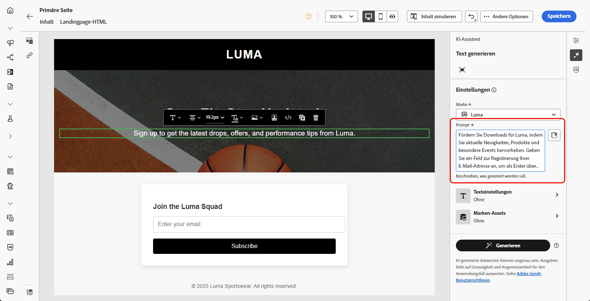
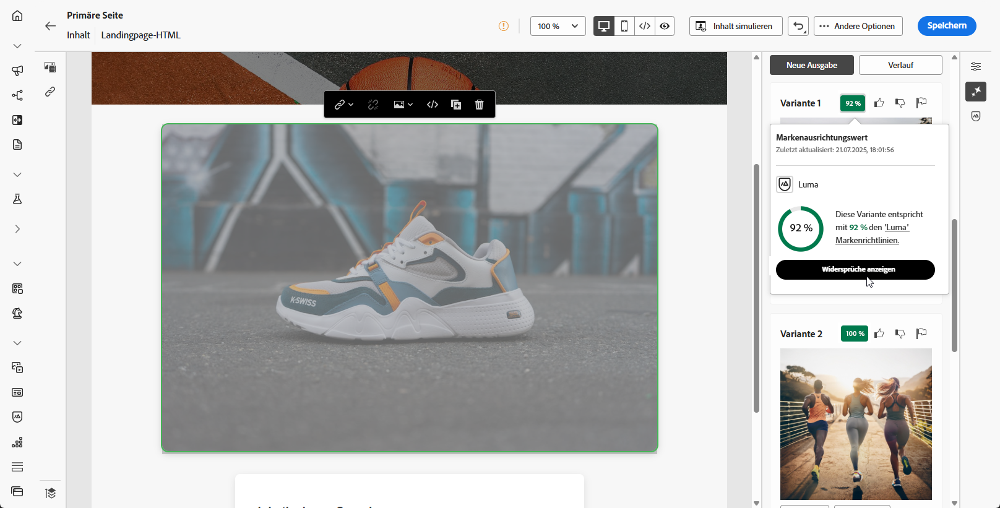

# Generierung von Landingpages mit dem KI-Assistenten {#generative-lp}

>[!IMPORTANT]
>
>* Bevor Sie mit der Verwendung dieser Funktion beginnen, lesen Sie die entsprechenden Informationen zu [Leitlinien und Einschränkungen](gs-generative.md#generative-guardrails).
>
>
>* Sie müssen die [Benutzervereinbarung](https://www.adobe.com/de/legal/licenses-terms/adobe-dx-gen-ai-user-guidelines.html) akzeptieren, damit Sie den KI-Assistenten in Journey Optimizer verwenden können. Weitere Informationen erhalten Sie beim Adobe-Support.

Transformieren Sie Ihre Landingpages mit dem KI-Assistenten in Journey Optimizer, der auf generativer KI basiert.

Erstellen Sie mühelos wirkungsvolle Inhalte, einschließlich vollständiger Seiten, maßgeschneiderter Textausschnitte und benutzerdefinierter Visualisierungen, die Ihre Zielgruppe ansprechen und so mehr Interaktion fördern.

Auf den folgenden Registerkarten erfahren Sie, wie Sie den KI-Assistenten in Journey Optimizer verwenden.

>[!BEGINTABS]

>[!TAB Vollständige Landingpage-Generierung]

Im folgenden Beispiel nutzen wir den KI-Assistenten, um eine vorhandene Landingpage-Vorlage zu optimieren.

1. Nachdem Sie Ihre Landingpage erstellt und konfiguriert haben, klicken Sie auf **[!UICONTROL Inhalt bearbeiten]**.

   Weitere Informationen zur Konfiguration Ihrer Landingpage finden Sie auf [dieser Seite](../landing-pages/create-lp.md).

1. Personalisieren Sie Ihr Layout nach Bedarf und öffnen Sie das Menü **[!UICONTROL KI-Assistent]**.

   {zoomable="yes"}

1. Aktivieren Sie für den KI-Assistenten die Option **[!UICONTROL Originalinhalt verwenden]**, um neue Inhalte basierend auf dem ausgewählten Inhalt zu personalisieren.

1. Passen Sie den Inhalt an, indem Sie im Feld **[!UICONTROL Prompt]** beschreiben, was Sie generieren möchten.

   Wenn Sie Hilfe bei der Erstellung Ihres Prompts benötigen, finden Sie in der **[!UICONTROL Prompt-Bibliothek]** eine Vielzahl von Ideen für Prompts, mit denen Sie Ihre Landingpage verbessern können.

   {zoomable="yes"}

1. Passen Sie Ihr Prompt mit der Option **[!UICONTROL Texteinstellungen]** an:

   * **[!UICONTROL Kommunikationsstrategie]**: Wählen Sie den am besten geeigneten Kommunikationsstil für den generierten Text aus.
   * **[!UICONTROL Sprachen]**: Wählen Sie die Sprache Ihrer generierten Inhalte.
   * **[!UICONTROL Ton]**: Der Ton Ihrer Landingpage sollte bei Ihrer Zielgruppe ankommen. Ob Sie nun informativ, humorvoll oder überzeugend klingen möchten, der KI-Assistent kann die Nachricht entsprechend anpassen.

   {zoomable="yes"}

1. Wählen Sie die **[!UICONTROL Bildeinstellungen]**:

   * **[!UICONTROL Content-Typ]**: Hiermit wird die Art des visuellen Elements kategorisiert, wobei zwischen verschiedenen Arten der visuellen Darstellung wie Fotos, Grafiken oder Kunst unterschieden wird.
   * **[!UICONTROL Visuelle Intensität]**: Sie können die Wirkung des Bildes durch Anpassen seiner Intensität steuern. Eine niedrigere Einstellung (2) sorgt für ein weicheres, zurückhaltenderes Erscheinungsbild, während eine höhere Einstellung (10) das Bild lebendiger und visuell kräftiger macht.
   * **[!UICONTROL Farbe und Ton]**: Die Gesamterscheinung der Farben in einem Bild und die Stimmung oder Atmosphäre, die diese vermittelt.
   * **[!UICONTROL Beleuchtung]**: Dies bezieht sich auf die Beleuchtung in einem Bild, die dessen Atmosphäre prägt und bestimmte Elemente hervorhebt.
   * **[!UICONTROL Komposition]**: Dies bezieht sich auf die Anordnung der Elemente innerhalb des Rahmens eines Bildes.

   {zoomable="yes"}

1. Klicken Sie im Menü **[!UICONTROL Marken-Assets]** auf **[!UICONTROL Marken-Asset hochladen]**, um beliebige Marken-Assets mit Inhalten hinzuzufügen, die zusätzlichen Kontext für den KI-Assistenten liefern können. Wählen Sie alternativ ein zuvor hochgeladenes Asset aus.

   Zuvor hochgeladene Dateien sind in der Dropdown-Liste **[!UICONTROL Hochgeladene Marken-Assets]** verfügbar. Wählen Sie einfach die Assets aus, die bei der Generierung berücksichtigt werden sollen.

1. Wenn das Prompt fertig ist, klicken Sie auf **[!UICONTROL Generieren]**.

1. Durchsuchen Sie die generierten **[!UICONTROL Varianten]**.

   Klicken Sie auf **[!UICONTROL Vorschau]**, um eine Vollbildversion der ausgewählten Variante anzuzeigen, oder auf **[!UICONTROL Anwenden]**, um Ihren aktuellen Inhalt zu ersetzen.

1. Klicken Sie auf das Prozentsymbol, um den **[!UICONTROL Markenausrichtungswert]** anzuzeigen und Abweichungen von Ihrer Marke zu identifizieren.

   Weitere Informationen finden Sie unter [Markenausrichtungswert](brands-score.md).

   {zoomable="yes"}

1. Navigieren Sie im Fenster **[!UICONTROL Vorschau]** zur Option **[!UICONTROL Verfeinern]**, um auf zusätzliche Anpassungsfunktionen zuzugreifen:

   * **[!UICONTROL Umformulierungen]**: Der KI-Assistent kann Ihre Nachricht auf verschiedene Arten umformulieren, sodass Ihre Texte für verschiedene Zielgruppen interessant und ansprechend klingen.

   * **[!UICONTROL Einfachere Sprache verwenden]**: Nutzen Sie den KI-Assistenten, um Ihren Text zu vereinfachen, damit er für eine breitere Zielgruppe verständlich und zugänglich ist.

   Sie können auch den **[!UICONTROL Ton]** und die **[!UICONTROL Kommunikationsstrategie]** Ihres Textes ändern.

   {zoomable="yes"}

1. Öffnen Sie die Registerkarte **[!UICONTROL Markenausrichtung]**, um zu sehen, wie gut Ihr Inhalt mit Ihren [Markenrichtlinien](brands.md) abgestimmt ist.

1. Klicken Sie auf **[!UICONTROL Auswählen]**, sobald Sie den passenden Inhalt gefunden haben.

1. Fügen Sie Personalisierungsfelder ein, um Ihre Landingpage-Inhalte auf der Grundlage von Profildaten anzupassen. Klicken Sie danach auf die Schaltfläche **[!UICONTROL Inhalte simulieren]**, um das Rendern zu steuern, und überprüfen Sie die Personalisierungseinstellungen mit Testprofilen. [Weitere Informationen](../personalization/personalize.md)

Sobald Ihre Landingpage fertig ist, können Sie sie veröffentlichen, um sie für die Verwendung in einer Nachricht verfügbar zu machen. [Weitere Informationen](../landing-pages/create-lp.md#publish-landing-page)

>[!TAB Nur Textgenerierung]

Im folgenden Beispiel nutzen wir den KI-Assistenten, um den Inhalt unserer Landingpage zu verbessern.

1. Nachdem Sie Ihre Landingpage erstellt und konfiguriert haben, klicken Sie auf **[!UICONTROL Inhalt bearbeiten]**.

   Weitere Informationen zur Konfiguration Ihrer Landingpage finden Sie auf [dieser Seite](../landing-pages/create-lp.md).

1. Wählen Sie eine **[!UICONTROL Textkomponente]**, um nur bestimmten Inhalt zu erfassen. und rufen Sie das Menü **[!UICONTROL KI-Assistent]** auf.

   {zoomable="yes"}

1. Aktivieren Sie für den KI-Assistenten die Option **[!UICONTROL Originalinhalt verwenden]**, um neue Inhalte basierend auf dem ausgewählten Inhalt zu personalisieren.

1. Passen Sie den Inhalt an, indem Sie im Feld **[!UICONTROL Prompt]** beschreiben, was Sie generieren möchten.

   Wenn Sie Hilfe bei der Erstellung Ihres Prompts benötigen, finden Sie in der **[!UICONTROL Prompt-Bibliothek]** eine Vielzahl von Ideen für Prompts, mit denen Sie Ihre Landingpages verbessern können.

   {zoomable="yes"}

1. Passen Sie Ihr Prompt mit der Option **[!UICONTROL Texteinstellungen]** an:

   * **[!UICONTROL Kommunikationsstrategie]**: Wählen Sie den am besten geeigneten Kommunikationsstil für den generierten Text aus.
   * **[!UICONTROL Sprachen]**: Wählen Sie die Sprache Ihrer generierten Inhalte.
   * **[!UICONTROL Ton]**: Der Ton Ihrer Landingpage sollte bei Ihrer Zielgruppe ankommen. Ob Sie nun informativ, humorvoll oder überzeugend klingen möchten, der KI-Assistent kann die Nachricht entsprechend anpassen.
   * **Textlänge**: Wählen Sie mit dem Schieberegler die gewünschte Länge des Textes aus.

   {zoomable="yes"}

1. Klicken Sie im Menü **[!UICONTROL Marken-Assets]** auf **[!UICONTROL Marken-Asset hochladen]**, um beliebige Marken-Assets mit Inhalten hinzuzufügen, die zusätzlichen Kontext für den KI-Assistenten liefern können. Wählen Sie alternativ ein zuvor hochgeladenes Asset aus.

   Zuvor hochgeladene Dateien sind in der Dropdown-Liste **[!UICONTROL Hochgeladene Marken-Assets]** verfügbar. Wählen Sie einfach die Assets aus, die bei der Generierung berücksichtigt werden sollen.

1. Wenn das Prompt fertig ist, klicken Sie auf **[!UICONTROL Generieren]**.

1. Durchsuchen Sie die generierten **[!UICONTROL Varianten]**.

   Klicken Sie auf **[!UICONTROL Vorschau]**, um eine Vollbildversion der ausgewählten Variante anzuzeigen, oder auf **[!UICONTROL Anwenden]**, um Ihren aktuellen Inhalt zu ersetzen.

1. Klicken Sie auf das Prozentsymbol, um den **[!UICONTROL Markenausrichtungswert]** anzuzeigen und Abweichungen von Ihrer Marke zu identifizieren.

   Weitere Informationen finden Sie unter [Markenausrichtungswert](brands-score.md).

   {zoomable="yes"}

1. Navigieren Sie im Fenster **[!UICONTROL Vorschau]** zur Option **[!UICONTROL Verfeinern]**, um auf zusätzliche Anpassungsfunktionen zuzugreifen:

   * **[!UICONTROL Als Referenzinhalt verwenden]**: Die gewählte Variante dient hierbei als Referenzinhalt für die Generierung anderer Ergebnisse.

   * **[!UICONTROL Weiter ausführen]**: Der KI-Assistent kann Ihnen dabei helfen, genauer auf bestimmte Themen einzugehen und zusätzliche Details zum besseren Verständnis und für mehr Interaktion zu liefern.

   * **[!UICONTROL Zusammenfassen]**: Zu ausführliche Informationen können die Empfängerinnen und Empfänger einer Landingpage überfordern. Nutzen Sie den KI-Assistenten, um die wichtigsten Punkte in klaren, prägnanten Aussagen zusammenzufassen, die die Aufmerksamkeit der Leserinnen und Leser wecken und sie zum Weiterlesen anregen.

   * **[!UICONTROL Neu formulieren]**:The: Der KI-Assistent kann Ihre Nachricht auf verschiedene Arten umformulieren, sodass Ihre Texte für verschiedene Zielgruppen interessant und ansprechend klingen.

   * **[!UICONTROL Einfachere Sprache verwenden]**: Nutzen Sie den KI-Assistenten, um Ihren Text zu vereinfachen, damit er für eine breitere Zielgruppe verständlich und zugänglich ist.

   Sie können auch den **[!UICONTROL Ton]** und die **[!UICONTROL Kommunikationsstrategie]** Ihres Textes ändern.

   {zoomable="yes"}

1. Öffnen Sie die Registerkarte **[!UICONTROL Markenausrichtung]**, um zu sehen, wie gut Ihr Inhalt mit Ihren [Markenrichtlinien](brands.md) abgestimmt ist.

1. Klicken Sie auf **[!UICONTROL Auswählen]**, sobald Sie den passenden Inhalt gefunden haben.

1. Fügen Sie Personalisierungsfelder ein, um Ihre Landingpage-Inhalte auf der Grundlage von Profildaten anzupassen. Klicken Sie danach auf die Schaltfläche **[!UICONTROL Inhalte simulieren]**, um das Rendern zu steuern, und überprüfen Sie die Personalisierungseinstellungen mit Testprofilen. [Weitere Informationen](../personalization/personalize.md)

Sobald Ihre Landingpage fertig ist, können Sie sie veröffentlichen, um sie für die Verwendung in einer Nachricht verfügbar zu machen. [Weitere Informationen](../landing-pages/create-lp.md#publish-landing-page)

>[!TAB Nur Bildgenerierung]

Im folgenden Beispiel erfahren Sie, wie Sie den KI-Assistenten nutzen können, um Ihre Assets zu optimieren und zu verbessern und so ein benutzerfreundlicheres Erlebnis zu gewährleisten.

1. Nachdem Sie Ihre Landingpage erstellt und konfiguriert haben, klicken Sie auf **[!UICONTROL Inhalt bearbeiten]**.

   Weitere Informationen zur Konfiguration Ihrer Landingpage finden Sie auf [dieser Seite](../landing-pages/create-lp.md).

1. Wählen Sie das Asset aus, das mit dem KI-Assistenten geändert werden soll.

1. Wählen Sie im Menü auf der rechten Seite die Option **[!UICONTROL KI-Assistent]** aus.

   {zoomable="yes"}

1. Aktivieren Sie für den KI-Assistenten die Option **[!UICONTROL Referenzstil]**, um neue Inhalte basierend auf dem Referenzinhalt zu personalisieren. Sie können auch ein Bild hochladen, um Ihrer Variante Kontext hinzuzufügen.

1. Passen Sie den Inhalt an, indem Sie im Feld **[!UICONTROL Prompt]** beschreiben, was Sie generieren lassen möchten.

   Wenn Sie Hilfe bei der Erstellung Ihres Prompts benötigen, finden Sie in der **[!UICONTROL Prompt-Bibliothek]** eine Vielzahl von Ideen für Prompts, mit denen Sie Ihre Landingpages verbessern können.

   {zoomable="yes"}

1. Passen Sie Ihr Prompt mit der Option **[!UICONTROL Bildeinstellungen]** an:

   * **[!UICONTROL Seitenverhältnis]**: Dadurch wird die Breite und Höhe des Assets bestimmt. Sie können aus gängigen Verhältnissen wie 16:9, 4:3, 3:2 oder 1:1 wählen oder eine benutzerdefinierte Größe eingeben.
   * **[!UICONTROL Content-Typ]**: Hiermit wird die Art des visuellen Elements kategorisiert, wobei zwischen verschiedenen Arten der visuellen Darstellung wie Fotos, Grafiken oder Kunst unterschieden wird.
   * **[!UICONTROL Visuelle Intensität]**: Sie können die Wirkung des Bildes durch Anpassen seiner Intensität steuern. Eine niedrigere Einstellung (2) sorgt für ein weicheres, zurückhaltenderes Erscheinungsbild, während eine höhere Einstellung (10) das Bild lebendiger und visuell kräftiger macht.
   * **[!UICONTROL Farbe und Ton]**: Die Gesamterscheinung der Farben in einem Bild und die Stimmung oder Atmosphäre, die diese vermittelt.
   * **[!UICONTROL Beleuchtung]**: Dies bezieht sich auf die Beleuchtung in einem Bild, die dessen Atmosphäre prägt und bestimmte Elemente hervorhebt.
   * **[!UICONTROL Komposition]**: Dies bezieht sich auf die Anordnung der Elemente innerhalb des Rahmens eines Bildes.

   {zoomable="yes"}

1. Klicken Sie im Menü **[!UICONTROL Marken-Assets]** auf **[!UICONTROL Marken-Asset hochladen]**, um beliebige Marken-Assets mit Inhalten hinzuzufügen, die zusätzlichen Kontext für den KI-Assistenten liefern können. Wählen Sie alternativ ein zuvor hochgeladenes Asset aus.

   Zuvor hochgeladene Dateien sind in der Dropdown-Liste **[!UICONTROL Hochgeladene Marken-Assets]** verfügbar. Wählen Sie einfach die Assets aus, die bei der Generierung berücksichtigt werden sollen.

1. Sobald Sie mit der Konfiguration des Prompts zufrieden sind, klicken Sie auf **[!UICONTROL Generieren]**.

1. Durchsuchen Sie die generierten **[!UICONTROL Varianten]**.

   Klicken Sie auf **[!UICONTROL Vorschau]**, um eine Vollbildversion der ausgewählten Variante anzuzeigen, oder auf **[!UICONTROL Anwenden]**, um Ihren aktuellen Inhalt zu ersetzen.

1. Klicken Sie auf das Prozentsymbol, um den **[!UICONTROL Markenausrichtungswert]** anzuzeigen und Abweichungen von Ihrer Marke zu identifizieren.

   Weitere Informationen finden Sie unter [Markenausrichtungswert](brands-score.md).

   {zoomable="yes"}

1. Navigieren Sie im Fenster **[!UICONTROL Vorschau]** zur Option **[!UICONTROL Verfeinern]**, um auf zusätzliche Anpassungsfunktionen zuzugreifen:

   * Mit **[!UICONTROL Ähnliche generieren]** können Sie verwandte Bilder für diese Variante anzeigen.
   * Mit **[!UICONTROL In Adobe Express bearbeiten]** können Sie Ihr Asset weiter anpassen.

[Weitere Informationen zur Adobe Express-Integration](../integrations/express.md)

   * Mit **[!UICONTROL Speichern]** können Sie die Assets für den späteren Zugriff speichern.

   {zoomable="yes"}

1. Öffnen Sie die Registerkarte **[!UICONTROL Markenausrichtung]**, um zu sehen, wie gut Ihr Inhalt mit Ihren [Markenrichtlinien](brands.md) abgestimmt ist.

1. Klicken Sie auf **[!UICONTROL Auswählen]**, sobald Sie den passenden Inhalt gefunden haben.

1. Klicken Sie nach dem Definieren des Nachrichteninhalts auf die Schaltfläche **[!UICONTROL Inhalt simulieren]**, um das Rendern zu kontrollieren und die Personalisierungseinstellungen mit Testprofilen zu überprüfen. [Weitere Informationen](../personalization/personalize.md)

Sobald Ihre Landingpage fertig ist, können Sie sie veröffentlichen, um sie für die Verwendung in einer Nachricht verfügbar zu machen. [Weitere Informationen](../landing-pages/create-lp.md#publish-landing-page)

>[!ENDTABS]
