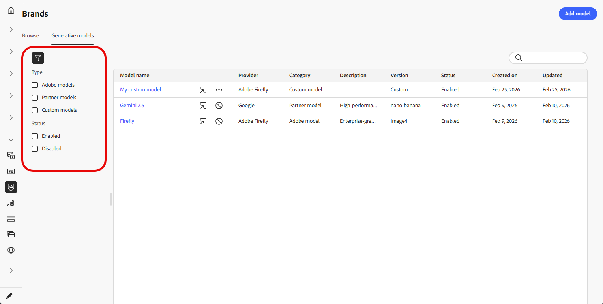

# Erstellen und Verwalten generativer Modelle {#generative-models}

Erweitern Sie Ihre KI-Bilderstellungsfunktionen mit integrierten Modellen, benutzerdefinierten Firefly-Modellen und Drittanbietern von Bildgenerierungsdiensten, um Ihre spezifischen Anforderungen zu erfüllen und die Markenausrichtung zu verbessern.

Wählen Sie das richtige Modell für Ihre Anforderungen:

- Das **[!UICONTROL Adobe]** Modell, unterstützt von Firefly Image Model 4, ist vorkonfiguriert und kann ohne zusätzliche Einrichtung sofort für die Bildgenerierung verwendet werden.
- **[!UICONTROL Partnermodell]**, unterstützt durch Gemini 2.5 Flash, bietet spezielle Funktionen für bestimmte Anwendungsfälle. Einen Schritt-für-Schritt-Workflow, der **Gemini** mit **Textüberlagerungen** für Bilder im KI-Assistenten verwendet, finden Sie unter [Verwenden von Gemini als generatives Modell für Textüberlagerungsbilder](generative-uc.md#generative-gemini).
- **[!UICONTROL Benutzerdefinierte Modelle]** sind markenspezifische Modelle, die auf Ihren eigenen Assets trainiert und von Ihrem Unternehmen hinzugefügt werden.

  Weitere Informationen zu **[!UICONTROL benutzerdefinierten Modellen]** finden Sie in der Dokumentation zu [Adobe Firefly](https://helpx.adobe.com/de/firefly/web/work-with-enterprise-features/train-custom-models/custom-models-overview.html)

Nach der Konfiguration können Sie jedes Ihrer generativen Modelle auswählen, wenn Sie Bilder in Ihrem Inhalt erstellen. [Erfahren Sie mehr über das Generieren von Bildern](generative-image.md).

## Verwalten generativer Modelle

Verwalten Sie Ihre generativen Modelle von einem zentralen Ort aus. Sehen Sie sich alle verfügbaren Modelle an, filtern und suchen Sie nach bestimmten Modellen und konfigurieren Sie deren Einstellungen für Ihre Marken.

1. Wählen Sie im Menü **[!UICONTROL Marken]** die Registerkarte **[!UICONTROL Generative Modelle]** aus.

   {zoomable="yes"}

1. Klicken Sie auf das Symbol  , um auf das Filtermenü zuzugreifen. Filtern Sie Modelle nach **[!UICONTROL Typ]** oder **[!UICONTROL Status]**.

   {zoomable="yes"}

1. Verwenden Sie die Suchleiste, um ein bestimmtes generatives Modell anhand des Namens zu finden.

1. Klicken Sie auf das Symbol  , um auf das erweiterte Menü zuzugreifen. Dort können Sie Ihr Modell aktivieren oder deaktivieren oder löschen.

   Beachten Sie, dass nur **[!UICONTROL Benutzerdefinierte Modelle]** gelöscht werden können.

   {zoomable="yes"}

1. Klicken Sie **[!UICONTROL Modell hinzufügen]**, um ein neues generatives Modell von Grund auf zu erstellen.

Sie können jetzt jedes Ihrer generativen Modelle auswählen, wenn Sie Bilder in Ihrem Inhalt erstellen. [Erfahren Sie mehr über das Generieren von Bildern](generative-image.md).

## Generatives Modell hinzufügen

>[!IMPORTANT]
>
>Das Erstellen benutzerdefinierter Firefly-Modelle erfordert eine Firefly ETLA-Vereinbarung.

Benutzerdefinierte Firefly-Modelle sind markenspezifische KI-Modelle, die auf Ihren eigenen Assets trainiert werden und es Ihnen ermöglichen, Bilder zu generieren, die genau Ihrer Markenidentität, Ihrem Stil und Ihren visuellen Richtlinien entsprechen.

Durch die Erstellung benutzerdefinierter Firefly-Modellanbieter können Sie Ihre KI-Funktionen über die Standardmodelle hinaus erweitern und sicherstellen, dass der generierte Inhalt konsistent die einzigartige Ästhetik und die Anforderungen Ihrer Marke widerspiegelt.

➡️ [Erfahren Sie, wie Sie Ihr benutzerdefiniertes Modell trainieren](https://helpx.adobe.com/de/firefly/web/work-with-enterprise-features/train-custom-models/train-firefly-custom-models.html)

1. Rufen Sie im Menü **[!UICONTROL Marken]** die Registerkarte **[!UICONTROL Generative Modelle]** auf und klicken Sie auf **[!UICONTROL Modell hinzufügen]**.

   {zoomable="yes"}

1. Geben Sie einen **[!UICONTROL Namen]** für Ihr Modell ein.

1. Geben Sie Ihre **[!UICONTROL Modell-ID]** ein.

   +++ Ermitteln der Firefly-Modell-ID

   1. Rufen Sie die Firefly-Website auf und navigieren Sie zu Ihren trainierten Modellen.
   1. Rufen Sie das [Vorschau und Test](https://helpx.adobe.com/de/firefly/web/work-with-enterprise-features/train-custom-models/train-firefly-custom-models.html#preview-and-test) Menü auf.
   1. Suchen Sie in der URL den Wert nach `customModelId=`. Kopieren Sie diesen Wert, um ihn als Modell-ID zu verwenden.

   Weitere Informationen finden Sie in der Dokumentation zu benutzerdefinierten Modellen für [Firefly](https://helpx.adobe.com/de/firefly/web/work-with-enterprise-features/train-custom-models/manage-custom-models.html).

   {zoomable="yes"}

   +++

    

   {zoomable="yes"}

1. Geben Sie optional eine **[!UICONTROL Beschreibung]** ein, um das Modell zu identifizieren.

1. Klicken Sie **[!UICONTROL Verbindung testen]**, um die Modellkonfiguration zu überprüfen.

1. Klicken Sie nach erfolgreichem Verbindungstest auf **[!UICONTROL Speichern]**, um Ihre Modellkonfiguration zu speichern.

   {zoomable="yes"}

1. Nach dem Speichern wird das benutzerdefinierte Modell zur Modellliste hinzugefügt. Sie können sie jederzeit deaktivieren oder löschen.

   {zoomable="yes"}

<!--
1. Once the connection test is successful, choose whether to enable the model for selected brands.

1. Enable or disable the option to connect the model to all brands.

    If disabled, select which brands this model should be applied to.
-->

Nach der Konfiguration können Sie jedes Ihrer benutzerdefinierten generativen Modelle auswählen, wenn Sie Bilder in Ihrem Inhalt erstellen. [Erfahren Sie mehr über das Generieren von Bildern](generative-image.md).

{zoomable="yes"}
