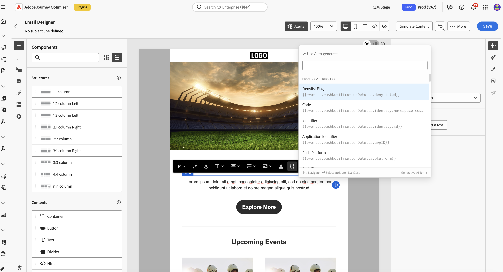
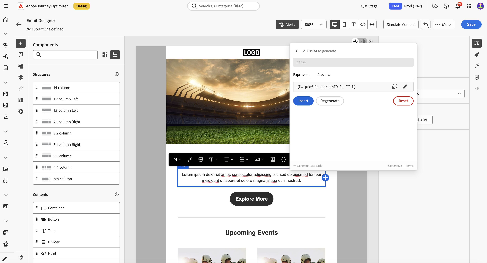

# KI-Assistent für Personalisierungsausdrücke{#generative-personalization-expressions}

>[!IMPORTANT]
>
>Bevor Sie mit der Verwendung dieser Funktion beginnen, lesen Sie die entsprechenden Informationen zu [Leitlinien und Einschränkungen](gs-generative.md#generative-guardrails).
> 
>
>Sie müssen einer [Benutzervereinbarung](https://www.adobe.com/de/legal/licenses-terms/adobe-dx-gen-ai-user-guidelines.html) zustimmen, damit Sie den KI-Assistenten in Journey Optimizer verwenden können. Weitere Informationen erhalten Sie beim Adobe-Support.

## Überblick {#where-available}

[!UICONTROL KI-Assistent] hilft Ihnen, eine neue Personalisierung aus einer einfachen Sprache zu generieren, zu erklären, was vorhandene Ausdrücke tun, und Probleme im ausgewählten Code zu beheben, sodass Sie weniger Zeit mit Syntax- und manuellen Felderkennungen verbringen. Sie können auch eine Auswahl iterieren oder andere Änderungen in der Konversation anfordern. Es ist über zwei Einstiegspunkte verfügbar:

* **[!UICONTROL Personalization-Editor]** - überall dort, wo der Editor verfügbar ist (Betreffzeile, Hauptteil und andere Felder, die ihn öffnen). Informationen dazu, wo und wie der Editor geöffnet wird, finden Sie unter [Personalisierung hinzufügen](../personalization/personalization-build-expressions.md#where).
* **Inline-Textbearbeitung von Designer** - Direkt über das Inline-Bearbeitungs-Pop-up beim Bearbeiten einer Textkomponente. Siehe [Generieren aus der E-Mail-Designer](#generate-email-designer).

Weitere Informationen zur Einrichtung und zu den Sprachen des KI-Assistenten finden Sie unter [Erste Schritte mit dem KI-Assistenten](gs-generative.md). Personalisierungskonzepte finden Sie unter [Erste Schritte mit der Personalisierung](../personalization/personalize.md). Informationen zu umgehenden Ideen finden Sie unter [Best Practices für KI-Eingabeaufforderungen](ai-assistant-prompting-guide.md).

Je nach Kampagnen- oder Journey-Kontext kann der Assistent mit Daten arbeiten und erstellt den [!UICONTROL Personalization-Editor], der bereits bereitstellt - z. B. Profilattribute, Segmentzugehörigkeit, Hilfsfunktionen und zugehörige Personalisierungsquellen.

>[!NOTE]
>
>Der Assistent behält nur dann den Kontext aus Ihren Eingabeaufforderungen, wenn [!UICONTROL KI-Assistent] in dieser Sitzung offen bleibt. Durch Schließen des Assistenten oder des Editors wird die Unterhaltung gelöscht. Wenn Sie den Assistenten das nächste Mal öffnen, beginnen Sie eine neue Unterhaltung.

## Generieren von Personalisierungsausdrücken {#generate}

Diese Schritte umfassen die Erstellung von Personalisierungsausdrücken von Grund auf. Informationen zum Arbeiten mit Code, der sich bereits im Editor befindet, finden Sie unter [Bearbeiten, Korrigieren oder Erläutern von vorhandenem Code](#edit-existing).

1. Öffnen Sie in Ihrer Nachricht oder Ihrem Inhalt den **[!UICONTROL Personalization-Editor]**.

1. Platzieren Sie den Cursor im Editor an der Stelle, an der der generierte Personalisierungscode eingefügt werden soll, und klicken Sie auf die Schaltfläche **[!UICONTROL KI-Assistent]**.

   

1. Beschreiben Sie im Textfeld den gewünschten Personalisierungsausdruck in einfacher Sprache - beispielsweise welche Profilattribute, Segmente oder Logik Sie benötigen, und klicken Sie dann auf **[!UICONTROL Generieren]**.

   Sie können auch einsatzbereite Eingabeaufforderungen aus dem Abschnitt &quot;**[!UICONTROL Eingabeaufforderungen“ verwenden]** z. B. personalisierte Begrüßung, Erstellung von Promo-Code und mehr.

   

   >[!NOTE]
   >
   >Jede nicht damit zusammenhängende Eingabeaufforderung oder Frage gibt einen Fehler zurück, der außerhalb des Bereichs liegt. Passen Sie Ihre Eingabeaufforderung an und stellen Sie eine relevante Frage zur benötigten Personalisierung.

1. Sie können die Diskussion mit dem Assistenten in einem mehrgängigen Gespräch fortsetzen: Es wird der Kontext aus Ihren Eingabeaufforderungen beibehalten, sodass Sie denselben Ausdruck Schritt für Schritt verfeinern können. Klicken Sie auf die Schaltfläche **[!UICONTROL Neue Sitzung]**, um von vorne zu beginnen.

   

1. Nachdem Sie einen Ausdruck generiert haben, klicken Sie auf **[!UICONTROL Vorschau für Beispielprofile anzeigen]** um zu sehen, wie der Ausdruck mit Beispieldaten ausgewertet wird, und um die zugehörige Payload als JSON anzuzeigen. Für diese Prüfung generiert der Assistent einen begrenzten Satz synthetischer Musterprofile, die nicht in Ihrer Organisation gespeichert werden.

   Wenn Sie benutzerdefinierte oder zusätzliche Beispielprofile benötigen, beschreiben Sie, was Sie in der Diskussion mit dem Assistenten benötigen, und fügen Sie das Keyword **preview** in Ihre Eingabeaufforderung ein, damit die richtigen Vorschauprofile für Ihre Prüfung generiert werden können.

   

   +++Beispiel für eine Vorschau

   

   >[!NOTE]
   >
   >Zusätzliche Vorschauen dienen zur Stichprobenprüfung. Der Assistent ist so eingestellt, dass er ungefähr ein bis fünf Profile generiert. Wenn Sie nach einer sehr großen Anzahl fragen, kann dies dazu führen, dass die Anfrage fehlschlägt.

   +++

   >[!NOTE]
   >
   >Mit diesem Steuerelement können Sie Ihren Personalisierungs-Code im Editor schnell überprüfen, nicht aber die vollständige Vorschau Ihres Inhalts. Verwenden Sie für eine vollständige Validierung des Erlebnisses Ihren üblichen Simulationsfluss. [Erfahren Sie, wie Sie eine Vorschau der Inhalte anzeigen und die Inhalte testen](../content-management/preview-test.md)

1. Um die Ausgabe in Ihrem Personalisierungsausdruck zu implementieren, klicken Sie auf **[!UICONTROL Anwenden]**. Die Assistentenausgabe wird an der Cursorposition im Personalisierungseditor eingefügt. Um stattdessen bereits vorhandenen Code zu ersetzen, wählen Sie diesen Code zuerst im Editor aus und verwenden Sie dann **[!UICONTROL Bearbeiten mit dem KI-Assistenten]** (siehe [Bearbeiten, Korrigieren oder Erläutern von vorhandenem Code](#edit-existing)).

   Sie können die Ausgabe auch kopieren und über das Symbol „Kopieren einfügen.

## Vorhandenen Code bearbeiten, korrigieren oder erklären {#edit-existing}

Sie können einen vorhandenen Personalisierungsausdruck auswählen und den KI-Assistenten verwenden, um Personalisierungsprobleme zu beheben, zu erklären, was der Code tut, oder andere Änderungen anzufordern.

1. Wählen Sie den vorhandenen Personalisierungscode im Editor aus.

1. Klicken Sie mit der rechten Maustaste auf die Auswahl und wählen Sie **[!UICONTROL Mit KI-Assistent bearbeiten]** sodass der Assistent Ihre Auswahl als Kontext verwendet.

   

1. **[!UICONTROL KI-Assistent]** wird geöffnet. Klicken **[!UICONTROL Schnellbefehle]** auf **[!UICONTROL Erläutern]** oder **[!UICONTROL Korrigieren]** oder verwenden Sie das Textfeld, um andere Änderungen anzufordern und eine Konversation zu starten.

   

1. Wenn Sie **[!UICONTROL Beheben]** verwenden, klicken Sie in der **[!UICONTROL auf]** Fehlerbehebungsdetails anzeigen, um eine Erklärung der Fehlerbehebung und eine zeilenweise Anleitung vor und nach der Vorschau anzuzeigen.

   

1. Klicken Sie wie beim Generieren eines Personalisierungsausdrucks auf **[!UICONTROL Anwenden]** um die Assistentenausgabe zu implementieren. Er ersetzt den Code, den Sie im Personalisierungseditor ausgewählt hatten. Wenn Sie beispielsweise nach einer Erklärung des Codes gefragt haben, fügt das Anwenden von Kommentare zum Ausdruck hinzu, die beschreiben, was er tut.

## Aus E-Mail-Designer generieren {#generate-email-designer}

[!UICONTROL KI-Assistent für Personalisierungsausdrücke] ist auch direkt über die Inline-Bearbeitung in der E-Mail-Designer verfügbar, ohne den vollständigen [!UICONTROL Personalization-Editor zu öffnen]. Der generierte Ausdruck wird an der Cursorposition in die Textkomponente eingefügt.

1. Wählen Sie in der E-Mail-Designer eine Textkomponente aus und bearbeiten Sie sie inline.

1. Öffnen Sie das Pop-up für die Inline-Personalisierung auf eine dieser zwei Arten:

   * Geben Sie `{{` an der Position ein, an der der Ausdruck eingefügt werden soll. Das Popover wird automatisch geöffnet.
   * Klicken Sie **[!UICONTROL Pop-up für]** Inline-Bearbeitung auf „KI zum Generieren verwenden“, wenn es bereits geöffnet ist.

   

1. Beschreiben Sie im Textfeld den gewünschten Personalisierungsausdruck in einfacher Sprache und klicken Sie dann auf **[!UICONTROL Generieren]**.

1. Überprüfen Sie das Ergebnis auf der Registerkarte **[!UICONTROL Ausdruck]**, um den generierten Ausdruck anzuzeigen.

   Wechseln Sie zur Registerkarte **[!UICONTROL Vorschau]**, um anhand von Beispielprofilwerten zu sehen, wie der Ausdruck ausgewertet wird, damit Sie die Ausgabe vor dem Einfügen überprüfen können.

   

1. Klicken Sie **[!UICONTROL Einfügen]**, um den Ausdruck an der Cursorposition in der Textkomponente anzuwenden. Verwenden Sie **[!UICONTROL Regenerieren]**, um einen neuen Vorschlag zu erstellen, oder **[!UICONTROL Zurücksetzen]**, um von vorne zu beginnen.

>[!NOTE]
>
>Die [!UICONTROL KI-Assistent für Personalisierungsausdrücke] im Inline-E-Mail-Designer-Pop-up ist unabhängig von Sitzungen im [!UICONTROL Personalization-Editor]. Das Schließen des Popups löscht die Konversation.
