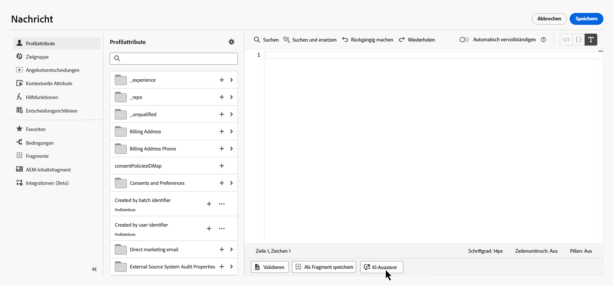
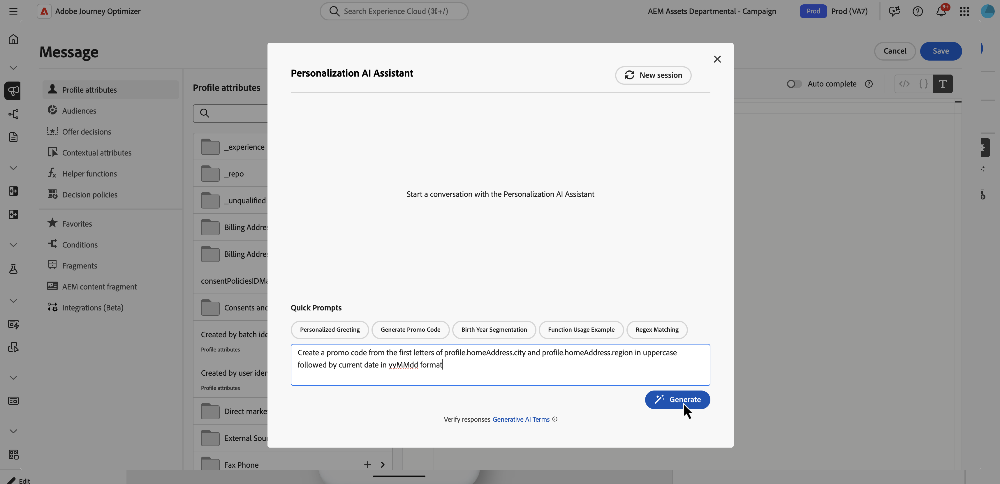
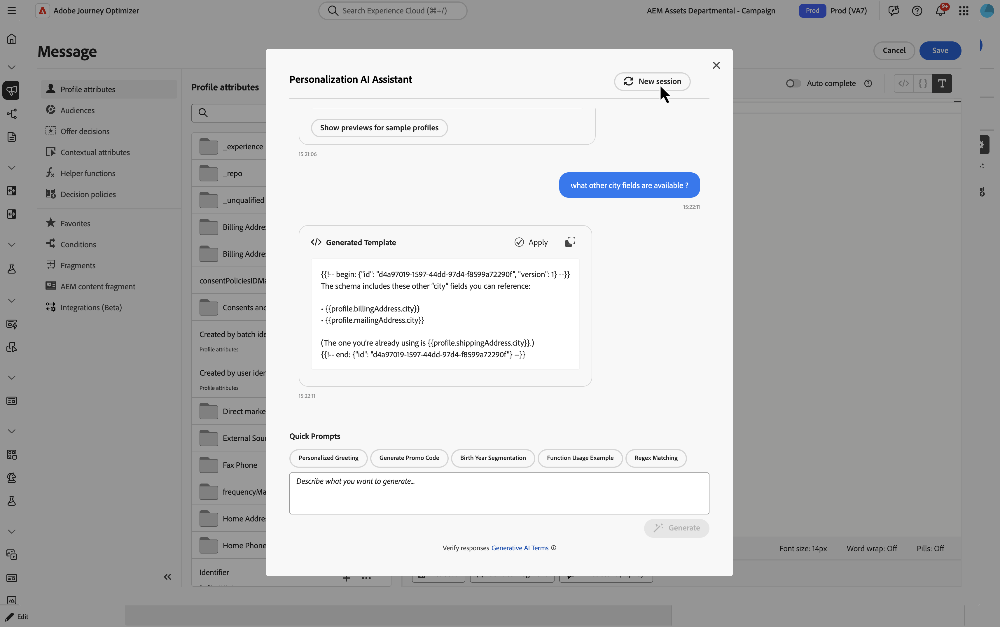
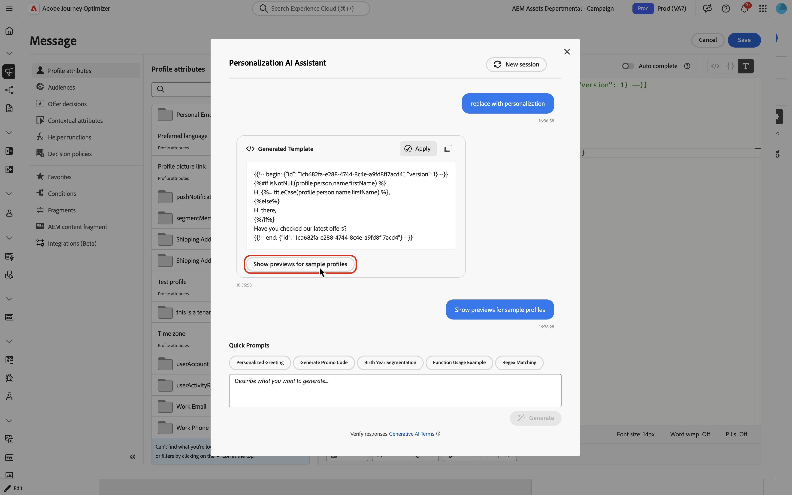
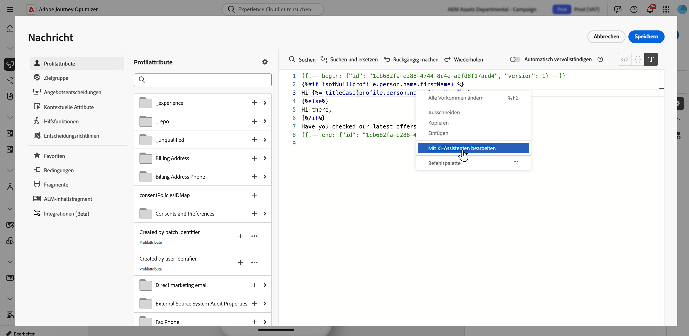
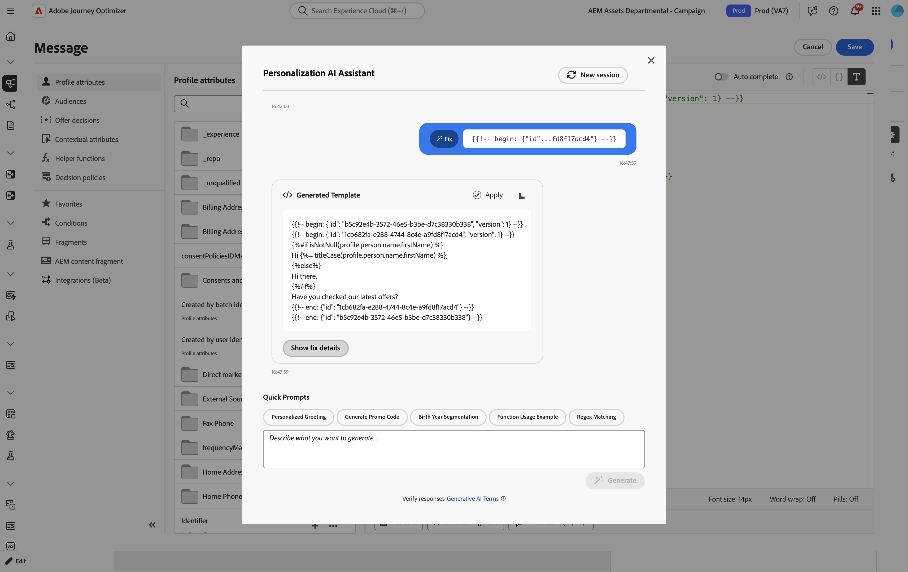
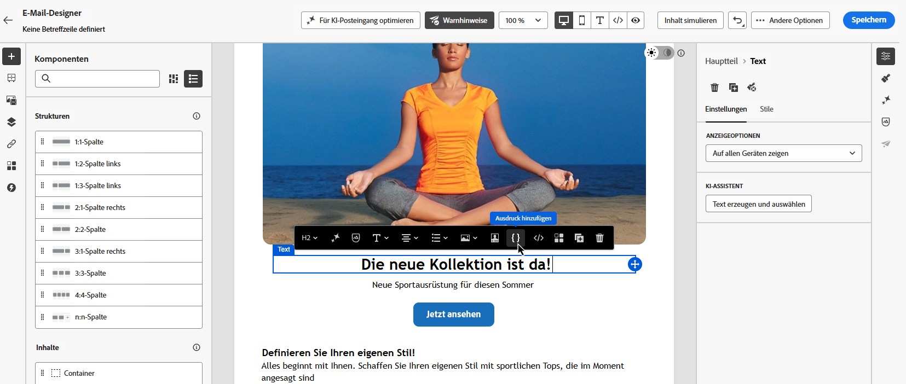

# KI-Assistent für Personalisierungsausdrücke{#generative-personalization-expressions}

>[!IMPORTANT]
>
>Bevor Sie mit der Verwendung dieser Funktion beginnen, lesen Sie die entsprechenden Informationen zu [Leitlinien und Einschränkungen](gs-generative.md#generative-guardrails).
> 
>
>Sie müssen einer [Benutzervereinbarung](https://www.adobe.com/de/legal/licenses-terms/adobe-dx-gen-ai-user-guidelines.html) zustimmen, damit Sie den KI-Assistenten in Journey Optimizer verwenden können. Weitere Informationen erhalten Sie beim Adobe-Support.

## Überblick {#where-available}

[!UICONTROL KI-Assistent] hilft Ihnen, eine neue Personalisierung aus einer einfachen Sprache zu generieren, zu erklären, was vorhandene Ausdrücke tun, und Probleme im ausgewählten Code zu beheben, sodass Sie weniger Zeit mit Syntax- und manuellen Felderkennungen verbringen. Sie können auch eine Auswahl iterieren oder andere Änderungen in der Konversation anfordern. Es ist auf zwei Arten verfügbar:

* **[!UICONTROL Personalization-Editor]** - überall dort, wo der Editor kanalübergreifend verfügbar ist (Betreffzeile, Hauptteil und andere Felder, die ihn öffnen). Dies ist der allgemeine Pfad zur KI-unterstützten Personalisierung. Informationen dazu, wo und wie der Editor geöffnet wird, finden Sie unter [Personalisierung hinzufügen](../personalization/personalization-build-expressions.md#where).
* **E-Mail-Designer-Symbolleiste** - Wenn Sie E-Mails in der E-Mail-Designer verfassen, wählen Sie eine Komponente aus und verwenden Sie **[!UICONTROL Ausdruck hinzufügen]** in der kontextuellen Symbolleiste, um den Assistenten in einer Toolbox zu öffnen, ohne zuerst den vollständigen Editor zu öffnen. Dieser Einstiegspunkt ist außerhalb des E-Mail-Authorings nicht verfügbar. Siehe [Generieren aus der E-Mail-Designer](#generate-email-designer).

Weitere Informationen zur Einrichtung und zu den Sprachen des KI-Assistenten finden Sie unter [Erste Schritte mit dem KI-Assistenten](gs-generative.md). Personalisierungskonzepte finden Sie unter [Erste Schritte mit der Personalisierung](../personalization/personalize.md). Informationen zu umgehenden Ideen finden Sie unter [Best Practices für KI-Eingabeaufforderungen](ai-assistant-prompting-guide.md).

Je nach Kampagnen- oder Journey-Kontext kann der Assistent mit Daten arbeiten und erstellt den [!UICONTROL Personalization-Editor], der bereits bereitstellt - z. B. Profilattribute, Segmentzugehörigkeit, Hilfsfunktionen und zugehörige Personalisierungsquellen.

>[!NOTE]
>
>Der Assistent behält nur dann den Kontext aus Ihren Eingabeaufforderungen, wenn [!UICONTROL KI-Assistent] in dieser Sitzung offen bleibt. Durch Schließen des Assistenten oder des Editors wird die Unterhaltung gelöscht. Wenn Sie den Assistenten das nächste Mal öffnen, beginnen Sie eine neue Unterhaltung.

## Generieren von Personalisierungsausdrücken {#generate}

Diese Schritte umfassen die Erstellung von Personalisierungsausdrücken von Grund auf. Informationen zum Arbeiten mit Code, der sich bereits im Editor befindet, finden Sie unter [Bearbeiten, Korrigieren oder Erläutern von vorhandenem Code](#edit-existing).

1. Öffnen Sie in Ihrer Nachricht oder Ihrem Inhalt den **[!UICONTROL Personalization-Editor]**.

1. Platzieren Sie den Cursor im Editor an der Stelle, an der der generierte Personalisierungscode eingefügt werden soll, und klicken Sie auf die Schaltfläche **[!UICONTROL KI-Assistent]**.

   

1. Beschreiben Sie im Textfeld den gewünschten Personalisierungsausdruck in einfacher Sprache - beispielsweise welche Profilattribute, Segmente oder Logik Sie benötigen, und klicken Sie dann auf **[!UICONTROL Generieren]**.

   Sie können auch einsatzbereite Eingabeaufforderungen aus dem Abschnitt &quot;**[!UICONTROL Eingabeaufforderungen“ verwenden]** z. B. personalisierte Begrüßung, Erstellung von Promo-Code und mehr.

   

   >[!NOTE]
   >
   >Jede nicht damit zusammenhängende Eingabeaufforderung oder Frage gibt einen Fehler zurück, der außerhalb des Bereichs liegt. Passen Sie Ihre Eingabeaufforderung an und stellen Sie eine relevante Frage zur benötigten Personalisierung.

1. Sie können die Diskussion mit dem Assistenten in einem mehrgängigen Gespräch fortsetzen: Es wird der Kontext aus Ihren Eingabeaufforderungen beibehalten, sodass Sie denselben Ausdruck Schritt für Schritt verfeinern können. Klicken Sie auf die Schaltfläche **[!UICONTROL Neue Sitzung]**, um von vorne zu beginnen.

   

1. Nachdem Sie einen Ausdruck generiert haben, klicken Sie auf **[!UICONTROL Vorschau für Beispielprofile anzeigen]**, um zu sehen, wie der Ausdruck anhand **synthetischen** ausgewertet wird, und um die zugehörige Payload als JSON anzuzeigen. Bei der Vorschau handelt es sich um eine **-**-Prüfung, damit Sie darauf vertrauen können, dass Ihr Code erwartungsgemäß aufgelöst wird. Dabei werden **mehrere Empfänger, unterschiedliche Daten oder** vollständige Abdeckung simuliert. Beispieldaten werden in Ihrer Organisation nicht gespeichert.

   Wenn Sie die Stichprobe anpassen möchten (z. B. Hervorhebung verschiedener Attribute), beschreiben Sie, was Sie in der Diskussion mit dem Assistenten benötigen, und fügen Sie in **Eingabeaufforderung das Keyword preview** ein.

   

   +++Beispiel für eine Vorschau

   

   >[!NOTE]
   >
   >Erwarten Sie hier nicht mehrere Vorschauzeilen oder vollständige Szenarien. Die Kontrolle ist absichtlich auf **eine) Beispielauswertung** eine schnelle Code-Prüfung beschränkt, nicht auf eine partielle Abdeckung vieler Profile. Die Anforderung eines unrealistisch großen Satzes von Vorschauen kann dazu führen, dass die Anfrage fehlschlägt.

   +++

   >[!NOTE]
   >
   >Mit diesem Steuerelement können Sie Ihren Personalisierungs-Code im Editor schnell überprüfen, nicht aber die vollständige Vorschau Ihres Inhalts. Verwenden Sie für eine vollständige Validierung des Erlebnisses Ihren üblichen Simulationsfluss. [Erfahren Sie, wie Sie eine Vorschau der Inhalte anzeigen und die Inhalte testen](../content-management/preview-test.md)

1. Um die Ausgabe in Ihrem Personalisierungsausdruck zu implementieren, klicken Sie auf **[!UICONTROL Anwenden]**. Die Assistentenausgabe wird an der Cursorposition im Personalisierungseditor eingefügt. Um stattdessen bereits vorhandenen Code zu ersetzen, wählen Sie diesen Code zuerst im Editor aus und verwenden Sie dann **[!UICONTROL Bearbeiten mit dem KI-Assistenten]** (siehe [Bearbeiten, Korrigieren oder Erläutern von vorhandenem Code](#edit-existing)).

   Sie können die Ausgabe auch kopieren und über das Symbol „Kopieren einfügen.

## Vorhandenen Code bearbeiten, korrigieren oder erklären {#edit-existing}

Sie können einen vorhandenen Personalisierungsausdruck auswählen und den KI-Assistenten verwenden, um Personalisierungsprobleme zu beheben, zu erklären, was der Code tut, oder andere Änderungen anzufordern.

1. Wählen Sie den vorhandenen Personalisierungscode im Editor aus.

1. Klicken Sie mit der rechten Maustaste auf die Auswahl und wählen Sie **[!UICONTROL Mit KI-Assistent bearbeiten]** sodass der Assistent Ihre Auswahl als Kontext verwendet.

   

1. **[!UICONTROL KI-Assistent]** wird geöffnet. Klicken **[!UICONTROL Schnellbefehle]** auf **[!UICONTROL Erläutern]** oder **[!UICONTROL Korrigieren]** oder verwenden Sie das Textfeld, um andere Änderungen anzufordern und eine Konversation zu starten.

   

1. Wenn Sie **[!UICONTROL Beheben]** verwenden, klicken Sie in der **auf** Fehlerbehebungsdetails anzeigen, um eine Erklärung der Fehlerbehebung und eine zeilenweise Anleitung vor und nach der Vorschau anzuzeigen.

   

1. Klicken Sie wie beim Generieren eines Personalisierungsausdrucks auf **[!UICONTROL Anwenden]** um die Assistentenausgabe zu implementieren. Er ersetzt den Code, den Sie im Personalisierungseditor ausgewählt hatten. Wenn Sie beispielsweise nach einer Erklärung des Codes gefragt haben, fügt das Anwenden von Kommentare zum Ausdruck hinzu, die beschreiben, was er tut.

## Über die E-Mail-Designer-Symbolleiste generieren {#generate-email-designer}

>[!NOTE]
>
>Dieser Abschnitt gilt nur, wenn Sie **E-Mail**-Inhalte in der E-Mail-Designer bearbeiten. Verwenden Sie für andere Kanäle den **[!UICONTROL Personalization-Editor]**.

In der E-Mail-Designer können Sie den [!UICONTROL KI-Assistenten für Personalisierungsausdrücke] von der kontextuellen Symbolleiste aus verwenden, ohne zuerst den vollständigen [!UICONTROL Personalization-Editor &#x200B;] öffnen.

1. Wählen Sie in der E-Mail-Designer die Komponente aus, die Sie personalisieren möchten, und klicken Sie an der Stelle, an der Sie den Ausdruck einfügen möchten.

1. Klicken Sie in der kontextuellen Symbolleiste auf **[!UICONTROL Ausdruck hinzufügen]**.

   

1. Daraufhin wird eine Toolbox geöffnet, in der Sie den KI-Assistenten zur Personalisierung auffordern können. Geben Sie ein, was Sie benötigen. Der Assistent empfiehlt Profilfelder und andere Attribute, die Ihrer Eingabeaufforderung entsprechen, damit Sie den Ausdruck schneller erstellen können.

1. Der Assistent generiert den Ausdruck.

   

   Sie haben folgende Möglichkeiten:

   * Validieren Sie die Ausdrucksausgabe mit einem Beispielwert - verwenden Sie die Registerkarte **[!UICONTROL Vorschau]**.
   * Aus derselben Eingabeaufforderung einen weiteren Vorschlag generieren - mit **[!UICONTROL Regenerieren]**.
   * Deaktivieren Sie die Diskussion und beginnen Sie von vorne - verwenden Sie **[!UICONTROL Zurücksetzen]**.
   * Verfeinern Sie den Ausdruck im vollständigen Editor - klicken Sie auf das Symbol , um den **[!UICONTROL Personalization-Editor zu]**.

1. Wenn Sie mit dem Ergebnis zufrieden sind, klicken Sie auf **[!UICONTROL Einfügen]**, um den Ausdruck zu Ihrem Inhalt hinzuzufügen.
