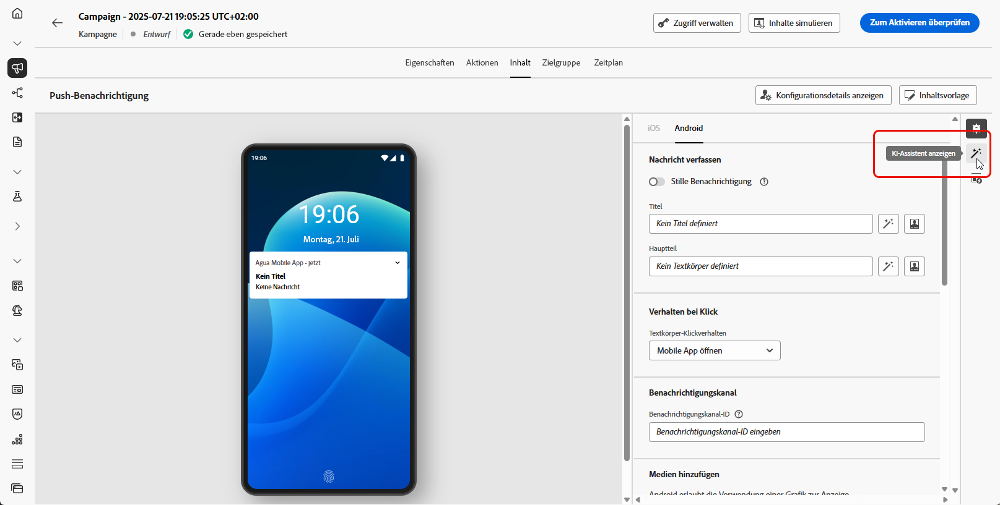

# Generierung von Push-Benachrichtigungen mit dem KI-Assistenten {#generative-push}

>[!BEGINSHADEBOX]

**Inhaltsverzeichnis**

* [Erste Schritte mit dem KI-Assistenten](gs-generative.md)
* [Generierung von E-Mails mit dem KI-Assistenten](generative-email.md)
* [SMS-Generierung mit dem KI-Assistenten](generative-sms.md)
* Generierung von Push-Benachrichtigungen mit dem KI-Assistenten
* [Inhaltsexperiment mit dem KI-Assistenten](generative-experimentation.md)

>[!ENDSHADEBOX]

>[!NOTE]
>
>Bevor Sie mit der Verwendung dieser Funktion beginnen, lesen Sie die entsprechenden Informationen zu [Schutzmechanismen und Einschränkungen](gs-generative.md#generative-guardrails).

Sobald Sie Ihre Nachrichten erstellt und personalisiert haben, können Sie den Inhalt Ihrer Push-Benachrichtigungen mithilfe des KI-Assistenten in Adobe Journey Optimizer auf die nächste Stufe bringen.

Auf den folgenden Registerkarten erfahren Sie, wie Sie den KI-Assistenten in Journey Optimizer verwenden.

>[!BEGINTABS]

>[!TAB Vollständige Generierung von Push-Benachrichtigungen]

In diesem speziellen Beispiel erfahren Sie, wie Sie eine ansprechende Push-Benachrichtigung mithilfe des KI-Assistenten senden. 

Führen Sie folgende Schritte aus:

1. Nachdem Sie Ihre Push-Benachrichtigungs-Kampagne erstellt und konfiguriert haben, klicken Sie auf **[!UICONTROL Inhalt bearbeiten]**.

   Weitere Informationen zur Konfiguration Ihrer Push-Benachrichtigungs-Kampagne finden Sie auf [dieser Seite](../push/create-push.md).

1. Füllen Sie die **[!UICONTROL grundlegenden Details]** für Ihre Kampagne aus. Klicken Sie abschließend auf **[!UICONTROL Inhalt bearbeiten]**.

1. Personalisieren Sie Ihre Push-Benachrichtigung nach Bedarf. [Weitere Informationen](../push/design-push.md)

1. Rufen Sie das Menü **[!UICONTROL KI-Assistenten anzeigen]** auf.

   {zoomable=&quot;yes&quot;}

1. Aktivieren Sie für den KI-Assistenten die Option **[!UICONTROL Originalinhalt verwenden]**, um neue Inhalte basierend auf dem Inhalt Ihrer Kampagne, dem Namen und der ausgewählten Zielgruppe zu personalisieren.

   Ihr Prompt muss immer an einen bestimmten Kontext gebunden sein.

1. Passen Sie den Inhalt genauer an, indem Sie im Feld **[!UICONTROL Prompt]** beschreiben, was Sie generieren möchten.

   Wenn Sie Hilfe bei der Erstellung Ihres Prompts benötigen, finden Sie in der **[!UICONTROL Prompt-Bibliothek]** eine Vielzahl von Ideen für Prompts, mit denen Sie Ihre Kampagnen verbessern können.

   {zoomable=&quot;yes&quot;}

1. Wählen Sie **[!UICONTROL Marken-Asset hochladen]** aus, um ein beliebiges Marken-Asset hinzuzufügen, das Inhalte enthält, die zusätzlichen Kontext für den KI-Assistenten bieten können.

1. Wählen Sie das zu generierende Feld aus: **[!UICONTROL Titel]** und/oder **[!UICONTROL Nachricht]**.

1. Passen Sie Ihr Prompt mit den verschiedenen Optionen an:

   * **[!UICONTROL Kommunikationsstrategie]**: Wählen Sie den am besten geeigneten Kommunikationsstil für den generierten Text aus.
   * **[!UICONTROL Sprache]**: Wählen Sie die Sprache aus, in der Sie Ihre Inhalte generieren möchten.
   * **[!UICONTROL Ton]**: Der Ton der E-Mail sollte bei Ihrer Zielgruppe ankommen. Je nachdem, ob Sie informativ, humorvoll oder überzeugend klingen möchten, kann der KI-Assistent die Nachricht entsprechend anpassen.

   {zoomable=&quot;yes&quot;}

1. Wenn das Prompt fertig ist, klicken Sie auf **[!UICONTROL Generieren]**.

1. Durchsuchen Sie die generierten **[!UICONTROL Varianten]** und klicken Sie auf **[!UICONTROL Vorschau]**, um eine Vollbildversion der ausgewählten Variante anzuzeigen.

1. Navigieren Sie zur Option **[!UICONTROL Verfeinern]** im Fenster **[!UICONTROL Vorschau]**, um auf zusätzliche Anpassungsfunktionen zuzugreifen:

   * **[!UICONTROL Als Referenzinhalt verwenden]**: Die gewählte Variante dient hierbei als Referenzinhalt für die Generierung anderer Ergebnisse.

   * **[!UICONTROL Umformulieren]**: Der KI-Assistent kann Ihre Nachricht auf verschiedene Arten umformulieren, sodass Ihre Texte für verschiedene Zielgruppen interessant und ansprechend klingen.

   * **[!UICONTROL Einfache Sprache]**: Nutzen Sie den KI-Assistenten, um Ihre Sprache zu vereinfachen und den Inhalt auf diese Weise für eine breitere Zielgruppe verständlich und zugänglich zu machen.

   {zoomable=&quot;yes&quot;}

1. Klicken Sie auf **[!UICONTROL Auswählen]**, sobald Sie den passenden Inhalt gefunden haben.

   Sie können auch ein Experiment für Ihren Inhalt aktivieren. [Weitere Informationen](generative-experimentation.md)

1. Fügen Sie Personalisierungsfelder ein, um Ihre E-Mail-Inhalte auf der Grundlage von Profildaten anzupassen. Klicken Sie danach auf die Schaltfläche **[!UICONTROL Inhalte simulieren]**, um das Rendern zu steuern, und überprüfen Sie die Personalisierungseinstellungen mit Testprofilen. [Weitere Informationen](../personalization/personalize.md)

Wenn Sie Inhalt, Zielgruppe und Zeitplan definiert haben, können Sie Ihre Push-Benachrichtigungs-Kampagne vorbereiten. [Weitere Informationen](../campaigns/review-activate-campaign.md)

>[!TAB Textgenerierung]

In diesem Beispiel lernen Sie, wie Sie den KI-Assistenten für bestimmte Inhalte nutzen können. Führen Sie folgende Schritte aus:

1. Nachdem Sie Ihre Push-Benachrichtigungs-Kampagne erstellt und konfiguriert haben, klicken Sie auf **[!UICONTROL Inhalt bearbeiten]**.

   Weitere Informationen zur Konfiguration Ihrer Push-Benachrichtigungs-Kampagne finden Sie auf [dieser Seite](../push/create-push.md).

1. Geben Sie die **[!UICONTROL grundlegenden Details]** für Ihre Kampagne ein. Klicken Sie abschließend auf **[!UICONTROL Inhalt bearbeiten]**.

1. Personalisieren Sie Ihre Push-Benachrichtigung nach Bedarf. [Weitere Informationen](../push/design-push.md)

1. Rufen Sie das Menü **[!UICONTROL KI-Assistent anzeigen]** neben den Feldern **[!UICONTROL Titel]** oder **[!UICONTROL Nachricht]** auf.

   {zoomable=&quot;yes&quot;}

1. Aktivieren Sie für den KI-Assistenten die Option **[!UICONTROL Referenzinhalt verwenden]**, um neue Inhalte basierend auf dem Inhalt Ihrer Kampagne, dem Namen und der ausgewählten Zielgruppe zu personalisieren.

   Ihr Prompt muss immer an einen bestimmten Kontext gebunden sein.

1. Passen Sie den Inhalt an, indem Sie im Feld **[!UICONTROL Prompt]** beschreiben, was Sie generieren möchten.

   Wenn Sie Hilfe bei der Erstellung Ihres Prompts benötigen, finden Sie in der **[!UICONTROL Prompt-Bibliothek]** eine Vielzahl von Ideen für Prompts, mit denen Sie Ihre Kampagnen verbessern können.

   {zoomable=&quot;yes&quot;}

1. Wählen Sie **[!UICONTROL Marken-Asset hochladen]** aus, um ein beliebiges Marken-Asset hinzuzufügen, das Inhalte enthält, die zusätzlichen Kontext für den KI-Assistenten bieten können.

   {zoomable=&quot;yes&quot;}

1. Passen Sie Ihr Prompt mit den verschiedenen Optionen an:

   * **[!UICONTROL Kommunikationsstrategie]**: Wählen Sie den am besten geeigneten Kommunikationsstil für den generierten Text aus.
   * **[!UICONTROL Sprache]**: Wählen Sie die Sprache aus, in der Sie Ihre Inhalte generieren möchten.
   * **[!UICONTROL Ton]**: Der Ton der E-Mail sollte bei Ihrer Zielgruppe ankommen. Je nachdem, ob Sie informativ, humorvoll oder überzeugend klingen möchten, kann der KI-Assistent die Nachricht entsprechend anpassen.
   * **[!UICONTROL Länge]**: Legen Sie die Länge Ihres Inhalts mit dem Schieberegler fest.

   {zoomable=&quot;yes&quot;}

1. Wenn das Prompt fertig ist, klicken Sie auf **[!UICONTROL Generieren]**.

1. Durchsuchen Sie die generierten **[!UICONTROL Varianten]** und klicken Sie auf **[!UICONTROL Vorschau]**, um eine Vollbildversion der ausgewählten Variante anzuzeigen.

1. Navigieren Sie zur Option **[!UICONTROL Verfeinern]** im Fenster **[!UICONTROL Vorschau]**, um auf zusätzliche Anpassungsfunktionen zuzugreifen:

   * **[!UICONTROL Als Referenzinhalt verwenden]**: Die gewählte Variante dient hierbei als Referenzinhalt für die Generierung anderer Ergebnisse.

   * **[!UICONTROL Weiter ausführen]**: Der KI-Assistent kann Ihnen dabei helfen, genauer auf bestimmte Themen einzugehen und zusätzliche Details zum besseren Verständnis und für mehr Interaktion zu liefern.

   * **[!UICONTROL Zusammenfassen]**: Zu ausführliche Informationen können die Empfangenden einer E-Mail überfordern. Nutzen Sie den KI-Assistenten, um die wichtigsten Punkte in klaren, prägnanten Aussagen zusammenzufassen, die die Aufmerksamkeit der Leserinnen und Leser wecken und sie zum Weiterlesen anregen.

   * **[!UICONTROL Umformulieren]**: Der KI-Assistent kann Ihre Nachricht auf verschiedene Arten umformulieren, sodass Ihr Text frisch und für verschiedene Zielgruppen ansprechend bleibt.

   * **[!UICONTROL Einfachere Sprache verwenden]**: Nutzen Sie den KI-Assistenten, um Ihren Text zu vereinfachen, damit er für eine breitere Zielgruppe verständlich und zugänglich ist.

   {zoomable=&quot;yes&quot;}

1. Klicken Sie auf **[!UICONTROL Auswählen]**, sobald Sie den passenden Inhalt gefunden haben.

   Sie können auch ein Experiment für Ihren Inhalt aktivieren. [Weitere Informationen](generative-experimentation.md)

1. Fügen Sie Personalisierungsfelder ein, um Ihre E-Mail-Inhalte auf der Grundlage von Profildaten anzupassen. Klicken Sie danach auf die Schaltfläche **[!UICONTROL Inhalte simulieren]**, um das Rendern zu steuern, und überprüfen Sie die Personalisierungseinstellungen mit Testprofilen. [Weitere Informationen](../personalization/personalize.md)

Wenn Sie Inhalt, Zielgruppe und Zeitplan definiert haben, können Sie Ihre Push-Benachrichtigungs-Kampagne vorbereiten. [Weitere Informationen](../campaigns/review-activate-campaign.md)

>[!ENDTABS]
