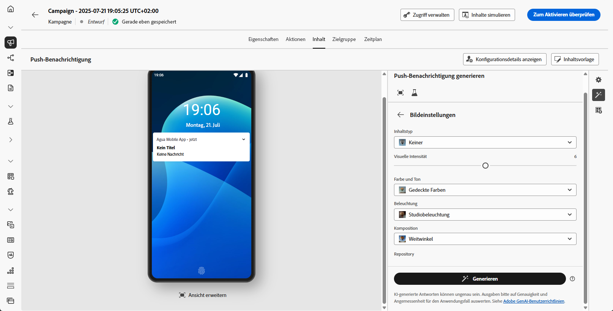
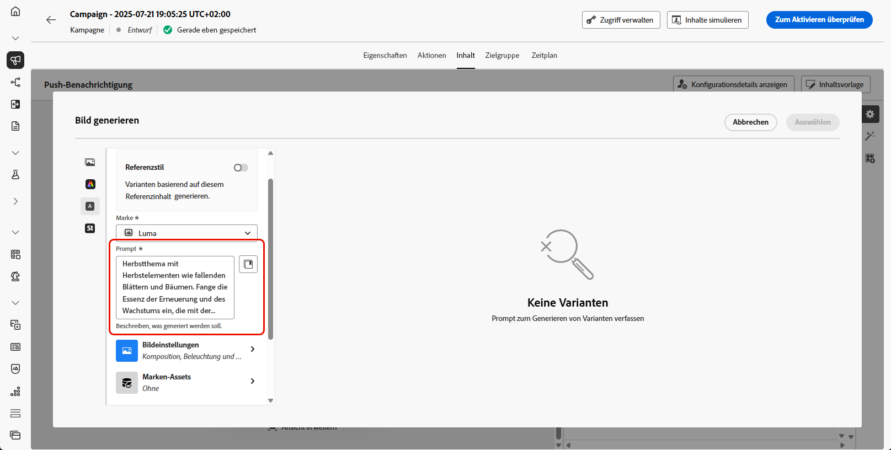
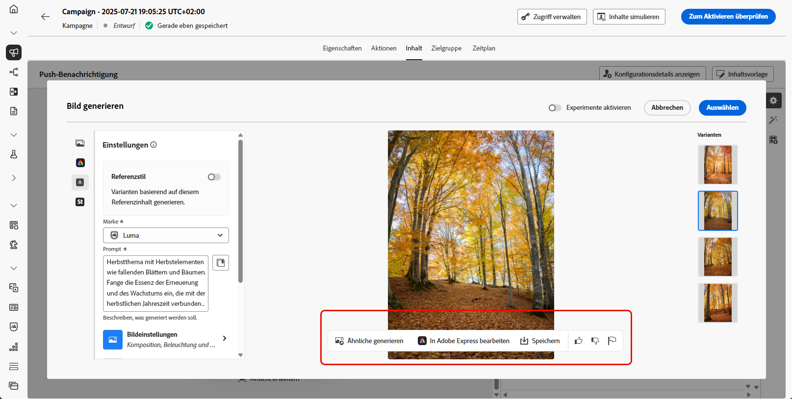

# Push-Generierung mit dem AI-Assistenten - Content Accelerator  {#generative-push}

>[!IMPORTANT]
>
>Bevor Sie mit der Verwendung dieser Funktion beginnen, lesen Sie die entsprechenden Informationen zu [Schutzmechanismen und Einschränkungen](gs-generative.md#generative-guardrails).
> 
>
>Sie müssen einer [Benutzervereinbarung](https://www.adobe.com/legal/licenses-terms/adobe-dx-gen-ai-user-guidelines.html) zustimmen, bevor Sie den AI-Assistenten in Journey Optimizer für Inhaltsbeschleunigung verwenden können. Weitere Informationen erhalten Sie beim Adobe-Support.

Nachdem Sie Ihre Nachrichten erstellt und personalisiert haben, stellen Sie mit dem AI-Assistenten in Journey Optimizer for Content Acceleration den Inhalt Ihrer Push-Benachrichtigung auf die nächste Stufe.

Auf den folgenden Registerkarten erfahren Sie, wie Sie den AI-Assistenten in Journey Optimizer für Content Acceleration verwenden.

>[!BEGINTABS]

>[!TAB Vollständige Generierung von Push-Benachrichtigungen]

In diesem speziellen Beispiel erfahren Sie, wie Sie mit dem AI-Assistenten in Journey Optimizer for Content Acceleration eine ansprechende Push-Benachrichtigung senden.

Führen Sie folgende Schritte aus:

1. Nachdem Sie Ihre Push-Benachrichtigungs-Kampagne erstellt und konfiguriert haben, klicken Sie auf **[!UICONTROL Inhalt bearbeiten]**.

   Weitere Informationen zur Konfiguration Ihrer Push-Benachrichtigungs-Kampagne finden Sie auf [dieser Seite](../push/create-push.md).

1. Füllen Sie die **[!UICONTROL grundlegenden Details]** für Ihre Kampagne aus. Klicken Sie abschließend auf **[!UICONTROL Inhalt bearbeiten]**.

1. Personalisieren Sie Ihre Push-Benachrichtigung nach Bedarf. [Weitere Informationen](../push/design-push.md)

1. Rufen Sie das Menü **[!UICONTROL KI-Assistenten anzeigen]** auf.

   {zoomable="yes"}

1. Aktivieren Sie die Option **[!UICONTROL Ursprünglichen Inhalt verwenden]** für den AI-Assistenten zur Inhaltsbeschleunigung, um die neue Inhaltsoption basierend auf dem ausgewählten Inhalt zu personalisieren.

1. Passen Sie den Inhalt an, indem Sie im Feld **[!UICONTROL Prompt]** beschreiben, was Sie generieren möchten.

   Wenn Sie Hilfe bei der Erstellung Ihres Prompts benötigen, finden Sie in der **[!UICONTROL Prompt-Bibliothek]** eine Vielzahl von Ideen für Prompts, mit denen Sie Ihre Kampagnen verbessern können.

   {zoomable="yes"}

1. Wählen Sie das Feld aus, das Sie generieren möchten: **[!UICONTROL Titel]**, **[!UICONTROL Nachricht]** und/oder **[!UICONTROL Bild]**.

1. Passen Sie Ihre Eingabeaufforderung mit der Option **[!UICONTROL Texteinstellungen]** an:

   * **[!UICONTROL Kommunikationsstrategie]**: Wählen Sie den am besten geeigneten Kommunikationsstil für den generierten Text aus.
   * **[!UICONTROL Tone]**: Der Ton Ihrer Push-Benachrichtigungen sollte bei Ihrer Zielgruppe Resonanz finden. Je nachdem, ob Sie informativ, humorvoll oder überzeugend klingen möchten, kann der KI-Assistent die Nachricht entsprechend anpassen.

   {zoomable="yes"}

1. Wählen Sie Ihre **[!UICONTROL Bildeinstellungen]** aus:

   * **[!UICONTROL Inhaltstyp]**: Hiermit wird die Art des visuellen Elements kategorisiert, wobei zwischen verschiedenen Arten der visuellen Darstellung wie Fotos, Grafiken oder Kunst unterschieden wird.
   * **[!UICONTROL visuelle Intensität]**: Sie können die Wirkung des Bildes durch Anpassung seiner Intensität steuern. Durch eine niedrigere Einstellung (2) wird das Erscheinungsbild weicher, zurückhaltender dargestellt, während eine höhere Einstellung (10) das Bild lebendiger und visuell leistungsfähiger macht.
   * **[!UICONTROL Farbe und Ton]**: Die Gesamterscheinung der Farben in einem Bild und die Stimmung oder Atmosphäre, die diese vermittelt.
   * **[!UICONTROL Beleuchtung]**: Dies bezieht sich auf die Beleuchtung in einem Bild, die dessen Atmosphäre prägt und bestimmte Elemente hervorhebt.
   * **[!UICONTROL Komposition]**: Dies bezieht sich auf die Anordnung der Elemente innerhalb des Rahmens eines Bildes.

   {zoomable="yes"}

1. Klicken Sie im Menü **[!UICONTROL Marken-Assets]** auf **[!UICONTROL Marken-Asset hochladen]** , um ein Marken-Asset hinzuzufügen, das Inhalte enthält, die zusätzlichen Kontext für den AI-Assistenten bieten können, oder wählen Sie ein zuvor hochgeladenes Asset aus.

   Zuvor hochgeladene Dateien sind in der Dropdown-Liste **[!UICONTROL Hochgeladene Marken-Assets]** verfügbar. Schalten Sie einfach die Assets um, die Sie in Ihre Generierung aufnehmen möchten.

1. Wenn das Prompt fertig ist, klicken Sie auf **[!UICONTROL Generieren]**.

1. Durchsuchen Sie die generierten **[!UICONTROL Varianten]** und klicken Sie auf **[!UICONTROL Vorschau]**, um eine Vollbildversion der ausgewählten Variante anzuzeigen.

1. Navigieren Sie zur Option **[!UICONTROL Verfeinern]** im Fenster **[!UICONTROL Vorschau]**, um auf zusätzliche Anpassungsfunktionen zuzugreifen:

   * **[!UICONTROL Als Referenzinhalt verwenden]**: Die gewählte Variante dient hierbei als Referenzinhalt für die Generierung anderer Ergebnisse.

   * **[!UICONTROL Umformulieren]**: Der KI-Assistent kann Ihre Nachricht auf verschiedene Arten umformulieren, sodass Ihre Texte für verschiedene Zielgruppen interessant und ansprechend klingen.

   * **[!UICONTROL Einfachere Sprache verwenden]**: Nutzen Sie den KI-Assistenten, um Ihren Text zu vereinfachen, damit er für eine breitere Zielgruppe verständlich und zugänglich ist.

   Sie können auch die **[!UICONTROL Tone]** und die **[!UICONTROL Kommunikationsstrategie]** Ihres Textes ändern.

   {zoomable="yes"}

1. Klicken Sie auf **[!UICONTROL Auswählen]**, sobald Sie den passenden Inhalt gefunden haben.

   Sie können auch ein Experiment für Ihren Inhalt aktivieren. [Weitere Informationen](generative-experimentation.md)

1. Fügen Sie Personalisierungsfelder ein, um den Inhalt Ihrer Push-Benachrichtigung auf der Basis von Profildaten anzupassen. Klicken Sie danach auf die Schaltfläche **[!UICONTROL Inhalte simulieren]**, um das Rendern zu steuern, und überprüfen Sie die Personalisierungseinstellungen mit Testprofilen. [Weitere Informationen](../personalization/personalize.md)

Wenn Sie Inhalt, Zielgruppe und Zeitplan definiert haben, können Sie Ihre Push-Benachrichtigungs-Kampagne vorbereiten. [Weitere Informationen](../campaigns/review-activate-campaign.md)

>[!TAB Nur Texterstellung]

In diesem Beispiel erfahren Sie, wie Sie den AI-Assistenten in Journey Optimizer für die Inhaltsbeschleunigung für bestimmte Inhalte verwenden. Führen Sie folgende Schritte aus:

1. Nachdem Sie Ihre Push-Benachrichtigungs-Kampagne erstellt und konfiguriert haben, klicken Sie auf **[!UICONTROL Inhalt bearbeiten]**.

   Weitere Informationen zur Konfiguration Ihrer Push-Benachrichtigungs-Kampagne finden Sie auf [dieser Seite](../push/create-push.md).

1. Geben Sie die **[!UICONTROL grundlegenden Details]** für Ihre Kampagne ein. Klicken Sie abschließend auf **[!UICONTROL Inhalt bearbeiten]**.

1. Personalisieren Sie Ihre Push-Benachrichtigung nach Bedarf. [Weitere Informationen](../push/design-push.md)

1. Greifen Sie auf das Menü **[!UICONTROL Text mit AI-Assistenten bearbeiten]** neben Ihren Feldern **[!UICONTROL Titel]** oder **[!UICONTROL Nachricht]** zu.

   {zoomable="yes"}

1. Aktivieren Sie die Option **[!UICONTROL Referenzinhalt verwenden]** für den AI-Assistenten für Inhaltsbeschleunigung, um neue Inhalte basierend auf dem ausgewählten Inhalt zu personalisieren.

1. Passen Sie den Inhalt an, indem Sie im Feld **[!UICONTROL Prompt]** beschreiben, was Sie generieren möchten.

   Wenn Sie Hilfe bei der Erstellung Ihres Prompts benötigen, finden Sie in der **[!UICONTROL Prompt-Bibliothek]** eine Vielzahl von Ideen für Prompts, mit denen Sie Ihre Kampagnen verbessern können.

   {zoomable="yes"}

1. Passen Sie Ihre Eingabeaufforderung mit der Option **[!UICONTROL Texteinstellungen]** an:

   * **[!UICONTROL Kommunikationsstrategie]**: Wählen Sie den am besten geeigneten Kommunikationsstil für den generierten Text aus.
   * **[!UICONTROL Tone]**: Der Ton Ihrer Push-Benachrichtigung sollte bei Ihrer Zielgruppe Resonanz finden. Je nachdem, ob Sie informativ, humorvoll oder überzeugend klingen möchten, kann der KI-Assistent die Nachricht entsprechend anpassen.
   * **[!UICONTROL Länge]**: Legen Sie die Länge Ihres Inhalts mit dem Schieberegler fest.

   {zoomable="yes"}

1. Klicken Sie im Menü **[!UICONTROL Marken-Assets]** auf **[!UICONTROL Marken-Asset hochladen]** , um ein Marken-Asset hinzuzufügen, das Inhalte enthält, die zusätzlichen Kontext für den AI-Assistenten bieten können, oder wählen Sie ein zuvor hochgeladenes Asset aus.

   Zuvor hochgeladene Dateien sind in der Dropdown-Liste **[!UICONTROL Hochgeladene Marken-Assets]** verfügbar. Schalten Sie einfach die Assets um, die Sie in Ihre Generierung aufnehmen möchten.

1. Wenn das Prompt fertig ist, klicken Sie auf **[!UICONTROL Generieren]**.

1. Navigieren Sie zur Option **[!UICONTROL Verfeinern]** im Fenster **[!UICONTROL Vorschau]**, um auf zusätzliche Anpassungsfunktionen zuzugreifen:

   * **[!UICONTROL Als Referenzinhalt verwenden]**: Die gewählte Variante dient hierbei als Referenzinhalt für die Generierung anderer Ergebnisse.

   * **[!UICONTROL Weiter ausführen]**: Der KI-Assistent kann Ihnen dabei helfen, genauer auf bestimmte Themen einzugehen und zusätzliche Details zum besseren Verständnis und für mehr Interaktion zu liefern.

   * **[!UICONTROL Zusammenfassung]**: Lange Informationen können Empfänger überlasten. Nutzen Sie den KI-Assistenten, um die wichtigsten Punkte in klaren, prägnanten Aussagen zusammenzufassen, die die Aufmerksamkeit der Leserinnen und Leser wecken und sie zum Weiterlesen anregen.

   * **[!UICONTROL Umformulieren]**: Der KI-Assistent kann Ihre Nachricht auf verschiedene Arten umformulieren, sodass Ihr Text frisch und für verschiedene Zielgruppen ansprechend bleibt.

   * **[!UICONTROL Einfachere Sprache verwenden]**: Nutzen Sie den KI-Assistenten, um Ihren Text zu vereinfachen, damit er für eine breitere Zielgruppe verständlich und zugänglich ist.

   Sie können auch die **[!UICONTROL Tone]** und die **[!UICONTROL Kommunikationsstrategie]** Ihres Textes ändern.

   {zoomable="yes"}

1. Klicken Sie auf **[!UICONTROL Auswählen]**, sobald Sie den passenden Inhalt gefunden haben.

   Sie können auch ein Experiment für Ihren Inhalt aktivieren. [Weitere Informationen](generative-experimentation.md)

1. Fügen Sie Personalisierungsfelder ein, um den Inhalt Ihrer Push-Benachrichtigung auf der Basis von Profildaten anzupassen. Klicken Sie danach auf die Schaltfläche **[!UICONTROL Inhalte simulieren]**, um das Rendern zu steuern, und überprüfen Sie die Personalisierungseinstellungen mit Testprofilen. [Weitere Informationen](../personalization/personalize.md)

Wenn Sie Inhalt, Zielgruppe und Zeitplan definiert haben, können Sie Ihre Push-Benachrichtigungs-Kampagne vorbereiten. [Weitere Informationen](../campaigns/review-activate-campaign.md)

>[!TAB Nur Bildgenerierung]

1. Nachdem Sie Ihre Push-Benachrichtigungs-Kampagne erstellt und konfiguriert haben, klicken Sie auf **[!UICONTROL Inhalt bearbeiten]**.

   Weitere Informationen zur Konfiguration Ihrer Push-Benachrichtigungs-Kampagne finden Sie auf [dieser Seite](../push/create-push.md).

1. Füllen Sie die **[!UICONTROL grundlegenden Details]** für Ihre Kampagne aus. Klicken Sie abschließend auf **[!UICONTROL Inhalt bearbeiten]**.

1. Personalisieren Sie Ihre Push-Benachrichtigung nach Bedarf. [Weitere Informationen](../push/design-push.md)

1. Rufen Sie das Menü **[!UICONTROL Medien hinzufügen]** auf.

   {zoomable="yes"}

1. Aktivieren Sie die Option **[!UICONTROL Referenzstil]** für den AI-Assistenten für Inhaltsbeschleunigung, um neuen Inhalt basierend auf dem Referenzinhalt zu personalisieren. Sie können auch ein Bild hochladen, um Ihrer Variante Kontext hinzuzufügen.

1. Passen Sie den Inhalt an, indem Sie im Feld **[!UICONTROL Prompt]** beschreiben, was Sie generieren möchten.

   Wenn Sie Hilfe bei der Erstellung Ihres Prompts benötigen, finden Sie in der **[!UICONTROL Prompt-Bibliothek]** eine Vielzahl von Ideen für Prompts, mit denen Sie Ihre Kampagnen verbessern können.

   {zoomable="yes"}

1. Wählen Sie Ihre **[!UICONTROL Bildeinstellungen]** aus:

   * **[!UICONTROL Inhaltstyp]**: Hiermit wird die Art des visuellen Elements kategorisiert, wobei zwischen verschiedenen Arten der visuellen Darstellung wie Fotos, Grafiken oder Kunst unterschieden wird.
   * **[!UICONTROL visuelle Intensität]**: Sie können die Wirkung des Bildes durch Anpassung seiner Intensität steuern. Durch eine niedrigere Einstellung (2) wird das Erscheinungsbild weicher, zurückhaltender dargestellt, während eine höhere Einstellung (10) das Bild lebendiger und visuell leistungsfähiger macht.
   * **[!UICONTROL Farbe und Ton]**: Die Gesamterscheinung der Farben in einem Bild und die Stimmung oder Atmosphäre, die diese vermittelt.
   * **[!UICONTROL Beleuchtung]**: Dies bezieht sich auf die Beleuchtung in einem Bild, die dessen Atmosphäre prägt und bestimmte Elemente hervorhebt.
   * **[!UICONTROL Komposition]**: Dies bezieht sich auf die Anordnung der Elemente innerhalb des Rahmens eines Bildes.

1. Klicken Sie im Menü **[!UICONTROL Marken-Assets]** auf **[!UICONTROL Marken-Asset hochladen]** , um ein Marken-Asset hinzuzufügen, das Inhalte enthält, die zusätzlichen Kontext für den AI-Assistenten bieten können, oder wählen Sie ein zuvor hochgeladenes Asset aus.

   Zuvor hochgeladene Dateien sind in der Dropdown-Liste **[!UICONTROL Hochgeladene Marken-Assets]** verfügbar. Schalten Sie einfach die Assets um, die Sie in Ihre Generierung aufnehmen möchten.

1. Wenn das Prompt fertig ist, klicken Sie auf **[!UICONTROL Generieren]**.

1. Durchsuchen Sie die generierten **[!UICONTROL Varianten]**.

   {zoomable="yes"}

1. Wählen Sie **[!UICONTROL Ähnliche Elemente erzeugen]** aus, um Bildvarianten anzuzeigen, die der aktuellen Option sehr ähnlich sind, sodass alternative Designs ein einheitliches Design erhalten.

1. Klicken Sie auf **[!UICONTROL Auswählen]**, sobald Sie den passenden Inhalt gefunden haben.

   Sie können auch ein Experiment für Ihren Inhalt aktivieren. [Weitere Informationen](generative-experimentation.md)

Wenn Sie Inhalt, Zielgruppe und Zeitplan definiert haben, können Sie Ihre Push-Benachrichtigungs-Kampagne vorbereiten. [Weitere Informationen](../campaigns/review-activate-campaign.md)

>[!ENDTABS]
