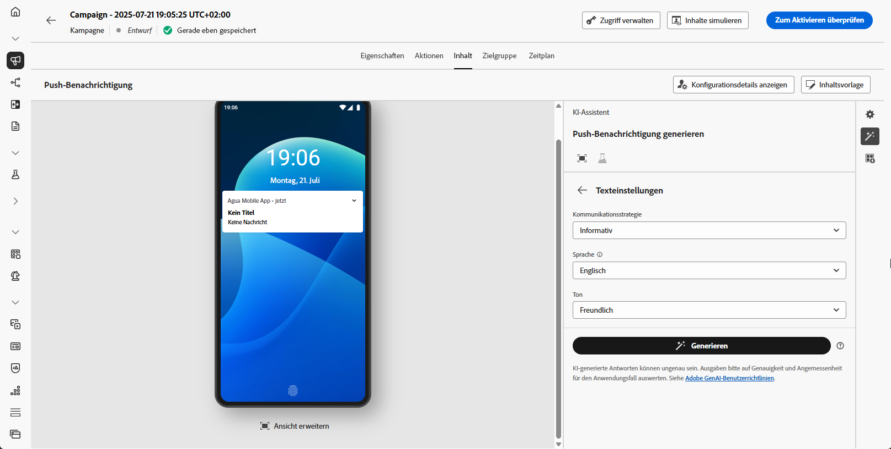
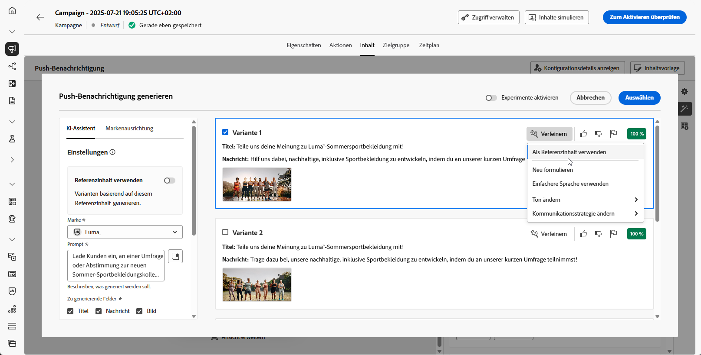
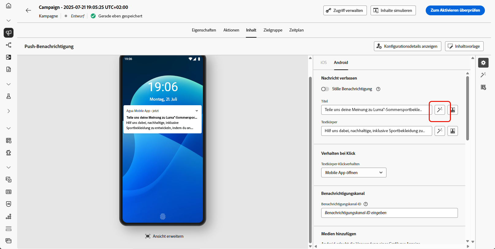
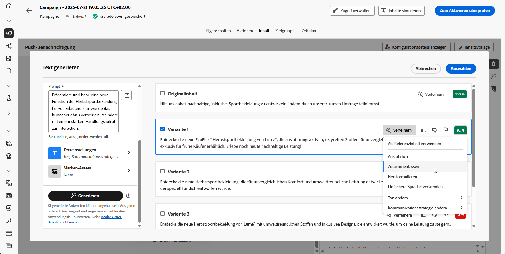

# Generierung von Push-Benachrichtigungen mit dem KI-Assistenten {#generative-push}

>[!IMPORTANT]
>
>Bevor Sie mit der Verwendung dieser Funktion beginnen, lesen Sie die entsprechenden Informationen zu [Leitlinien und Einschränkungen](gs-generative.md#generative-guardrails).
> 
>
>Sie müssen einer [Benutzervereinbarung](https://www.adobe.com/de/legal/licenses-terms/adobe-dx-gen-ai-user-guidelines.html) zustimmen, damit Sie den KI-Assistenten in Journey Optimizer verwenden können. Weitere Informationen erhalten Sie beim Adobe-Support.

Sobald Sie Ihre Nachrichten erstellt und personalisiert haben, können Sie den Inhalt Ihrer Push-Benachrichtigungen mithilfe des KI-Assistenten in Journey Optimizer weiterentwickeln.

Auf den folgenden Registerkarten erfahren Sie, wie Sie den KI-Assistenten in Journey Optimizer verwenden.

>[!BEGINTABS]

>[!TAB Vollständige Generierung von Push-Benachrichtigungen]

In diesem speziellen Beispiel erfahren Sie, wie Sie eine ansprechende Push-Benachrichtigung mithilfe des KI-Assistenten in Journey Optimizer senden.

Führen Sie folgende Schritte aus:

1. Nachdem Sie Ihre Push-Benachrichtigungs-Kampagne erstellt und konfiguriert haben, klicken Sie auf **[!UICONTROL Inhalt bearbeiten]**.

   Weitere Informationen zur Konfiguration Ihrer Push-Benachrichtigungs-Kampagne finden Sie auf [dieser Seite](../push/create-push.md).

1. Füllen Sie die **[!UICONTROL grundlegenden Details]** für Ihre Kampagne aus. Klicken Sie abschließend auf **[!UICONTROL Inhalt bearbeiten]**.

1. Personalisieren Sie Ihre Push-Benachrichtigung nach Bedarf. [Weitere Informationen](../push/design-push.md)

1. Rufen Sie das Menü **[!UICONTROL KI-Assistenten anzeigen]** auf.

   {zoomable="yes"}

1. Aktivieren Sie die Option **[!UICONTROL Originalinhalt verwenden]** für den KI-Assistenten, um neue Inhalte basierend auf dem ausgewählten Inhalt zu personalisieren.

1. Wählen Sie Ihre **[!UICONTROL Marke]** aus, um sicherzustellen, dass die KI-generierten Inhalte Ihren Markenspezifikationen entsprechen. [Erfahren Sie mehr](brands.md) über Marken.

   Beachten Sie, dass die Marken-Funktion als Private Beta veröffentlicht und in zukünftigen Versionen schrittweise allen Kundinnen und Kunden zur Verfügung gestellt wird.

1. Passen Sie den Inhalt an, indem Sie im Feld **[!UICONTROL Prompt]** beschreiben, was Sie generieren möchten.

   Wenn Sie Hilfe bei der Erstellung Ihres Prompts benötigen, finden Sie in der **[!UICONTROL Prompt-Bibliothek]** eine Vielzahl von Ideen für Prompts, mit denen Sie Ihre Kampagnen verbessern können.

   {zoomable="yes"}

1. Wählen Sie das zu generierende Feld aus: **[!UICONTROL Titel]**, **[!UICONTROL Nachricht]** und/oder **[!UICONTROL Bild]**.

1. Passen Sie Ihr Prompt mit der Option **[!UICONTROL Texteinstellungen]** an:

   * **[!UICONTROL Kommunikationsstrategie]**: Wählen Sie den am besten geeigneten Kommunikationsstil für den generierten Text aus.
   * **[!UICONTROL Sprachen]**: Wählen Sie die Sprache Ihrer generierten Inhalte.
   * **[!UICONTROL Ton]**: Der Ton der Push-Benachrichtigung sollte bei Ihrer Zielgruppe ankommen. Ob Sie nun informativ, humorvoll oder überzeugend klingen möchten, der KI-Assistent kann die Nachricht entsprechend anpassen.

   {zoomable="yes"}

1. Wählen Sie die **[!UICONTROL Bildeinstellungen]**:

   * **[!UICONTROL Content-Typ]**: Hiermit wird die Art des visuellen Elements kategorisiert, wobei zwischen verschiedenen Arten der visuellen Darstellung wie Fotos, Grafiken oder Kunst unterschieden wird.
   * **[!UICONTROL Visuelle Intensität]**: Sie können die Wirkung des Bildes durch Anpassen seiner Intensität steuern. Eine niedrigere Einstellung (2) sorgt für ein weicheres, zurückhaltenderes Erscheinungsbild, während eine höhere Einstellung (10) das Bild lebendiger und visuell kräftiger macht.
   * **[!UICONTROL Farbe und Ton]**: Die Gesamterscheinung der Farben in einem Bild und die Stimmung oder Atmosphäre, die diese vermittelt.
   * **[!UICONTROL Beleuchtung]**: Dies bezieht sich auf die Beleuchtung in einem Bild, die dessen Atmosphäre prägt und bestimmte Elemente hervorhebt.
   * **[!UICONTROL Komposition]**: Dies bezieht sich auf die Anordnung der Elemente innerhalb des Rahmens eines Bildes.

   {zoomable="yes"}

1. Klicken Sie im Menü **[!UICONTROL Marken-Assets]** auf **[!UICONTROL Marken-Asset hochladen]**, um beliebige Marken-Assets mit Inhalten hinzuzufügen, die zusätzlichen Kontext für den KI-Assistenten liefern können. Wählen Sie alternativ ein zuvor hochgeladenes Asset aus.

   Zuvor hochgeladene Dateien sind in der Dropdown-Liste **[!UICONTROL Hochgeladene Marken-Assets]** verfügbar. Wählen Sie einfach die Assets aus, die bei der Generierung berücksichtigt werden sollen.

1. Wenn das Prompt fertig ist, klicken Sie auf **[!UICONTROL Generieren]**.

1. Durchsuchen Sie die generierten **[!UICONTROL Varianten]**.

   Klicken Sie auf **[!UICONTROL Vorschau]**, um eine Vollbildversion der ausgewählten Variante anzuzeigen, oder auf **[!UICONTROL Anwenden]**, um Ihren aktuellen Inhalt zu ersetzen.

1. Klicken Sie auf das Prozentsymbol, um den **[!UICONTROL Markenausrichtungswert]** anzuzeigen und Abweichungen von Ihrer Marke zu identifizieren.

   Weitere Informationen finden Sie unter [Markenausrichtungswert](brands-score.md).

   {zoomable="yes"}

1. Navigieren Sie im Fenster **[!UICONTROL Vorschau]** zur Option **[!UICONTROL Verfeinern]**, um auf zusätzliche Anpassungsfunktionen zuzugreifen:

   * **[!UICONTROL Als Referenzinhalt verwenden]**: Die gewählte Variante dient hierbei als Referenzinhalt für die Generierung anderer Ergebnisse.

   * **[!UICONTROL Umformulieren]**: Der KI-Assistent kann Ihre Nachricht auf verschiedene Arten umformulieren, sodass Ihre Texte für verschiedene Zielgruppen interessant und ansprechend klingen.

   * **[!UICONTROL Einfachere Sprache verwenden]**: Nutzen Sie den KI-Assistenten, um Ihren Text zu vereinfachen, damit er für eine breitere Zielgruppe verständlich und zugänglich ist.

   Sie können auch den **[!UICONTROL Ton]** und die **[!UICONTROL Kommunikationsstrategie]** Ihres Textes ändern.

   {zoomable="yes"}

1. Öffnen Sie die Registerkarte **[!UICONTROL Markenausrichtung]**, um zu sehen, wie gut Ihr Inhalt mit Ihren [Markenrichtlinien](brands.md) abgestimmt ist.

1. Klicken Sie auf **[!UICONTROL Auswählen]**, sobald Sie den passenden Inhalt gefunden haben.

   Sie können auch ein Experiment für Ihren Inhalt aktivieren. [Weitere Informationen](generative-experimentation.md)

1. Fügen Sie Personalisierungsfelder ein, um Ihre Push-Benachrichtigung auf der Grundlage von Profildaten anzupassen. Klicken Sie danach auf die Schaltfläche **[!UICONTROL Inhalte simulieren]**, um das Rendern zu steuern, und überprüfen Sie die Personalisierungseinstellungen mit Testprofilen. [Weitere Informationen](../personalization/personalize.md)

Wenn Sie Inhalt, Zielgruppe und Zeitplan definiert haben, können Sie Ihre Push-Benachrichtigungs-Kampagne vorbereiten. [Weitere Informationen](../campaigns/review-activate-campaign.md)

>[!TAB Nur Textgenerierung]

In diesem speziellen Beispiel erfahren Sie, wie Sie den KI-Assistenten in Journey Optimizer für bestimmte Inhalte nutzen können. Führen Sie folgende Schritte aus:

1. Nachdem Sie Ihre Push-Benachrichtigungs-Kampagne erstellt und konfiguriert haben, klicken Sie auf **[!UICONTROL Inhalt bearbeiten]**.

   Weitere Informationen zur Konfiguration Ihrer Push-Benachrichtigungs-Kampagne finden Sie auf [dieser Seite](../push/create-push.md).

1. Geben Sie die **[!UICONTROL grundlegenden Details]** für Ihre Kampagne ein. Klicken Sie abschließend auf **[!UICONTROL Inhalt bearbeiten]**.

1. Personalisieren Sie Ihre Push-Benachrichtigung nach Bedarf. [Weitere Informationen](../push/design-push.md)

1. Rufen Sie das Menü **[!UICONTROL Text mit KI-Assistenten bearbeiten]** neben den Feldern **[!UICONTROL Titel]** oder **[!UICONTROL Nachricht]** auf.

   {zoomable="yes"}

1. Aktivieren Sie die Option **[!UICONTROL Referenzinhalt verwenden]** für den KI-Assistenten, um neue Inhalte basierend auf dem ausgewählten Inhalt zu personalisieren.

1. Wählen Sie Ihre **[!UICONTROL Marke]** aus, um sicherzustellen, dass die KI-generierten Inhalte Ihren Markenspezifikationen entsprechen. [Erfahren Sie mehr](brands.md) über Marken.

   Beachten Sie, dass die Marken-Funktion als Private Beta veröffentlicht und in zukünftigen Versionen schrittweise allen Kundinnen und Kunden zur Verfügung gestellt wird.

1. Passen Sie den Inhalt an, indem Sie im Feld **[!UICONTROL Prompt]** beschreiben, was Sie generieren möchten.

   Wenn Sie Hilfe bei der Erstellung Ihres Prompts benötigen, finden Sie in der **[!UICONTROL Prompt-Bibliothek]** eine Vielzahl von Ideen für Prompts, mit denen Sie Ihre Kampagnen verbessern können.

   {zoomable="yes"}

1. Passen Sie Ihr Prompt mit der Option **[!UICONTROL Texteinstellungen]** an:

   * **[!UICONTROL Kommunikationsstrategie]**: Wählen Sie den am besten geeigneten Kommunikationsstil für den generierten Text aus.
   * **[!UICONTROL Sprachen]**: Wählen Sie die Sprache Ihrer generierten Inhalte.
   * **[!UICONTROL Ton]**: Der Ton der Push-Benachrichtigung sollte bei Ihrer Zielgruppe ankommen. Ob Sie nun informativ, humorvoll oder überzeugend klingen möchten, der KI-Assistent kann die Nachricht entsprechend anpassen.
   * **[!UICONTROL Länge]**: Legen Sie die Länge Ihres Inhalts mit dem Schieberegler fest.

   {zoomable="yes"}

1. Klicken Sie im Menü **[!UICONTROL Marken-Assets]** auf **[!UICONTROL Marken-Asset hochladen]**, um beliebige Marken-Assets mit Inhalten hinzuzufügen, die zusätzlichen Kontext für den KI-Assistenten liefern können. Wählen Sie alternativ ein zuvor hochgeladenes Asset aus.

   Zuvor hochgeladene Dateien sind in der Dropdown-Liste **[!UICONTROL Hochgeladene Marken-Assets]** verfügbar. Wählen Sie einfach die Assets aus, die bei der Generierung berücksichtigt werden sollen.

1. Wenn das Prompt fertig ist, klicken Sie auf **[!UICONTROL Generieren]**.

1. Durchsuchen Sie die generierten **[!UICONTROL Varianten]**.

1. Klicken Sie auf das Prozentsymbol, um den **[!UICONTROL Markenausrichtungswert]** anzuzeigen und Abweichungen von Ihrer Marke zu identifizieren.

   Weitere Informationen finden Sie unter [Markenausrichtungswert](brands-score.md).

   {zoomable="yes"}

1. Navigieren Sie im Fenster **[!UICONTROL Vorschau]** zur Option **[!UICONTROL Verfeinern]**, um auf zusätzliche Anpassungsfunktionen zuzugreifen:

   * **[!UICONTROL Als Referenzinhalt verwenden]**: Die gewählte Variante dient hierbei als Referenzinhalt für die Generierung anderer Ergebnisse.

   * **[!UICONTROL Weiter ausführen]**: Der KI-Assistent kann Ihnen dabei helfen, genauer auf bestimmte Themen einzugehen und zusätzliche Details zum besseren Verständnis und für mehr Interaktion zu liefern.

   * **[!UICONTROL Zusammenfassen]**: Zu ausführliche Informationen können die Empfangenden überfordern. Nutzen Sie den KI-Assistenten, um die wichtigsten Punkte in klaren, prägnanten Aussagen zusammenzufassen, die die Aufmerksamkeit der Leserinnen und Leser wecken und sie zum Weiterlesen anregen.

   * **[!UICONTROL Neu formulieren]**:The: Der KI-Assistent kann Ihre Nachricht auf verschiedene Arten umformulieren, sodass Ihre Texte für verschiedene Zielgruppen interessant und ansprechend klingen.

   * **[!UICONTROL Einfachere Sprache verwenden]**: Nutzen Sie den KI-Assistenten, um Ihren Text zu vereinfachen, damit er für eine breitere Zielgruppe verständlich und zugänglich ist.

   Sie können auch den **[!UICONTROL Ton]** und die **[!UICONTROL Kommunikationsstrategie]** Ihres Textes ändern.

   {zoomable="yes"}

1. Öffnen Sie die Registerkarte **[!UICONTROL Markenausrichtung]**, um zu sehen, wie gut Ihr Inhalt mit Ihren [Markenrichtlinien](brands.md) abgestimmt ist.

1. Klicken Sie auf **[!UICONTROL Auswählen]**, sobald Sie den passenden Inhalt gefunden haben.

   Sie können auch ein Experiment für Ihren Inhalt aktivieren. [Weitere Informationen](generative-experimentation.md)

1. Fügen Sie Personalisierungsfelder ein, um Ihre Push-Benachrichtigung auf der Grundlage von Profildaten anzupassen. Klicken Sie danach auf die Schaltfläche **[!UICONTROL Inhalte simulieren]**, um das Rendern zu steuern, und überprüfen Sie die Personalisierungseinstellungen mit Testprofilen. [Weitere Informationen](../personalization/personalize.md)

Wenn Sie Inhalt, Zielgruppe und Zeitplan definiert haben, können Sie Ihre Push-Benachrichtigungs-Kampagne vorbereiten. [Weitere Informationen](../campaigns/review-activate-campaign.md)

>[!TAB Nur Bildgenerierung]

1. Nachdem Sie Ihre Push-Benachrichtigungs-Kampagne erstellt und konfiguriert haben, klicken Sie auf **[!UICONTROL Inhalt bearbeiten]**.

   Weitere Informationen zur Konfiguration Ihrer Push-Benachrichtigungs-Kampagne finden Sie auf [dieser Seite](../push/create-push.md).

1. Füllen Sie die **[!UICONTROL grundlegenden Details]** für Ihre Kampagne aus. Klicken Sie abschließend auf **[!UICONTROL Inhalt bearbeiten]**.

1. Personalisieren Sie Ihre Push-Benachrichtigung nach Bedarf. [Weitere Informationen](../push/design-push.md)

1. Rufen Sie das Menü **[!UICONTROL Medien hinzufügen]** auf.

   {zoomable="yes"}

1. Aktivieren Sie für den KI-Assistenten die Option **[!UICONTROL Referenzstil]**, um neue Inhalte basierend auf dem Referenzinhalt zu personalisieren. Sie können auch ein Bild hochladen, um Ihrer Variante Kontext hinzuzufügen.

1. Wählen Sie Ihre **[!UICONTROL Marke]** aus, um sicherzustellen, dass die KI-generierten Inhalte Ihren Markenspezifikationen entsprechen. [Erfahren Sie mehr](brands.md) über Marken.

   Beachten Sie, dass die Marken-Funktion als Private Beta veröffentlicht und in zukünftigen Versionen schrittweise allen Kundinnen und Kunden zur Verfügung gestellt wird.

1. Passen Sie den Inhalt an, indem Sie im Feld **[!UICONTROL Prompt]** beschreiben, was Sie generieren möchten.

   Wenn Sie Hilfe bei der Erstellung Ihres Prompts benötigen, finden Sie in der **[!UICONTROL Prompt-Bibliothek]** eine Vielzahl von Ideen für Prompts, mit denen Sie Ihre Kampagnen verbessern können.

   {zoomable="yes"}

1. Wählen Sie die **[!UICONTROL Bildeinstellungen]**:

   * **[!UICONTROL Content-Typ]**: Hiermit wird die Art des visuellen Elements kategorisiert, wobei zwischen verschiedenen Arten der visuellen Darstellung wie Fotos, Grafiken oder Kunst unterschieden wird.
   * **[!UICONTROL Visuelle Intensität]**: Sie können die Wirkung des Bildes durch Anpassen seiner Intensität steuern. Eine niedrigere Einstellung (2) sorgt für ein weicheres, zurückhaltenderes Erscheinungsbild, während eine höhere Einstellung (10) das Bild lebendiger und visuell kräftiger macht.
   * **[!UICONTROL Farbe und Ton]**: Die Gesamterscheinung der Farben in einem Bild und die Stimmung oder Atmosphäre, die diese vermittelt.
   * **[!UICONTROL Beleuchtung]**: Dies bezieht sich auf die Beleuchtung in einem Bild, die dessen Atmosphäre prägt und bestimmte Elemente hervorhebt.
   * **[!UICONTROL Komposition]**: Dies bezieht sich auf die Anordnung der Elemente innerhalb des Rahmens eines Bildes.

1. Klicken Sie im Menü **[!UICONTROL Marken-Assets]** auf **[!UICONTROL Marken-Asset hochladen]**, um beliebige Marken-Assets mit Inhalten hinzuzufügen, die zusätzlichen Kontext für den KI-Assistenten liefern können. Wählen Sie alternativ ein zuvor hochgeladenes Asset aus.

   Zuvor hochgeladene Dateien sind in der Dropdown-Liste **[!UICONTROL Hochgeladene Marken-Assets]** verfügbar. Wählen Sie einfach die Assets aus, die bei der Generierung berücksichtigt werden sollen.

1. Wenn das Prompt fertig ist, klicken Sie auf **[!UICONTROL Generieren]**.

1. Durchsuchen Sie die generierten **[!UICONTROL Varianten]**.

1. Klicken Sie auf das Prozentsymbol, um den **[!UICONTROL Markenausrichtungswert]** anzuzeigen und Abweichungen von Ihrer Marke zu identifizieren.

   Weitere Informationen finden Sie unter [Markenausrichtungswert](brands-score.md).

1. Navigieren Sie im Fenster **[!UICONTROL Vorschau]** zur Option **[!UICONTROL Verfeinern]**, um auf zusätzliche Anpassungsfunktionen zuzugreifen:

   * Mit **[!UICONTROL Ähnliche generieren]** können Sie verwandte Bilder für diese Variante anzeigen.
   * Mit **[!UICONTROL In Adobe Express bearbeiten]** können Sie Ihr Asset weiter anpassen.

[Weitere Informationen zur Adobe Express-Integration](../integrations/express.md)

   * Mit **[!UICONTROL Speichern]** können Sie die Assets für den späteren Zugriff speichern.

   {zoomable="yes"}

1. Öffnen Sie die Registerkarte **[!UICONTROL Markenausrichtung]**, um zu sehen, wie gut Ihr Inhalt mit Ihren [Markenrichtlinien](brands.md) abgestimmt ist.

1. Klicken Sie auf **[!UICONTROL Auswählen]**, sobald Sie den passenden Inhalt gefunden haben.

   Sie können auch ein Experiment für Ihren Inhalt aktivieren. [Weitere Informationen](generative-experimentation.md)

Wenn Sie Inhalt, Zielgruppe und Zeitplan definiert haben, können Sie Ihre Push-Benachrichtigungs-Kampagne vorbereiten. [Weitere Informationen](../campaigns/review-activate-campaign.md)

>[!ENDTABS]
