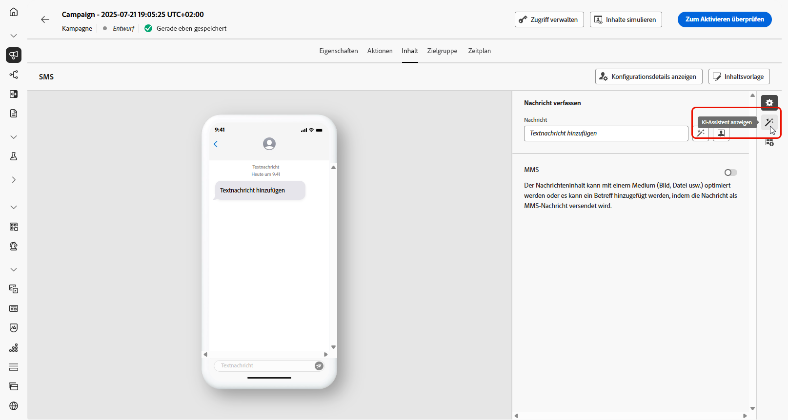
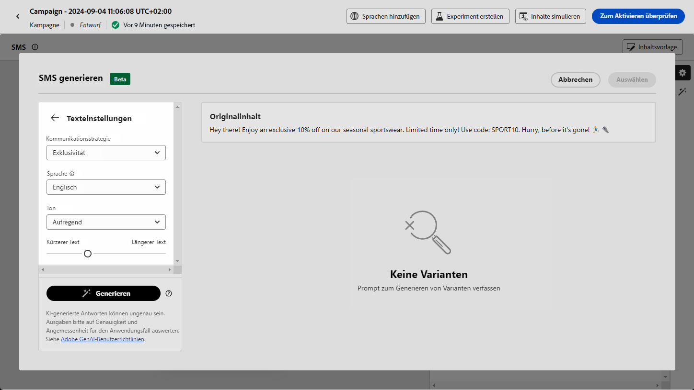

# Generierung von SMS mit dem KI-Assistenten {#generative-sms}

>[!BEGINSHADEBOX]

**Inhaltsverzeichnis**

* [Erste Schritte mit dem KI-Assistenten](gs-generative.md)
* [Generierung von E-Mails mit dem KI-Assistenten](generative-email.md)
* Generierung von SMS mit dem KI-Assistenten
* [Push-Generierung mit dem AI-Assistenten](generative-push.md)
* [Inhaltsexperiment mit dem KI-Assistenten](generative-experimentation.md)

>[!ENDSHADEBOX]

Nach der Erstellung und Anpassung Ihrer SMS-Nachrichten an die Vorlieben Ihrer Zielgruppe sollten Sie Ihre Kommunikation mit dem KI-Assistenten in Journey Optimizer intensivieren.

Diese Ressource bietet aufschlussreiche Empfehlungen zur Feinabstimmung Ihres Inhalts, die dazu beitragen, dass Ihre Nachrichten Resonanz finden und maximale Interaktion fördern.

Auf den folgenden Registerkarten erfahren Sie, wie Sie den AI-Assistenten in Journey Optimizer verwenden.

>[!NOTE]
>
>Bevor Sie mit der Verwendung dieser Funktion beginnen, lesen Sie die entsprechenden Informationen zu [Schutzmechanismen und Begrenzungen](gs-generative.md#generative-guardrails).

>[!BEGINTABS]

>[!TAB Vollständige SMS-Generierung]

1. Klicken Sie nach der Erstellung und Konfiguration Ihrer SMS-Kampagne auf **[!UICONTROL Inhalt bearbeiten]**.

   Weiterführende Informationen zur Konfiguration Ihrer SMS-Kampagne finden Sie im Abschnitt [diese Seite](../sms/create-sms.md).

1. Füllen Sie die **[!UICONTROL Grundlegende Details]** für Ihre Kampagne. Klicken Sie abschließend auf **[!UICONTROL Inhalt bearbeiten]**.

1. Personalisieren Sie Ihre SMS-Nachricht nach Bedarf. [Weitere Informationen](../sms/create-sms.md)

1. Rufen Sie das Menü **[!UICONTROL KI-Assistenten anzeigen]** auf.

   {zoomable=&quot;yes&quot;}

1. Aktivieren Sie die **[!UICONTROL Originalinhalt verwenden]** Option für den KI-Assistenten, um neuen Inhalt basierend auf Ihrem Kampagneninhalt, Ihrem Namen und der ausgewählten Zielgruppe zu personalisieren.

   Ihr Prompt muss immer an einen bestimmten Kontext gebunden sein.

1. Passen Sie den Inhalt an, indem Sie im Feld **[!UICONTROL Prompt]** beschreiben, was Sie generieren möchten.

   Wenn Sie Hilfe bei der Erstellung Ihrer Eingabeaufforderung benötigen, rufen Sie die **[!UICONTROL Eingabebibliothek]** , die eine Vielzahl von schnellen Ideen zur Verbesserung Ihrer Kampagnen bietet.

   {zoomable=&quot;yes&quot;}

1. Wählen Sie **[!UICONTROL Marken-Asset hochladen]** aus, um ein beliebiges Marken-Asset hinzuzufügen, das Inhalte enthält, die zusätzlichen Kontext für den KI-Assistenten bieten können.

1. Passen Sie Ihr Prompt mit den verschiedenen Optionen an:

   * **[!UICONTROL Kommunikationsstrategie]**: Wählen Sie den gewünschten Kommunikationsansatz für den erstellten Text.
   * **[!UICONTROL Sprache]**: Wählen Sie die Sprache für den Inhalt der Variante.
   * **[!UICONTROL Ton]**: Stellen Sie sicher, dass der Text für Ihre Zielgruppe und Ihren Zweck geeignet ist.
   * **[!UICONTROL Länge]**: Legen Sie die Länge Ihres Inhalts mit dem Schieberegler fest.

   {zoomable=&quot;yes&quot;}

1. Wenn das Prompt fertig ist, klicken Sie auf **[!UICONTROL Generieren]**.

1. Durchsuchen Sie die erstellten **[!UICONTROL Varianten]** und klicken Sie auf **[!UICONTROL Vorschau]**, um eine Vollbildversion der ausgewählten Variante anzuzeigen.

1. Navigieren Sie zur Option **[!UICONTROL Verfeinern]** im Fenster **[!UICONTROL Vorschau]**, um auf weitere Anpassungsfunktionen zuzugreifen und Ihre Variante nach Ihren Vorlieben zu gestalten:

   * **[!UICONTROL Als Referenzinhalt verwenden]**: Die gewählte Variante dient hierbei als Referenzinhalt für die Generierung anderer Ergebnisse.

   * **[!UICONTROL Umformulieren]**: Der KI-Assistent kann Ihre Nachricht auf verschiedene Arten umformulieren, sodass Ihr Text frisch und für verschiedene Zielgruppen ansprechend bleibt.

   * **[!UICONTROL Einfachere Sprache verwenden]**: Nutzen Sie den KI-Assistenten, um Ihre Sprache zu vereinfachen und für eine breitere Zielgruppe Klarheit und Barrierefreiheit zu gewährleisten.

   {zoomable=&quot;yes&quot;}

1. Klicken Sie auf **[!UICONTROL Auswählen]**, sobald Sie den passenden Inhalt gefunden haben.

   Sie können auch Experimente für Ihren Inhalt aktivieren. [Weitere Informationen](generative-experimentation.md)

1. Fügen Sie Personalisierungsfelder ein, um Ihre SMS-Inhalte auf der Grundlage von Profildaten anzupassen. [Weitere Informationen über die Personalisierung von Inhalten](../personalization/personalize.md)

1. Klicken Sie nach dem Definieren des Nachrichteninhalts auf die Schaltfläche **[!UICONTROL Inhalt simulieren]**, um das Rendern zu kontrollieren und die Personalisierungseinstellungen mit Testprofilen zu überprüfen. [Weitere Informationen](../personalization/personalize.md)

Wenn Sie Inhalt, Zielgruppe und Zeitplan definiert haben, können Sie Ihre SMS-Kampagne vorbereiten. [Weitere Informationen](../campaigns/review-activate-campaign.md)

>[!TAB Textgenerierung]

1. Klicken Sie nach der Erstellung und Konfiguration Ihrer SMS-Kampagne auf **[!UICONTROL Inhalt bearbeiten]**.

   Weiterführende Informationen zur Konfiguration Ihrer SMS-Kampagne finden Sie im Abschnitt [diese Seite](../sms/create-sms.md).

1. Füllen Sie die **[!UICONTROL Grundlegende Details]** für Ihre Kampagne. Klicken Sie abschließend auf **[!UICONTROL Inhalt bearbeiten]**.

1. Personalisieren Sie Ihre SMS-Nachricht nach Bedarf. [Weitere Informationen](../sms/create-sms.md)

1. Zugriff auf **[!UICONTROL Text mit dem KI-Assistenten bearbeiten]** Menü neben Ihrem **[!UICONTROL Nachricht]** -Feld.

   {zoomable=&quot;yes&quot;}

1. Aktivieren Sie die **[!UICONTROL Referenzinhalt verwenden]** Option für den KI-Assistenten, um neuen Inhalt basierend auf Ihrem Kampagneninhalt, Ihrem Namen und der ausgewählten Zielgruppe zu personalisieren.

   Ihr Prompt muss immer an einen bestimmten Kontext gebunden sein.

1. Passen Sie den Inhalt an, indem Sie im Feld **[!UICONTROL Prompt]** beschreiben, was Sie generieren möchten.

   Wenn Sie Hilfe bei der Erstellung Ihrer Eingabeaufforderung benötigen, rufen Sie die **[!UICONTROL Eingabebibliothek]** , die eine Vielzahl von schnellen Ideen zur Verbesserung Ihrer Kampagnen bietet.

   {zoomable=&quot;yes&quot;}

1. Wählen Sie **[!UICONTROL Marken-Asset hochladen]** aus, um ein beliebiges Marken-Asset hinzuzufügen, das Inhalte enthält, die zusätzlichen Kontext für den KI-Assistenten bieten können.

1. Passen Sie Ihr Prompt mit den verschiedenen Optionen an:

   * **[!UICONTROL Kommunikationsstrategie]**: Wählen Sie den gewünschten Kommunikationsansatz für den erstellten Text.
   * **[!UICONTROL Sprache]**: Wählen Sie die Sprache für den Inhalt der Variante.
   * **[!UICONTROL Ton]**: Stellen Sie sicher, dass der Text für Ihre Zielgruppe und Ihren Zweck geeignet ist.
   * **[!UICONTROL Länge]**: Legen Sie die Länge Ihres Inhalts mit dem Schieberegler fest.

   {zoomable=&quot;yes&quot;}

1. Wenn das Prompt fertig ist, klicken Sie auf **[!UICONTROL Generieren]**.

1. Durchsuchen Sie die erstellten **[!UICONTROL Varianten]** und klicken Sie auf **[!UICONTROL Vorschau]**, um eine Vollbildversion der ausgewählten Variante anzuzeigen.

1. Navigieren Sie zur Option **[!UICONTROL Verfeinern]** im Fenster **[!UICONTROL Vorschau]**, um auf weitere Anpassungsfunktionen zuzugreifen und Ihre Variante nach Ihren Vorlieben zu gestalten:

   * **[!UICONTROL Als Referenzinhalt verwenden]**: Die gewählte Variante dient hierbei als Referenzinhalt für die Generierung anderer Ergebnisse.

   * **[!UICONTROL Umformulieren]**: Der KI-Assistent kann Ihre Nachricht auf verschiedene Arten umformulieren, sodass Ihr Text frisch und für verschiedene Zielgruppen ansprechend bleibt.

   * **[!UICONTROL Einfachere Sprache verwenden]**: Nutzen Sie den KI-Assistenten, um Ihre Sprache zu vereinfachen und für eine breitere Zielgruppe Klarheit und Barrierefreiheit zu gewährleisten.

   {zoomable=&quot;yes&quot;}

1. Klicken Sie auf **[!UICONTROL Auswählen]**, sobald Sie den passenden Inhalt gefunden haben.

   Sie können auch Experimente für Ihren Inhalt aktivieren. [Weitere Informationen](generative-experimentation.md)

1. Fügen Sie Personalisierungsfelder ein, um Ihre SMS-Inhalte auf der Grundlage von Profildaten anzupassen. [Weitere Informationen über die Personalisierung von Inhalten](../personalization/personalize.md)

1. Klicken Sie nach der Definition des Nachrichteninhalts auf die Schaltfläche **[!UICONTROL Inhalt simulieren]** zur Steuerung des Renderings und zur Überprüfung der Personalisierungseinstellungen mit Testprofilen.

Wenn Sie Inhalt, Zielgruppe und Zeitplan definiert haben, können Sie Ihre SMS-Kampagne vorbereiten. [Weitere Informationen](../campaigns/review-activate-campaign.md)

>[!ENDTABS]
