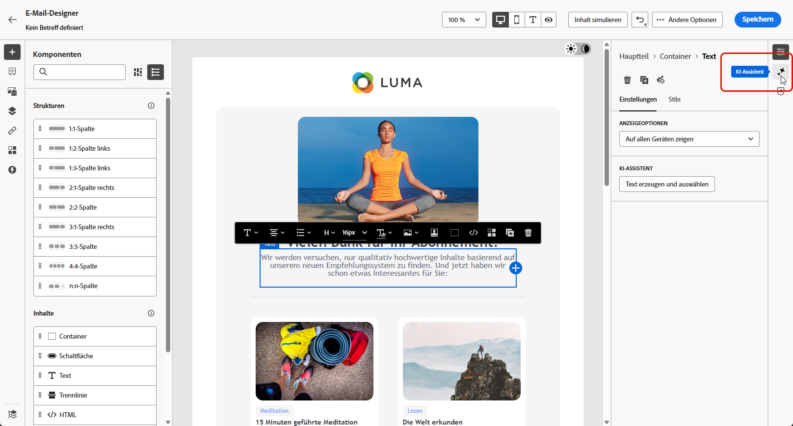
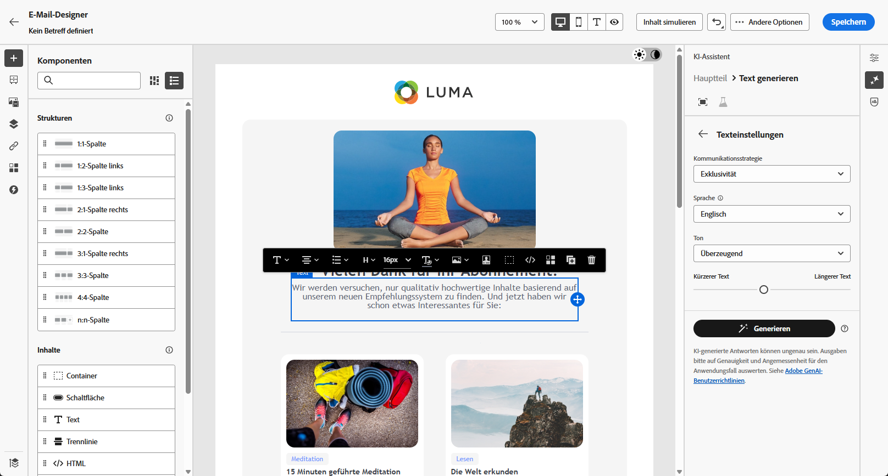
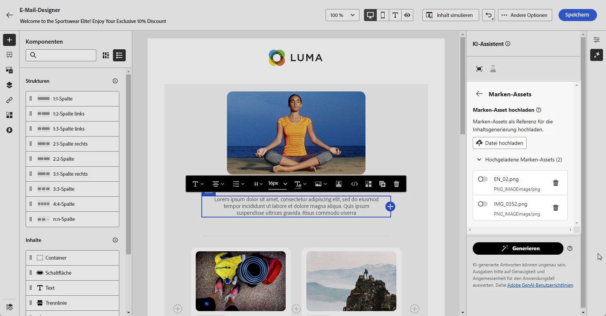
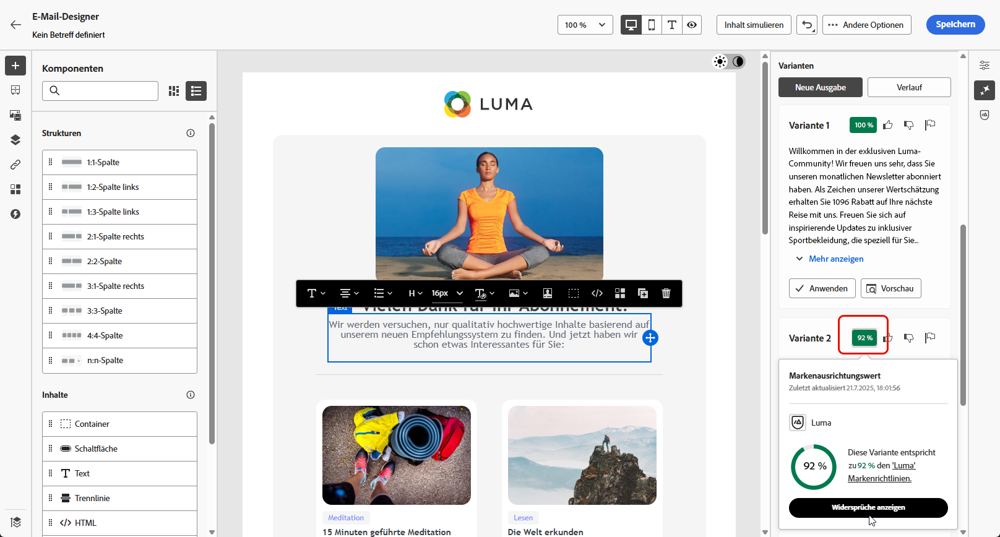
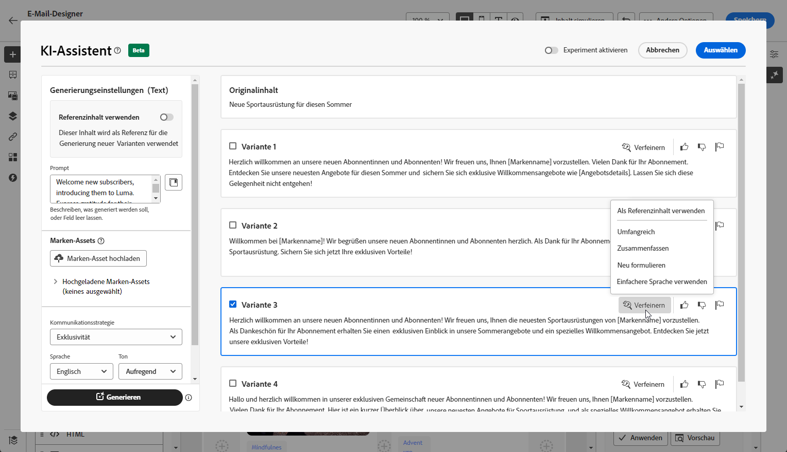
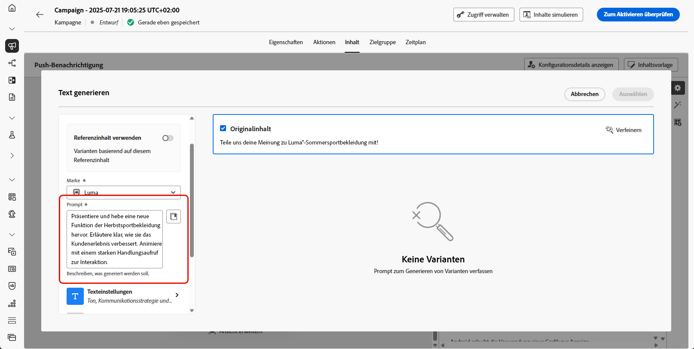
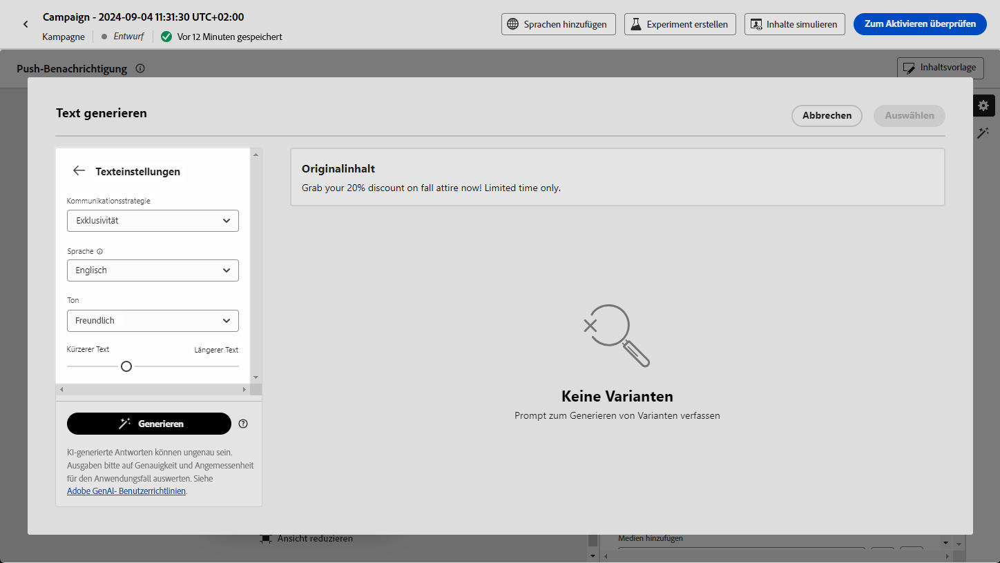
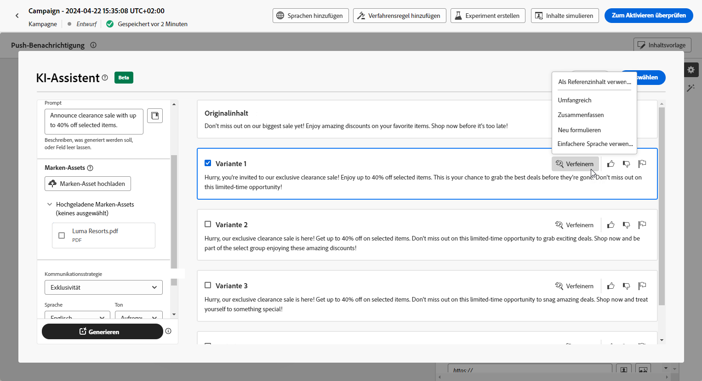
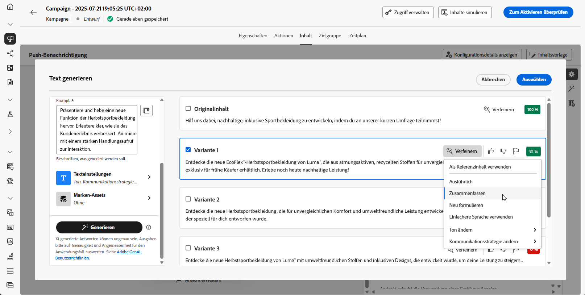

# Generieren von Text mit dem KI-Assistenten {#generative-text}

>[!IMPORTANT]
>
>Bevor Sie mit der Verwendung dieser Funktion beginnen, lesen Sie die entsprechenden Informationen zu [Leitlinien und Einschränkungen](gs-generative.md#generative-guardrails).
> 
>
>Sie müssen einer [Benutzervereinbarung](https://www.adobe.com/de/legal/licenses-terms/adobe-dx-gen-ai-user-guidelines.html) zustimmen, damit Sie den KI-Assistenten in Journey Optimizer verwenden können. Weitere Informationen erhalten Sie beim Adobe-Support.

Verwenden Sie den KI-Assistenten in Journey Optimizer, um ansprechende Textinhalte zu generieren, die Ihre Zielgruppe ansprechen. Unabhängig davon, ob Sie E-Mail-Kopien verbessern, überzeugende Web-Inhalte erstellen, überzeugenden Landingpage-Text erstellen, Push-Benachrichtigungen schreiben oder SMS-Nachrichten verfassen möchten, hilft Ihnen der KI-Assistent beim Versenden wirkungsvoller Texte.

## Für E-Mail- und Web-Kanäle {#email-web-channels}

Der KI-Assistent kann hochwertige Textinhalte für Ihre E-Mail-Kampagnen, Web-Erlebnisse und Landingpages generieren. Mit dieser Funktion können Sie überzeugende Markenbotschaften erstellen, die über digitale Touchpoints hinweg mit Ihrer Audience verbunden werden.

### Zugreifen auf und Konfigurieren {#access-configure}

Bevor Sie mit der Erstellung von Textinhalten mit dem KI-Assistenten beginnen können, müssen Sie Ihre Kampagne oder Journey einrichten und auf den Inhaltseditor zugreifen. Führen Sie diese Schritte aus, um Ihren Arbeitsbereich vorzubereiten und das Bedienfeld KI-Assistent zu öffnen.

1. Erstellen und konfigurieren Sie Ihre Kampagne oder Journey:

   * **E-**: Nachdem Sie Ihre E-Mail-Kampagne erstellt und konfiguriert haben, klicken Sie auf **[!UICONTROL Inhalt bearbeiten]**. [Weitere Informationen](../email/create-email.md)
   * **Web**: Klicken Sie nach dem Erstellen und Konfigurieren Ihrer Web-Seite auf **[!UICONTROL Web-Seite bearbeiten]**. [Weitere Informationen](../web/create-web.md)
   * **Landingpage**: Klicken Sie nach dem Erstellen und Konfigurieren Ihrer Landingpage auf **[!UICONTROL Designer öffnen]**. [Weitere Informationen](../landing-pages/create-lp.md)

1. Wählen Sie eine **[!UICONTROL Textkomponente]** aus, um nur einen bestimmten Inhalt anzusprechen und auf das Menü **[!UICONTROL KI-Assistent]** zuzugreifen (oder **[!UICONTROL KI-Assistent anzeigen]** für das Web).

   {zoomable="yes"}

### Inhalt generieren {#generate-content}

Erfahren Sie, wie Sie mit dem KI-Assistenten klare Eingabeaufforderungen erstellen, Einstellungen optimieren und maßgeschneiderten Text generieren können, um sicherzustellen, dass Ihre Botschaft mit Ihren Marken- und Kommunikationszielen übereinstimmt.

1. Aktivieren Sie für den KI-Assistenten die Option **[!UICONTROL Originalinhalt verwenden]**, um neue Inhalte basierend auf dem ausgewählten Inhalt zu personalisieren.

1. Wählen Sie Ihre **[!UICONTROL Marke]** aus, um sicherzustellen, dass die KI-generierten Inhalte Ihren Markenspezifikationen entsprechen. [Erfahren Sie mehr](brands.md) über Marken.

1. Passen Sie den Inhalt an, indem Sie im Feld **[!UICONTROL Prompt]** beschreiben, was Sie generieren möchten.

   Wenn Sie Hilfe bei der Erstellung Ihres Prompts benötigen, finden Sie in der **[!UICONTROL Prompt-Bibliothek]** eine Vielzahl von Ideen für Prompts, mit denen Sie Ihre Kampagnen verbessern können.

   {zoomable="yes"}

1. Passen Sie Ihr Prompt mit der Option **[!UICONTROL Texteinstellungen]** an:

   * **[!UICONTROL Kommunikationsstrategie]**: Wählen Sie den am besten geeigneten Kommunikationsstil für den generierten Text aus.
   * **[!UICONTROL Sprachen]**: Wählen Sie die Sprache Ihrer generierten Inhalte.
   * **[!UICONTROL Ton]**: Der Ton sollte bei Ihrer Audience Anklang finden. Ob Sie nun informativ, humorvoll oder überzeugend klingen möchten, der KI-Assistent kann die Nachricht entsprechend anpassen.
   * **Textlänge**: Wählen Sie mit dem Schieberegler die gewünschte Länge des Textes aus.

   {zoomable="yes"}

1. Klicken Sie im Menü **[!UICONTROL Marken-Assets]** auf **[!UICONTROL Marken-Asset hochladen]**, um beliebige Marken-Assets mit Inhalten hinzuzufügen, die zusätzlichen Kontext für den KI-Assistenten liefern können. Wählen Sie alternativ ein zuvor hochgeladenes Asset aus.

   Zuvor hochgeladene Dateien sind in der Dropdown-Liste **[!UICONTROL Hochgeladene Marken-Assets]** verfügbar. Wählen Sie einfach die Assets aus, die bei der Generierung berücksichtigt werden sollen.

   {zoomable="yes"}

1. Wenn der Prompt fertig ist, klicken Sie auf **[!UICONTROL Generieren]**.

### Verfeinern und abschließen {#refine-finalize}

Erfahren Sie, wie Sie den generierten Text überprüfen, Verfeinerungen vornehmen und Personalisierungen anwenden können, um Ihre Inhalte zu vervollständigen und ansprechende Nachrichten zu erstellen, die versandbereit sind.

1. Durchsuchen Sie die generierten **[!UICONTROL Varianten]**.

   Klicken Sie auf **[!UICONTROL Vorschau]**, um eine Vollbildversion der ausgewählten Variante anzuzeigen, oder auf **[!UICONTROL Anwenden]**, um Ihren aktuellen Inhalt zu ersetzen.

1. Klicken Sie auf das Prozentsymbol, um den **[!UICONTROL Markenausrichtungswert]** anzuzeigen und Abweichungen von Ihrer Marke zu identifizieren.

   Weitere Informationen finden Sie unter [Markenausrichtungswert](brands-score.md).

   {zoomable="yes"}

1. Navigieren Sie im Fenster **[!UICONTROL Vorschau]** zur Option **[!UICONTROL Verfeinern]**, um auf zusätzliche Anpassungsfunktionen zuzugreifen:

   * **[!UICONTROL Als Referenzinhalt verwenden]**: Die gewählte Variante dient hierbei als Referenzinhalt für die Generierung anderer Ergebnisse.

   * **[!UICONTROL Umformulieren]**: Schreiben Sie die Nachricht neu, ohne ihre Bedeutung zu verlieren. Mit dieser Option können Sie alternative Formulierungen erstellen, den Fluss verbessern oder die Formulierungen anpassen, ohne die Kernbotschaft zu ändern.

   * **[!UICONTROL Einfachere Sprache verwenden]**: Nutzen Sie den KI-Assistenten, um Ihren Text zu vereinfachen, damit er für eine breitere Zielgruppe verständlich und zugänglich ist.

   * **[!UICONTROL Ton ändern]**: Passen Sie den Ton der Nachricht an Ihren Kommunikationsstil an, d. h. sie freundlicher, professioneller, dringender oder inspirierender zu gestalten.

   * **[!UICONTROL Kommunikationsstrategie ändern]**: Ändern Sie den Messaging-Ansatz basierend auf Ihren Zielen, z. B. der Schaffung von Dringlichkeit oder der Betonung aufregender Attraktivität.

   {zoomable="yes"}

1. Öffnen Sie die Registerkarte **[!UICONTROL Markenausrichtung]**, um zu sehen, wie gut Ihr Inhalt mit Ihren [Markenrichtlinien](brands.md) abgestimmt ist.

1. Klicken Sie auf **[!UICONTROL Auswählen]**, sobald Sie den passenden Inhalt gefunden haben.

   Sie können auch ein Experiment für Ihren Inhalt aktivieren. [Weitere Informationen](generative-experimentation.md)

1. Fügen Sie Personalisierungsfelder ein, um Ihren Inhalt auf der Grundlage von Profildaten anzupassen. Klicken Sie danach auf die Schaltfläche **[!UICONTROL Inhalte simulieren]**, um das Rendern zu steuern, und überprüfen Sie die Personalisierungseinstellungen mit Testprofilen. [Weitere Informationen](../personalization/personalize.md)

1. Überprüfen und Aktivieren Ihres Inhalts:
   * **E** Mail: Wenn Sie Inhalt, Zielgruppe und Zeitplan definiert haben, können Sie Ihre E-Mail-Kampagne vorbereiten. [Weitere Informationen](../campaigns/review-activate-campaign.md)
   * **Web**: Nachdem Sie Ihre Web-Kampagneneinstellungen definiert und Ihren Inhalt nach Bedarf bearbeitet haben, können Sie Ihre Web-Kampagne überprüfen und aktivieren. [Weitere Informationen](../web/create-web.md#activate-web-campaign)
   * **Landingpage**: Sobald Ihre Landingpage fertig ist, können Sie sie veröffentlichen, um sie für die Verwendung in einer Nachricht verfügbar zu machen. [Weitere Informationen](../landing-pages/create-lp.md#publish-landing-page)

## Für mobile Kanäle {#mobile-channels}

Der KI-Assistent kann ansprechende Textinhalte für Ihre Push-Benachrichtigungen und SMS-Nachrichten generieren und Ihnen dabei helfen, ansprechende mobile Kommunikationen zu erstellen, die Ihre Zielgruppe über alle mobilen Touchpoints hinweg ansprechen.

### Zugreifen auf und Konfigurieren {#mobile-access-configure}

Bevor Sie mit der Erstellung von Text mit dem KI-Assistenten für mobile Kanäle beginnen, müssen Sie Ihre Kampagne einrichten und auf den KI-Assistenten zugreifen. Die Zugriffsmethode variiert geringfügig zwischen Push-Benachrichtigungen und SMS-Nachrichten.

1. Erstellen und konfigurieren Sie Ihre Mobile-Kampagne:
   * **Push-Benachrichtigungen**: Klicken Sie nach der Erstellung und Konfiguration Ihrer Push-Benachrichtigungskampagne auf **[!UICONTROL Inhalt bearbeiten]**. [Weitere Informationen](../push/create-push.md)
   * **SMS**: Klicken Sie nach der Erstellung und Konfiguration Ihrer SMS-Kampagne auf **[!UICONTROL Inhalt bearbeiten]**. [Weitere Informationen](../sms/create-sms.md)

1. Füllen Sie die **[!UICONTROL grundlegenden Details]** für Ihre Kampagne aus. Klicken Sie abschließend auf **[!UICONTROL Inhalt bearbeiten]**.

1. Personalisieren Sie Ihre Nachricht nach Bedarf:
   * **Push-Benachrichtigungen**: [Weitere Informationen](../push/design-push.md)
   * **SMS**: [Weitere Informationen](../sms/create-sms.md)

1. Zugriff auf KI-Assistenten:
   * **Für Push** Benachrichtigungen: Klicken Sie auf das Menü **[!UICONTROL Text mit KI-]** bearbeiten neben Ihren Feldern **[!UICONTROL Titel]** oder **[!UICONTROL Nachricht]**. Sie können auch direkt auf das Menü **KI-Assistent** zugreifen.

     {zoomable="yes"}

   * **Für SMS**: Klicken Sie auf das Menü **[!UICONTROL Text mit KI-]** bearbeiten neben Ihrer **[!UICONTROL Nachricht]** oder rufen Sie das Menü **[!UICONTROL KI-Assistenten anzeigen]** auf.

     {zoomable="yes"}

### Inhalt generieren {#mobile-generate-content}

Nachdem Sie auf den KI-Assistenten zugegriffen haben, können Sie die Generierungseinstellungen so konfigurieren, dass mobile Inhalte erstellt werden, die Ihren Marken- und Kampagnenzielen entsprechen. Passen Sie Textparameter an, fügen Sie Marken-Assets hinzu und geben Sie Aufforderungen an, um die KI bei der Generierung relevanter Varianten zu unterstützen.

1. Wählen Sie Ihre **[!UICONTROL Marke]** aus, um sicherzustellen, dass die KI-generierten Inhalte Ihren Markenspezifikationen entsprechen. [Erfahren Sie mehr](brands.md) über Marken.

   Beachten Sie, dass die Marken-Funktion als Private Beta veröffentlicht und in zukünftigen Versionen schrittweise allen Kundinnen und Kunden zur Verfügung gestellt wird.

1. Passen Sie den Inhalt an, indem Sie im Feld **[!UICONTROL Prompt]** beschreiben, was Sie generieren möchten.

   Wenn Sie Hilfe bei der Erstellung Ihrer Eingabeaufforderung benötigen, rufen Sie die **[!UICONTROL Eingabeaufforderungsbibliothek“ auf]** die eine Vielzahl von Ideen für die Eingabeaufforderung zur Verbesserung Ihrer Kampagnen bietet. [Erfahren Sie mehr über Best Practices zur Eingabeaufforderung](ai-assistant-prompting-guide.md)

   {zoomable="yes"}

1. **Wählen Sie für** Push-Benachrichtigung aus, welches Feld Sie generieren möchten: Titel und/oder Nachricht.

1. Passen Sie Ihr Prompt mit der Option **[!UICONTROL Texteinstellungen]** an:

   * **[!UICONTROL Kommunikationsstrategie]**: Wählen Sie den am besten geeigneten Kommunikationsstil für den generierten Text aus.
   * **[!UICONTROL Sprachen]**: Wählen Sie die Sprache Ihrer generierten Inhalte.
   * **[!UICONTROL Ton]**: Der Ton sollte bei Ihrer Audience Anklang finden. Ob Sie nun informativ, humorvoll oder überzeugend klingen möchten, der KI-Assistent kann die Nachricht entsprechend anpassen.

     {zoomable="yes"}

1. Klicken Sie im Menü **[!UICONTROL Referenzinhalt]** auf **[!UICONTROL Datei hochladen]**, um jedes Marken-Asset hinzuzufügen, das Inhalte enthält, die zusätzlichen Kontext-KI-Assistenten bereitstellen können oder ein zuvor hochgeladenes Asset auswählen.

   Zuvor hochgeladene Dateien sind in der Dropdown **[!UICONTROL Liste „Hochgeladener]**&quot; verfügbar. Wählen Sie einfach die Assets aus, die bei der Generierung berücksichtigt werden sollen.

1. Wenn das Prompt fertig ist, klicken Sie auf **[!UICONTROL Generieren]**.

### Verfeinern und abschließen {#mobile-refine-finalize}

Nachdem Sie Textvarianten für Ihre Mobile-Nachrichten generiert haben, können Sie die Ergebnisse optimieren, um sicherzustellen, dass sie genau Ihren Anforderungen entsprechen. Überprüfen Sie die Markenausrichtung, passen Sie den Ton und die Sprache an und bereiten Sie den Inhalt für die Aktivierung vor.

1. Navigieren Sie nach der Generierung durch **[!UICONTROL Varianten]**.

1. Klicken Sie auf das Prozentsymbol, um den **[!UICONTROL Markenausrichtungswert]** anzuzeigen und Abweichungen von Ihrer Marke zu identifizieren.

   Weitere Informationen finden Sie unter [Markenausrichtungswert](brands-score.md).

   {zoomable="yes"}

1. Klicken Sie auf **[!UICONTROL Vorschau]**, um eine Vollbildversion der ausgewählten Variante anzuzeigen, oder auf **[!UICONTROL Anwenden]**, um Ihren aktuellen Inhalt zu ersetzen.

1. Navigieren Sie im Fenster **[!UICONTROL Vorschau]** zur Option **[!UICONTROL Verfeinern]**, um auf zusätzliche Anpassungsfunktionen zuzugreifen:

   * **[!UICONTROL Als Referenzinhalt verwenden]**: Die gewählte Variante dient hierbei als Referenzinhalt für die Generierung anderer Ergebnisse.

   * **[!UICONTROL Umformulieren]**: Schreiben Sie die Nachricht neu, ohne ihre Bedeutung zu verlieren. Mit dieser Option können Sie alternative Formulierungen erstellen, den Fluss verbessern oder die Formulierungen anpassen, ohne die Kernbotschaft zu ändern.

   * **[!UICONTROL Einfachere Sprache verwenden]**: Nutzen Sie den KI-Assistenten, um Ihren Text zu vereinfachen, damit er für eine breitere Zielgruppe verständlich und zugänglich ist.

   * **[!UICONTROL Übersetzen]**: Vereinfachen Sie Ihre Sprache, um einer breiteren Zielgruppe Klarheit und Zugänglichkeit zu verschaffen.

   * **[!UICONTROL Ton ändern]**: Passen Sie den Ton der Nachricht an Ihren Kommunikationsstil an, d. h. sie freundlicher, professioneller, dringender oder inspirierender zu gestalten.

   * **[!UICONTROL Kommunikationsstrategie ändern]**: Ändern Sie den Messaging-Ansatz basierend auf Ihren Zielen, z. B. der Schaffung von Dringlichkeit oder der Betonung aufregender Attraktivität.

     {zoomable="yes"}

1. Öffnen Sie die Registerkarte **[!UICONTROL Markenausrichtung]**, um zu sehen, wie gut Ihr Inhalt mit Ihren [Markenrichtlinien](brands.md) abgestimmt ist.

1. Klicken Sie auf **[!UICONTROL Auswählen]**, sobald Sie den passenden Inhalt gefunden haben.

   Sie können auch ein Experiment für Ihren Inhalt aktivieren. [Weitere Informationen](generative-experimentation.md)

1. Fügen Sie Personalisierungsfelder ein, um Ihren Inhalt auf der Grundlage von Profildaten anzupassen. Klicken Sie danach auf die Schaltfläche **[!UICONTROL Inhalte simulieren]**, um das Rendern zu steuern, und überprüfen Sie die Personalisierungseinstellungen mit Testprofilen. [Weitere Informationen](../personalization/personalize.md)

Wenn Sie Inhalt, Zielgruppe und Zeitplan definiert haben, können Sie Ihre Mobile-Kampagne vorbereiten. [Weitere Informationen](../campaigns/review-activate-campaign.md)

