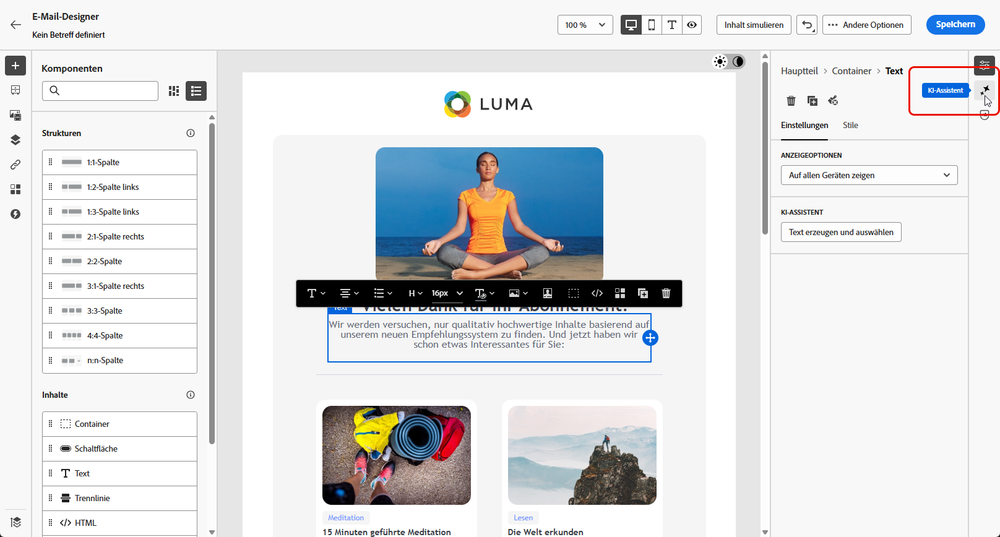
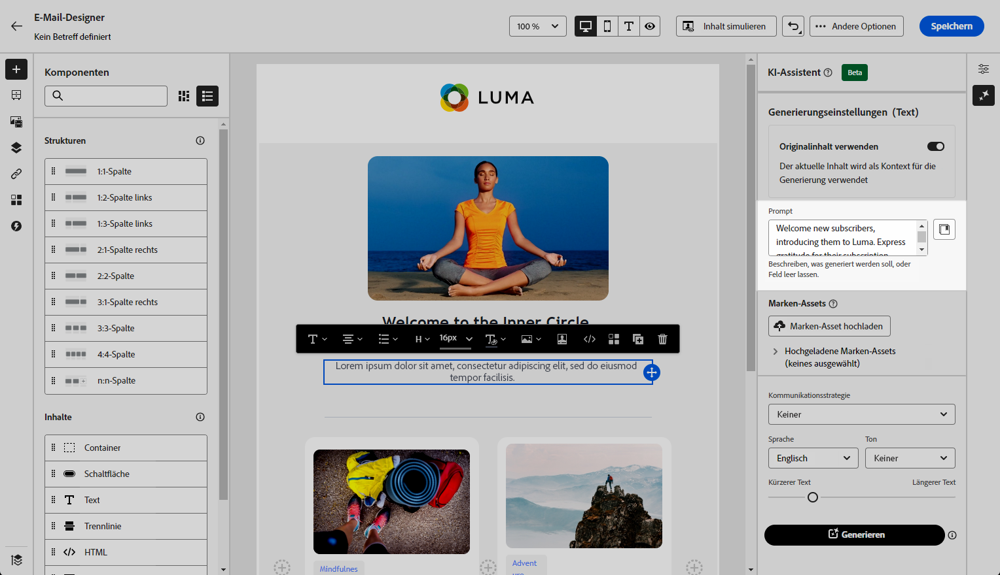
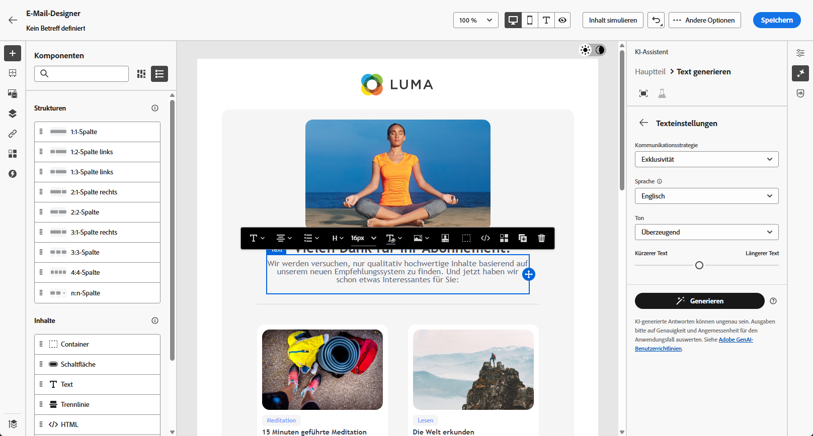
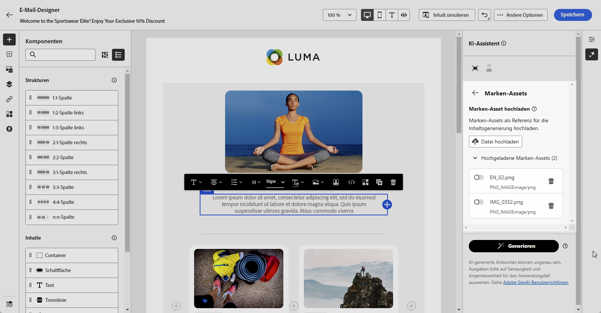
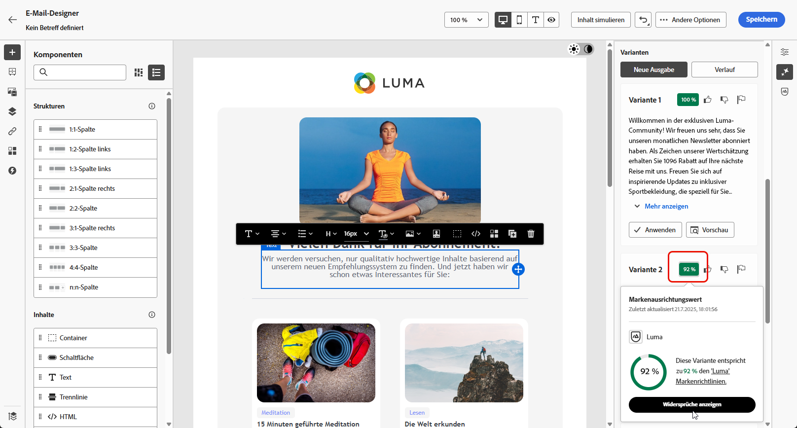
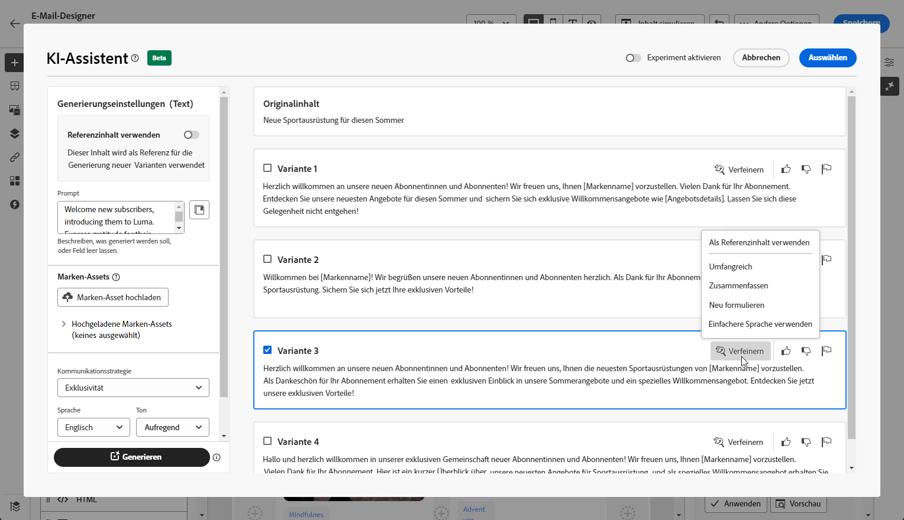
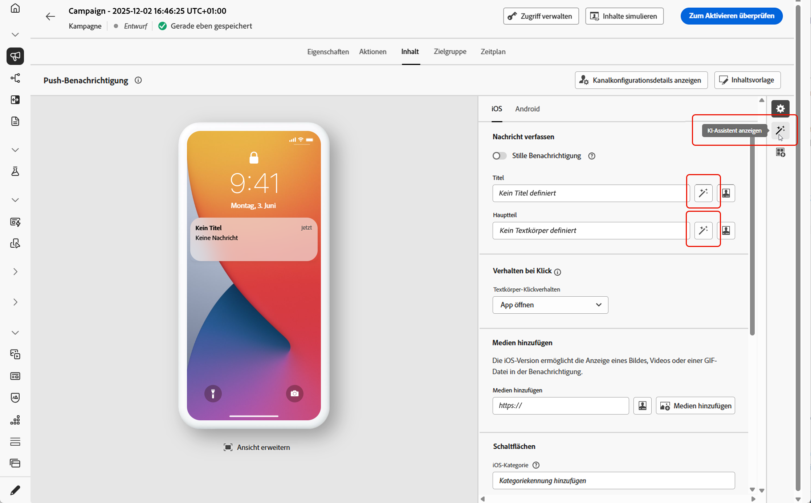
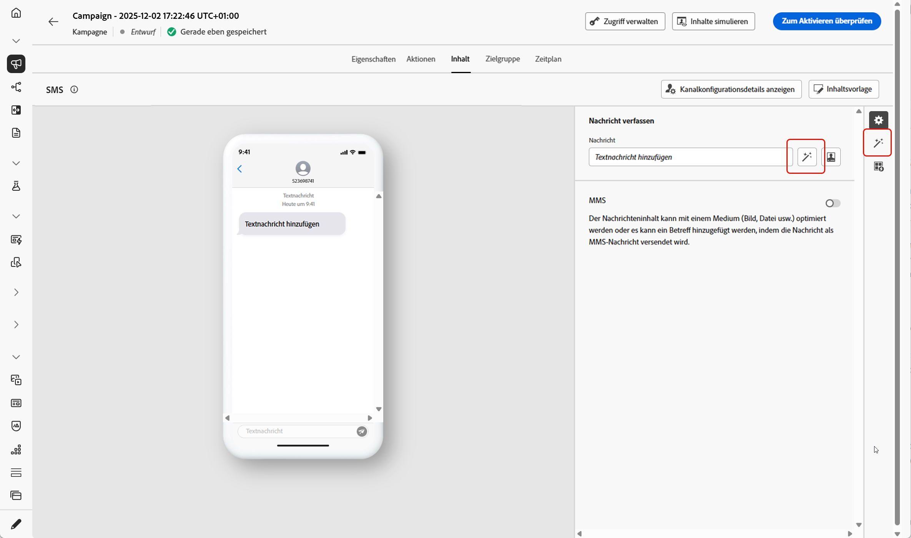
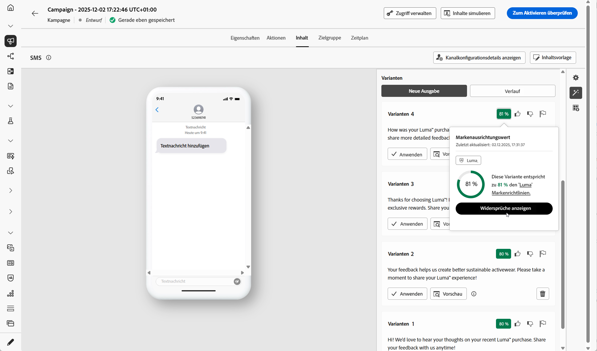

# Generieren von Text mit dem KI-Assistenten {#generative-text}

>[!IMPORTANT]
>
>Bevor Sie mit der Verwendung dieser Funktion beginnen, lesen Sie die entsprechenden Informationen zu [Leitlinien und Einschränkungen](gs-generative.md#generative-guardrails).
> 
>
>Sie müssen einer [Benutzervereinbarung](https://www.adobe.com/de/legal/licenses-terms/adobe-dx-gen-ai-user-guidelines.html) zustimmen, damit Sie den KI-Assistenten in Journey Optimizer verwenden können. Weitere Informationen erhalten Sie beim Adobe-Support.

Verwenden Sie den KI-Assistenten in Journey Optimizer, um ansprechenden Text zu generieren, der bei Ihrer Zielgruppe Anklang findet. Unabhängig davon, ob Sie E-Mail-Versionen verbessern, ansprechende Web-Inhalte erstellen, überzeugenden Landingpage-Text zusammenstellen, Push-Benachrichtigungen schreiben oder SMS-Nachrichten verfassen möchten, hilft Ihnen der KI-Assistent beim Versenden wirkungsvoller Texte.

## Für E-Mail- und Web-Kanäle {#email-web-channels}

Der KI-Assistent kann hochwertige Textinhalte für Ihre E-Mail-Kampagnen, Web-Erlebnisse und Landingpages generieren. Mit dieser Funktion können Sie überzeugendes markenkonformes Messaging erstellen, das über digitale Touchpoints hinweg bei Ihrer Zielgruppe Anklang findet.

### Zugriff und Konfiguration {#access-configure}

Bevor Sie mit dem Generieren von Textinhalten mit dem KI-Assistenten beginnen können, müssen Sie Ihre Kampagne oder Journey einrichten und auf den Inhaltseditor zugreifen. Gehen Sie wie folgt vor, um Ihren Arbeitsbereich vorzubereiten und das Panel „KI-Assistent“ zu öffnen.

1. Erstellen und konfigurieren Sie die Kampagne oder Journey:

   * **E-Mail:** Nachdem Sie Ihre E-Mail-Kampagne erstellt und konfiguriert haben, klicken Sie auf **[!UICONTROL Inhalt bearbeiten]**. [Weitere Informationen](../email/create-email.md)
   * **Web:** Nachdem Sie Ihre Web-Seite erstellt und konfiguriert haben, klicken Sie auf **[!UICONTROL Web-Seite bearbeiten]**. [Weitere Informationen](../web/create-web.md)
   * **Landingpage:** Nachdem Sie Ihre Landingpage erstellt und konfiguriert haben, klicken Sie auf **[!UICONTROL Designer öffnen]**. [Weitere Informationen](../landing-pages/create-lp.md)

1. Wählen Sie eine **[!UICONTROL Textkomponente]** aus, um nur einen bestimmten Inhalt zu erfassen und auf das Menü **[!UICONTROL KI-Assistent]** zuzugreifen (oder **[!UICONTROL KI-Assistent anzeigen]** für Web).

   {zoomable="yes"}

### Generieren von Inhalt {#generate-content}

Erfahren Sie, wie Sie klare Prompts erstellen, Einstellungen optimieren und maßgeschneiderte Texte mit dem KI-Assistenten generieren können, um sicherzustellen, dass Ihr Messaging mit Ihren Marken- und Kommunikationszielen übereinstimmt.

1. Aktivieren Sie für den KI-Assistenten die Option **[!UICONTROL Originalinhalt verwenden]**, um neue Inhalte basierend auf dem ausgewählten Inhalt zu personalisieren.

1. Wählen Sie Ihre **[!UICONTROL Marke]** aus, um sicherzustellen, dass die KI-generierten Inhalte Ihren Markenspezifikationen entsprechen. [Erfahren Sie mehr](brands.md) über Marken.

1. Passen Sie den Inhalt an, indem Sie im Feld **[!UICONTROL Prompt]** beschreiben, was Sie generieren möchten.

   Wenn Sie Hilfe bei der Erstellung Ihres Prompts benötigen, finden Sie in der **[!UICONTROL Prompt-Bibliothek]** eine Vielzahl von Ideen für Prompts, mit denen Sie Ihre Kampagnen verbessern können.

   {zoomable="yes"}

1. Passen Sie Ihr Prompt mit der Option **[!UICONTROL Texteinstellungen]** an:

   * **[!UICONTROL Kommunikationsstrategie]**: Wählen Sie den am besten geeigneten Kommunikationsstil für den generierten Text aus.
   * **[!UICONTROL Sprachen]**: Wählen Sie die Sprache Ihrer generierten Inhalte.
   * **[!UICONTROL Ton]**: Der Ton sollte bei Ihrer Zielgruppe Anklang finden. Der KI-Assistent kann die Nachricht entsprechend anpassen, je nachdem ob Sie informativ, humorvoll oder überzeugend klingen möchten.
   * **Textlänge**: Wählen Sie mit dem Schieberegler die gewünschte Länge des Textes aus.

   {zoomable="yes"}

1. Klicken Sie im Menü **[!UICONTROL Marken-Assets]** auf **[!UICONTROL Marken-Asset hochladen]**, um beliebige Marken-Assets mit Inhalten hinzuzufügen, die zusätzlichen Kontext für den KI-Assistenten liefern können. Wählen Sie alternativ ein zuvor hochgeladenes Asset aus.

   Zuvor hochgeladene Dateien sind in der Dropdown-Liste **[!UICONTROL Hochgeladene Marken-Assets]** verfügbar. Wählen Sie einfach die Assets aus, die bei der Generierung berücksichtigt werden sollen.

   {zoomable="yes"}

1. Wenn der Prompt fertig ist, klicken Sie auf **[!UICONTROL Generieren]**.

### Verfeinern und Fertigstellen {#refine-finalize}

Erfahren Sie, wie Sie den generierten Text überprüfen, Anpassungen vornehmen und Personalisierung anwenden können, um Ihre Inhalte fertigzustellen sowie hochwertige und ansprechende Nachrichten zu erstellen, die versandbereit sind.

1. Durchsuchen Sie die generierten **[!UICONTROL Varianten]**.

   Klicken Sie auf **[!UICONTROL Vorschau]**, um eine Vollbildversion der ausgewählten Variante anzuzeigen, oder auf **[!UICONTROL Anwenden]**, um Ihren aktuellen Inhalt zu ersetzen.

1. Klicken Sie auf das Prozentsymbol, um den **[!UICONTROL Markenausrichtungswert]** anzuzeigen und Abweichungen von Ihrer Marke zu identifizieren.

   Weitere Informationen finden Sie unter [Markenausrichtungswert](brands-score.md).

   {zoomable="yes"}

1. Navigieren Sie im Fenster **[!UICONTROL Vorschau]** zur Option **[!UICONTROL Verfeinern]**, um auf zusätzliche Anpassungsfunktionen zuzugreifen:

   * **[!UICONTROL Als Referenzinhalt verwenden]**: Die gewählte Variante dient hierbei als Referenzinhalt für die Generierung anderer Ergebnisse.

   * **[!UICONTROL Neu formulieren]**: Schreiben Sie die Nachricht um und behalten Sie dabei seine Bedeutung bei. Mit dieser Option können Sie alternative Formulierungen generieren, den Lesefluss verbessern oder die Ausdrucksweise anpassen, ohne die Kernbotschaft zu ändern.

   * **[!UICONTROL Einfachere Sprache verwenden]**: Nutzen Sie den KI-Assistenten, um Ihren Text zu vereinfachen, damit er für eine breitere Zielgruppe verständlich und zugänglich ist.

   * **[!UICONTROL Ton ändern]**: Passen Sie den Ton der Nachricht an Ihren Kommunikationsstil an, d. h. lassen Sie sie freundlicher, professioneller, dringender oder inspirierender klingen.

   * **[!UICONTROL Kommunikationsstrategie ändern]**: Ändern Sie den Messaging-Ansatz basierend auf Ihren Zielen, beispielsweise um Dringlichkeit zu erzeugen oder aufregende Anreize zu betonen.

   {zoomable="yes"}

1. Öffnen Sie die Registerkarte **[!UICONTROL Markenausrichtung]**, um zu sehen, wie gut Ihr Inhalt mit Ihren [Markenrichtlinien](brands.md) abgestimmt ist.

1. Klicken Sie auf **[!UICONTROL Auswählen]**, sobald Sie den passenden Inhalt gefunden haben.

1. Fügen Sie Personalisierungsfelder ein, um Ihre Inhalte auf der Grundlage von Profildaten anzupassen. Klicken Sie danach auf die Schaltfläche **[!UICONTROL Inhalte simulieren]**, um das Rendern zu steuern, und überprüfen Sie die Personalisierungseinstellungen mit Testprofilen. [Weitere Informationen](../personalization/personalize.md)

1. Überprüfen und aktivieren Sie Ihren Inhalt:
   * **E-Mail**: Wenn Sie Inhalt, Zielgruppe und Zeitplan definiert haben, können Sie die E-Mail-Kampagne vorbereiten. [Weitere Informationen](../campaigns/review-activate-campaign.md)
   * **Web**: Nachdem Sie Ihre Web-Kampagneneinstellungen festgelegt und Ihren Inhalt wie gewünscht bearbeitet haben, können Sie Ihre Web-Kampagne prüfen und aktivieren. [Weitere Informationen](../web/create-web.md#activate-web-campaign)
   * **Landingpage**: Sobald Ihre Landingpage fertig ist, können Sie sie veröffentlichen, um sie für die Verwendung in einer Nachricht verfügbar zu machen. [Weitere Informationen](../landing-pages/create-lp.md#publish-landing-page)

## Für mobile Kanäle {#mobile-channels}

Der KI-Assistent kann überzeugende Textinhalte für Ihre Push-Benachrichtigungen und SMS-Nachrichten generieren und Ihnen dabei helfen, ansprechende Mobile-Kommunikation zu erstellen, die über alle Mobile-Touchpoints hinweg bei Ihrer Zielgruppe Anklang findet.

### Zugriff und Konfiguration {#mobile-access-configure}

Bevor Sie mit dem Generieren von Text mit dem KI-Assistenten für Mobile-Kanäle beginnen, müssen Sie Ihre Kampagne einrichten und den KI-Assistenten aufrufen. Die Zugriffsmethode variiert geringfügig zwischen Push-Benachrichtigungen und SMS-Nachrichten.

1. Erstellen und konfigurieren Sie die Mobile-Kampagne:
   * **Push-Benachrichtigungen:** Nachdem Sie Ihre Push-Benachrichtigungskampagne erstellt und konfiguriert haben, klicken Sie auf **[!UICONTROL Inhalt bearbeiten]**. [Weitere Informationen](../push/create-push.md)
   * **SMS:** Nachdem Sie Ihre SMS-Kampagne erstellt und konfiguriert haben, klicken Sie auf **[!UICONTROL Inhalt bearbeiten]**. [Weitere Informationen](../mobile/create-mobile-message.md)

1. Füllen Sie die **[!UICONTROL grundlegenden Details]** für Ihre Kampagne aus. Klicken Sie abschließend auf **[!UICONTROL Inhalt bearbeiten]**.

1. Personalisieren Sie Ihre Nachricht nach Bedarf:
   * **Push-Benachrichtigungen**: [Weitere Informationen](../push/design-push.md)
   * **SMS**: [Weitere Informationen](../mobile/create-mobile-message.md)

1. Rufen Sie den KI-Assistenten auf:
   * **Für Push-Benachrichtigungen:** Klicken Sie neben dem Feld **[!UICONTROL Titel]** oder **[!UICONTROL Nachricht]** auf das Menü **[!UICONTROL Text mit KI-Assistent bearbeiten]**. Sie können auch direkt auf das Menü **KI-Assistent** zugreifen.

     {zoomable="yes"}

   * **Für SMS:** Klicken Sie neben der **[!UICONTROL Nachricht]** auf das Menü **[!UICONTROL Text mit KI-Assistent bearbeiten]** oder rufen Sie das Menü **[!UICONTROL KI-Assistenten anzeigen]** auf.

     {zoomable="yes"}

### Generieren von Inhalt {#mobile-generate-content}

Nachdem Sie den KI-Assistenten aufgerufen haben, können Sie die Generierungseinstellungen so konfigurieren, dass Mobile-Inhalte erstellt werden, die Ihren Marken- und Kampagnenzielen entsprechen. Passen Sie Textparameter an, fügen Sie Marken-Assets hinzu und geben Sie Prompts ein, um die KI beim Generieren relevanter Varianten zu unterstützen.

1. Wählen Sie Ihre **[!UICONTROL Marke]** aus, um sicherzustellen, dass die KI-generierten Inhalte Ihren Markenspezifikationen entsprechen. [Erfahren Sie mehr](brands.md) über Marken.

   Beachten Sie, dass die Marken-Funktion als Private Beta veröffentlicht und in zukünftigen Versionen schrittweise allen Kundinnen und Kunden zur Verfügung gestellt wird.

1. Passen Sie den Inhalt an, indem Sie im Feld **[!UICONTROL Prompt]** beschreiben, was Sie generieren möchten.

   Wenn Sie Hilfe bei der Erstellung Ihres Prompts benötigen, finden Sie in der **[!UICONTROL Prompt-Bibliothek]** eine Vielzahl von Ideen für Prompts, mit denen Sie Ihre Kampagnen verbessern können. [Weitere Informationen zu Best Practices für Prompts](ai-assistant-prompting-guide.md)

   {zoomable="yes"}

1. Wählen Sie für **Push-Benachrichtigungen** das zu generierende Feld aus: „Titel“ und/oder „Nachricht“.

1. Passen Sie Ihr Prompt mit der Option **[!UICONTROL Texteinstellungen]** an:

   * **[!UICONTROL Kommunikationsstrategie]**: Wählen Sie den am besten geeigneten Kommunikationsstil für den generierten Text aus.
   * **[!UICONTROL Sprachen]**: Wählen Sie die Sprache Ihrer generierten Inhalte.
   * **[!UICONTROL Ton]**: Der Ton sollte bei Ihrer Zielgruppe Anklang finden. Der KI-Assistent kann die Nachricht entsprechend anpassen, je nachdem ob Sie informativ, humorvoll oder überzeugend klingen möchten.

     {zoomable="yes"}

1. Klicken Sie im Menü **[!UICONTROL Referenzinhalt]** auf **[!UICONTROL Datei hochladen]**, um beliebige Marken-Assets mit Inhalten hinzuzufügen, die zusätzlichen Kontext für den KI-Assistenten liefern können. Alternativ können Sie ein zuvor hochgeladenes Asset auswählen.

   Zuvor hochgeladene Dateien sind in der Dropdown-Liste **[!UICONTROL Hochgeladener Referenzinhalt]** verfügbar. Wählen Sie einfach die Assets aus, die bei der Generierung berücksichtigt werden sollen.

1. Wenn der Prompt fertig ist, klicken Sie auf **[!UICONTROL Generieren]**.

### Verfeinern und Fertigstellen {#mobile-refine-finalize}

Nachdem Sie Textvarianten für Ihre Mobile-Nachrichten generiert haben, können Sie die Ergebnisse anpassen, um sicherzustellen, dass sie genau Ihren Anforderungen entsprechen. Überprüfen Sie die Markenausrichtung, passen Sie den Ton und die Sprache an und bereiten Sie den Inhalt für die Aktivierung vor.

1. Sehen Sie sich nach der Generierung die **[!UICONTROL Varianten]** an.

1. Klicken Sie auf das Prozentsymbol, um den **[!UICONTROL Markenausrichtungswert]** anzuzeigen und Abweichungen von Ihrer Marke zu identifizieren.

   Weitere Informationen finden Sie unter [Markenausrichtungswert](brands-score.md).

   {zoomable="yes"}

1. Klicken Sie auf **[!UICONTROL Vorschau]**, um eine Vollbildversion der ausgewählten Variante anzuzeigen, oder auf **[!UICONTROL Anwenden]**, um Ihren aktuellen Inhalt zu ersetzen.

1. Navigieren Sie im Fenster **[!UICONTROL Vorschau]** zur Option **[!UICONTROL Verfeinern]**, um auf zusätzliche Anpassungsfunktionen zuzugreifen:

   * **[!UICONTROL Als Referenzinhalt verwenden]**: Die gewählte Variante dient hierbei als Referenzinhalt für die Generierung anderer Ergebnisse.

   * **[!UICONTROL Neu formulieren]**: Schreiben Sie die Nachricht um und behalten Sie dabei seine Bedeutung bei. Mit dieser Option können Sie alternative Formulierungen generieren, den Lesefluss verbessern oder die Ausdrucksweise anpassen, ohne die Kernbotschaft zu ändern.

   * **[!UICONTROL Einfachere Sprache verwenden]**: Nutzen Sie den KI-Assistenten, um Ihren Text zu vereinfachen, damit er für eine breitere Zielgruppe verständlich und zugänglich ist.

   * **[!UICONTROL Übersetzen]**: Vereinfachen Sie Ihren Text, damit er für eine breitere Zielgruppe verständlich und zugänglich ist.

   * **[!UICONTROL Ton ändern]**: Passen Sie den Ton der Nachricht an Ihren Kommunikationsstil an, d. h. lassen Sie sie freundlicher, professioneller, dringender oder inspirierender klingen.

   * **[!UICONTROL Kommunikationsstrategie ändern]**: Ändern Sie den Messaging-Ansatz basierend auf Ihren Zielen, beispielsweise um Dringlichkeit zu erzeugen oder aufregende Anreize zu betonen.

     {zoomable="yes"}

1. Öffnen Sie die Registerkarte **[!UICONTROL Markenausrichtung]**, um zu sehen, wie gut Ihr Inhalt mit Ihren [Markenrichtlinien](brands.md) abgestimmt ist.

1. Klicken Sie auf **[!UICONTROL Auswählen]**, sobald Sie den passenden Inhalt gefunden haben.

1. Fügen Sie Personalisierungsfelder ein, um Ihre Inhalte auf der Grundlage von Profildaten anzupassen. Klicken Sie danach auf die Schaltfläche **[!UICONTROL Inhalte simulieren]**, um das Rendern zu steuern, und überprüfen Sie die Personalisierungseinstellungen mit Testprofilen. [Weitere Informationen](../personalization/personalize.md)

Wenn Sie Inhalt, Zielgruppe und Zeitplan definiert haben, können Sie Ihre Mobile-Kampagne vorbereiten. [Weitere Informationen](../campaigns/review-activate-campaign.md)
