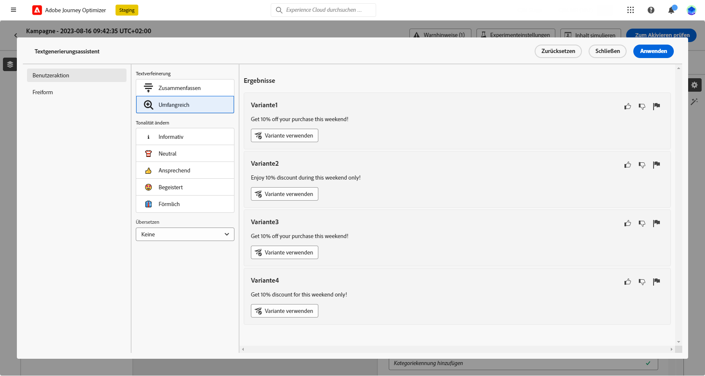
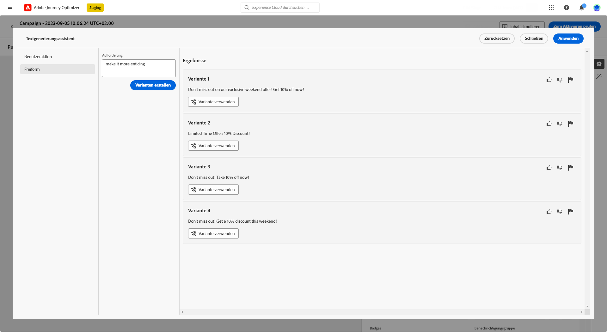
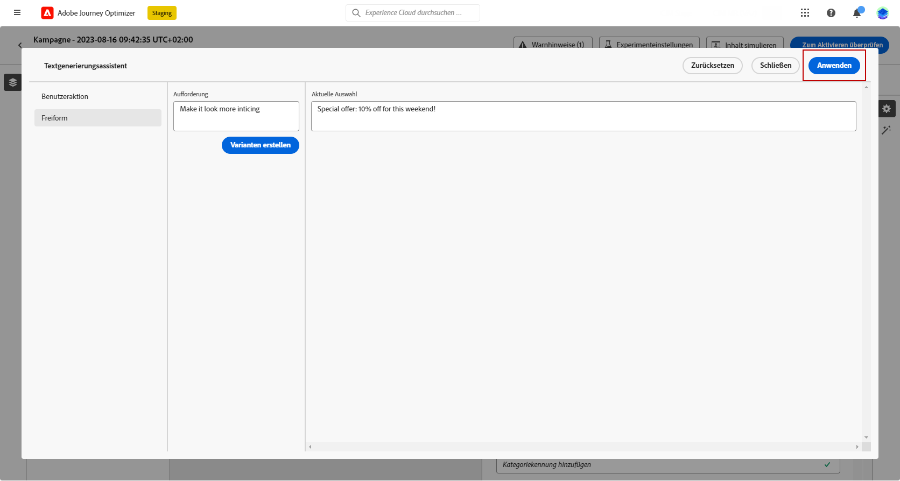

# Generieren von Titeln mit dem Inhaltsassistenten {#title-content-assistant}

>[!BEGINSHADEBOX]

**Inhaltsverzeichnis**

* [Erste Schritte mit dem Inhaltsassistenten](gs-generative.md)
* **[Generieren von Text mit dem Inhaltsassistenten](generative-title.md)**
* [Generieren von Bildern mit dem Inhaltsassistenten](generative-image.md)

>[!ENDSHADEBOX]

Nachdem Sie Ihre Nachrichten erstellt und personalisiert haben, können Sie Ihre Inhalte mit dem Inhaltsassistenten auf die nächste Stufe bringen.

Mithilfe des Inhaltsassistenten können Sie die Wirkung Ihrer Nachricht optimieren, indem Sie mit verschiedenen Haupttiteln experimentieren. Jede Variante wird als eindeutige Abwandlung verwaltet, um zu messen und zu vergleichen, welcher Titel effektiv mehr Klicks generiert.

In diesem speziellen Beispiel erfahren Sie, wie Sie eine ansprechende Push-Benachrichtigung mithilfe des Inhaltsexperiments senden. Führen Sie folgende Schritte aus:

1. Erstellen Sie Ihre Nachricht und fügen Sie ein Inhaltsexperiment hinzu. Weiterführende Informationen zum Simulieren von Inhalten finden Sie in [diesem Abschnitt](../campaigns/content-experiment.md)

1. Klicken Sie nach der Konfiguration Ihrer Kampagne und des Experiments auf **[!UICONTROL Inhalt erstellen]** und personalisieren Sie Ihren Nachrichteninhalt nach Bedarf.

1. Verwenden Sie für die zweite **[!UICONTROL Abwandlung]** den Generierungsassistenten, um den Titel zu ändern.

   Klicken Sie neben dem Feld **[!UICONTROL Kopfzeile]** auf **[!UICONTROL Mit Textgenerierungsassistenten bearbeiten]**.

   

1. Wählen Sie aus dem Menü **[!UICONTROL Benutzeraktion]** die Option **[!UICONTROL Textverfeinerung]** aus:

   * **[!UICONTROL Zusammenfassen]**: Verwenden Sie diese Option, um einen Text zu kürzen und das Wesentliche beizubehalten.

   * **[!UICONTROL Elaborieren]**: Verwenden Sie diese Option, um Ihren Inhalt mit zusätzlichen kreativen Varianten aus dem Inhaltsassistenten zu erweitern.

   

1. Wählen Sie den Ton Ihrer Varianten mit dem Menü **[!UICONTROL Tonfall ändern]**.

1. Im Menü **[!UICONTROL Freiform]** können Sie auch eine Eingabeaufforderung zur besseren Feinabstimmung Ihrer Ergebnisse auswählen.

   

1. Sobald Sie die entsprechende Variante gefunden haben, klicken Sie auf **[!UICONTROL Benutzervariante]** und dann auf **[!UICONTROL Anwenden]**.

   

1. Klicken Sie nach dem Definieren des Nachrichteninhalts auf die Schaltfläche **[!UICONTROL Inhalt simulieren]**, um das Rendern zu kontrollieren und die Personalisierungseinstellungen mit Testprofilen zu überprüfen. [Weitere Informationen](../email/preview.md)

1. Wenn Ihr Inhaltsexperiment fertig ist, können Sie auf der Seite mit der Kampagnenübersicht auf **[!UICONTROL Zum Aktivieren überprüfen]** klicken, um eine Zusammenfassung der Kampagne anzuzeigen. Es werden Warnhinweise angezeigt, wenn Parameter falsch sind oder fehlen.

1. Überprüfen Sie vor dem Start Ihrer Kampagne, ob alle Konfigurationen korrekt sind, und klicken Sie auf **[!UICONTROL Aktivieren]**.

Nach erfolgreicher Konfiguration Ihres Experiments und Ihrer Kampagne können Sie die Kampagne im Kampagnenbericht verfolgen. [Weitere Informationen](../reports/campaign-global-report.md#experimentation-report)
