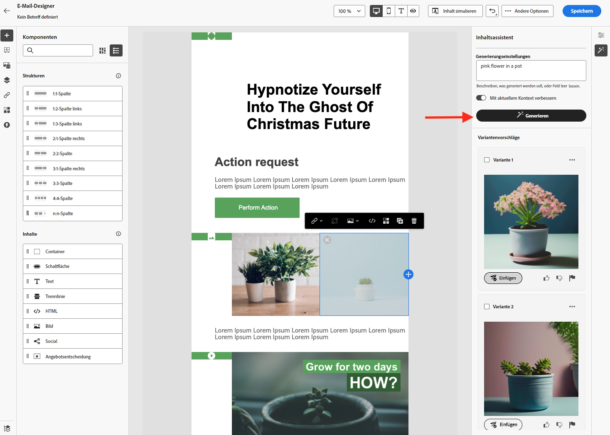

# Erste Schritte mit dem Inhaltsassistenten {#gs-content-assistant}

>[!BEGINSHADEBOX]

**Inhaltsverzeichnis**

* **[Erste Schritte mit dem Inhaltsassistenten](gs-generative.md)**
* [Generieren von Text mit dem Inhaltsassistenten](generative-title.md)
* [Generieren von Bildern mit dem Inhaltsassistenten](generative-image.md)

>[!ENDSHADEBOX]

Adobe Journey Optimier Content-Assistent bietet proaktive Variantenvorschläge für Text und Bilder. Sie ist für E-Mail-, Push-, SMS- und Webkanäle verfügbar. Diese neue Funktion bietet eine auf Eingabeaufforderungen basierende Text- und Bildgenerierung. Die Bildgenerierung wird mit Adobe Firefly verwaltet.

Verwenden Sie den Inhaltsassistenten, um die Wirkung Ihrer Nachricht zu optimieren, indem Sie mit verschiedenen Haupttiteln und Bildern experimentieren. Generieren Sie mehrere Varianten und erstellen Sie ein Experiment, um sie zu vergleichen. Mithilfe des Journey Optimizer Content Experiments können Sie mehrere Nachrichtenbehandlungen definieren, um zu messen, welche die beste Leistung für Ihre Zielgruppe erzielt. Sie haben die Möglichkeit, Inhalt, Betreff oder Absender des Versands zu variieren. Die Zielgruppe der Nachricht wird nach dem Zufallsprinzip jeder Behandlung zugeordnet, um zu bestimmen, welche die angegebene Metrik am besten verwendet. Weitere Informationen zum Inhaltserlebnis finden Sie unter [diesem Abschnitt](../campaigns/content-experiment.md).

>[!AVAILABILITY]
>
>Der Adobe Journey Optimizer Content-Assistent ist derzeit als Beta-Version verfügbar, über die nur ausgewählte Benutzer ausgewählt werden können. Wenden Sie sich an die Kundenunterstützung von Adobe, um am Beta-Programm teilzunehmen.

