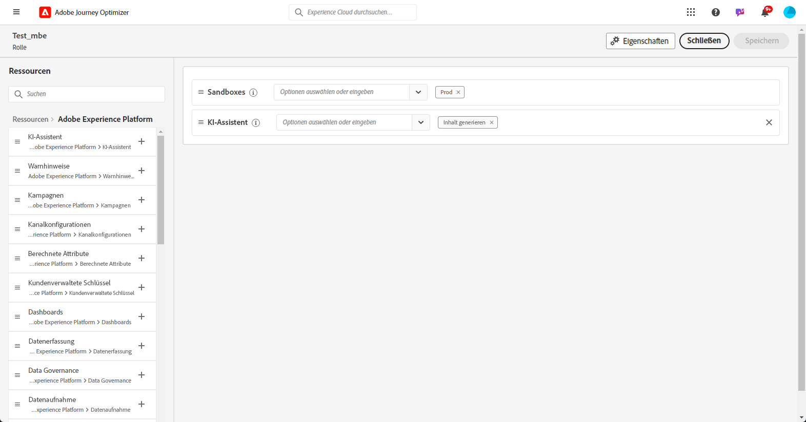

# Erste Schritte mit dem Content Accelerator des KI-Assistenten {#gs-content-assistant}

>[!CONTEXTUALHELP]
>id="ajo_ai_generation_settings"
>title="AI Assistant Content Accelerator in Journey Optimizer"
>abstract="Nachdem Sie Ihren Versand erstellt und personalisiert haben, können Sie den AI Assistant Content Accelerator in Journey Optimizer verwenden, um Ihre Inhalte zu verbessern. Diese Funktion vereinfacht den Prozess der Personalisierung und Verbesserung der Inhalte, da diese durch eine Beschreibung dessen, was generiert werden soll, genauer angepasst werden können."

>[!CONTEXTUALHELP]
>id="ajo_ai_generation_context"
>title="Hochladen von Marken-Assets"
>abstract="Im Menü Marken-Asset hochladen können Sie beliebige Marken-Assets mit Inhalten hinzufügen, die zusätzlichen Kontext für den AI Assistant Content Accelerator in Journey Optimizer bieten können, oder ein zuvor hochgeladenes Asset auswählen. Diese Option stellt sicher, dass der KI-Assistent Zugriff auf alle erforderlichen Materialien hat, um seine Funktionalität und Relevanz zu verbessern."

>[!CONTEXTUALHELP]
>id="ajo_ai_generation_start"
>title="Adobe-Begriffe zu generativer KI"
>abstract="Der Zugriff auf diese Funktion unterliegt der Zustimmung zu den Benutzerrichtlinien für generative KI in Adobe Experience Cloud. Alle Ausgaben dieser Funktion auf ihre Richtigkeit überprüfen und sicherstellen, dass sie für den Anwendungsfall geeignet sind."
>additional-url="https://www.adobe.com/legal/licenses-terms/adobe-dx-gen-ai-user-guidelines.html" text="Benutzerrichtlinien für generative KI in Adobe"

>[!INFO]
>
>Machen Sie sich auf praktische Weise mit [unserer Live-Funktionsvorschau](https://experienceleague.adobe.com/de/apps/journey-optimizer/ai-assistant-content-accelerator){target="_blank"} vertraut, die Ihnen die Möglichkeit gibt, die Funktionen selbst zu entdecken und die entsprechenden Fähigkeiten vollständig zu verstehen.

Der AI Assistant Content Accelerator in Adobe Journey Optimizer, powered by Microsoft Azure OpenAI and Adobe Firefly, bietet proaktive Variationsvorschläge für Text und Bilder. Er ist für die Kanäle E-Mail, Push-Benachrichtigungen und SMS-Kanäle verfügbar. Diese neue Funktion bietet eine auf Eingabeaufforderungen basierende Text- und Bildgenerierung. Die Bildgenerierung wird mit Adobe Firefly gehandhabt.

Verwenden Sie den AI Assistant Content Accelerator in Adobe Journey Optimizer, um die Wirkung Ihrer Nachricht zu optimieren, indem Sie mit verschiedenen Haupttiteln und Bildern experimentieren. Generieren Sie mehrere Varianten und erstellen Sie ein Experiment, um sie zu vergleichen. Mit dem Journey Optimizer-Inhaltsexperiment können Sie mehrere Nachrichtenabwandlungen definieren, um zu messen, welche bei Ihrer Zielgruppe am besten ankommt. Sie haben die Möglichkeit, Inhalt oder Betreff des Versands zu variieren. Die Zielgruppe der Nachricht wird nach dem Zufallsprinzip jeder Abwandlung zugewiesen, um zu bestimmen, welche Abwandlung in Bezug auf die angegebene Metrik am besten funktioniert. Weiterführende Informationen zum Inhaltsexperiment finden Sie in [diesem Abschnitt](../content-management/content-experiment.md).

>[!IMPORTANT]
>
>* Bevor Sie mit der Verwendung dieser Funktion beginnen, lesen Sie die entsprechenden Informationen zu [Schutzmechanismen und Einschränkungen](#generative-guardrails).
>
>
>* Sie müssen einer [Benutzervereinbarung](https://www.adobe.com/legal/licenses-terms/adobe-dx-gen-ai-user-guidelines.html){target="_blank"} zustimmen, bevor Sie den AI Assistant Content Accelerator in Adobe Journey Optimizer verwenden können. Weitere Informationen erhalten Sie beim Adobe-Support.

## Zugriff auf den Content Accelerator des KI-Assistenten {#generative-access}

Um auf den AI Assistant Content Accelerator in Adobe Journey Optimizer zugreifen zu können, müssen Benutzer über die Berechtigung **Inhalt generieren** verfügen. [Weitere Informationen](../administration/permissions.md)

+++  Erfahren Sie, wie Sie Berechtigungen zur Inhaltserstellung zuweisen.

1. Gehen Sie im Produkt **Berechtigungen** zur Registerkarte **Rollen** und wählen Sie die gewünschte **Rolle** aus.

1. Klicken Sie auf **Bearbeiten**, um die Berechtigungen zu ändern.

1. Fügen Sie die Ressource **KI-Assistent** hinzu und wählen Sie dann aus dem Dropdown-Menü die Option **Inhalt erzeugen** aus.

   {zoomable="yes"}

1. Klicken Sie auf **Speichern**, um die Änderungen anzuwenden.

   Die Berechtigungen aller Benutzenden, die dieser Rolle bereits zugewiesen sind, werden automatisch aktualisiert.

1. Um diese Rolle neuen Benutzenden zuzuweisen, navigieren Sie im Dashboard **Rollen** zur Registerkarte **Benutzer** und klicken Sie auf **Benutzer hinzufügen**.

1. Geben Sie den Namen und die E-Mail-Adresse der Benutzerin oder des Benutzers ein oder wählen Sie aus der Liste aus und klicken Sie dann auf **Speichern**.

1. Wenn die Benutzerin bzw. der Benutzer vorher noch nicht erstellt wurde, lesen Sie [diese Dokumentation](https://experienceleague.adobe.com/de/docs/experience-platform/access-control/abac/permissions-ui/users).

Die Benutzerin oder der Benutzer erhält eine E-Mail mit Anweisungen zum Zugriff auf Ihre Instanz.

+++

## Schutzmechanismen und Einschränkungen {#generative-guardrails}

Die allgemeinen Richtlinien für die Verwendung des AI Assistant Content Accelerator in Adobe Journey Optimizer zur E-Mail-Generierung sind unten aufgeführt:

* Die Qualität des generierten Inhalts wird stark durch das von Ihnen definierte Marketing-Ziel bzw. den von Ihnen definierten Prompt beeinflusst. Verwenden Sie einen gut definierten Prompt, damit das GenAI-Modell diesen korrekt interpretieren kann. 
* Laden Sie Marken-Assets hoch, damit die Informationen über Markeninhalte exakt sind. Andernfalls basieren die Inhalte auf öffentlich verfügbaren Informationen. Die hochgeladenen Inhalte können die folgenden Formate aufweisen: PDF-, JPEG-, PNG- oder ZIP-Dateien (mit unterstützten Dateiformaten).
* Die maximale Größe für hochgeladene Marken-Assets beträgt 50 MB. Größere Dateien oder viele Bilder können funktionieren, aber die Verarbeitungszeit verlängert sich.
* Verwenden Sie eine markenspezifische oder benutzerdefinierte Vorlage, um E-Mail-Inhalte mit dem AI Assistant Content Accelerator in Adobe Journey Optimizer zu erstellen. Es werden E-Mail-Vorlagen mit 8 bis 10 Bildern empfohlen.
* Vergewissern Sie sich, dass Sie problematische Ausgaben melden, indem Sie bei der Auswahl von Varianten die Symbole Daumen nach oben, Daumen nach unten oder Flagge verwenden.
* Ihre Verwendung des AI-Assistenten unterliegt den Adobe Experience Cloud Generative AI-Benutzerrichtlinien. [Weitere Informationen](https://www.adobe.com/legal/licenses-terms/adobe-dx-gen-ai-user-guidelines.html)
* Im Zuge seiner Selbstverpflichtung zur Förderung von Transparenz bei der Nutzung generativer KI-Tools zur Medienerstellung wendet Adobe Content Credentials an, wenn Inhalte oder Projekte mit einem Firefly-generierten Asset heruntergeladen oder exportiert werden. [Weitere Informationen](https://helpx.adobe.com/de/firefly/using/content-credentials.html)

Die folgenden Einschränkungen gelten für den AI Assistant Content Accelerator in Adobe Journey Optimizer:

* Als Sprache wird ausschließlich Englisch unterstützt. Nicht-englische Eingaben können zu inkonsistenten oder fehlerhaften Ergebnissen führen. Probleme, die sich aus nicht-englischen Antworten ergeben, werden derzeit nicht behoben oder verbessert.
* Der Assistent ist nur für den E-Mail-, Push- und SMS-Kanal verfügbar.
* GenAI-Inhalte sind möglicherweise nicht immer genau: Bitte teilen Sie uns Ihr Feedback mit, damit unsere Ingenieurinnen und Ingenieure die Modelle verfeinern können.
* Sie können mehrere Marken-Assets hochladen, jedoch nur eines für eine bestimmte Generierung nutzen.

## Funktionen des KI-Assistenten zur Inhaltserstellung {#generative-features}

<table style="table-layout:fixed"><tr style="border: 0;">
<td>

<a href="generative-email.md"><strong>Generierung von E-Mails</strong></a>

</td>
<td>

<a href="generative-sms.md"><strong>Generierung von SMS</strong>

</td>
<td>

<a href="generative-push.md"><strong>Generierung von Push-Benachrichtigungen</strong></a>

</td>
<td>

<a href="generative-web.md"><strong>Generierung von Web-Seiten</strong>

</td>
</tr></table>
