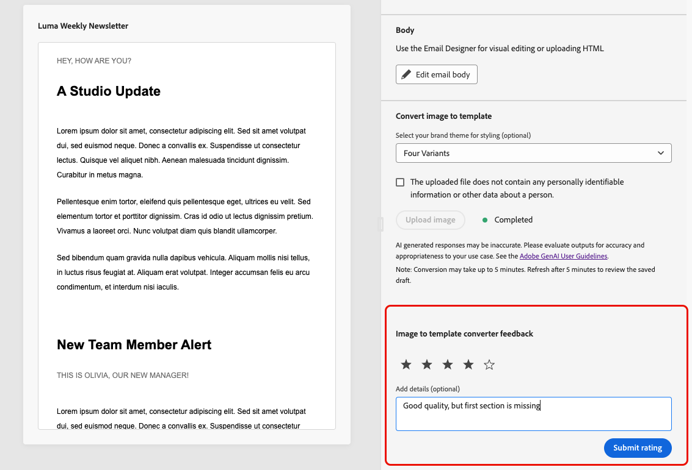

# Konvertieren von Bildern in E-Mail-Inhaltsvorlagen {#image-to-html}

[!DNL Journey Optimizer] können Sie die E-Mail-Erstellung erheblich beschleunigen, indem Sie statische Bilddesigns in vollständig anpassbare, modulare E-Mail-Inhaltsvorlagen umwandeln.

>[!AVAILABILITY]
>
>Um diese Funktion verwenden zu können, muss Ihr Unternehmen das [!DNL Generative AI]-Addendum mit Adobe unterzeichnet haben. Wenden Sie sich im Zweifelsfall an den Adobe-Support.
>
>Diese Funktion ist nur für den E-Mail-Kanal verfügbar.

Durch die Nutzung der generativen KI-Technologie analysiert ein integriertes Tool das Layout, die Typografie, die Farben und die visuellen Elemente in Ihrem Bild und generiert saubere, modulare HTML-Inhalte, die die Designtreue erhalten und gleichzeitig mit der [E-Mail-Designer](../email/get-started-email-design.md) vollständig bearbeitbar sind.

Diese Code-freie Funktion ermöglicht es Marketing-Experten, visuelle Assets von Grafikdesignern oder Design-Tools in responsive, bearbeitbare E-Mail-Vorlagen umzuwandeln, die in mehreren Journey und Kampagnen gespeichert und wiederverwendet werden können, ohne dass technisches Know-how erforderlich ist.

>[!IMPORTANT]
>
>Bevor Sie mit der Verwendung dieser Funktion beginnen, lesen Sie die zugehörigen [Leitplanken und Empfehlungen](#limitations).

Die wichtigsten Vorteile sind:

* **Schneller als Handcodierung** - Der Konverter wandelt Bilder in Minuten in bearbeitbare Inhalte um, sodass Sie den manuellen, zeitaufwendigen Mockup-to-HTML-Workflow überspringen können.
* **Keine technischen Fähigkeiten erforderlich** - Marketing-Experten können Vorlagen ohne Design- oder Entwicklungsunterstützung erstellen und anpassen.
* **Wiederverwendbar in allen Kampagnen** - Speichern Sie Vorlagen in Ihrer Bibliothek und verwenden Sie sie auf jeder Journey oder Kampagne.
* **Bleibt dem Design treu** - Die Ausgabe stimmt mit Ihrem Layout und Stil überein und ist gleichzeitig vollständig mit dem E-Mail-Designer kompatibel.

<!--* **Design fidelity**: Maintain visual consistency with your original design while creating fully editable content
* **Email compatibility**: Generate HTML that works seamlessly with the Email Designer and across email clients-->

+++ Häufige Anwendungsfälle

Der Bild-zu-HTML-Converter eignet sich ideal für:

* **Plattformmigration**: Sie migrieren von einer anderen E-Mail-Marketing-Plattform? Konvertieren Sie Ihre vorhandenen E-Mail-Designs in [!DNL Journey Optimizer] HTML-Vorlagen, ohne sie von Grund auf neu zu erstellen.
* **Design-Mockup-Konversion**: Wandeln Sie Design-Mockups aus Tools wie Photoshop, Figma oder anderer Design-Software in funktionale E-Mail-Vorlagen um.
* **Schnelle Vorlagenerstellung**: Schnelle Generierung von E-Mail-Vorlagen für zeitkritische Kampagnen, ohne auf Entwicklerressourcen zu warten.
* **Erstellen von Vorlagenbibliotheken**: Erstellen Sie eine umfassende Bibliothek markenkonsistenter Vorlagen, die Mitglieder des nicht-technischen Teams anpassen und bereitstellen können.
* **Verringerung technischer Abhängigkeiten**: Marketing-Experten können E-Mail-Vorlagen unabhängig erstellen und iterieren und so die Kampagnenausführung beschleunigen.

+++

## Zugreifen auf das Bild zum HTML Converter {#access-image-to-html}

**Addendum mit Adobe**

Um auf diese Funktion zugreifen zu können, muss Ihr Unternehmen das [!DNL Generative AI]-Addendum mit Adobe unterzeichnet haben. Wenden Sie sich im Zweifelsfall an den Adobe-Support.

**Berechtigungen**

* Um auf Vorlagen zuzugreifen und sie zu erstellen, muss Ihre Rolle die Berechtigung **[!UICONTROL Inhaltsvorlagen verwalten]** (unter der Ressource **Content-Management** enthalten. [Weitere Informationen zu Berechtigungen](../administration/permissions.md)

* Um den Konvertierer für das Bild in HTML verwenden zu können, muss Ihnen die Berechtigung **Inhalt generieren** gewährt werden. Erfahren Sie in [&#x200B; Abschnitt, wie Sie Berechtigungen zum Erstellen von Inhalten &#x200B;](../content-management/gs-generative.md#generative-access).

**Vereinbarung**

Bevor Sie diese Funktion nutzen können, müssen Sie einer Benutzervereinbarung zustimmen, die angezeigt wird, wenn Sie Generative AI in [!DNL Journey Optimizer] zum ersten Mal verwenden. Weitere Informationen finden Sie in den [Benutzerrichtlinien für die generative KI von Adobe Experience Cloud](https://www.adobe.com/de/legal/licenses-terms/adobe-gen-ai-user-guidelines.html){target="_blank"}.

## Schutzmechanismen und Empfehlungen {#limitations}

Beachten Sie die folgenden Einschränkungen und Empfehlungen beim Konvertieren von Bildern in E-Mail-Inhaltsvorlagen.

**Angemessenheit**

* **KI-Interpretation**: Die KI generiert statische HTML-Inhalte basierend auf der visuellen Interpretation Ihres Bildes. Sie bietet einen guten Ausgangspunkt für die E-Mail-Erstellung, sollte jedoch mithilfe der E-Mail-Designer überprüft und verfeinert werden, um sicherzustellen, dass sie genau Ihren Anforderungen entspricht. Sie müssen bei Bedarf Personalisierung, dynamische Inhalte und Tracking nach der Konversion manuell hinzufügen.

* **Textgenauigkeit**: Während die KI versucht, Text genau zu erkennen und zu reproduzieren, sollten Textinhalte immer überprüft und nach Bedarf korrigiert werden. Lesen Sie die [Benutzerrichtlinien für die generative KI von Adobe](https://www.adobe.com/de/legal/licenses-terms/adobe-gen-ai-user-guidelines.html){target="_blank"}.

**Bildauswahl**

* **PII und vertrauliche Daten**: Achten Sie darauf, ein Bild auszuwählen, das keine personenbezogenen oder anderen vertraulichen Daten enthält.

* **Bildgröße**: Sie können keine Bilder hochladen, die größer als 10 MB sind.

* **Bilder in hoher Qualität**: Verwenden Sie klare, hochwertige Bilder, um optimale Ergebnisse zu erzielen: scharfe Grafiken, lesbarer Text und klar definierte Layout-Elemente. Unscharfe, dunkle oder unübersichtliche Bilder verringern die Konvertierungsqualität. Bilder sollten idealerweise zwischen 600 und 800 Pixel breit sein, um den standardmäßigen E-Mail-Größen zu entsprechen.

* **Einfache Layouts**: Hochkomplexe Designs mit komplizierten Ebenen, ungewöhnlichen Formen oder nicht standardmäßigen Elementen werden möglicherweise nicht perfekt konvertiert. Einfachere Designs liefern in der Regel bessere Ergebnisse.

**Verarbeitung**

* **Seite aktualisieren**: Das Ergebnis wird bis zur Aktualisierung nicht automatisch angezeigt.

* **Verarbeitungszeit**: Je nach Komplexität und Bildgröße endet die Konvertierung **innerhalb von** etwa 5 Minuten). Sehr große oder komplexe Bilder können manchmal bis zu 10 Minuten dauern. Warten Sie entsprechend und aktualisieren Sie dann, um das Ergebnis anzuzeigen.

<!--
* **Background processing**: The AI processing happens in the background, so you can work on other tasks without keeping the screen open. The template is automatically saved as a draft once the conversion is complete.

**Feedback is welcome!** Use the dedicated section to share your thoughts and suggestions with Adobe to help us improve the feature.-->

## Konvertieren eines Bildes in eine HTML-Vorlage {#convert-image}

Gehen Sie wie folgt vor, um ein Bilddesign in eine vollständig anpassbare E-Mail-Inhaltsvorlage zu konvertieren.

1. Stellen Sie sicher, dass Sie eine Bilddatei im JPEG- oder PNG-Format haben, die Ihr E-Mail-Design enthält.

   >[!IMPORTANT]
   >
   >Die Bildgröße darf **10 MB** nicht überschreiten. Die besten Ergebnisse erzielen Sie, wenn Sie ein **klares, hochwertiges Bild** mit scharfen Bildern, lesbarem Text und klar definierten Layout-Elementen verwenden.

1. Greifen Sie auf die Liste der Inhaltsvorlagen zu, indem Sie **[!UICONTROL Content]** Management“ > **[!UICONTROL Inhaltsvorlagen]** aus dem linken Menü auswählen.

1. Klicken Sie auf **[!UICONTROL Vorlage erstellen]**.

1. Füllen Sie die Vorlagendetails aus, wählen Sie **[!UICONTROL E-Mail]** als Kanal aus und klicken Sie auf **[!UICONTROL Erstellen]**.

1. Führen **[!UICONTROL im Abschnitt „Bild in Vorlage]**&quot; die folgenden Schritte aus:

   * (Optional) Wenn in Ihrem Unternehmen Markenthemen in Journey Optimizer definiert sind, können Sie ein Design als Eingabe auswählen, sodass die generierte HTML entsprechend Ihren Markendesignparametern formatiert wird. [Weitere Informationen zu Designs](../email/apply-email-themes.md)

     Auf die generierte Vorlage werden Stile wie Hintergrundfarbe, Schaltflächenfarbe, Schriftarten, Zeilenabstand, Ränder und Abstand angewendet, wodurch die zusätzliche Entwurfsarbeit reduziert wird und eine Vorlage erstellt wird, die mit minimalen Bearbeitungen verwendet werden kann.

   * Um ein Bild hochladen zu können, stellen Sie sicher, dass es keine personenbezogenen oder anderen sensiblen Daten enthält. Aktivieren Sie die entsprechende Option, um die Überprüfung der Datei zu bestätigen.

   * Klicken Sie auf **[!UICONTROL Bild hochladen]**, um Ihre Bilddatei auszuwählen.

     {width=80%}

     >[!CAUTION]
     >
     >Wenn Sie ein Bild zur Konversion hochladen, wird der gesamte aktuell in der E-Mail hinzugefügte Inhalt gelöscht und durch die generierte Vorlage ersetzt.

1. Wenn Sie in [!DNL Journey Optimizer] zum ersten Mal generative KI verwenden, werden Sie aufgefordert, der Benutzervereinbarung zuzustimmen. Weitere Informationen finden Sie in den [Benutzerrichtlinien für die generative KI von Adobe](https://www.adobe.com/de/legal/licenses-terms/adobe-gen-ai-user-guidelines.html){target="_blank"}.

   {width=50%}

   Klicken Sie **[!UICONTROL Zustimmen]**, um fortzufahren.

1. Klicken Sie nach der Auswahl des Bildes **[!UICONTROL Öffnen]** um den KI-gestützten Konvertierungsprozess zu starten, der häufig - je nach Komplexität und Größe Ihres Bilddesigns - innerhalb **etwa 5 Minuten** abgeschlossen wird.

   >[!NOTE]
   >
   >Sehr große Bilder können in einigen Fällen bis zu 10 Minuten dauern. Sie können diesen Bildschirm verlassen und an anderen Aufgaben arbeiten, während die Konvertierung ausgeführt wird.

1. **Aktualisieren Sie die Seite** um die Ausgabe anzuzeigen. Nach Abschluss der Konvertierung wird der generierte Inhalt angezeigt und automatisch als Entwurf gespeichert.

   >[!IMPORTANT]
   >
   >Das Ergebnis wird erst nach der Aktualisierung automatisch angezeigt.

   {width=90%}

1. Verwenden Sie den Abschnitt **[!UICONTROL Feedback zur Konvertierung von Bildern in Vorlagen]**, um Ihre Gedanken und Vorschläge mit Adobe zu teilen, damit wir die Funktion verbessern können.
   {width=70%}

1. Klicken Sie **[!UICONTROL E-Mail-Textkörper bearbeiten]**. Die konvertierte Vorlage wird in der [E-Mail-Designer](../email/get-started-email-design.md) mit allen Bearbeitungsfunktionen geöffnet. Sie können jetzt:

   * Überprüfen, Bearbeiten von Textinhalten und Anwenden von Personalisierung
   * Bilder ändern und Links hinzufügen
   * Farben, Schriften und Stile anpassen
   * Inhaltskomponenten hinzufügen, entfernen oder neu anordnen
   * Alle E-Mail-Designer-Funktionen wie bei jeder anderen Vorlage nutzen

   

   Nehmen Sie die erforderlichen Anpassungen vor, um die Vorlage zu verfeinern und auf Ihre Markenrichtlinien abzustimmen.

1. Wenn Sie mit Ihrer Vorlage zufrieden sind, klicken Sie auf **[!UICONTROL Speichern]**.

Ihre Vorlage ist jetzt in der Inhaltsvorlagenbibliothek verfügbar und kann beim Erstellen von E-Mails in Journey oder Kampagnen verwendet werden. [Informationen zur Verwendung von Inhaltsvorlagen](../email/use-email-templates.md)

## Best Practices {#best-practices}

Um beim Konvertieren von Bildern in E-Mail-Inhaltsvorlagen optimale Ergebnisse zu erzielen, befolgen Sie diese Empfehlungen.

+++Bevor Sie beginnen

* **Vorhandenen Inhalt speichern**: Das Konvertieren eines Bildes ersetzt alle vorhandenen Inhalte in Ihrer E-Mail-Vorlage. Speichern Sie Ihre aktuelle Arbeit immer, bevor Sie diese Funktion verwenden.
* **Workflow planen**: Verwenden Sie diese Funktion zu Beginn Ihres E-Mail-Erstellungsprozesses oder stellen Sie sicher, dass Sie bereit sind, den gesamten aktuellen Inhalt zu ersetzen.

+++

+++Bildvorbereitung

* **Resolution**: Verwenden Sie hochauflösende Bilder für eine bessere Texterkennung und Elementerkennung.
* **Klarheit**: Verwenden Sie ein klares Bild. Der Text muss leicht lesbar und die visuellen Elemente klar definiert sein. Vermeiden Sie verschwommene, kontrastarme oder verrauschte Quelldateien.
* **Breite**: Entwerfen Sie Bilder mit standardmäßigen E-Mail-Breiten (600-800 px), um die typischen E-Mail-Client-Anforderungen zu erfüllen.
* **Dateiformat**: Verwenden Sie das JPEG- oder PNG-Format, um komprimierte Bilder oder Bilder von schlechter Qualität zu vermeiden.
* **Vollständiges Design**: Vollständiges E-Mail-Design in ein einziges Bild aufnehmen, von Kopf- bis Fußzeile.

+++

+++Überlegungen zum Design

* **Einfache Layouts**: Einfachere, gut strukturierte Layouts ermöglichen eine präzisere Konvertierung als hochkomplexe Designs.
* **Standardelemente**: Verwenden Sie gängige E-Mail-Design-Muster (Kopfzeilen-, Hauptteil-, CTAs- und Fußzeilen).
* **Textlesbarkeit**: Sicherstellen eines ausreichenden Kontrasts zwischen Text und Hintergrund.
* **Web-sichere Schriftarten**: Designs, die gängige Web-sichere Schriftarten verwenden, sind zuverlässiger.
* **Überlappende Elemente vermeiden**: Halten Sie Designelemente zur besseren Strukturerkennung klar getrennt.

+++

+++Nach der Konversion

* **Aktualisieren, um Ergebnisse anzuzeigen**: Aktualisieren Sie die Seite nach etwa 5 Minuten (oder bis zu 10 Minuten bei sehr großen Bildern), sodass die vollständige Konvertierung angezeigt wird.
* **Prüfen Sie den Entwurf**: Nach Abschluss der Konvertierung wird Ihre Vorlage automatisch als Entwurf gespeichert. Nehmen Sie sich Zeit, um den generierten Inhalt sorgfältig auf Korrektheit zu überprüfen.
* **Gründlich testen**: Testen Sie die E-Mail über verschiedene E-Mail-Clients und Geräte hinweg. [Erfahren Sie, wie Sie Inhalte in der Vorschau anzeigen und testen können](preview-test.md).
* **Manuell verfeinern**: Nehmen Sie die erforderlichen Anpassungen mit den [E-Mail-Designer](../email/get-started-email-design.md)Bearbeitungsfunktionen vor.
* **Markenausrichtung**: Überprüfen Sie, ob Farben, Schriftarten und Stile Ihren Markenrichtlinien entsprechen, und verwenden Sie Designs, falls verfügbar. [Weitere Informationen zu E-Mail-Designs](../email/apply-email-themes.md).
* **Personalization**: Fügen Sie nach Bedarf dynamische Inhalte und Personalisierungs-Token hinzu. [Weitere Informationen über Personalisierung](../personalization/personalize.md).
* **Barrierefreiheit**: Überprüfen und erweitern Sie die Funktionen für die Barrierefreiheit bei Bedarf. [Weitere Informationen über barrierefreie E-Mail-Inhalte](../email/accessible-content.md).

+++

+++Feedback ist willkommen!

Verwenden Sie den entsprechenden Abschnitt, um Ihre Gedanken und Vorschläge mit Adobe zu teilen, damit wir die Funktion verbessern können.

+++

## Häufig gestellte Fragen {#faq}

+++Was passiert mit meinem vorhandenen E-Mail-Inhalt, wenn ich ein Bild in eine Inhaltsvorlage konvertiere?

Alle vorhandenen Inhalte in Ihrer E-Mail werden gelöscht und durch die neu generierte Vorlage ersetzt, wenn Sie ein Bild zur Konvertierung hochladen. Speichern Sie alle wichtigen Inhalte, bevor Sie diese Funktion verwenden. Am besten ist es, diese Funktion zu Beginn des E-Mail-Erstellungsprozesses zu nutzen.

+++

+++Welche Dateiformate werden unterstützt?

Der Konverter unterstützt die Bildformate JPEG (.jpg, .jpeg) und PNG (.png).

+++

+++Wie lange dauert der Konvertierungsprozess?

Je nach Komplexität und Größe des Bilddesigns endet die Konvertierung häufig innerhalb von etwa 5 Minuten. Sehr große Bilder können manchmal bis zu 10 Minuten dauern. Warten Sie etwas länger und aktualisieren Sie dann. Die KI-Verarbeitung erfolgt im Hintergrund, sodass Sie weg navigieren und an anderen Aufgaben arbeiten können - Sie müssen den Bildschirm nicht offen lassen. Nach Abschluss der Konvertierung wird die Datei automatisch als Entwurf gespeichert, den Sie überprüfen und bearbeiten können.

+++

+++Kann ich die generierte Vorlage bearbeiten?

Ja. Die generierte Inhaltsvorlage wird in der E-Mail-Designer geöffnet und bietet vollständige Bearbeitungsfunktionen. Sie können alle Aspekte der Vorlage ändern, einschließlich Text, Bilder, Stil, Layout und Struktur.

+++

+++Was geschieht, wenn die Konvertierung nicht genau meinem Design entspricht?

Die KI bemüht sich, Ihr Design möglichst genau zu interpretieren, doch einige manuelle Anpassungen können erforderlich sein. Verwenden Sie den E-Mail-Designer, um alle Elemente anzupassen, die einer Feinabstimmung bedürfen.

+++

+++Kann ich diese Funktion für Landingpages oder andere Inhaltstypen verwenden?

Der Bild-zu-HTML-Konvertierer wurde speziell für E-Mail-Inhaltsvorlagen entwickelt. Verwenden Sie für andere Inhaltstypen die standardmäßigen Design- und Importoptionen, die im E-Mail-Designer verfügbar sind.

+++

+++Benötige ich spezielle Berechtigungen, um diese Funktion nutzen zu können?

Diese Funktion steht allen Kunden zur Verfügung, die das [!DNL Gen AI]-Addendum mit Adobe unterzeichnet haben. Wenn Sie sich nicht sicher sind, ob Ihr Unternehmen das Addendum unterzeichnet hat, wenden Sie sich an den Adobe-Support.

+++

+++Kann ich konvertierte Vorlagen in mehreren Kampagnen wiederverwenden?

Ja. Mit dem Bild-zu-HTML-Converter erstellte Vorlagen werden automatisch in der Inhaltsvorlagenbibliothek gespeichert. Sie können auf sie zugreifen und sie in beliebigen E-Mails innerhalb Ihrer Journeys und Kampagnen wiederverwenden. [Weitere Informationen](content-templates.md)

+++

+++Kann ich dies für eine Plattformmigration verwenden?

Ja. Der Bild-zu-HTML-Converter eignet sich ideal für die Migration von anderen E-Mail-Marketing-Plattformen. Exportieren Sie Ihre bestehenden E-Mail-Designs aus Ihrer vorherigen Plattform oder erstellen Sie einfach Screenshots und konvertieren Sie diese in AJO-fähige HTML-Vorlagen, ohne sie von Grund auf neu erstellen zu müssen.

+++

## Verwandte Themen {#related-topics}

* [Erste Schritte mit Inhaltsvorlagen](content-templates.md)
* [Erstellen von Inhaltsvorlagen](create-content-templates.md)
* [Verwenden von E-Mail-Vorlagen](../email/use-email-templates.md)
* [Nutzen von E-Mail-Designs](../email/apply-email-themes.md)
* [Erste Schritte mit dem E-Mail-Design](../email/get-started-email-design.md)
