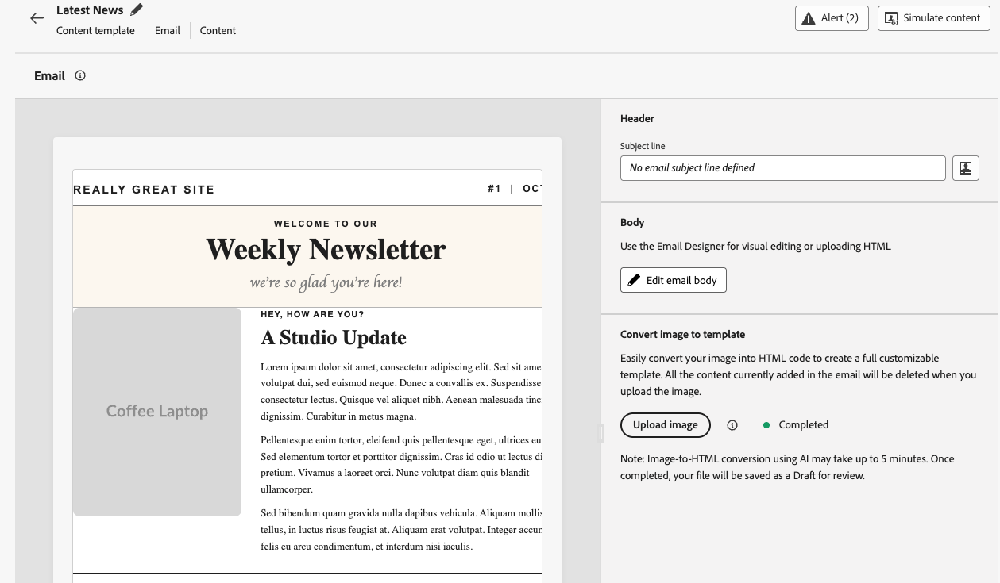

# Konvertieren von Bildern in E-Mail-Inhaltsvorlagen {#image-to-html}

>[!AVAILABILITY]
>
>Diese Funktion ist nur eingeschränkt verfügbar. Wenden Sie sich an den Adobe-Support, um Zugriff zu erhalten.

[!DNL Journey Optimizer] können Sie die E-Mail-Erstellung erheblich beschleunigen, indem Sie statische Bilddesigns in vollständig anpassbare, modulare E-Mail-Inhaltsvorlagen umwandeln.

>[!NOTE]
>
>Diese Funktion ist nur für den E-Mail-Kanal verfügbar.

Durch die Nutzung der generativen KI-Technologie analysiert ein integriertes Tool das Layout, die Typografie, die Farben und die visuellen Elemente in Ihrem Bild und generiert saubere, modulare HTML-Inhalte, die die Designtreue erhalten und gleichzeitig mit der [E-Mail-Designer](../email/get-started-email-design.md) vollständig bearbeitbar sind.

Diese Code-freie Funktion ermöglicht es Marketing-Experten, visuelle Assets von Grafikdesignern oder Design-Tools in responsive, bearbeitbare E-Mail-Vorlagen umzuwandeln, die in mehreren Journey und Kampagnen gespeichert und wiederverwendet werden können, ohne dass technisches Know-how erforderlich ist.

Die wichtigsten Vorteile sind:

* **Schneller als Handcodierung** - Der Konverter wandelt Bilder in Minuten in bearbeitbare Inhalte um, sodass Sie den manuellen, zeitaufwendigen Mockup-to-HTML-Workflow überspringen können.
* **Keine technischen Fähigkeiten erforderlich** - Marketing-Experten können Vorlagen ohne Design- oder Entwicklungsunterstützung erstellen und anpassen.
* **Wiederverwendbar in allen Kampagnen** - Speichern Sie Vorlagen in Ihrer Bibliothek und verwenden Sie sie auf jeder Journey oder Kampagne.
* **Bleibt dem Design treu** - Die Ausgabe stimmt mit Ihrem Layout und Stil überein und ist gleichzeitig vollständig mit dem E-Mail-Designer kompatibel.

<!--* **Design fidelity**: Maintain visual consistency with your original design while creating fully editable content
* **Email compatibility**: Generate HTML that works seamlessly with the Email Designer and across email clients-->

+++ Häufige Anwendungsfälle

Der Bild-zu-HTML-Converter eignet sich ideal für:

* **Plattformmigration**: Sie migrieren von einer anderen E-Mail-Marketing-Plattform? Konvertieren Sie Ihre vorhandenen E-Mail-Designs in [!DNL Journey Optimizer] HTML-Vorlagen, ohne sie von Grund auf neu zu erstellen.
* **Design-Mockup-Konversion**: Wandeln Sie Design-Mockups aus Tools wie Photoshop, Figma oder anderer Design-Software in funktionale E-Mail-Vorlagen um.
* **Schnelle Vorlagenerstellung**: Schnelle Generierung von E-Mail-Vorlagen für zeitkritische Kampagnen, ohne auf Entwicklerressourcen zu warten.
* **Erstellen von Vorlagenbibliotheken**: Erstellen Sie eine umfassende Bibliothek markenkonsistenter Vorlagen, die Mitglieder des nicht-technischen Teams anpassen und bereitstellen können.
* **Verringerung technischer Abhängigkeiten**: Marketing-Experten können E-Mail-Vorlagen unabhängig erstellen und iterieren und so die Kampagnenausführung beschleunigen.

+++

## Schutzmechanismen und Empfehlungen {#limitations}

Beachten Sie die folgenden Einschränkungen beim Konvertieren von Bildern in E-Mail-Inhaltsvorlagen.

* **KI-Interpretation**: Die KI generiert statische HTML-Inhalte basierend auf der visuellen Interpretation Ihres Bildes. Sie bietet einen guten Ausgangspunkt für die E-Mail-Erstellung, sollte jedoch mithilfe der E-Mail-Designer überprüft und verfeinert werden, um sicherzustellen, dass sie genau Ihren Anforderungen entspricht. Sie müssen bei Bedarf Personalisierung, dynamische Inhalte und Tracking nach der Konversion manuell hinzufügen.

* **Textgenauigkeit**: Die KI versucht zwar, Text genau zu erkennen und zu reproduzieren, aber Sie sollten Textinhalte immer überprüfen und nach Bedarf korrigieren.

* **Komplexe Layouts**: Hochkomplexe Designs mit komplizierten Ebenen, ungewöhnlichen Formen oder nicht standardmäßigen Elementen werden möglicherweise nicht perfekt konvertiert. Einfachere Designs liefern in der Regel bessere Ergebnisse.

* **Verarbeitungszeit**: Der Konvertierungsprozess kann je nach Komplexität und Größe des Bildes bis zu 5 Minuten dauern. Die KI-Verarbeitung erfolgt im Hintergrund, sodass Sie andere Aufgaben bearbeiten können und der Bildschirm nicht geöffnet sein muss. Die Vorlage wird nach Abschluss der Konvertierung automatisch als Entwurf gespeichert.

* **Eingeschränkte Verfügbarkeit**: Als Funktion für eingeschränkte Verfügbarkeit wird dieser Konverter kontinuierlich verbessert. Funktionalität und Genauigkeit können variieren, und Ihr Feedback trägt zur Verbesserung der Funktion bei.

## Konvertieren eines Bildes in eine HTML-Vorlage {#convert-image}

Gehen Sie wie folgt vor, um ein Bilddesign in eine vollständig anpassbare E-Mail-Inhaltsvorlage zu konvertieren.

1. Stellen Sie sicher, dass Sie eine Bilddatei im JPEG- oder PNG-Format haben, die Ihr E-Mail-Design enthält.

   >[!NOTE]
   >
   >Für optimale Ergebnisse sollten Sie hochwertige Bilder mit klaren visuellen Elementen und lesbarem Text verwenden. Bilder sollten idealerweise zwischen 600 und 800 Pixel breit sein, um den standardmäßigen E-Mail-Größen zu entsprechen.

1. Greifen Sie auf die Liste der Inhaltsvorlagen zu, indem Sie **[!UICONTROL Content]** Management“ > **[!UICONTROL Inhaltsvorlagen]** aus dem linken Menü auswählen.

1. Klicken Sie auf **[!UICONTROL Vorlage erstellen]**.

1. Füllen Sie die Vorlagendetails aus, wählen Sie **[!UICONTROL E-Mail]** als Kanal aus und klicken Sie auf **[!UICONTROL Erstellen]**.

1. Führen **[!UICONTROL im Abschnitt „Bild in Vorlage]**&quot; die folgenden Schritte aus:

   * (Optional) Wenn in Ihrem Unternehmen Markenthemen in Journey Optimizer definiert sind, können Sie ein Design als Eingabe auswählen, sodass die generierte HTML entsprechend Ihren Markendesignparametern formatiert wird. [Weitere Informationen zu Designs](../email/apply-email-themes.md)

     Auf die generierte Vorlage werden Stile wie Hintergrundfarbe, Schaltflächenfarbe, Schriftarten, Zeilenabstand, Ränder und Abstand angewendet, wodurch die zusätzliche Entwurfsarbeit reduziert wird und eine Vorlage erstellt wird, die mit minimalen Bearbeitungen verwendet werden kann.

   * Um ein Bild hochladen zu können, stellen Sie sicher, dass es keine persönlich identifizierbaren Informationen (PII) oder anderen sensiblen Daten enthält, und aktivieren Sie die entsprechende Option, um zu bestätigen, dass Sie die Datei geprüft haben.

   * Klicken Sie auf **[!UICONTROL Bild hochladen]**, um Ihre Bilddatei auszuwählen.

     

     >[!CAUTION]
     >
     >Wenn Sie ein Bild zur Konversion hochladen, wird der gesamte aktuell in der E-Mail hinzugefügte Inhalt gelöscht und durch die generierte Vorlage ersetzt.

1. Klicken Sie nach Auswahl des Bildes **[!UICONTROL Öffnen]**, um den KI-gestützten Konvertierungsprozess zu starten.

   >[!NOTE]
   >
   >Der Generierungsvorgang kann je nach Komplexität und Größe Ihres Bild-Designs bis zu 5 Minuten dauern. Sie können diesen Bildschirm verlassen und an anderen Aufgaben arbeiten, während die Konvertierung ausgeführt wird.

1. Nach Abschluss der Konvertierung wird Ihre Inhaltsvorlage automatisch als Entwurf gespeichert.

   

1. Klicken Sie **[!UICONTROL E-Mail-Textkörper bearbeiten]**. Die konvertierte Vorlage wird in der [E-Mail-Designer](../email/get-started-email-design.md) mit allen Bearbeitungsfunktionen geöffnet. Sie können jetzt:

   * Überprüfen, Bearbeiten von Textinhalten und Anwenden von Personalisierung
   * Bilder ändern und Links hinzufügen
   * Farben, Schriften und Stile anpassen
   * Inhaltskomponenten hinzufügen, entfernen oder neu anordnen
   * Alle E-Mail-Designer-Funktionen wie bei jeder anderen Vorlage nutzen

   

1. Nehmen Sie die erforderlichen Anpassungen vor, um die Vorlage zu verfeinern und auf Ihre Markenrichtlinien abzustimmen.

1. Wenn Sie mit Ihrer Vorlage zufrieden sind, klicken Sie auf **[!UICONTROL Speichern]**.

Ihre Vorlage ist jetzt in der Inhaltsvorlagenbibliothek verfügbar und kann beim Erstellen von E-Mails in Journey oder Kampagnen verwendet werden. [Informationen zur Verwendung von Inhaltsvorlagen](../email/use-email-templates.md)

## Best Practices {#best-practices}

Um beim Konvertieren von Bildern in E-Mail-Inhaltsvorlagen optimale Ergebnisse zu erzielen, befolgen Sie diese Empfehlungen.

+++Bevor Sie beginnen

* **Vorhandenen Inhalt speichern**: Das Konvertieren eines Bildes ersetzt alle vorhandenen Inhalte in Ihrer E-Mail-Vorlage. Speichern Sie Ihre aktuelle Arbeit immer, bevor Sie diese Funktion verwenden.
* **Workflow planen**: Verwenden Sie diese Funktion zu Beginn Ihres E-Mail-Erstellungsprozesses oder stellen Sie sicher, dass Sie bereit sind, den gesamten aktuellen Inhalt zu ersetzen.

+++

+++Bildvorbereitung

* **Auflösung**: Verwenden Sie hochauflösende Bilder (mindestens 1200 Pixel breit) für eine bessere Texterkennung und Auffindbarkeit von Elementen
* **Klarheit**: Stellen Sie sicher, dass der Text klar lesbar ist und visuelle Elemente klar definiert sind
* **Breite**: Entwerfen Sie Bilder mit standardmäßigen E-Mail-Breiten (600–800 px), um die Anforderungen typischer E-Mail-Clients zu erfüllen
* **Dateiformat**: Verwenden Sie das JPEG- oder PNG-Format, um komprimierte Bilder oder Bilder mit geringer Qualität zu vermeiden
* **Vollständiges Design**: Nehmen Sie das vollständige E-Mail-Design in ein einziges Bild auf, von Kopf- bis Fußzeile

+++

+++Überlegungen zum Design

* **Einfache Layouts**: Einfachere, gut strukturierte Layouts ermöglichen eine präzisere Konvertierung als hochkomplexe Designs
* **Standardelemente**: Verwenden Sie gängige E-Mail-Design-Muster (Kopfzeile, Hauptteil, CTAs und Fußzeile)
* **Textlesbarkeit**: Stellen Sie einen ausreichenden Kontrast zwischen Text und Hintergrund sicher
* **Web-sichere Schriften**: Designs, die gängige Web-sichere Schriften verwenden, sind zuverlässiger
* **Vermeiden Sie überlappende Elemente**: Halten Sie Design-Elemente zur besseren Strukturerkennung klar getrennt

+++

+++Nach der Konversion

* **Prüfen Sie den Entwurf**: Nach Abschluss der Konvertierung wird Ihre Vorlage automatisch als Entwurf gespeichert. Nehmen Sie sich Zeit, um den generierten Inhalt sorgfältig auf Korrektheit zu überprüfen
* **Testen Sie sorgfältig**: Testen Sie die E-Mail auf verschiedenen E-Mail-Clients und Geräten
* **Optimieren Sie manuell**: Nehmen Sie die benötigten Anpassungen mit den umfassenden Bearbeitungsfunktionen des E-Mail-Designers vor
* **Markenausrichtung**: Prüfen Sie, ob die Farben, Schriften und Formate Ihren Markenrichtlinien entsprechen
* **Personalisierung**: Fügen Sie nach Bedarf dynamische Inhalte und Personalisierungs-Token hinzu
* **Barrierefreiheit**: Prüfen und erweitern Sie die Barrierefreiheitsfunktionen bei Bedarf

+++

## Häufig gestellte Fragen {#faq}

+++Was passiert mit meinem vorhandenen E-Mail-Inhalt, wenn ich ein Bild in eine Inhaltsvorlage konvertiere?

Alle vorhandenen Inhalte in Ihrer E-Mail werden gelöscht und durch die neu generierte Vorlage ersetzt, wenn Sie ein Bild zur Konvertierung hochladen. Speichern Sie alle wichtigen Inhalte, bevor Sie diese Funktion verwenden. Am besten ist es, diese Funktion zu Beginn des E-Mail-Erstellungsprozesses zu nutzen.

+++

+++Welche Dateiformate werden unterstützt?

Der Konverter unterstützt die Bildformate JPEG (.jpg, .jpeg) und PNG (.png).

+++

+++Wie lange dauert der Konvertierungsprozess?

Die Konvertierung kann je nach Komplexität und Größe Ihres Bild-Designs bis zu 5 Minuten dauern. Die KI-Verarbeitung erfolgt im Hintergrund, sodass Sie zu anderen Aufgaben wechseln und diese bearbeiten können. Der Bildschirm muss nicht geöffnet bleiben. Nach Abschluss der Konvertierung wird Ihre Datei automatisch als Entwurf gespeichert, den Sie überprüfen und bearbeiten können.

+++

+++Kann ich die generierte Vorlage bearbeiten?

Ja. Die generierte Inhaltsvorlage wird in der E-Mail-Designer geöffnet und bietet vollständige Bearbeitungsfunktionen. Sie können alle Aspekte der Vorlage ändern, einschließlich Text, Bilder, Stil, Layout und Struktur.

+++

+++Was geschieht, wenn die Konvertierung nicht genau meinem Design entspricht?

Die KI bemüht sich, Ihr Design möglichst genau zu interpretieren, doch einige manuelle Anpassungen können erforderlich sein. Verwenden Sie den E-Mail-Designer, um alle Elemente anzupassen, die einer Feinabstimmung bedürfen.

+++

+++Kann ich diese Funktion für Landingpages oder andere Inhaltstypen verwenden?

Der Bild-zu-HTML-Konvertierer wurde speziell für E-Mail-Inhaltsvorlagen entwickelt. Verwenden Sie für andere Inhaltstypen die standardmäßigen Design- und Importoptionen, die im E-Mail-Designer verfügbar sind.

+++

+++Benötige ich spezielle Berechtigungen, um diese Funktion nutzen zu können?

Diese Funktion ist nur eingeschränkt verfügbar. Wenden Sie sich an den Adobe-Support, um Zugriff zu erhalten.

+++

+++Kann ich konvertierte Vorlagen in mehreren Kampagnen wiederverwenden?

Ja. Mit dem Bild-zu-HTML-Converter erstellte Vorlagen werden automatisch in der Inhaltsvorlagenbibliothek gespeichert. Sie können auf sie zugreifen und sie in beliebigen E-Mails innerhalb Ihrer Journeys und Kampagnen wiederverwenden. [Weitere Informationen](content-templates.md)

+++

+++Kann ich dies für eine Plattformmigration verwenden?

Ja. Der Bild-zu-HTML-Converter eignet sich ideal für die Migration von anderen E-Mail-Marketing-Plattformen. Exportieren Sie Ihre bestehenden E-Mail-Designs aus Ihrer vorherigen Plattform oder erstellen Sie einfach Screenshots und konvertieren Sie diese in AJO-fähige HTML-Vorlagen, ohne sie von Grund auf neu erstellen zu müssen.

+++

## Verwandte Themen {#related-topics}

* [Erste Schritte mit Inhaltsvorlagen](content-templates.md)
* [Erstellen von Inhaltsvorlagen](create-content-templates.md)
* [Verwenden von E-Mail-Vorlagen](../email/use-email-templates.md)
* [Nutzen von E-Mail-Designs](../email/apply-email-themes.md)
* [Erste Schritte mit dem E-Mail-Design](../email/get-started-email-design.md)
* [Importieren von E-Mail-Inhalten](../email/existing-content.md)
* [Neugestalten von Inhalten](../email/content-from-scratch.md)
