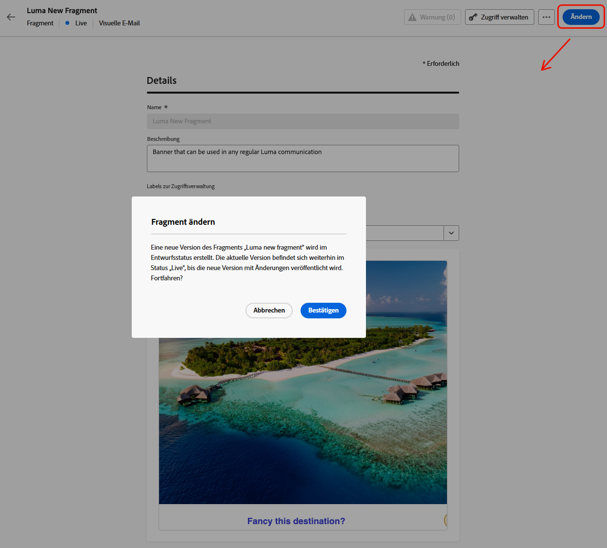

# Hinzufügen von kontextuellen Attributen zu veröffentlichten Fragmenten {#adding-contextual-attributes}

>[!AVAILABILITY]
>
>Diese Funktion steht nur ausgewählten Kunden zur Verfügung und birgt erhebliche Risiken. Vergewissern Sie sich bei Ihrem Adobe-Support-Mitarbeiter, dass diese Funktion für Ihr Unternehmen aktiviert ist.

Standardmäßig wird das Hinzufügen neuer [Personalisierungsattribute](../personalization/personalization-build-expressions.md) zu einem veröffentlichten Fragment nicht unterstützt. Nach der Veröffentlichung eines Fragments wird der Satz von Profil- oder Kontextattributen für alle Kampagnen und Journey gesperrt.

Bei ausgewählten Kunden ist es jedoch möglich, **kontextuelle Attribute** nur veröffentlichten Fragmenten hinzuzufügen.

>[!WARNING]
>
>Beim Hinzufügen von Personalisierungsattributen zu einem veröffentlichten Fragment ist der Validierungsprozess weniger streng und es werden möglicherweise keine Fehler erkannt. Dies könnte unbeabsichtigte Brüche in allen Journey und Kampagnen verursachen, die dieses Fragment im benötigten Umfang verwenden.

## Leitlinien und Einschränkungen {#limitations}

* Stellen Sie sicher, dass alle Journey und Kampagnen, die das Fragment derzeit verwenden, die neuen Kontexteigenschaften verarbeiten können.
* Profilattribute können nicht zu veröffentlichten Fragmenten hinzugefügt werden. Es werden nur kontextuelle Attribute unterstützt.
* Kontextuelle Attribute müssen manuell in den Code-Editor eingegeben werden - sie können nicht in der Benutzeroberfläche des Personalisierungseditors ausgewählt werden.
* Beim Hinzufügen personalisierter Attribute zu Live-Fragmenten werden die Validierungen gelockert, was bedeutet, dass Fehler möglicherweise nicht erkannt werden und unbeabsichtigte Brüche im großen Maßstab verursachen können.
* Nach der Veröffentlichung wirken sich Fehler sofort auf alle Kommunikationen aus, die dieses Fragment verwenden.

## Hinzufügen von Kontextattributen {#add-contextual-attributes}

Gehen Sie wie folgt vor, um einem veröffentlichten Fragment kontextuelle Attribute hinzuzufügen.

>[!IMPORTANT]
>
>Fahren Sie nur fort, wenn Sie [&#x200B; Auswirkungen auf Journey und Kampagnen, &#x200B;](#limitations) auf das Fragment verweisen, vollständig verstehen.

1. Navigieren Sie **[!UICONTROL Content-Management]** > **[!UICONTROL Fragmente]**.

1. Wählen Sie das veröffentlichte Fragment aus und klicken Sie auf **[!UICONTROL Ändern]**, um eine Entwurfsversion zu erstellen.

   {width="70%" align="left"}

1. Klicken Sie **[!UICONTROL Bearbeiten]**, um den Inhaltsfragment-Editor zu öffnen.

1. Wechseln Sie **[!UICONTROL Personalisierungseditor]** den **[!UICONTROL Erweiterter Modus]**.

1. Geben Sie das kontextuelle Attribut manuell ein (kopieren Sie es) oder fügen Sie es mithilfe der `{{context.attribute_name}}` ein:

   Beispiel für ein `promotionCode`:

   ```
   {{context.promotionCode}}
   ```

   >[!CAUTION]
   >
   >Überprüfen Sie den Attributpfad auf Genauigkeit. Fehler werden möglicherweise nicht erkannt und können die Journey- oder Kampagnenkommunikation in großem Umfang stören.

1. Speichern Sie Ihre Änderungen.

1. Klicken Sie nach der Bestätigung auf **[!UICONTROL Veröffentlichen]**, um Ihre Änderungen live zu schalten.

>[!NOTE]
>Um unbeabsichtigte Brüche zwischen Journey und Kampagnen zu vermeiden, können Sie die kontextuellen Attributpfade in einer Nicht-Produktionsumgebung testen.

## Verwandte Themen {#related-topics}

* [Verwalten von Fragmenten](manage-fragments.md)
* [Bearbeiten eines Fragments](manage-fragments.md#edit-fragments)
* [Durch API ausgelöste Kampagnen](../campaigns/api-triggered-campaigns.md)
* [Personalisierungssyntax](../personalization/personalization-syntax.md)

