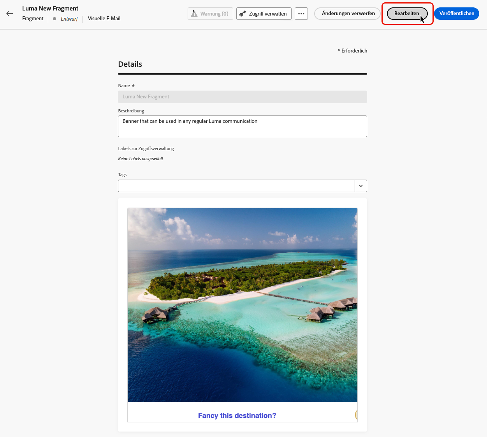
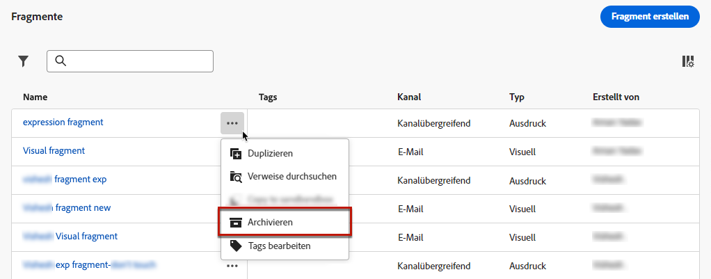

# Verwalten von Fragmenten {#manage-fragments}

Um Ihre Fragmente zu verwalten, greifen Sie links über das Menü **[!UICONTROL Content-Management]** > **[!UICONTROL Fragmente]** auf die Fragmentliste zu.

Es werden alle in der aktuellen Sandbox entweder [über das Menü **[!UICONTROL Fragmente]** oder](#create-fragments) die Option [Als Fragment speichern](#save-as-fragment) erstellten Fragmente angezeigt. 

Fragmente können nach folgenden Kriterien gefiltert werden:

* Status (Entwurf oder Live)
* Typ (visuell oder Ausdruck)
* Erstellungs- oder Änderungsdatum
* Status (archiviert oder nicht)
* Tags

Sie können auch festlegen, dass alle Fragmente oder nur die Elemente angezeigt werden, die der aktuelle Benutzer erstellt oder geändert hat.

Über die Schaltfläche **[!UICONTROL Weitere Aktionen]** neben jedem Fragment können Sie Folgendes ausführen:

* Duplizieren Sie ein Fragment.
* Verwenden Sie die Option **[!UICONTROL Verweise erkunden]**, um die Journeys, Kampagnen oder Vorlagen anzuzeigen, in denen es verwendet wird. [Weitere Informationen](#explore-references)
* Archivieren Sie ein Fragment. [Weitere Informationen](#archive-fragments)
* Bearbeiten der Tags eines Fragments [Erfahren Sie, wie Sie mit einheitlichen Tags arbeiten.](../start/search-filter-categorize.md#tags).

## Status von Fragmenten

>[!CONTEXTUALHELP]
>id="ajo_fragment_statuses"
>title="Status neuer Fragmente"
>abstract="Da die Status **Entwurf** und **Live** mit der Version Juni von Journey Optimizer eingeführt wurden, haben alle Fragmente, die vor dieser Version erstellt wurden, den Status „Entwurf“, auch wenn sie in einer Journey oder Kampagne verwendet werden. Wenn Sie Änderungen an diesen Fragmenten vornehmen, müssen Sie diese veröffentlichen, um sie „live“ zu schalten und die Änderungen an die zugehörigen Kampagnen und Journeys weiterzugeben. Außerdem müssen Sie eine neue Journey-/Kampagnenversion erstellen und veröffentlichen. Für die Veröffentlichung ist eine Benutzerberechtigung erforderlich."

>[!AVAILABILITY]
>
> Beachten Sie, dass die Fragmentstatus über mehrere Tage nach der Journey Optimizer-Version vom Juni schrittweise eingeführt werden. Einige Benutzer haben zwar sofort Zugriff, bei anderen kann es aber zu einer Verzögerung kommen, bevor sie in ihren Umgebungen verfügbar werden. Wenn diese Verbesserung noch nicht in Ihrer Umgebung verfügbar ist, beachten Sie, dass Fragmente nicht **Live** zur Verwendung in Ihren Journey und Kampagnen.

Fragmente können mehrere Status haben:

* **[!UICONTROL Entwurf]**: Das Fragment wird bearbeitet und wurde nicht genehmigt.

* **[!UICONTROL Live]**: Das Fragment wurde genehmigt und ist live. [Erfahren Sie, wie Sie ein Fragment veröffentlichen](../content-management/create-fragments.md#publish)

  Wenn ein Live-Fragment bearbeitet wird, wird ein spezifisches Symbol neben seinem Status angezeigt. Klicken Sie auf dieses Symbol, um die Entwurfsversion des Fragments zu öffnen.

* **[!UICONTROL Publishing]**: Das Fragment wurde genehmigt und wird veröffentlicht.
* **[!UICONTROL Archiviert]**: Das Fragment wurde archiviert. [Informationen zum Archivieren von Fragmenten](#archive-fragments)

>[!CAUTION]
>
>Da die Status **Entwurf** und **Live** mit der Version Juni von Journey Optimizer eingeführt wurden, haben alle Fragmente, die vor dieser Version erstellt wurden, den Status „Entwurf“, auch wenn sie in einer Journey oder Kampagne verwendet werden. Wenn Sie Änderungen an diesen Fragmenten vornehmen, müssen Sie diese veröffentlichen, um sie „live“ zu schalten und die Änderungen an die zugehörigen Kampagnen und Journeys weiterzugeben. Außerdem müssen Sie eine neue Journey-/Kampagnenversion erstellen und veröffentlichen. Für die Veröffentlichung ist eine Benutzerberechtigung erforderlich.

## Bearbeiten von Fragmenten {#edit-fragments}

Gehen Sie wie folgt vor, um ein Fragment zu bearbeiten.

1. Klicken Sie im **[!UICONTROL Fragmente]** Liste.

1. Die Fragmenteigenschaften werden mit einer Vorschau des zugehörigen Inhalts geöffnet.

1. Wenn das zu bearbeitende Fragment die Variable **Live** Status, klicken Sie auf die **Ändern** -Schaltfläche, um eine Entwurfsversion des Fragments zu erstellen. Die aktuelle Version des Fragments ist weiterhin aktiv, bis Sie den Entwurf veröffentlichen.

1. Nehmen Sie die gewünschten Änderungen am Fragment vor. Um den Inhalt zu bearbeiten, klicken Sie auf das **Bearbeiten** und bearbeiten Sie dann den Inhalt wie beim Erstellen eines neuen Fragments. [Informationen zum Erstellen eines Fragments](#create-from-scratch)

   >[!NOTE]
   >
   >Beim Bearbeiten eines Ausdrucksfragments können Sie jedes Personalisierungsfeld entfernen, dem Fragmentinhalt jedoch keine neuen hinzufügen. Wenn Sie Personalisierungsfelder hinzufügen möchten, duplizieren Sie das Fragment, um ein neues zu erstellen.

   Sie können auch die Liste der Journey, Kampagnen und Inhaltsvorlagen überprüfen, in denen das Fragment derzeit verwendet wird, indem Sie die Option **Explorer-Verweise** -Option. [Weitere Informationen](#explore-references)

   

1. Sobald Ihre Änderungen fertig sind, klicken Sie auf die **Veröffentlichen** -Schaltfläche, um Ihre Änderungen live zu stellen.

Wenn Sie ein Fragment bearbeiten, werden die Änderungen automatisch auf alle Inhalte übertragen, die dieses Fragment verwenden, einschließlich Live-Journey und Kampagnen, mit Ausnahme von Inhalten, in denen die Vererbung vom ursprünglichen Fragment unterbrochen wurde. Erfahren Sie, wie Sie die Vererbung in der [Hinzufügen visueller Fragmente zu E-Mails](../email/use-visual-fragments.md#break-inheritance) und [Ausdrucksfragmente nutzen](../personalization/use-expression-fragments.md#break-inheritance) Abschnitte.

>[!AVAILABILITY]
>
>Beachten Sie, dass die Verbreitung von Fragmentänderungen in Live-Journey und -Kampagnen über einen Zeitraum von mehreren Tagen nach der Journey Optimizer-Version vom Juni schrittweise erfolgt. Einige Benutzer haben zwar sofort Zugriff, bei anderen kann es aber zu einer Verzögerung kommen, bevor sie in ihren Umgebungen verfügbar werden. Wenn diese Verbesserung noch nicht in Ihrer Umgebung verfügbar ist, werden Ihre Änderungen nicht an in Live-Journey oder Kampagnen verwendeten Inhalten weitergegeben.

## Verweise erkunden {#explore-references}

Sie können die Liste der Journey, Kampagnen und Inhaltsvorlagen anzeigen, die derzeit ein Fragment verwenden. Wählen Sie dazu entweder über das Menü **[!UICONTROL Mehr Aktionen]** in der Fragmentliste oder über den Bildschirm mit den Fragmenteigenschaften die Option **[!UICONTROL Verweise erkunden]** aus.

Wählen Sie eine Registerkarte aus, um zwischen Journeys, Kampagnen und Vorlagen zu wechseln. Sie können ihren Status anzeigen und auf einen Namen klicken, um zum entsprechenden Element mit dem Fragmentverweis weitergeleitet zu werden.

>[!NOTE]
>
>Wenn das Fragment in einer Journey, einer Kampagne oder einer Vorlage verwendet wird, die mit einer Kennzeichnung versehen ist, die den Zugriff darauf verhindert, wird oben auf der ausgewählten Registerkarte eine Warnmeldung angezeigt. [Weitere Informationen zur Zugriffssteuerung auf Objektebene (OLAC)](../administration/object-based-access.md)

## Archivieren von Fragmenten {#archive-fragments}

Sie können aus der Fragmentliste die Elemente löschen, die für Ihre Marke nicht mehr relevant sind.

Klicken Sie dazu auf das Symbol **[!UICONTROL Weitere Aktionen]** neben dem gewünschten Fragment und dann auf **[!UICONTROL Archivieren]**. Es wird daraufhin nicht länger in der Fragmentliste angezeigt, sodass es in zukünftigen E-Mails oder Vorlagen nicht mehr von Benutzenden verwendet werden kann.

>[!NOTE]
>
>Die Archivierung eines Fragments, das in einem Inhalt verwendet wird, <!--it will remain in the email or template, but you won't be able to select it from the fragment list to edit it-->hat keine Auswirkungen auf diesen Inhalt.

Um die Archivierung eines Fragments aufzuheben, filtern Sie nach **[!UICONTROL archivierten]** Elementen und wählen Sie aus dem Menü **[!UICONTROL Mehr Aktionen]** die Option **[!UICONTROL Archivierung aufheben]** aus. Es ist nun wieder über die Fragmentliste zugänglich und kann in jeder E-Mail oder Vorlage verwendet werden.

