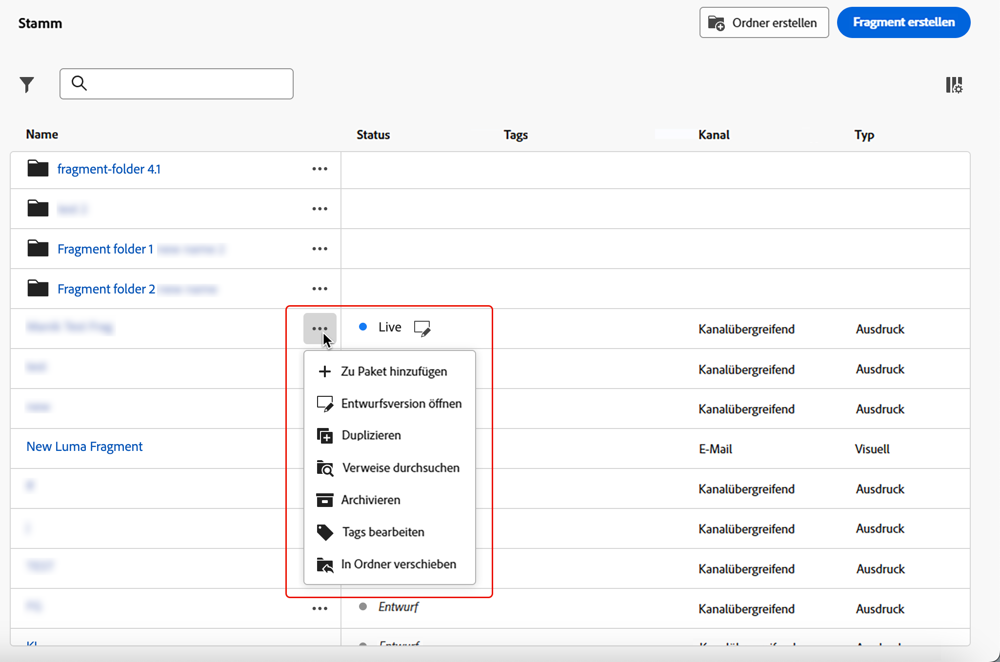
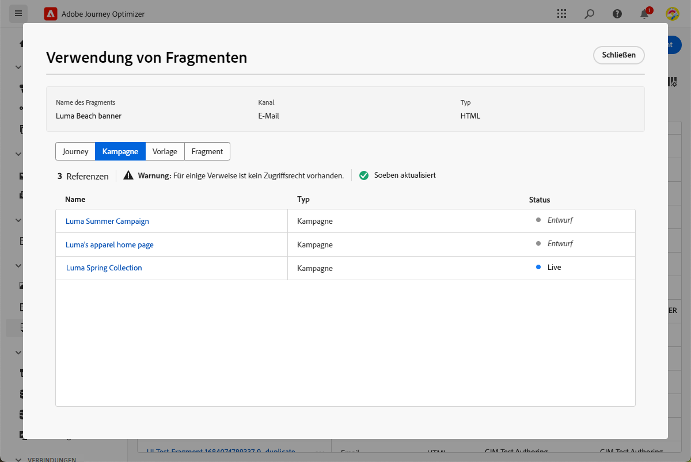
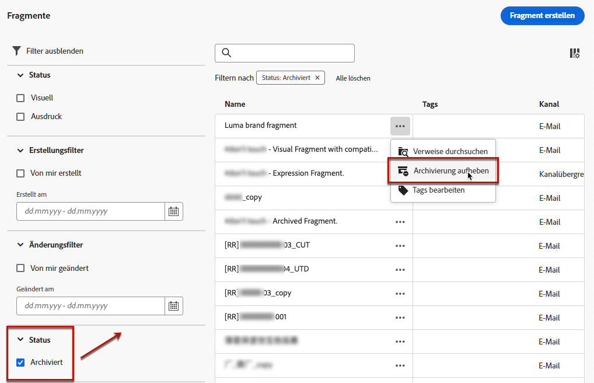

# Fragmente verwalten {#manage-fragments}

Um Ihre Fragmente zu verwalten, greifen Sie auf die Fragmentliste über **[!UICONTROL Content Management]** > **[!UICONTROL Fragmente]** Menü links.

Es werden alle in der aktuellen Sandbox entweder [über das Menü **[!UICONTROL Fragmente]** oder](#create-fragments) die Option [Als Fragment speichern](#save-as-fragment) erstellten Fragmente angezeigt. 

Fragmente können nach folgenden Kriterien gefiltert werden:

* Typ: **[!UICONTROL Visuell]** oder **[!UICONTROL Ausdruck]**
* Tags
* Erstellungs- oder Änderungsdatum

Sie können wählen, ob alle Fragmente angezeigt werden sollen oder nur die Elemente, die von der Person, die aktuell daran arbeitet, erstellt oder geändert wurden.

Sie können auch die **[!UICONTROL archivierten]** Fragmente anzeigen. [Weitere Informationen](#archive-fragments)

Über die Schaltfläche **[!UICONTROL Weitere Aktionen]** neben jedem Fragment können Sie Folgendes ausführen:

* Duplizieren Sie ein Fragment.

* Verwenden Sie die Option **[!UICONTROL Verweise erkunden]**, um die Journeys, Kampagnen oder Vorlagen anzuzeigen, in denen es verwendet wird. [Weitere Informationen](#explore-references)

* Archivieren Sie ein Fragment. [Weitere Informationen](#archive-fragments)

* Die [Tags](../start/search-filter-categorize.md#tags) eines Fragments bearbeiten.

## Bearbeiten von Fragmenten {#edit-fragments}

Gehen Sie wie folgt vor, um ein Fragment zu bearbeiten.

1. Klicken Sie auf das gewünschte Element in der Liste **[!UICONTROL Fragmente]**.
1. Über die Fragmenteigenschaften können Sie [Verweise erkunden](#explore-references), den [Zugriff verwalten](../administration/object-based-access.md) und die Fragmentdetails einschließlich [Tags](../start/search-filter-categorize.md#tags) aktualisieren.

   

1. Wählen Sie die entsprechende Schaltfläche aus, um den Inhalt zu bearbeiten, wie Sie es bei der kompletten Neuerstellung eines Fragments tun würden. [Weitere Informationen](#create-from-scratch)

>[!NOTE]
>
>Wenn Sie ein Fragment bearbeiten, werden die Änderungen automatisch auf alle E-Mails und Vorlagen übertragen, die dieses Fragment enthalten, mit Ausnahme der für **[!UICONTROL Live]**-Journeys und -Kampagnen verwendeten E-Mails. Sie können auch die Vererbung vom ursprünglichen Fragment unterbrechen. Weitere Informationen finden Sie unter [Hinzufügen visueller Fragmente zu Ihren E-Mails](../email/use-visual-fragments.md#break-inheritance) und [Nutzen von Ausdrucksfragmenten](../personalization/use-expression-fragments.md#break-inheritance).

## Verweise erkunden {#explore-references}

Sie können die Liste der Journeys, Kampagnen und Inhaltsvorlagen anzeigen, die derzeit ein Fragment verwenden.

Wählen Sie dazu entweder über das Menü **[!UICONTROL Mehr Aktionen]** in der Fragmentliste oder über den Bildschirm mit den Fragmenteigenschaften die Option **[!UICONTROL Verweise erkunden]** aus.

Wählen Sie eine Registerkarte aus, um zwischen Journeys, Kampagnen und Vorlagen zu wechseln. Sie können ihren Status anzeigen und auf einen Namen klicken, um zum entsprechenden Element mit dem Fragmentverweis weitergeleitet zu werden.

>[!NOTE]
>
>Wenn das Fragment in einer Journey, einer Kampagne oder einer Vorlage verwendet wird, die mit einer Kennzeichnung versehen ist, die den Zugriff darauf verhindert, wird oben auf der ausgewählten Registerkarte eine Warnmeldung angezeigt. [Weitere Informationen zur Zugriffssteuerung auf Objektebene (OLAC)](../administration/object-based-access.md)

## Archivieren von Fragmenten {#archive-fragments}

Sie können aus der Fragmentliste die Elemente löschen, die für Ihre Marke nicht mehr relevant sind.

Klicken Sie dazu auf das Symbol **[!UICONTROL Weitere Aktionen]** neben dem gewünschten Fragment und dann auf **[!UICONTROL Archivieren]**. Es wird daraufhin nicht länger in der Fragmentliste angezeigt, sodass es in zukünftigen E-Mails oder Vorlagen nicht mehr von Benutzenden verwendet werden kann.

>[!NOTE]
>
>Die Archivierung eines Fragments, das in einem Inhalt verwendet wird, <!--it will remain in the email or template, but you won't be able to select it from the fragment list to edit it-->hat keine Auswirkungen auf diesen Inhalt.

Um die Archivierung eines Fragments aufzuheben, filtern Sie nach **[!UICONTROL archivierten]** Elementen und wählen Sie aus dem Menü **[!UICONTROL Mehr Aktionen]** die Option **[!UICONTROL Archivierung aufheben]** aus. Es ist nun wieder über die Fragmentliste zugänglich und kann in jeder E-Mail oder Vorlage verwendet werden.

