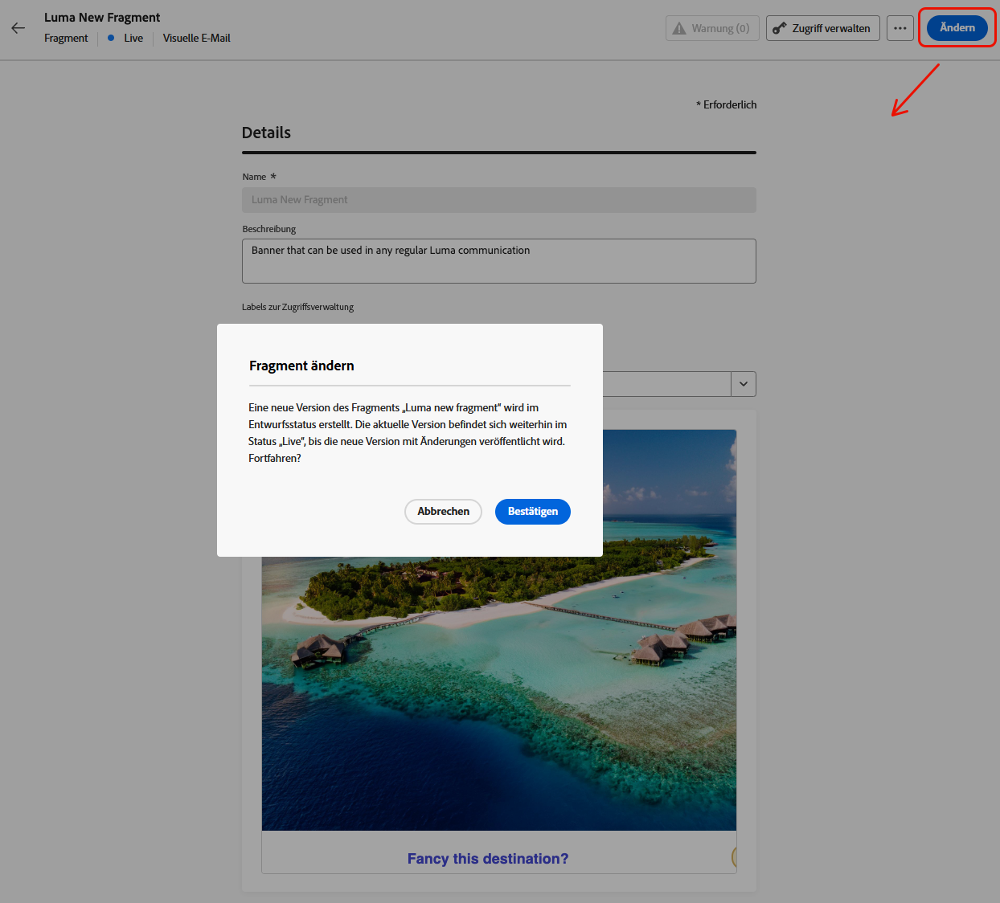
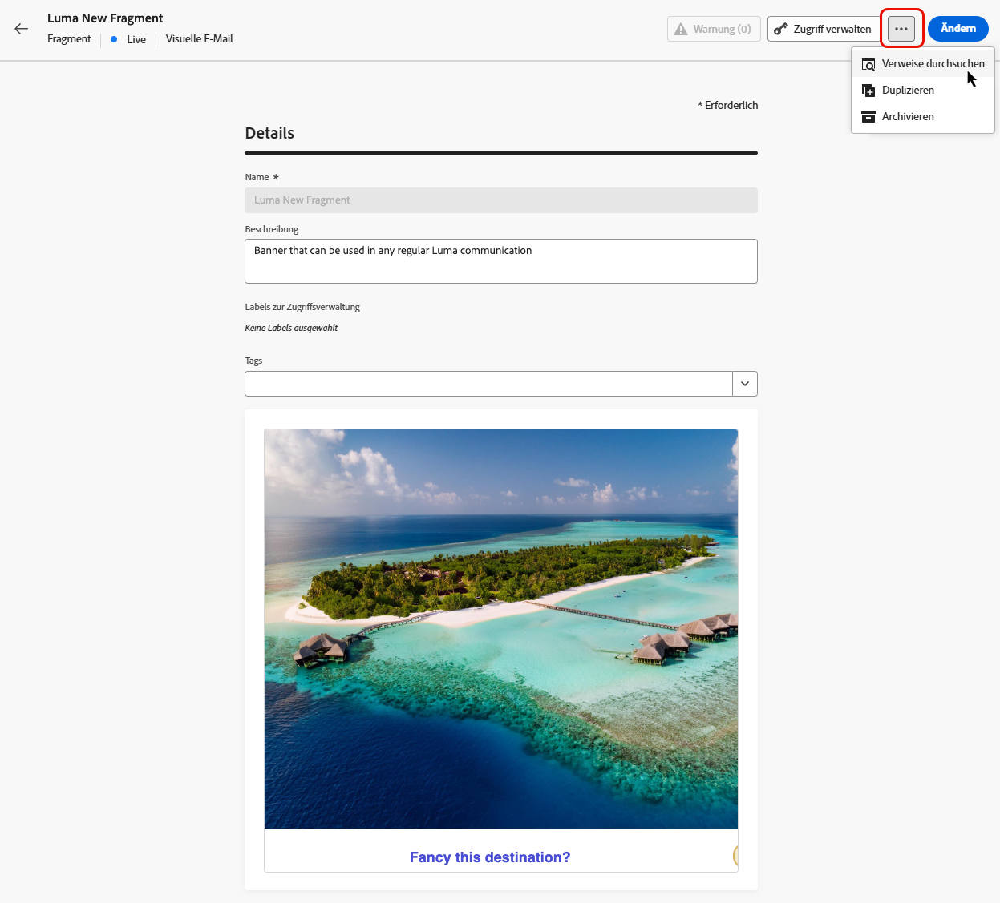

# Verwalten von Fragmenten {#manage-fragments}

## Zugeifen auf Fragmente {#access-fragments}

Um Ihre Fragmente zu verwalten, greifen Sie links über das Menü **[!UICONTROL Content-Management]** > **[!UICONTROL Fragmente]** auf die Fragmentliste zu.

Es werden alle in der aktuellen Sandbox entweder [über das Menü **[!UICONTROL Fragmente]** oder](#create-fragments) die Option [Als Fragment speichern](#save-as-fragment) erstellten Fragmente angezeigt. 

Im Bereich auf der linken Seite können Sie Fragmente in Ordnern organisieren. Standardmäßig werden alle Fragmente angezeigt. Bei der Auswahl eines Ordners werden nur die Fragmente und Ordner angezeigt, die im ausgewählten Ordner enthalten sind. [Weitere Informationen](#folders)

Um nach einem bestimmten Element zu suchen, geben Sie einen Namen in das Suchfeld ein. Wenn ein [Ordner](#folders) ausgewählt ist, gilt die Suche für alle Fragmente oder Ordner in der ersten Hierarchieebene dieses Ordners<!--(not nested items)-->.

Fragmente können nach folgenden Kriterien gefiltert werden:

* Status (Entwurf oder Live)
* Typ (visuell oder Ausdruck)
* Erstellungs- oder Änderungsdatum
* Status (archiviert oder nicht)
* Tags

{width="90%" align="left"}

Sie können auch wählen, ob alle Fragmente angezeigt werden sollen oder nur die Elemente, die von der Person, die aktuell daran arbeitet, erstellt oder geändert wurden.

Über die Schaltfläche **[!UICONTROL Weitere Aktionen]** neben jedem Fragment können Sie Folgendes ausführen:

* Fügen Sie das Fragment einem Paket für den Export hinzu. [Weitere Informationen](#export)
* Öffnen Sie beim Bearbeiten eines Live-Fragments die Entwurfsversion dieses Fragments. [Weitere Informationen](#edit-fragments)
* Duplizieren Sie das Fragment.
* Verwenden Sie die Option **[!UICONTROL Verweise erkunden]**, um die Journeys, Kampagnen oder Vorlagen anzuzeigen, in denen es verwendet wird. [Weitere Informationen](#explore-references)
* Archivieren Sie das Fragment. [Weitere Informationen](#archive-fragments)
* Bearbeiten Sie die Tags eines Fragments. [Informationen zum Arbeiten mit einheitlichen Tags](../start/search-filter-categorize.md#tags)
* Verschieben Sie das Fragment in einen Ordner. [Weitere Informationen](#folders)

## Verwalten von Fragmenten mithilfe von Ordnern {#folders}

>[!CONTEXTUALHELP]
>id="ajo_fragments_folders"
>title="Organisieren von Fragmenten in Ordnern"
>abstract="Verwenden Sie Ordner, um Ihre Fragmente entsprechend den Anforderungen Ihrer Organisation zu kategorisieren und zu verwalten."

Für eine einfache Fragmentnavigation können Sie Ordner verwenden, um sie effektiver in einer strukturierten Hierarchie zu organisieren. Auf diese Weise können Sie die Elemente entsprechend den Anforderungen Ihrer Organisation kategorisieren und verwalten.

1. Klicken Sie auf die Schaltfläche **[!UICONTROL Alle Fragmente]**, um alle zuvor erstellten Elemente ohne Ordnergruppierung anzuzeigen.

1. Klicken Sie auf den **[!UICONTROL Stammordner]**, um alle erstellten Ordner anzuzeigen.

   >[!NOTE]
   >
   >Wenn Sie noch keine Ordner erstellt haben, werden alle Fragmente angezeigt.

1. Klicken Sie auf einen beliebigen Ordner im **[!UICONTROL Stammordner]**, um dessen Inhalt anzuzeigen.

1. Wenn Sie auf den **[!UICONTROL Stammordner]** oder einen anderen Ordner klicken, wird die Schaltfläche **[!DNL Create folder]** angezeigt. Wählen Sie sie aus.

   

1. Geben Sie einen Namen für den neuen Ordner ein und klicken Sie auf **[!UICONTROL Speichern]**. Der neue Ordner wird über der Fragmentliste im **[!UICONTROL Stammordner]** oder im aktuell ausgewählten Ordner angezeigt.

1. Sie können auf die Schaltfläche **[!UICONTROL Weitere Aktionen]** klicken, um den Ordner umzubenennen oder zu löschen.

   

1. Mit der Schaltfläche **[!UICONTROL Weitere Aktionen]** können Sie das Fragment auch in einen anderen vorhandenen Ordner verschieben.

   <!---->

1. Nun können Sie zu dem Ordner navigieren, den Sie gerade erstellt haben. Jedes neue Fragment, das Sie hier [erstellen](create-fragments.md), wird im aktuellen Ordner gespeichert.

   

## Status von Fragmenten {#fragments-statuses}

>[!CONTEXTUALHELP]
>id="ajo_fragment_statuses"
>title="Status von neuen Fragmenten"
>abstract="Da die Status **Entwurf** und **Live** mit der Version Juni von Journey Optimizer eingeführt wurden, haben alle Fragmente, die vor dieser Version erstellt wurden, den Status **Entwurf**. Dies gilt auch dann, wenn sie in einer Journey oder Kampagne verwendet werden. Wenn Sie Änderungen an diesen Fragmenten vornehmen, müssen Sie sie veröffentlichen, um sie **live zu schalten** und die Änderungen an die zugehörigen Kampagnen und Journeys weiterzugeben. Außerdem müssen Sie eine neue Journey-/Kampagnenversion erstellen und veröffentlichen.  Für die Veröffentlichung ist die Benutzerberechtigung <a href="https://experienceleague.adobe.com/de/docs/journey-optimizer/using/access-control/privacy/ootb-product-profiles#content-library-manage">Fragment veröffentlichen</a> erforderlich."
>additional-url="https://experienceleague.adobe.com/de/docs/journey-optimizer/using/access-control/privacy/ootb-product-profiles#content-library-manager" text="Weitere Informationen zu den Berechtigungen für Inhaltsfragmente"

Fragmente können mehrere Status aufweisen:

* **[!UICONTROL Entwurf]**: Das Fragment wird noch bearbeitet und wurde noch nicht genehmigt.

* **[!UICONTROL Live]**: Das Fragment wurde genehmigt und ist live. [Informationen zum Veröffentlichen eines Fragments](../content-management/create-fragments.md#publish)

  Wenn ein Live-Fragment bearbeitet wird, wird ein spezifisches Symbol neben seinem Status angezeigt. Klicken Sie auf dieses Symbol, um die Entwurfsversion des Fragments zu öffnen.

* **[!UICONTROL Publishing]**: Das Fragment wurde genehmigt und wird gerade veröffentlicht.
* **[!UICONTROL Archiviert:]**: Das Fragment wurde archiviert. [Informationen zum Archivieren von Fragmenten](#archive-fragments)

>[!CAUTION]
>
>Da die Status **Entwurf** und **Live** mit der Version Juni von Journey Optimizer eingeführt wurden, haben alle Fragmente, die vor dieser Version erstellt wurden, den Status **Entwurf**. Dies gilt auch dann, wenn sie in einer Journey oder Kampagne verwendet werden. Wenn Sie Änderungen an diesen Fragmenten vornehmen, müssen Sie sie veröffentlichen, um sie **live zu schalten** und die Änderungen an die zugehörigen Kampagnen und Journeys weiterzugeben. Außerdem müssen Sie eine neue Journey-/Kampagnenversion erstellen und veröffentlichen. Für die Veröffentlichung ist die Benutzerberechtigung [Fragment veröffentlichen](../administration/ootb-product-profiles.md#content-library-manager) erforderlich.

## Bearbeiten eines Fragments {#edit-fragments}

>[!CONTEXTUALHELP]
>id="ajo_fragments_update_campaigns"
>title="Aktualisieren von Fragmenten in Kampagnen"
>abstract="Diese Kampagne wird nicht aktualisiert, wenn Sie Änderungen an dem Fragment veröffentlichen. Es muss eine neue Version veröffentlicht werden, damit die Funktion zum Aktualisieren von Fragmenten unterstützt werden kann."

>[!CONTEXTUALHELP]
>id="ajo_fragments_update_journeys"
>title="Aktualisieren von Fragmenten in Journeys"
>abstract="Diese Journey wird nicht aktualisiert, wenn Sie Änderungen an dem Fragment veröffentlichen. Es muss eine neue Version veröffentlicht werden, damit die Funktion zum Aktualisieren von Fragmenten unterstützt werden kann."

Gehen Sie wie folgt vor, um ein Fragment zu bearbeiten.

1. Klicken Sie in der Liste **[!UICONTROL Fragmente]** auf das gewünschte Fragment. Der Bildschirm „Fragmenteigenschaften“ wird mit einer Vorschau des zugehörigen Inhalts geöffnet.

1. Sie können die Liste der Journeys, Kampagnen und Inhaltsvorlagen überprüfen, in denen das Fragment derzeit verwendet wird. Wählen Sie dazu über die Schaltfläche „Weitere Aktionen“ die Option **[!UICONTROL Verweise durchsuchen]** aus. [Weitere Informationen](#explore-references)

1. Wenn das in Bearbeitung befindliche Fragment den Status **[!UICONTROL Live]** aufweist, klicken Sie auf die Schaltfläche **[!UICONTROL Ändern]**, um eine Entwurfsversion des Fragments zu erstellen. Klicken Sie auf **[!UICONTROL Bestätigen]**.

   {width="70%" align="left"}

   >[!NOTE]
   >
   >Die aktuelle Version des Fragments ist weiterhin live, bis Sie die neu aktualisierte Version veröffentlichen.

1. Nehmen Sie bei Bedarf die gewünschten Änderungen an den Fragmentdetails vor.

1. Um den Fragmentinhalt zu bearbeiten, klicken Sie auf die Schaltfläche **[!UICONTROL Bearbeiten]** und aktualisieren Sie dann den Inhalt wie beim Erstellen eines neuen Fragments. [Informationen zum Erstellen eines Fragments](create-fragments.md#content)

   {width="70%" align="left"}

   >[!NOTE]
   >
   >Beim Bearbeiten eines veröffentlichten Fragments können Sie jedes Personalisierungsfeld entfernen, jedoch keine neuen Felder zum Fragmentinhalt hinzufügen. Wenn Sie personalisierte Attribute hinzufügen möchten, müssen Sie das Fragment duplizieren. [Weitere Informationen](#adding-new-attributes)

1. Sobald Ihre Änderungen fertig sind, speichern Sie sie und klicken Sie auf die Schaltfläche **[!UICONTROL Veröffentlichen]**, um Ihre Änderungen live zu schalten. [Weitere Informationen](create-fragments.md#publish)

Wenn Sie ein Fragment bearbeiten, werden die Änderungen automatisch auf alle Inhalte übertragen, die dieses Fragment verwenden, einschließlich Live-Journeys und Kampagnen. Davon ausgenommen sind Inhalte, bei denen Sie die Vererbung vom ursprünglichen Fragment unterbrochen haben. 

>[!NOTE]
>
>Informationen zum Unterbrechen der Vererbung finden Sie in den Abschnitten [Hinzufügen visueller Fragmente zu Ihren E-Mails](../email/use-visual-fragments.md#break-inheritance) und [Nutzen von Ausdrucksfragmenten](../personalization/use-expression-fragments.md#break-inheritance).

### Hinzufügen neuer Attribute zu einem Live-Fragment {#adding-new-attributes}

>[!WARNING]
>
>Das Hinzufügen neuer [personalisierter Attribute](../personalization/personalization-build-expressions.md) zu einem Live-Fragment wird nicht unterstützt.

Nach der Veröffentlichung eines Fragments wird der Satz personalisierter oder kontextueller Attribute für alle Kampagnen und Journeys gesperrt, die darauf verweisen.

Gehen Sie wie folgt vor, um zusätzliche Attribute in ein Live-Fragment einzubinden.

1. Duplizieren Sie das vorhandene Fragment mithilfe der Schaltfläche **[!UICONTROL Weitere Aktionen]**.

   {width="70%" align="left"}

1. Wählen Sie das duplizierte Fragment aus, um es zu öffnen, und klicken Sie auf die Schaltfläche **[!UICONTROL Bearbeiten]**.

1. [Fügen Sie die neuen gewünschten Attribute zum duplizierten Fragment hinzu](../personalization/personalization-build-expressions.md#add), z. B. Personalisierungsfelder.

   {width="70%" align="left"}

1. Speichern Sie Ihre Änderungen und veröffentlichen Sie das neue Fragment. [Weitere Informationen](create-fragments.md#publish)

1. Aktualisieren Sie alle Kampagnen oder Journeys, um auf das aktualisierte Fragment zu verweisen, dem die neuen Attribute hinzugefügt wurden.

   * [Erfahren Sie, wie Sie visuelle Fragmente verwenden](../email/use-visual-fragments.md)
   * [Erfahren Sie, wie Sie Ausdrucksfragmente verwenden](../personalization/use-expression-fragments.md)

## Erkunden der Verweise {#explore-references}

Sie können die Liste aller Journeys, Kampagnen und Inhaltsvorlagen anzeigen, die derzeit ein Fragment verwenden.  Wählen Sie dazu entweder über das Menü **[!UICONTROL Weitere Aktionen]** in der Fragmentliste oder im Bildschirm „Fragmenteigenschaften“ die Option **[!UICONTROL Verweise durchsuchen]** aus.

{width="70%" align="left"}

Wählen Sie eine Registerkarte aus, um zwischen Journeys, Kampagnen und Vorlagen zu wechseln. Sie können ihren Status anzeigen und auf einen Namen klicken, um zum entsprechenden Element mit dem Fragmentverweis weitergeleitet zu werden.

{width="70%" align="left"}

>[!NOTE]
>
>Wenn das Fragment in einer Journey, einer Kampagne oder einer Vorlage verwendet wird, die mit einer Kennzeichnung versehen ist, die den Zugriff darauf verhindert, wird oben auf der ausgewählten Registerkarte eine Warnmeldung angezeigt. [Weitere Informationen zur Zugriffssteuerung auf Objektebene (Object Level Access Control, OLAC)](../administration/object-based-access.md)

## Archivieren von Fragmenten {#archive-fragments}

Sie können aus der Fragmentliste die Elemente löschen, die für Ihre Marke nicht mehr relevant sind.

Klicken Sie dazu auf das Symbol **[!UICONTROL Weitere Aktionen]** neben dem gewünschten Fragment und dann auf **[!UICONTROL Archivieren]**. Es wird daraufhin nicht länger in der Fragmentliste angezeigt, sodass es in zukünftigen E-Mails oder Vorlagen nicht mehr von Benutzenden verwendet werden kann.

{width="70%" align="left"}

>[!NOTE]
>
>Die Archivierung eines Fragments, das in einem Inhalt verwendet wird, <!--it will remain in the email or template, but you won't be able to select it from the fragment list to edit it-->hat keine Auswirkungen auf diesen Inhalt.

Um die Archivierung eines Fragments aufzuheben, filtern Sie nach **[!UICONTROL archivierten]** Elementen und wählen Sie aus dem Menü **[!UICONTROL Mehr Aktionen]** die Option **[!UICONTROL Archivierung aufheben]** aus. Es ist nun wieder über die Fragmentliste zugänglich und kann in jeder E-Mail oder Vorlage verwendet werden.

{width="70%" align="left"}

## Exportieren von Fragmenten in eine andere Sandbox {#export}

Mit Journey Optimizer können Sie ein Fragment von einer Sandbox in eine andere kopieren. Sie können beispielsweise ein Fragment aus Ihrer Staging-Sandbox-Umgebung in Ihre Produktions-Sandbox kopieren.

Der Kopiervorgang wird über einen **Paket-Export und -Import** zwischen der Quell- und Ziel-Sandbox durchgeführt. Detaillierte Informationen darüber, wie Sie Objekte exportieren und in eine Ziel-Sandbox importieren, finden Sie in diesem Abschnitt: [Kopieren von Objekten in eine andere Sandbox](../configuration/copy-objects-to-sandbox.md).
