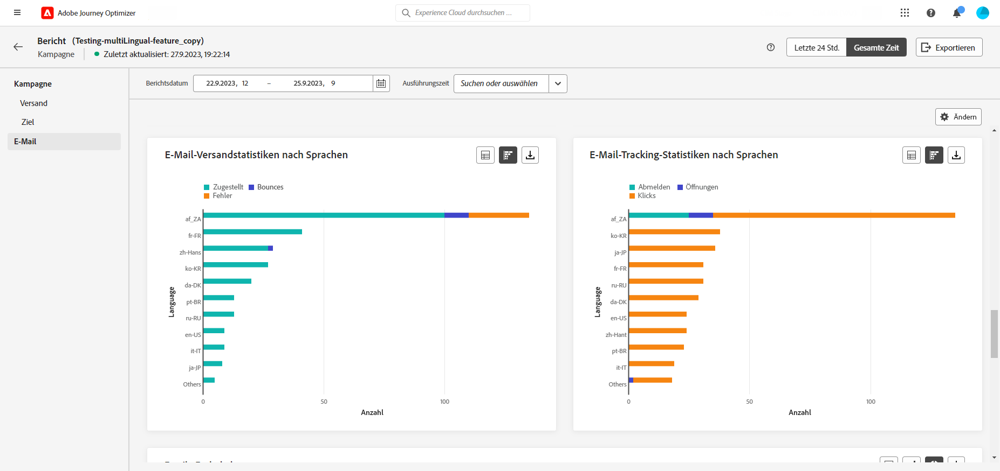

# Mehrsprachige Inhalte erstellen {#multilingual-automated}

Die mehrsprachige Funktion ermöglicht es Ihnen, mühelos Inhalte in mehreren Sprachen innerhalb einer Kampagne zu erstellen. Mit dieser Funktion können Sie bei der Bearbeitung Ihrer Kampagne zwischen Sprachen wechseln, den gesamten Bearbeitungsvorgang optimieren und Ihre Fähigkeit zur effizienten Verwaltung mehrsprachiger Inhalte verbessern.

## Gebietsschema erstellen {#create-locale}

Beim Konfigurieren der Spracheinstellungen, wie im Abschnitt [Spracheinstellungen erstellen](#language-settings) Wenn für Ihre mehrsprachigen Inhalte kein bestimmtes Gebietsschema verfügbar ist, können Sie mit der Variablen **[!UICONTROL Übersetzung]** Menü.

1. Aus dem **[!UICONTROL Administration]** Menü, Zugriff **[!UICONTROL Kanal]**.

   Im Menü Übersetzungen können Sie auf die Liste der aktivierten Gebietsschemata zugreifen.

1. Aus dem **[!UICONTROL Gebietsschema-Wörterbuch]** Registerkarte, klicken **[!UICONTROL Gebietsschema hinzufügen]**.

   

1. Wählen Sie Ihren Gebietsschema-Code aus der **[!UICONTROL Sprache]** und der zugehörigen **[!UICONTROL Region]**.

1. Klicks **[!UICONTROL Speichern]** , um Ihr Gebietsschema zu erstellen.

   

## Übersetzungsprojekt erstellen {#translation-project}

1. Aus dem **[!UICONTROL Übersetzungsprojekte]** Menü unter **[!UICONTROL Content Management]** klicken **[!UICONTROL Projekt erstellen]**.

1. Eingeben eines **[!UICONTROL Name]** und **[!UICONTROL Beschreibung]**.

1. Wählen Sie die **[!UICONTROL Gebietsschema der Quelle]**.

1. Wählen Sie aus, ob Ihre Übersetzungen nach der Validierung automatisch veröffentlicht werden und ob Sie den Review-Workflow aktivieren möchten.

1. Klicks **[!UICONTROL Gebietsschema hinzufügen]** , um auf das Menü zuzugreifen und die Sprachen für Ihr Übersetzungsprojekt zu definieren.

   Wenn eine **[!UICONTROL Gebietsschema]** fehlt, können Sie es manuell im Voraus erstellen über **[!UICONTROL Übersetzung]** Menü oder nach API. Siehe Abschnitt [Neues Gebietsschema erstellen](#create-locale).

1. Wählen Sie aus der Liste Ihre **[!UICONTROL Zielgebietsschema(e)]** und wählen Sie **[!UICONTROL Übersetzungsanbieter]** Sie möchten für jedes Gebietsschema verwenden.

1. Klicks **[!UICONTROL Gebietsschema hinzufügen]** wenn Sie die Verknüpfung Ihres Target-Gebietsschemas mit dem richtigen Übersetzungsanbieter abgeschlossen haben.

1. Klicks **[!UICONTROL Speichern]** wenn Ihr Übersetzungsprojekt konfiguriert ist.

1. Im Menü Erweitert Ihres Übersetzungsprojekts können Sie das Projekt bearbeiten, deaktivieren oder löschen.

## Spracheinstellungen erstellen {#language-settings}

In diesem Abschnitt können Sie Ihre Primärsprache und die zugehörigen Gebietsschemata zur Verwaltung Ihrer mehrsprachigen Inhalte festlegen. Sie können auch das Attribut auswählen, mit dem Sie Informationen zur Profilsprache nachschlagen möchten

1. Aus dem **[!UICONTROL Administration]** Menü, Zugriff **[!UICONTROL Kanal]**.

1. Im **[!UICONTROL Spracheinstellungen]** Menü, klicken **[!UICONTROL Spracheinstellungen erstellen]**.

1. Geben Sie den Namen Ihrer **[!UICONTROL Spracheinstellungen]**.

1. Wählen Sie die **[!UICONTROL Übersetzungsprojekt]** -Option.

1. Aus dem **[!UICONTROL Übersetzungsprojekt]** Feld, klicken Sie auf **[!UICONTROL Bearbeiten]** und wählen Sie die zuvor erstellte **[!UICONTROL Übersetzungsprojekt]**.

   Ihre zuvor konfigurierten Gebietsschemata werden automatisch importiert. Wenn Sie Ihre **[!UICONTROL Übersetzungsprojekt]** klicken **[!UICONTROL Aktualisieren]** , um diese Änderungen in Ihren **[!UICONTROL Spracheinstellungen]**.

1. Aus dem **[!UICONTROL Versandpräferenz]** wählen Sie das Attribut aus, nach dem Sie nach Informationen zu Profilsprachen suchen möchten.

1. Klicks **[!UICONTROL Bearbeiten]** neben **[!UICONTROL Gebietsschema]** , um sie weiter zu personalisieren und hinzuzufügen **[!UICONTROL Profilvoreinstellungen]**.

1. Klicks **[!UICONTROL Einsenden]** , um **[!UICONTROL Spracheinstellungen]**.

<!--
1. Access the **[!UICONTROL Channel surfaces]** menu and create a new channel surface or select an existing one.

1. In the **[!UICONTROL Header parameters]** section, select the **[!UICONTROL Enable multilingual]** option.

1. Select your **[!UICONTROL Locales dictionary]** and add as many as needed.
-->

## Mehrsprachige Kampagne erstellen {#create-multilingual-campaign}

1. Erstellen und konfigurieren Sie zunächst Ihre Kampagne entsprechend Ihren Anforderungen. [Weitere Informationen](../campaigns/create-campaign.md)

1. Navigieren Sie zum **[!UICONTROL Aktionen]** und wählen Sie **[!UICONTROL Inhalt bearbeiten]**.

1. Erstellen oder importieren Sie Ihren ursprünglichen Inhalt und personalisieren Sie ihn nach Bedarf.

1. Nachdem der Hauptinhalt erstellt wurde, klicken Sie auf **[!UICONTROL Speichern]** und gehen Sie zurück zum Kampagnenkonfigurationsbildschirm.

1. Klicks **[!UICONTROL Sprachen hinzufügen]** und wählen Sie die zuvor erstellte **[!UICONTROL Spracheinstellungen]**. [Weitere Informationen](#create-language-settings)

1. Greifen Sie auf die erweiterten Einstellungen der **[!UICONTROL Gebietsschemata]** Menü und wählen Sie **[!UICONTROL Primär in alle Gebietsschemata kopieren]**.

1. Jetzt, da Ihr Hauptinhalt in Ihrem ausgewählten  **[!UICONTROL Gebietsschemata]**, öffnen Sie jedes Gebietsschema und klicken Sie auf **[!UICONTROL Bearbeiten des E-Mail-Hauptteils]** , um Ihren Inhalt zu übersetzen.

1. Sie können Gebietsschemata mit dem **[!UICONTROL Mehr Aktionen]** des ausgewählten Gebietsschemas.

1. Um Ihre mehrsprachige Konfiguration zu deaktivieren, klicken Sie auf **[!UICONTROL Sprachen hinzufügen]** und wählen Sie die Sprache aus, die Sie als Landessprache beibehalten möchten.

1. Klicks **[!UICONTROL Aktivieren]** um eine Zusammenfassung der Kampagne anzuzeigen.

   In der Zusammenfassung können Sie die Kampagne bei Bedarf ändern und überprüfen, ob ein Parameter falsch ist oder fehlt.

1. Durchsuchen Sie Ihre mehrsprachigen Inhalte, um das Rendering in den einzelnen Sprachen anzuzeigen.

1. Vergewissern Sie sich, dass Ihre Kampagne korrekt konfiguriert ist, und klicken Sie dann auf **[!UICONTROL Aktivieren]**.

Ihre Kampagne ist jetzt aktiviert. Die in der Kampagne konfigurierte Nachricht wird sofort oder am angegebenen Datum gesendet. Beachten Sie, dass Ihre Kampagne, sobald sie live ist, nicht mehr geändert werden kann. Um Inhalte wiederzuverwenden, können Sie Ihre Kampagne duplizieren.

Nach dem Versand können Sie die Wirkung Ihrer Kampagnen in den Kampagnenberichten messen.

## Mehrsprachiger Kampagnenbericht {#multilingual-campaign-report}

Globale Berichte, auf die über die Registerkarte **Gesamte Zeit** zugegriffen werden kann, zeigen Ereignisse an, die vor mindestens zwei Stunden aufgetreten sind, und decken Ereignisse über einen ausgewählten Zeitraum ab. Über die Schaltfläche **[!UICONTROL Bericht anzeigen]** ist der direkte Zugriff in einer Campaign-Instanz auf den globalen Bericht in Campaign möglich.

Weitere Informationen zu den im Campaign-Bericht verfügbaren Daten finden Sie unter [diese Seite](../reports/campaign-global-report.md).

+++ Erfahren Sie mehr über die verschiedenen Metriken und Widgets, die für Ihren mehrsprachigen Inhalt verfügbar sind.

Die **[!UICONTROL Versandstatistiken von E-Mails nach Sprachen]** Widget erläutert den Erfolg Ihres Versands in Abhängigkeit von Ihrer **[!UICONTROL Gebietsschemata]**:

* **[!UICONTROL Zugestellt]**: Zahl der erfolgreich gesendeten Nachrichten im Vergleich zur Gesamtzahl der gesendeten Nachrichten.

* **[!UICONTROL Bounces]**: Gesamtzahl der kumulierten Fehler bei Versand und automatischer Bounce-Verarbeitung in Relation zur Gesamtzahl der gesendeten Nachrichten.

* **[!UICONTROL Fehler]**: Gesamtanzahl der Fehler, die während des Versands aufgetreten sind und die Zustellung an Profile verhinderten.

Die **[!UICONTROL Statistiken des E-Mail-Trackings nach Sprachen]** Widget enthält die für die Empfängeraktivität für Ihren Versand verfügbaren Daten. **[!UICONTROL Gebietsschemata]**:

* **[!UICONTROL Abmeldungen]**: Anzahl der Klicks auf den Abmelde-Link.

* **[!UICONTROL Öffnungen]**: Anzahl der Öffnungen der Nachricht.

* **[!UICONTROL Klicks]**: Anzahl der Klicks auf einen Inhalt.
+++

<!--
# Create a multilingual journey {#create-multilingual-journey}

1. Create your journey with a Delivery and personalize your content as needed.
1. From your delivery action, click Edit content.
1. Click Add languages.

-->
