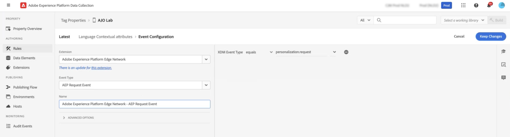

# Erstellen von mehrsprachigen Inhalten mit automatisierter Übersetzung {#multilingual-automated}

>[!CONTEXTUALHELP]
>id="ajo_multi_add_provider"
>title="Hinzufügen von Anbietern"
>abstract="Fügen Sie bei Bedarf Übersetzungsanbieter und Gebietsschemata hinzu. Auf diese Weise können Sie verwalten, welche Anbieter und Gebietsschemata für Ihr Projekt aktiv sind. So können Sie flexibel Ressourcen und Zielgruppen entsprechend Ihrer aktuellen Anforderungen und des Projektumfangs anpassen."

>[!CONTEXTUALHELP]
>id="ajo_multi_edit_provider"
>title="Bearbeiten von Anbietern"
>abstract="Bei Bedarf können Sie vorhandene Übersetzungsanbieter ändern und Gebietsschemata hinzufügen. Mit dieser Funktion können Sie steuern, welche Anbieter und Gebietsschemata für Ihr Projekt aktiv sind. So können Sie flexibel Ressourcen anpassen und spezifische Zielgruppen entsprechend Ihren aktuellen Anforderungen und Projektzielen ansprechen."

>[!IMPORTANT]
>
>Für den automatisierten Ablauf benötigen Benutzer Berechtigungen im Zusammenhang mit der Funktion **[!UICONTROL Übersetzungsdienst]** . [Weitere Informationen zu Berechtigungen](../administration/permissions.md)

Mithilfe des automatisierten Fluss können Sie einfach Ihre Zielsprache und Ihren Sprachdienstleister auswählen. Ihre Inhalte werden dann direkt an die Übersetzung weitergeleitet, die sie nach der Fertigstellung einer Endkontrolle unterzieht.

Führen Sie die folgenden Schritte aus, um mehrsprachige Inhalte mithilfe der automatisierten Übersetzung zu erstellen:

1. [Anbieter hinzufügen](multilingual-provider.md)

1. [Gebietsschemata hinzufügen (optional)](multilingual-locale.md)

1. [Erstellen eines Sprachprojekts](#create-translation-project)

1. [Erstellen von Spracheinstellungen](#create-language-settings)

1. [Erstellen von mehrsprachigen Inhalten](#create-a-multilingual-campaign)

1. [Überprüfen Sie Ihre Übersetzungsaufgabe (optional)](#review-translation-project)

## Erstellen eines Übersetzungsprojekts {#translation-project}

>[!CONTEXTUALHELP]
>id="ajo_multi_create_project"
>title="Erstellen von Projekten"
>abstract="Um mit der Erstellung mehrsprachiger Inhalte zu beginnen, starten Sie Ihr Übersetzungsprojekt, indem Sie das Zielgebietsschema identifizieren und die entsprechende Sprache oder den regionalen Dialekt für Ihre Zielgruppe auswählen. Wählen Sie anschließend einen Übersetzungsanbieter aus, der die Anforderungen Ihres Projekts erfüllt."

>[!CONTEXTUALHELP]
>id="ajo_multi_edit_project"
>title="Bearbeiten von Projekten"
>abstract="Aktualisieren Sie Ihr Übersetzungsprojekt, um zusätzliche Gebietsschemata zu integrieren, sodass Sie Ihre Inhalte erweitern können, um eine breitere Zielgruppe zu erreichen."

Starten Sie Ihr Übersetzungsprojekt, indem Sie das Zielgebietsschema angeben und dabei die spezifische Sprache oder Region für Ihren Inhalt angeben. Sie können dann Ihren Übersetzungsanbieter auswählen.

1. Klicken Sie im Menü **[!UICONTROL Übersetzung]** unter **[!UICONTROL Content-Management]** auf der Registerkarte **[!UICONTROL Projekte]** auf **[!UICONTROL Projekt erstellen]**.

   

1. Geben Sie einen **[!UICONTROL Namen]** und eine **[!UICONTROL Beschreibung]** ein.

1. Wählen Sie das **[!UICONTROL Gebietsschema der Ausgangssprache]**.

   

1. Wählen Sie aus, ob Sie die folgenden Optionen aktivieren möchten:

   * **[!UICONTROL Genehmigte Übersetzungen automatisch veröffentlichen]**: Sobald Übersetzungen validiert wurden, werden sie automatisch in die Kampagne integriert, ohne dass ein manuelles Eingreifen erforderlich ist.
   * **[!UICONTROL Überprüfungs-Workflow aktivieren]**: Gilt nur für von Menschen übersetzte Gebietsschemata. Dadurch kann eine interne Prüfperson übersetzte Inhalte effizient auswerten und genehmigen oder ablehnen. [Weitere Informationen](#review-translation-project)

1. Klicken Sie auf **[!UICONTROL Gebietsschema hinzufügen]**, um auf das Menü zuzugreifen und die Sprachen für Ihr Übersetzungsprojekt festzulegen.

   Wenn ein **[!UICONTROL Gebietsschema]** fehlt, können Sie es über das Menü **[!UICONTROL Übersetzung]** oder per API manuell im Voraus erstellen. Siehe [Erstellen eines neuen Gebietsschemas](#create-locale).

   

1. Wählen Sie aus der Liste Ihr(e) **[!UICONTROL Zielgebietsschema(ta)]** und den **[!UICONTROL Übersetzungsanbieter]** aus, die Sie für das jeweilige Gebietsschema verwenden möchten.

   Einstellungen für **[!UICONTROL Übersetzungsanbieter]** können über das Menü **[!UICONTROL Übersetzung]** im Menüabschnitt **[!UICONTROL Administration]** aufgerufen werden.

   >[!NOTE]
   >
   >Die Vertragsverwaltung mit dem Übersetzungsanbieter fällt nicht in den Anwendungsbereich dieser Funktion. Bitte stellen Sie sicher, dass Sie über einen gültigen und aktiven Vertrag mit dem dafür vorgesehenen Übersetzungspartner verfügen.
   >
   ></br>Der Übersetzungsanbieter ist verantwortlich für die Qualität der übersetzten Inhalte.

1. Klicken Sie auf **[!UICONTROL Gebietsschema hinzufügen]**, wenn Sie Ihr Zielgebietsschema mit dem richtigen Übersetzungsanbieter verknüpft haben. Klicken Sie dann auf **[!UICONTROL Speichern]**.

   Wenn ein Anbieter für ein Zielgebietsschema ausgegraut ist, bedeutet dies, dass der Anbieter das betreffende Gebietsschema nicht unterstützt.

   

1. Klicken Sie auf **[!UICONTROL Speichern]**, wenn Sie Ihr Übersetzungsprojekt konfiguriert haben.

Ihr Übersetzungsprojekt ist jetzt erstellt und kann in einer mehrsprachigen Kampagne verwendet werden.

## Erstellen von Spracheinstellungen {#language-settings}

>[!CONTEXTUALHELP]
>id="ajo_multi_custom_conditional"
>title="Benutzerdefinierte bedingte Einstellungen"
>abstract="Benutzerdefinierte bedingte Einstellungen sind Regelsätze, die basierend auf bestimmten Kriterien festlegen, in welchem Gebietsschema Ihr Inhalt angezeigt wird. Diese Einstellungen geben Ihnen die Kontrolle über die Inhaltsanzeige basierend auf Faktoren wie Benutzerstandort, Spracheinstellungen oder anderen kontextbezogenen Elementen."

>[!CONTEXTUALHELP]
>id="ajo_multi_fallback"
>title="Fallback-Einstellungen"
>abstract="Die Auswahl einer Fallback-Voreinstellung ist für die Verbesserung des Benutzererlebnisses von entscheidender Bedeutung. Wenn kein Fallback ausgewählt ist und ein Profil die erforderlichen Anforderungen nicht erfüllt, werden keine Inhalte bereitgestellt. Durch Auswahl eines geeigneten Fallbacks stellen Sie eine konsistente Inhaltsbereitstellung sicher, auch wenn Profile nicht den ursprünglichen Kriterien entsprechen."

In diesem Abschnitt können Sie Ihre unterschiedlichen Gebietsschemata zur Verwaltung Ihrer mehrsprachigen Inhalte festlegen. Sie können auch das Attribut auswählen, mit dem Sie nach Informationen zur Profilsprache suchen möchten

1. Öffnen Sie im Menü **[!UICONTROL Administration]** die Option **[!UICONTROL Kanal]** > **[!UICONTROL Allgemeine Einstellungen]**.

1. Klicken Sie im Menü **[!UICONTROL Spracheinstellungen]** auf **[!UICONTROL Spracheinstellungen erstellen]**.

   

1. Geben Sie den Namen Ihrer **[!UICONTROL Spracheinstellungen]** ein und wählen Sie **[!UICONTROL Übersetzungsprojekt]**.

1. Klicken Sie im Feld **[!UICONTROL Übersetzungsprojekt]** auf **[!UICONTROL Bearbeiten]** und wählen Sie Ihr zuvor erstelltes **[!UICONTROL Übersetzungsprojekt]** aus.

   Ihre zuvor konfigurierten **[!UICONTROL Gebietsschemata]** werden automatisch importiert.

1. Wählen Sie eine **[!UICONTROL Fallback-Voreinstellungen]** aus, um eine Sicherungsoption für den Fall zu definieren, dass ein Profil die für die Inhaltsbereitstellung erforderlichen Kriterien nicht erfüllt.

   Beachten Sie, dass die Kampagne oder Journey nicht gesendet wird, wenn keine Ausweichoption ausgewählt ist.

   

1. Wählen Sie aus den folgenden Optionen Ihre Versandpräferenz aus:

   * **[!UICONTROL Wählen Sie die Attribute der Sprache der Profilsprache aus]**
   * **[!UICONTROL Erstellen benutzerdefinierter bedingter Regeln]**

1. Wenn Sie &quot;**[!UICONTROL Profilattsprachpräferenzattribute auswählen]**&quot;auswählen, wählen Sie das relevante Attribut aus dem Menü &quot;**[!UICONTROL Profilattribute für Sprachpräferenzen]**&quot;, um nach Informationen zur Profilsprache zu suchen.

   

1. Wenn Sie **[!UICONTROL Benutzerdefinierte bedingte Regeln erstellen]** auswählen, wählen Sie das Gebietsschema aus, für das Sie Bedingungen erstellen möchten. Erstellen Sie dann Regeln basierend auf Faktoren wie Standort des Benutzers, Spracheinstellungen oder anderen kontextbezogenen Elementen.

   

1. Beginnen Sie mit der Erstellung von Bedingungen, indem Sie ein Attribut, ein Ereignis oder eine Zielgruppe hinzufügen, um Ihre Zielgruppe zu definieren.

   >[!IMPORTANT]
   >
   >Kontextdaten sind ausschließlich für die Kanäle Web, In-App, Code-basiertes Erlebnis und Inhaltskarten verfügbar. Wenn die Kampagne bzw. die Journey für die Kanäle E-Mail, SMS, Push-Benachrichtigung oder Briefpost ohne zusätzliche Attribute verwendet wird, wird sie in der Sprache der ersten Listenoption versendet.

   

   +++ Voraussetzungen für die Verwendung kontextbezogener Ereignisse in Ihren Bedingungen

   Wenn Benutzer Ihren Inhalt anzeigen, wird eine Personalisierungsanfrage zusammen mit dem Erlebnisereignis gesendet. Um Kontextdaten in Ihren Bedingungen zu nutzen, müssen Sie zusätzliche Daten an die Payload der Personalisierungsanfrage anhängen. Erstellen Sie dazu in der Adobe Experience Platform-Datenerfassung eine Regel, um Folgendes anzugeben: Wenn eine Personalisierungsanforderung gesendet wird, fügen Sie der Anforderung DANN zusätzliche Daten hinzu und definieren Sie das Attribut, das mit dem Sprachfeld in Ihrem Schema übereinstimmen soll.

   >[!NOTE]
   >
   >Diese Voraussetzungen sind nur für die Kanäle In-App und Inhaltskarten erforderlich.

   1. Rufen Sie in der Adobe Experience Platform-Datenerfassung das Menü **[!UICONTROL Regeln]** auf und erstellen Sie eine neue Regel. Detaillierte Informationen zum Erstellen von Regeln finden Sie in der [!DNL Adobe Experience Platform] [Dokumentation zur Datenerfassung](https://experienceleague.adobe.com/en/docs/experience-platform/collection/e2e#create-a-rule){target="_blank"} .

   2. Fügen Sie im Abschnitt **[!UICONTROL IF]** der Regel ein Ereignis hinzu, das wie folgt konfiguriert wurde:

      

      * Wählen Sie die **[!UICONTROL Erweiterung]** aus, mit der Sie arbeiten.
      * Wählen Sie im Feld **[!UICONTROL Ereignistyp]** die Option &quot;AEP-Anforderungsereignis&quot;aus.
      * Wählen Sie im rechten Bereich &quot;XDM Event Type equals personalization.request&quot;
      * Klicken Sie zur Bestätigung auf die Schaltfläche **[!UICONTROL Änderungen beibehalten]** .

   3. Fügen Sie im Abschnitt **[!UICONTROL THEN]** der Regel eine Aktion hinzu, die wie folgt konfiguriert wurde:

      

      * Wählen Sie die **[!UICONTROL Erweiterung]** aus, mit der Sie arbeiten.
      * Wählen Sie im Feld **[!UICONTROL Aktionstyp]** die Option &quot;Daten anhängen&quot;aus.
      * Stellen Sie im Abschnitt JSON-Payload sicher, dass das Attribut, mit dem die zu verwendende Sprache abgerufen wird (im Beispiel unter &quot;Sprache&quot;), mit dem Namen des Attributs übereinstimmt, das im Schema angegeben ist, in das Ihr Datenerfassungsdatastream fließt.

        ```JSON
        {
            "xdm":{
                "application":{
                    "_dc":{
                        "language":"{%%Language%%}"
                    }
                }
            }
        }
        ```

      * Klicken Sie auf die Schaltfläche **[!UICONTROL Änderungen beibehalten]** , um Ihre Regel zu bestätigen und zu speichern.

+++

1. Ziehen Sie die Gebietsschemata in den Arbeitsbereich, um sie neu anzuordnen und ihre Priorität in der Liste zu verwalten.

1. Klicken Sie auf **[!UICONTROL Senden]**, um Ihre **[!UICONTROL Spracheinstellungen]** zu erstellen.

Beachten Sie, dass Sie nach der Einrichtung Ihrer Spracheinstellungen nicht mehr die Möglichkeit haben, diese zu bearbeiten.

<!--
1. Access the **[!UICONTROL channel configurations]** menu and create a new channel configuration or select an existing one.

1. In the **[!UICONTROL Header parameters]** section, select the **[!UICONTROL Enable multilingual]** option.


1. Select your **[!UICONTROL Locales dictionary]** and add as many as needed.
-->

## Erstellen von mehrsprachigen Inhalten {#create-multilingual-campaign}

>[!AVAILABILITY]
>
> Die Vorschau für code-basierte Erlebnisse und Inhalte von Inhaltskarten ist derzeit mit dem automatisierten Fluss nicht verfügbar.

Sobald Sie Ihr Übersetzungsprojekt und Ihre Spracheinstellungen eingerichtet haben, können Sie Ihre Kampagne oder Journey erstellen und Ihren Inhalt für die verschiedenen Gebietsschemata anpassen.

1. Erstellen und konfigurieren Sie zunächst Ihre E-Mail-, SMS- oder Push-Benachrichtigungs-[Kampagne](../campaigns/create-campaign.md) oder [Journey](../building-journeys/journeys-message.md) entsprechend Ihren Anforderungen.

1. Sobald Sie Ihre Hauptinhalte erstellt haben, klicken Sie auf **[!UICONTROL Speichern]** und gehen Sie zurück zum Kampagnenkonfigurationsbildschirm.

1. Klicken Sie auf **[!UICONTROL Sprachen hinzufügen]**.  [Weitere Informationen](#create-language-settings)

   

1. Wählen Sie Ihre zuvor erstellten **[!UICONTROL Spracheinstellungen]**.

   

1. Klicken Sie nach dem Import Ihrer Gebietsschemata auf **[!UICONTROL Zur Übersetzung senden]**, um Ihre Inhalte an den zuvor ausgewählten Übersetzungsanbieter weiterzuleiten.

   

1. Nachdem Ihr Inhalt zur Übersetzung gesendet wurde, kann er nicht mehr bearbeitet werden. Um Änderungen am ursprünglichen Inhalt vorzunehmen, klicken Sie auf das Sperrsymbol.

   Beachten Sie, dass Sie, wenn Sie Änderungen an diesem Inhalt vornehmen möchten, ein neues Übersetzungsprojekt erstellen und erneut zur Übersetzung versenden müssen.

   

1. Klicken Sie auf **[!UICONTROL Übersetzung öffnen]**, um auf Ihr Übersetzungsprojekt zuzugreifen und es zu überprüfen.

   

1. Folgen Sie auf dieser Seite dem Status Ihres Übersetzungsprojekts:

   * **[!UICONTROL Übersetzung in Bearbeitung]**: Ihr Dienstleister arbeitet aktiv an der Übersetzung.

     Wenn Sie bei der Konfiguration Ihrer **Spracheinstellungen** die Option **Insourcing** ausgewählt haben, können Sie Ihre Inhalte direkt in Ihrem Übersetzungsprojekt übersetzen. [Weitere Informationen](#manage-ht-project)

   * **[!UICONTROL Bereit zur Überprüfung]**: Der Überprüfungsprozess kann jetzt gestartet werden, sodass Sie auf die Übersetzung zugreifen und sie entweder ablehnen oder genehmigen können.

     Wenn Sie in Ihrem **[!UICONTROL Übersetzungsprojekt]** die Option **[!UICONTROL Überprüfungs-Workflow aktivieren]** gewählt haben, können Sie die Übersetzung nach der Fertigstellung durch den von Ihnen gewählten Übersetzungsanbieter direkt in Journey Optimizer überprüfen. [Weitere Informationen](#review-translation-project)

   * **[!UICONTROL Überprüft]**: Die Übersetzung wurde genehmigt, ist bereit für die Veröffentlichung und kann an die Kampagne gesendet werden.

   * **[!UICONTROL Bereit zur Veröffentlichung]**: Die maschinelle Übersetzung wurde abgeschlossen und kann jetzt an Ihre Kampagne gesendet werden.

   * **[!UICONTROL Abgeschlossen]**: Die Übersetzung ist jetzt in Ihrer Kampagne verfügbar.

   

1. Sobald Ihre Übersetzung abgeschlossen ist, können Ihre mehrsprachigen Inhalte gesendet werden.

   

1. Klicken Sie auf **[!UICONTROL Zum Aktivieren überprüfen]**, um eine Zusammenfassung der Kampagne anzuzeigen.

   In der Zusammenfassung können Sie die Kampagne bei Bedarf ändern und überprüfen, ob ein Parameter falsch ist oder fehlt.

1. Durchsuchen Sie Ihre mehrsprachigen Inhalte, um das Rendering in den einzelnen Sprachen anzuzeigen.

   

1. Vergewissern Sie sich, dass Ihre Kampagne korrekt konfiguriert ist, und klicken Sie dann auf **[!UICONTROL Aktivieren]**.

   >[!IMPORTANT]
   >
   > Wenn Ihre Kampagne einer Genehmigungsrichtlinie unterliegt, müssen Sie eine Genehmigung anfordern, um Ihre mehrsprachige Kampagne senden zu können. [Weitere Informationen](../test-approve/gs-approval.md)

Jetzt können Sie Ihre Kampagne oder Journey aktivieren. Nach dem Versand können Sie die Wirkung Ihrer mehrsprachigen Journey oder Kampagnen in den Berichten ermitteln.

## Verwalten eines Insourcing-Übersetzungsprojekts {#manage-ht-project}

>[!CONTEXTUALHELP]
>id="ajo_multi_insourcing_project"
>title="Insourcing-Übersetzungsprojekt"
>abstract="Mit einem Insourcing-Übersetzungsprojekt können Sie Übersetzungen direkt in Ihrem Übersetzungsprojekt verwalten und ausführen und so den Prozess optimieren und die Übersetzungsqualität und -konsistenz besser kontrollieren."

Wenn Sie bei der Konfiguration Ihrer Spracheinstellungen die Option „Insourcing“ ausgewählt haben, können Sie Ihre Inhalte direkt in Ihrem Übersetzungsprojekt übersetzen.

1. Rufen Sie in Ihrem **[!UICONTROL Übersetzungsprojekt]** das Menü **[!UICONTROL Weitere Aktionen]** auf und wählen Sie **[!UICONTROL Insourcing]**.

   

1. Sie können Ihre CSV-Datei zur Übersetzung mit externer Übersetzungs-Software exportieren. Alternativ können Sie die CSV-Datei auch wieder in Ihr Übersetzungsprojekt importieren, indem Sie auf die Schaltfläche **[!UICONTROL CSV importieren]** klicken.

   

1. Klicken Sie auf **[!UICONTROL Bearbeiten]**, um den Inhalt Ihrer Übersetzung hinzuzufügen.

   

1. Wenn Sie bereit sind, den übersetzten Text zu veröffentlichen, klicken Sie auf **[!UICONTROL Fertigstellen]**.

## Überprüfen Ihres Übersetzungsprojekts {#review-translation-project}

>[!CONTEXTUALHELP]
>id="ajo_multi_review_project"
>title="Überprüfen Ihres Übersetzungsprojekts"
>abstract="Sobald Ihr ausgewählter Übersetzungsanbieter die Übersetzung fertiggestellt hat, können Sie die Ergebnisse direkt in Journey Optimizer überprüfen. Auf diese Weise können Sie die Genauigkeit und Qualität der Übersetzung beurteilen und sicherstellen, dass sie Ihren Erwartungen und Projektanforderungen entspricht, bevor Sie sie abschließen."

>[!CONTEXTUALHELP]
>id="ajo_multi_preview_project"
>title="Anzeigen einer Vorschau Ihres Übersetzungsprojekts"
>abstract="Im Vorschaufenster können Sie sich ansehen, wie der übersetzte Inhalt in den einzelnen Sprachen dargestellt wird. Mithilfe dieser Funktion können Sie das Rendering untersuchen und sicherstellen, dass der Inhalt in allen ausgewählten Sprachen korrekt und effektiv angezeigt wird."

Wenn Sie in Ihrem **[!UICONTROL Übersetzungsprojekt]** die Option **[!UICONTROL Überprüfungs-Workflow aktivieren]** gewählt haben, können Sie die Übersetzung nach der Fertigstellung durch den von Ihnen gewählten Übersetzungsanbieter direkt in Journey Optimizer überprüfen.

Beachten Sie, dass bei deaktivierter Option der Status der Übersetzungsaufgabe automatisch auf **[!UICONTROL Überprüft]** gesetzt wird, sobald die Übersetzung durch Ihren Anbieter abgeschlossen ist. So können Sie schnell fortfahren, indem Sie auf **[!UICONTROL Veröffentlichen]** klicken.

1. Sobald Ihre Übersetzung von Ihrem Dienstleister fertiggestellt wurde, können Sie die Übersetzung zur Überprüfung über Ihr **[!UICONTROL Übersetzungsprojekt]** oder direkt über Ihre **[!UICONTROL Kampagne]** aufrufen.

   Klicken Sie im Menü **[!UICONTROL Weitere Aktionen]** auf **[!UICONTROL Überprüfen]**.

   

1. Blättern Sie im Überprüfungsfenster durch Ihre übersetzten Inhalte und akzeptieren oder verwerfen Sie die einzelnen Übersetzungszeichenfolgen.

   

1. Klicken Sie auf **[!UICONTROL Bearbeiten]**, um den Inhalt einer Übersetzungszeichenfolge zu ändern.

   

1. Geben Sie Ihre aktualisierte Übersetzung ein und klicken Sie auf **[!UICONTROL Bestätigen]**, wenn Sie fertig sind.

   

1. Sie können auch direkt **[!UICONTROL Alle ablehnen]** oder **[!UICONTROL Alle genehmigen]** wählen.

   Wenn Sie **[!UICONTROL Alle ablehnen]** wählen, fügen Sie einen Kommentar hinzu und klicken Sie auf **[!UICONTROL Ablehnen]**.

1. Klicken Sie auf **[!UICONTROL Vorschau]**, um die Darstellung Ihres übersetzten Inhalts in jeder Sprache zu überprüfen.

1. Wenn Sie bereit sind, den übersetzten Text zu veröffentlichen, klicken Sie auf **[!UICONTROL Fertigstellen]**.

   

1. Wählen Sie in Ihrem **[!UICONTROL Übersetzungsprojekt]** eines Ihrer Projekte aus, um weitere Details aufzurufen. Wenn Sie die Übersetzung abgelehnt haben, können Sie sie zur Übersetzung zurücksenden.

   

1. Sobald Ihr **[!UICONTROL Übersetzungsprojekt]** den Status „Überprüft“ hat, können Sie es an Ihr Campaign senden.

   Klicken Sie im Menü **[!UICONTROL Weitere Aktionen]** auf **[!UICONTROL Veröffentlichen]**.

   

1. Überprüfen Sie in Ihrem Campaign, ob der Übersetzungsstatus in **[!UICONTROL Übersetzung abgeschlossen]** geändert wurde. Sie können jetzt Ihre mehrsprachigen Inhalte senden. Siehe dazu Schritt 10 in [diesem Abschnitt](#create-multilingual-campaign).

   

<!--
# Create a multilingual journey {#create-multilingual-journey}

1. Create your journey with a Delivery and personalize your content as needed.
1. From your delivery action, click Edit content.
1. Click Add languages.


-->
