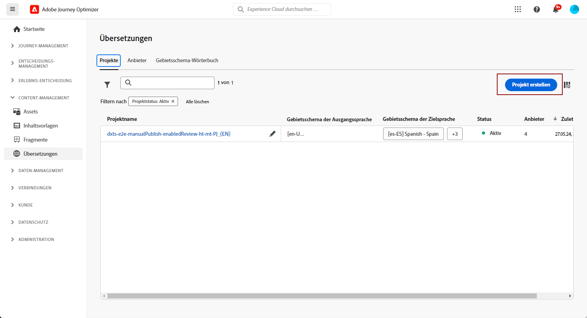
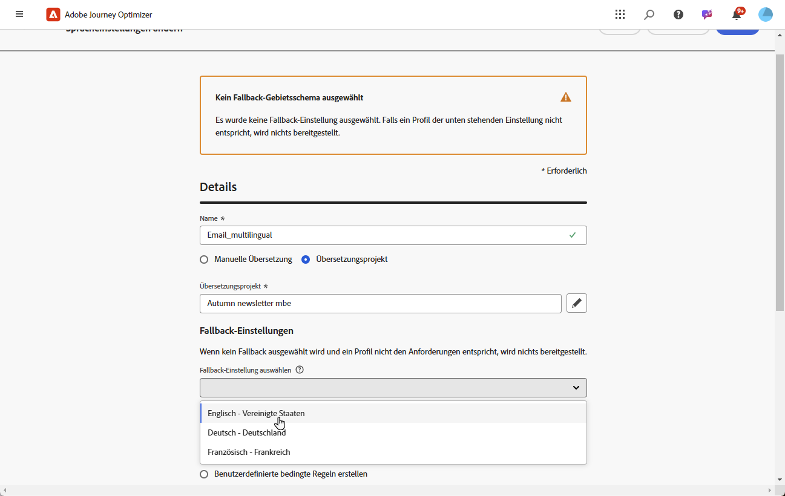

# Erstellen von mehrsprachigen Inhalten mit automatisierter Übersetzung {#multilingual-automated}

>[!BEGINSHADEBOX]

**Inhaltsverzeichnis**

* [Erste Schritte mit mehrsprachigen Inhalten](multilingual-gs.md)
* [Erstellen von mehrsprachigen Inhalten mit manueller Übersetzung](multilingual-manual.md)
* **[Erstellen von mehrsprachigen Inhalten mit automatisierter Übersetzung](multilingual-automated.md)**
* [Mehrsprachiger Kampagnenbericht](multilingual-report.md)

>[!ENDSHADEBOX]

Mithilfe des automatisierten Fluss können Sie einfach Ihre Zielsprache und Ihren Sprachdienstleister auswählen. Ihre Inhalte werden dann direkt an die Übersetzung weitergeleitet, die sie nach der Fertigstellung einer Endkontrolle unterzieht.

Führen Sie die folgenden Schritte aus, um mehrsprachige Inhalte mithilfe der automatisierten Übersetzung zu erstellen:

1. [Erstellen Sie Ihr Gebietsschema](#create-locale).

1. [Erstellen Sie ein Sprachprojekt](#create-translation-project).

1. [Erstellen Sie Spracheinstellungen](#create-language-settings).

1. [Erstellen Sie eine mehrsprachige Kampagne](#create-a-multilingual-campaign).

1. [Überprüfen Sie Ihre Übersetzungsaufgabe (optional)](#review-translation-project).

## Erstellen eines Gebietsschemas {#create-locale}

Wenn bei der Konfiguration der Spracheinstellungen, wie im Abschnitt [Erstellen von Spracheinstellungen](#language-settings) beschrieben, ein bestimmtes Gebietsschema für mehrsprachige Inhalte nicht verfügbar ist, können Sie über das Menü **[!UICONTROL Übersetzung]** beliebig viele Gebietsschemata erstellen.

1. Öffnen Sie im Menü **[!UICONTROL Administration]** die Option **[!UICONTROL Kanal]**.

   Über das Menü „Übersetzungen“ können Sie auf die Liste der aktivierten Gebietsschemata zugreifen.

1. Klicken Sie in der Registerkarte **[!UICONTROL Gebietsschema-Wörterbuch]** auf **[!UICONTROL Gebietsschema hinzufügen]**.

   

1. Wählen Sie Ihren Gebietsschema-Code aus der Liste **[!UICONTROL Sprache]** sowie die zugehörige **[!UICONTROL Region]** aus.

1. Klicken Sie auf **[!UICONTROL Speichern]**, um Ihr Gebietsschema zu erstellen.

   

## Erstellen eines Übersetzungsprojekts {#translation-project}

Starten Sie Ihr Übersetzungsprojekt, indem Sie das Zielgebietsschema angeben und dabei die spezifische Sprache oder Region für Ihren Inhalt angeben. Sie können dann Ihren Übersetzungsanbieter auswählen.

1. Klicken Sie im Menü **[!UICONTROL Übersetzungsprojekte]** unter **[!UICONTROL Content-Management]** auf **[!UICONTROL Projekt erstellen]**.

   

1. Geben Sie einen **[!UICONTROL Namen]** und eine **[!UICONTROL Beschreibung]** ein.

1. Wählen Sie das **[!UICONTROL Gebietsschema der Ausgangssprache]**.

   

1. Wählen Sie aus, ob Sie die folgenden Optionen aktivieren möchten:

   * **[!UICONTROL Genehmigte Übersetzungen automatisch veröffentlichen]**: Sobald Übersetzungen validiert wurden, werden sie automatisch in die Kampagne integriert, ohne dass ein manuelles Eingreifen erforderlich ist.
   * **[!UICONTROL Überprüfungs-Workflow aktivieren]**: Gilt nur für von Menschen übersetzte Gebietsschemata. Dadurch kann eine interne Prüfperson übersetzte Inhalte effizient auswerten und genehmigen oder ablehnen. [Weitere Informationen](#review-translation-project)

1. Klicken Sie auf **[!UICONTROL Gebietsschema hinzufügen]**, um auf das Menü zuzugreifen und die Sprachen für Ihr Übersetzungsprojekt festzulegen.

   Wenn ein **[!UICONTROL Gebietsschema]** fehlt, können Sie es über das Menü **[!UICONTROL Übersetzung]** oder per API manuell im Voraus erstellen. Siehe [Erstellen eines neuen Gebietsschemas](#create-locale).

   

1. Wählen Sie aus der Liste Ihr(e) **[!UICONTROL Zielgebietsschema(ta)]** und den **[!UICONTROL Übersetzungsanbieter]** aus, die Sie für das jeweilige Gebietsschema verwenden möchten.

   **[!UICONTROL Übersetzungsanbieter]** Die Einstellungen können über **[!UICONTROL Übersetzung]** im Menü **[!UICONTROL Administration]** Menüabschnitt.

   >[!NOTE]
   >
   >Die Vertragsverwaltung mit dem Übersetzungsanbieter fällt nicht in den Anwendungsbereich dieser Funktion. Bitte stellen Sie sicher, dass Sie über einen gültigen und aktiven Vertrag mit dem dafür vorgesehenen Übersetzungspartner verfügen.
   >
   > Der Übersetzungsanbieter ist Eigentümer der Qualität der übersetzten Inhalte.

1. Klicken Sie auf **[!UICONTROL Gebietsschema hinzufügen]**, wenn Sie Ihr Zielgebietsschema mit dem richtigen Übersetzungsanbieter verknüpft haben. Klicken Sie dann auf **[!UICONTROL Speichern]**.

   Wenn ein Anbieter für ein Zielgebietsschema ausgegraut ist, bedeutet dies, dass der Anbieter das betreffende Gebietsschema nicht unterstützt.

   

1. Klicken Sie auf **[!UICONTROL Speichern]**, wenn Sie Ihr Übersetzungsprojekt konfiguriert haben.

Ihr Übersetzungsprojekt ist jetzt erstellt und kann in einer mehrsprachigen Kampagne verwendet werden.

## Erstellen von Spracheinstellungen {#language-settings}

In diesem Abschnitt können Sie Ihre Primärsprache und die zugehörigen Gebietsschemata zur Verwaltung Ihrer mehrsprachigen Inhalte festlegen. Sie können auch das Attribut auswählen, mit dem Sie Informationen zur Profilsprache nachschlagen möchten.

1. Öffnen Sie im Menü **[!UICONTROL Administration]** die Option **[!UICONTROL Kanal]**.

1. Klicken Sie im Menü **[!UICONTROL Spracheinstellungen]** auf **[!UICONTROL Spracheinstellungen erstellen]**.

   

1. Geben Sie den Namen Ihrer **[!UICONTROL Spracheinstellungen]** ein.

1. Wählen Sie die Option **[!UICONTROL Übersetzungsprojekt]**.

1. Klicken Sie im Feld **[!UICONTROL Übersetzungsprojekt]** auf **[!UICONTROL Bearbeiten]** und wählen Sie Ihr zuvor erstelltes **[!UICONTROL Übersetzungsprojekt]** aus.

   Ihre zuvor konfigurierten Gebietsschemata werden automatisch importiert.

   

1. Wählen Sie im Menü **[!UICONTROL Versandvoreinstellung]** das Attribut aus, mit dem Sie nach Informationen zu Profilsprachen suchen möchten.

1. Klicken Sie neben Ihrem **[!UICONTROL Gebietsschema]** auf **[!UICONTROL Bearbeiten]**, um es weiter zu personalisieren und **[!UICONTROL Profilvoreinstellungen]** hinzuzufügen.

   

1. Wenn Ihr **[!UICONTROL Übersetzungsprojekt]** aktualisiert wird, klicken Sie auf **[!UICONTROL Aktualisieren]**, um diese Änderungen in Ihren **[!UICONTROL Spracheinstellungen]** zu berücksichtigen.

   

1. Klicken Sie auf **[!UICONTROL Senden]**, um Ihre **[!UICONTROL Spracheinstellungen]** zu erstellen.

<!--
1. Access the **[!UICONTROL Channel surfaces]** menu and create a new channel surface or select an existing one.

1. In the **[!UICONTROL Header parameters]** section, select the **[!UICONTROL Enable multilingual]** option.

1. Select your **[!UICONTROL Locales dictionary]** and add as many as needed.
-->

## Erstellen einer mehrsprachigen Kampagne {#create-multilingual-campaign}

Sobald Sie Ihr Übersetzungsprojekt und Ihre Spracheinstellungen eingerichtet haben, können Sie Ihre Kampagne erstellen und Ihren Inhalt für die verschiedenen Gebietsschemata anpassen.

1. Erstellen und konfigurieren Sie zunächst Ihre E-Mail-, SMS- oder Push-Benachrichtigungs-Kampagne entsprechend Ihren Anforderungen. [Weitere Informationen](../campaigns/create-campaign.md)

1. Sobald Sie Ihre Hauptinhalte erstellt haben, klicken Sie auf **[!UICONTROL Speichern]** und gehen Sie zurück zum Kampagnenkonfigurationsbildschirm.

1. Klicken Sie auf **[!UICONTROL Sprachen hinzufügen]**.  [Weitere Informationen](#create-language-settings)

   

1. Wählen Sie Ihre zuvor erstellten **[!UICONTROL Spracheinstellungen]**.

   

1. Klicken Sie nach dem Import Ihrer Gebietsschemata auf **[!UICONTROL Zur Übersetzung senden]**, um Ihre Inhalte an den zuvor ausgewählten Übersetzungsanbieter weiterzuleiten.

   

1. Nachdem Ihr Inhalt zur Übersetzung gesendet wurde, kann er nicht mehr bearbeitet werden. Um Änderungen am ursprünglichen Inhalt vorzunehmen, klicken Sie auf das Sperrsymbol.

   Beachten Sie, dass Sie, wenn Sie Änderungen an diesem Inhalt vornehmen möchten, ein neues Übersetzungsprojekt erstellen und erneut zur Übersetzung versenden müssen.

   

1. Klicken Sie auf **[!UICONTROL Übersetzung öffnen]**, um auf Ihr Übersetzungsprojekt zuzugreifen und es zu überprüfen.

   

1. Folgen Sie auf dieser Seite dem Status Ihres Übersetzungsprojekts:

   * **[!UICONTROL Übersetzung in Bearbeitung]**: Ihr Dienstleister arbeitet aktiv an der Übersetzung.
   * **[!UICONTROL Bereit zur Überprüfung]**: Der Überprüfungsprozess kann jetzt gestartet werden, sodass Sie auf die Übersetzung zugreifen und sie ablehnen oder genehmigen können.
   * **[!UICONTROL Überprüft]**: Die Übersetzung wurde genehmigt und kann an die Kampagne gesendet werden.
   * **[!UICONTROL Bereit zur Veröffentlichung]**: Die maschinelle Übersetzung wurde abgeschlossen und kann jetzt an Ihre Kampagne gesendet werden.
   * **[!UICONTROL Abgeschlossen]**: Die Übersetzung ist jetzt in Ihrer Kampagne verfügbar.

   

1. Sobald Ihre Übersetzung abgeschlossen ist, können Ihre mehrsprachigen Inhalte gesendet werden.

   

1. Klicken Sie auf **[!UICONTROL Zum Aktivieren überprüfen]**, um eine Zusammenfassung der Kampagne anzuzeigen.

   In der Zusammenfassung können Sie die Kampagne bei Bedarf ändern und überprüfen, ob ein Parameter falsch ist oder fehlt.

1. Durchsuchen Sie Ihre mehrsprachigen Inhalte, um das Rendering in den einzelnen Sprachen anzuzeigen.

   

1. Vergewissern Sie sich, dass Ihre Kampagne korrekt konfiguriert ist, und klicken Sie dann auf **[!UICONTROL Aktivieren]**.

Ihre Kampagne ist jetzt aktiviert. Die in der Kampagne konfigurierte Nachricht wird sofort bzw. zum angegebenen Datum versendet. Beachten Sie, dass Ihre Kampagne nicht mehr geändert werden kann, sobald sie live ist. Um Inhalte wiederzuverwenden, können Sie Ihre Kampagne duplizieren.

Nach dem Versand können Sie die Wirkung Ihrer Kampagnen in den Kampagnenberichten ermitteln.

## Verwalten eines internen Übersetzungsprojekts {#manage-ht-project}

Wenn Sie bei der Konfiguration Ihrer Spracheinstellungen die Option „Interne Übersetzung“ ausgewählt haben, können Sie Ihre Inhalte direkt in Ihrem Übersetzungsprojekt übersetzen.

1. Rufen Sie in Ihrem **[!UICONTROL Übersetzungsprojekt]** das Menü **[!UICONTROL Weitere Aktionen]** auf und wählen Sie **[!UICONTROL Interne Übersetzung]**.

   

1. Sie können Ihre CSV-Datei zur Übersetzung mit externer Übersetzungs-Software exportieren. Alternativ können Sie die CSV-Datei auch wieder in Ihr Übersetzungsprojekt importieren, indem Sie auf die Schaltfläche **[!UICONTROL CSV importieren]** klicken.

   

1. Klicken Sie auf **[!UICONTROL Bearbeiten]**, um den Inhalt Ihrer Übersetzung hinzuzufügen.

   

1. Wenn Sie bereit sind, den übersetzten Text zu veröffentlichen, klicken Sie auf **[!UICONTROL Fertigstellen]**.

## Überprüfen Ihres Übersetzungsprojekts {#review-translation-project}

Wenn Sie in Ihrem **[!UICONTROL Übersetzungsprojekt]** die Option **[!UICONTROL Überprüfungs-Workflow aktivieren]** gewählt haben, können Sie die Übersetzung nach der Fertigstellung durch den von Ihnen gewählten Übersetzungsanbieter direkt in Journey Optimizer überprüfen.

Beachten Sie, dass bei deaktivierter Option der Status der Übersetzungsaufgabe automatisch auf **[!UICONTROL Überprüft]** gesetzt wird, sobald die Übersetzung durch Ihren Anbieter abgeschlossen ist. So können Sie schnell fortfahren, indem Sie auf **[!UICONTROL Veröffentlichen]** klicken.

1. Sobald Ihre Übersetzung von Ihrem Dienstleister fertiggestellt wurde, können Sie die Übersetzung zur Überprüfung über Ihr **[!UICONTROL Übersetzungsprojekt]** oder direkt über Ihre **[!UICONTROL Kampagne]** aufrufen.

   Klicken Sie im Menü **[!UICONTROL Weitere Aktionen]** auf **[!UICONTROL Überprüfen]**.

   

1. Blättern Sie im Überprüfungsfenster durch Ihre übersetzten Inhalte und akzeptieren oder verwerfen Sie die einzelnen Übersetzungszeichenfolgen.

   

1. Klicken Sie auf **[!UICONTROL Bearbeiten]**, um den Inhalt einer Übersetzungszeichenfolge zu ändern.

   

1. Geben Sie Ihre aktualisierte Übersetzung ein und klicken Sie auf **[!UICONTROL Bestätigen]**, wenn Sie fertig sind.

   

1. Sie können auch direkt **[!UICONTROL Alle ablehnen]** oder **[!UICONTROL Alle genehmigen]** wählen.

   Wenn Sie **[!UICONTROL Alle ablehnen]** wählen, fügen Sie einen Kommentar hinzu und klicken Sie auf **[!UICONTROL Ablehnen]**.

1. Klicken Sie auf **[!UICONTROL Vorschau]**, um die Darstellung Ihres übersetzten Inhalts in jeder Sprache zu überprüfen.

1. Wenn Sie bereit sind, den übersetzten Text zu veröffentlichen, klicken Sie auf **[!UICONTROL Fertigstellen]**.

   

1. Wählen Sie in Ihrem **[!UICONTROL Übersetzungsprojekt]** eines Ihrer Projekte aus, um weitere Details aufzurufen. Wenn Sie die Übersetzung abgelehnt haben, können Sie sie zur Übersetzung zurücksenden.

   

1. Sobald Ihr **[!UICONTROL Übersetzungsprojekt]** den Status „Überprüft“ hat, können Sie es an Ihr Campaign senden.

   Klicken Sie im Menü **[!UICONTROL Weitere Aktionen]** auf **[!UICONTROL Veröffentlichen]**.

   

1. Überprüfen Sie in Ihrem Campaign, ob der Übersetzungsstatus in **[!UICONTROL Übersetzung abgeschlossen]** geändert wurde. Sie können jetzt Ihre mehrsprachigen Inhalte senden. Siehe dazu Schritt 10 in [diesem Abschnitt](#create-multilingual-campaign).

   

<!--
# Create a multilingual journey {#create-multilingual-journey}

1. Create your journey with a Delivery and personalize your content as needed.
1. From your delivery action, click Edit content.
1. Click Add languages.

-->
