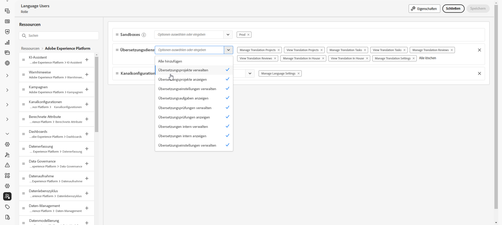
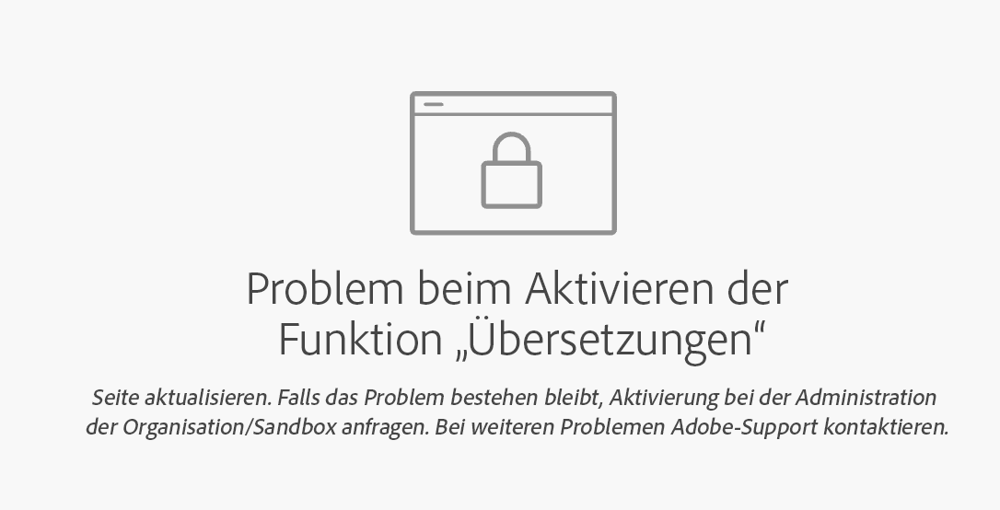

# Erste Schritte mit mehrsprachigen Inhalten {#multilingual-gs}

>[!CONTEXTUALHELP]
>id="ajo_multi_translation_homepage"
>title="Übersetzungen"
>abstract="Mit der Funktion „Mehrsprachig“ können Sie Inhalte in mehreren Sprachen innerhalb einer einzigen Kampagne oder Journey auf einfache Weise erstellen. Auf der Seite „Übersetzungen“ können Sie Projekte einrichten, Übersetzungsanbieter auswählen oder gebietsschemaspezifische Wörterbücher verwalten."

Mit der Mehrsprachen-Funktion können Sie im Rahmen einer Kampagne oder Journey mühelos Inhalte in mehreren Sprachen erstellen. Mit dieser Funktion können Sie bei der Bearbeitung Ihrer Kampagne zwischen Sprachen wechseln, den gesamten Bearbeitungsvorgang optimieren und Ihre mehrsprachigen Inhalte effizienter verwalten.

Mit Journey Optimizer können Sie mehrsprachige Inhalte auf zwei unterschiedliche Arten erstellen:

* **Manuelle Übersetzung**: Übersetzen Sie Ihre Inhalte direkt im E-Mail-Designer oder importieren Sie vorhandene mehrsprachige Inhalte. [Weitere Informationen](multilingual-manual.md)

* **Automatisierte Übersetzung**: Senden Sie Inhalte für die automatisierte Übersetzung an Ihren bevorzugten Sprachdienstleister. [Weitere Informationen](multilingual-automated.md)

 

## Voraussetzungen {#prerequisites}

>[!CONTEXTUALHELP]
>id="ajo_multi_translation_error"
>title="Übersetzungsfehler"
>abstract="Wenn Sie nicht auf die Seite „Übersetzung“ zugreifen können, liegt dies wahrscheinlich daran, dass die Übersetzungsfunktion nicht aktiviert ist. Um dieses Problem zu beheben, müssen Sie sicherstellen, dass die Übersetzungsfunktion von Ihrem Unternehmen und Sandbox-Admin aktiviert wird."

Adobe Journey Optimizer arbeitet derzeit mit Übersetzungsanbietern zusammen, die unabhängig von Adobe Journey Optimizer als Drittanbieter Übersetzungsdienste (maschinelle oder menschliche Übersetzung) anbieten.

Bevor Sie den von Ihnen ausgewählten Übersetzungsanbieter hinzufügen können, müssen Sie ein Konto bei diesem Anbieter erstellen.

Die Nutzung der Übersetzungsdienste von Übersetzungsanbietern unterliegt zusätzlichen Bedingungen des jeweiligen Anbieters.  Die Übersetzungsdienste sind Lösungen von Drittanbietern, die Benutzenden von Adobe Journey Optimizer über eine Integration zur Verfügung stehen.  Adobe hat keine Kontrolle über Produkte von Drittanbietern und ist nicht für diese verantwortlich.

Bei Problemen oder Anfragen zu Ihren Übersetzungen wenden Sie sich bitte an den jeweiligen Übersetzungsanbieter.

Für den mehrsprachigen Inhalt müssen die folgenden Einstellungen definiert werden:

* Um die Übersetzungsfunktion in Journey Optimizer zu verwenden, müssen Sie die API der entsprechenden Rolle zuweisen. [Weitere Informationen](https://experienceleague.adobe.com/de/docs/experience-platform/landing/platform-apis/api-authentication#assign-api-to-a-role)

* Um mit der Erstellung mehrsprachiger Inhalte zu beginnen, muss Benutzenden die Berechtigung **[!UICONTROL Spracheinstellungen verwalten]** gewährt werden. Für einen automatisierten Fluss benötigen Benutzende außerdem Berechtigungen für die Funktion **[!UICONTROL Übersetzungsdienst]**. [Weitere Informationen zu Berechtigungen](../administration/permissions.md)

  +++ Informationen zur Zuweisung von Berechtigungen für mehrsprachige Inhalte

   1. Gehen Sie im Produkt **Berechtigungen** zur Registerkarte **Rollen** und wählen Sie die gewünschte **Rolle** aus.

   1. Klicken Sie auf **Bearbeiten**, um die Berechtigungen zu ändern.

   1. Fügen Sie die Ressource **Übersetzungsdienst** hinzu und wählen Sie dann die entsprechenden Berechtigungen für mehrsprachige Inhalte aus dem Dropdown-Menü aus.

      {zoomable="yes"}

   1. Klicken Sie auf **Speichern**, um die Änderungen anzuwenden.

      Die Berechtigungen aller Benutzenden, die dieser Rolle bereits zugewiesen sind, werden automatisch aktualisiert.

   1. Um diese Rolle neuen Benutzenden zuzuweisen, navigieren Sie im Dashboard **Rollen** zur Registerkarte **Benutzer** und klicken Sie auf **Benutzer hinzufügen**.

   1. Geben Sie den Namen und die E-Mail-Adresse der Benutzerin oder des Benutzers ein oder wählen Sie aus der Liste aus und klicken Sie dann auf **Speichern**.

   1. Wenn die Benutzerin bzw. der Benutzer vorher noch nicht erstellt wurde, lesen Sie [diese Dokumentation](https://experienceleague.adobe.com/de/docs/experience-platform/access-control/abac/permissions-ui/users).

  +++

* Wenn Sie nicht auf die Seite „Übersetzung“ zugreifen können, müssen Sie die Übersetzungsfunktion aktivieren und Ihnen müssen die Berechtigungen für den **[!UICONTROL Übersetzungsdienst]** gewährt werden. [Weitere Informationen](../administration/ootb-permissions.md)

  +++ Erfahren Sie, wie Sie die Übersetzungsfunktion aktivieren

   1. Wenn die folgende Fehlerseite angezeigt wird, deutet dies darauf hin, dass die **[!UICONTROL Übersetzungsfunktion]** noch nicht aktiviert wurde. Wenden Sie sich an die Administratorin oder den Administrator Ihrer Organisation und Sandbox, um Zugriff anzufordern.

  

   1. Ihre Administratorin oder Ihr Administrator muss in der linken Seitenleiste zum Menü **[!UICONTROL Übersetzung]** navigieren.

      Das System aktiviert automatisch die Übersetzungsfunktion.

   1. Sobald die Funktion erfolgreich aktiviert wurde, können Sie auf die Seite **[!UICONTROL Übersetzung]** sowie auf die Registerkarten **[!UICONTROL Projekte]**, **[!UICONTROL Anbieter]** und **[!UICONTROL Gebietsschema]** zugreifen.

   1. Wenn dieses Verfahren fehlgeschlagen ist, wird weiterhin dieselbe Fehlerseite angezeigt. Wenden Sie sich in diesem Fall an Ihren Adobe-Support-Mitarbeiter, um weitere Unterstützung zu erhalten.

  +++

## Anleitungsvideo {#video}

Erfahren Sie, wie Sie im Rahmen einer einzelnen Kampagne oder Journey mühelos Inhalte in mehreren Sprachen erstellen.

>[!VIDEO](https://video.tv.adobe.com/v/3452122?captions=ger)
