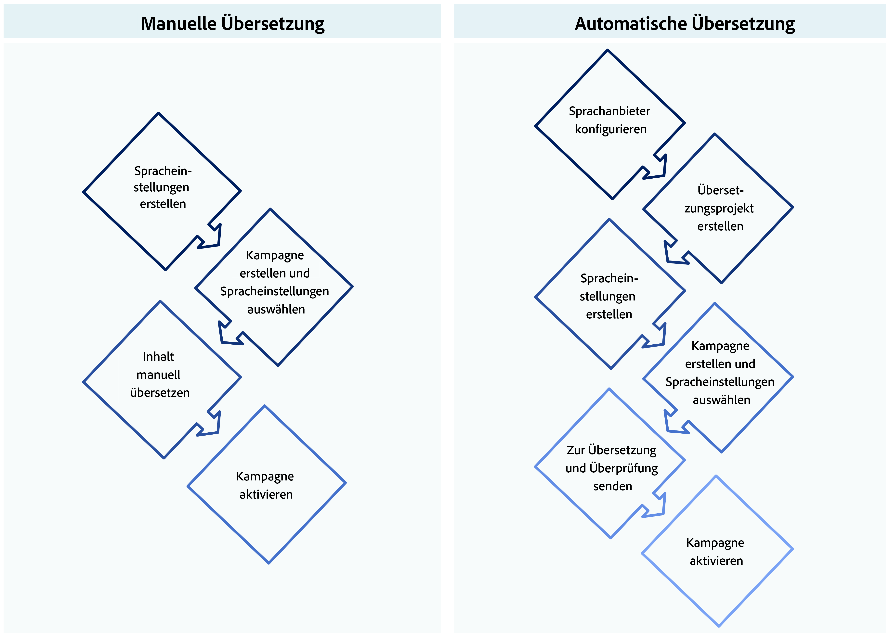

# Erste Schritte mit mehrsprachigen Inhalten {#multilingual-gs}

>[!BEGINSHADEBOX]

**Inhaltsverzeichnis**

* **[Erste Schritte mit mehrsprachigen Inhalten](multilingual-gs.md)**
* [Erstellen von mehrsprachigen Inhalten mit manueller Übersetzung](multilingual-manual.md)
* [Erstellen von mehrsprachigen Inhalten mit automatisierter Übersetzung](multilingual-automated.md)
* [Mehrsprachiger Kampagnenbericht](multilingual-report.md)

>[!ENDSHADEBOX]

Mit der Mehrsprachen-Funktion können Sie im Rahmen einer Kampagne mühelos Inhalte in mehreren Sprachen erstellen. Mit dieser Funktion können Sie bei der Bearbeitung Ihrer Kampagne zwischen Sprachen wechseln, den gesamten Bearbeitungsvorgang optimieren und Ihre mehrsprachigen Inhalte effizienter verwalten.

Mit Journey Optimizer können Sie mehrsprachige Inhalte auf zwei unterschiedliche Arten erstellen:

* **Manuelle Übersetzung**: Übersetzen Sie Ihre Inhalte direkt im E-Mail-Designer oder importieren Sie vorhandene mehrsprachige Inhalte. [Weitere Informationen](multilingual-manual.md)

* **Automatisierte Übersetzung**: Senden Sie Inhalte für die automatisierte Übersetzung an Ihren bevorzugten Sprachdienstleister. [Weitere Informationen](multilingual-automated.md)

 

