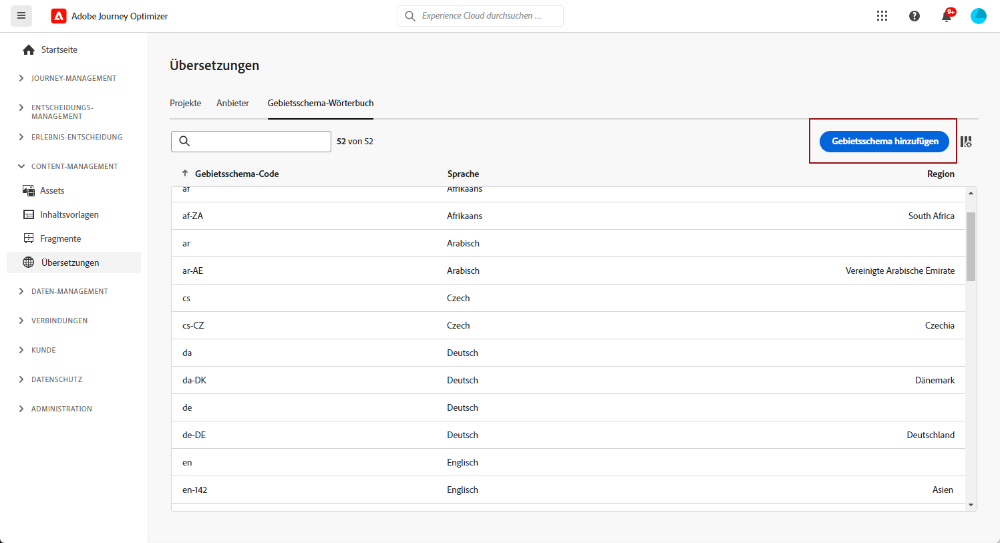

# Erstellen eines Gebietsschemas {#multilingual-locale}

>[!CONTEXTUALHELP]
>id="ajo_multi_add_locale"
>title="Hinzufügen eines Gebietsschemas"
>abstract="Bei der Konfiguration Ihrer Sprachvoreinstellungen haben Sie die Möglichkeit, zusätzliche Gebietsschemata zu erstellen, wenn das gewünschte Gebietsschema nicht für Ihre mehrsprachigen Inhalte verfügbar ist."

Wenn bei der Konfiguration der Spracheinstellungen, wie im Abschnitt [Erstellen von Spracheinstellungen](multilingual-manual.md#language-settings) beschrieben, ein bestimmtes Gebietsschema für mehrsprachige Inhalte nicht verfügbar ist, können Sie über das Menü **[!UICONTROL Übersetzung]** beliebig viele Gebietsschemata erstellen.

1. Greifen Sie im Menü **[!UICONTROL Content Management]** auf **[!UICONTROL Übersetzung]** zu.

1. Klicken Sie in der Registerkarte **[!UICONTROL Gebietsschema-Wörterbuch]** auf **[!UICONTROL Gebietsschema hinzufügen]**.

   

1. Wählen Sie Ihren Gebietsschema-Code aus der Liste **[!UICONTROL Sprache]** sowie die zugehörige **[!UICONTROL Region]** aus.

1. Klicken Sie auf **[!UICONTROL Speichern]**, um Ihr Gebietsschema zu erstellen.

   

