# Erstellen von mehrsprachigen Inhalten mit manueller Übersetzung {#multilingual-manual}

>[!BEGINSHADEBOX]

**Inhaltsverzeichnis**

* [Erste Schritte mit mehrsprachigen Inhalten](multilingual-gs.md)
* **[Erstellen von mehrsprachigen Inhalten mit manueller Übersetzung](multilingual-manual.md)**
* [Erstellen von mehrsprachigen Inhalten mit automatisierter Übersetzung](multilingual-automated.md)
* [Mehrsprachiger Kampagnenbericht](multilingual-report.md)

>[!ENDSHADEBOX]

Mithilfe des manuellen Flusses können Sie Ihren Inhalt mühelos direkt in Ihre E-Mail-, Push-Benachrichtigung- oder SMS-Kampagne übersetzen. So erhalten Sie präzise Steuerungsmöglichkeiten und Anpassungsoptionen für Ihre mehrsprachigen Nachrichten. Darüber hinaus können Sie mit der Option „HTML importieren“ bereits vorhandene mehrsprachige Inhalte ganz einfach importieren.

Führen Sie die folgenden Schritte aus, um mehrsprachige Inhalte mithilfe der manuellen Übersetzung zu erstellen:

1. [Erstellen Sie Ihr Gebietsschema](#create-locale).

1. [Erstellen Sie Spracheinstellungen](#create-language-settings).

1. [Erstellen Sie eine mehrsprachige Kampagne](#create-a-multilingual-campaign).

## Erstellen eines Gebietsschemas {#create-locale}

Wenn bei der Konfiguration der Spracheinstellungen, wie im Abschnitt [Erstellen von Spracheinstellungen](#language-settings) beschrieben, ein bestimmtes Gebietsschema für mehrsprachige Inhalte nicht verfügbar ist, können Sie über das Menü **[!UICONTROL Übersetzung]** beliebig viele Gebietsschemata erstellen.

1. Öffnen Sie im Menü **[!UICONTROL Administration]** die Option **[!UICONTROL Kanal]**.

   Über das Menü „Übersetzungen“ können Sie auf die Liste der aktivierten Gebietsschemata zugreifen.

1. Klicken Sie in der Registerkarte **[!UICONTROL Gebietsschema-Wörterbuch]** auf **[!UICONTROL Gebietsschema hinzufügen]**.

   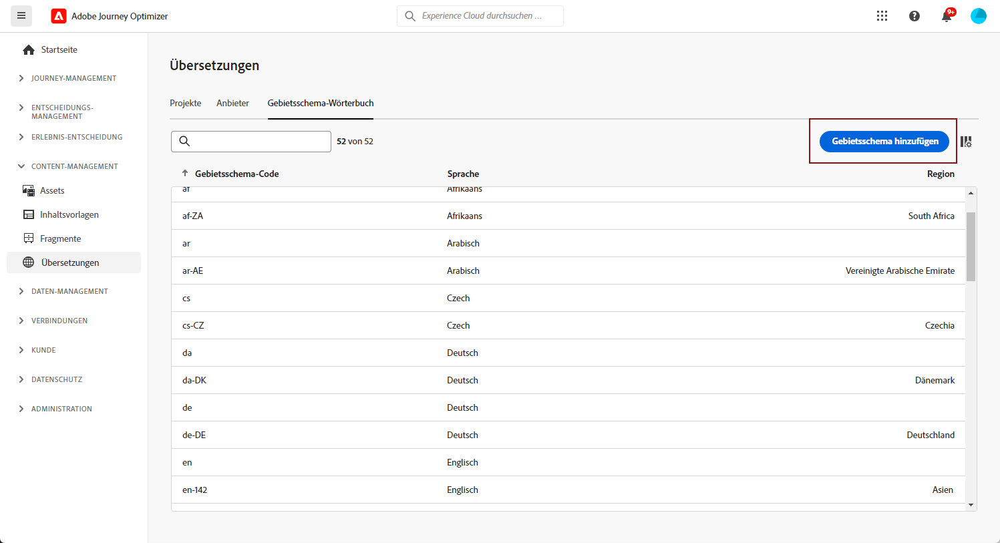

1. Wählen Sie Ihren Gebietsschema-Code aus der Liste **[!UICONTROL Sprache]** sowie die zugehörige **[!UICONTROL Region]** aus.

1. Klicken Sie auf **[!UICONTROL Speichern]**, um Ihr Gebietsschema zu erstellen.

   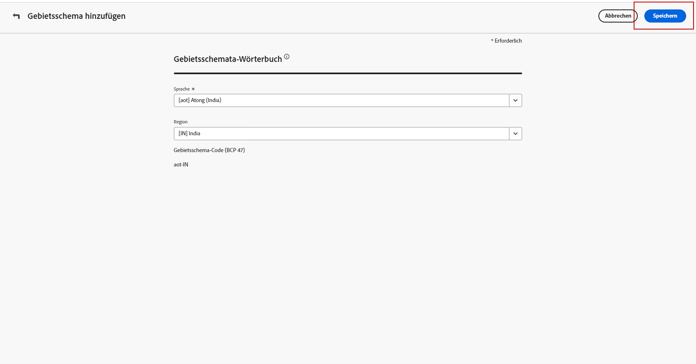

## Erstellen von Spracheinstellungen {#language-settings}

In diesem Abschnitt können Sie Ihre Primärsprache und die zugehörigen Gebietsschemata zur Verwaltung Ihrer mehrsprachigen Inhalte festlegen. Sie können auch das Attribut auswählen, mit dem Sie nach Informationen zur Profilsprache suchen möchten

1. Öffnen Sie im Menü **[!UICONTROL Administration]** die Option **[!UICONTROL Kanal]**.

1. Klicken Sie im Menü **[!UICONTROL Spracheinstellungen]** auf **[!UICONTROL Spracheinstellungen erstellen]**.

   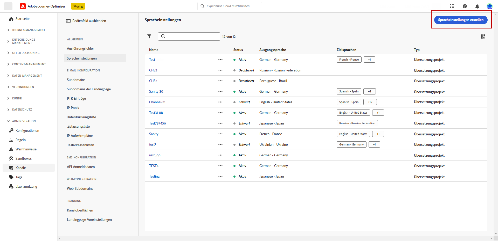

1. Geben Sie den Namen Ihrer **[!UICONTROL Spracheinstellungen]** ein.

1. Wählen Sie die mit diesen Einstellungen verknüpften **[!UICONTROL Gebietsschemata]**. Sie können maximal 50 Gebietsschemata hinzufügen.

   Wenn ein **[!UICONTROL Gebietsschema]** fehlt, können Sie es über das Menü **[!UICONTROL Übersetzung]** oder per API manuell im Voraus erstellen. Siehe [Erstellen eines neuen Gebietsschemas](#create-locale).

   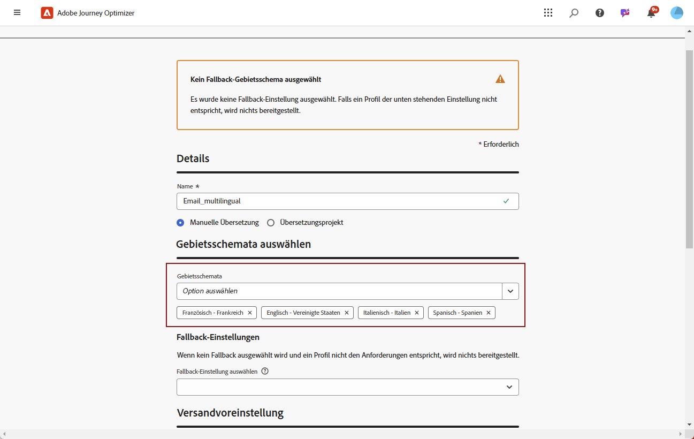

1. Wählen Sie im Menü **[!UICONTROL Versandvoreinstellung]** das Attribut aus, mit dem Sie nach Informationen zu Profilsprachen suchen möchten.

   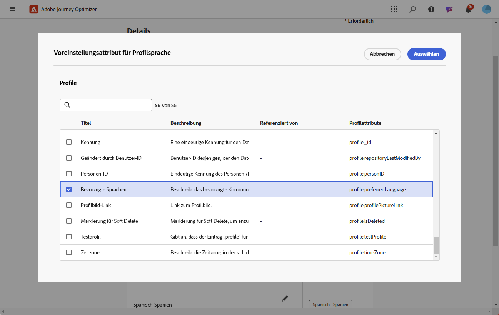

1. Klicken Sie neben Ihrem **[!UICONTROL Gebietsschema]** auf **[!UICONTROL Bearbeiten]**, um es weiter zu personalisieren und **[!UICONTROL Profilvoreinstellungen]** hinzuzufügen.

   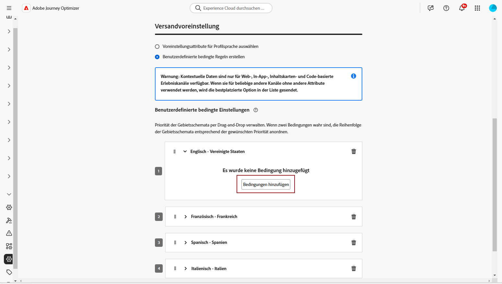

1. Wählen Sie andere **[!UICONTROL Gebietsschemata]** aus der Dropdown-Liste „Profileinstellungen“ und klicken Sie auf **[!UICONTROL Profile hinzufügen]**.

1. Öffnen Sie das erweiterte Menü Ihres **[!UICONTROL Gebietsschemas]**, um Ihr **[!UICONTROL primäres Gebietsschema]** festzulegen, d. h. die Standardsprache, wenn das Profilattribut nicht angegeben ist.

   Sie können Ihr Gebietsschema über dieses erweiterte Menü auch löschen.

   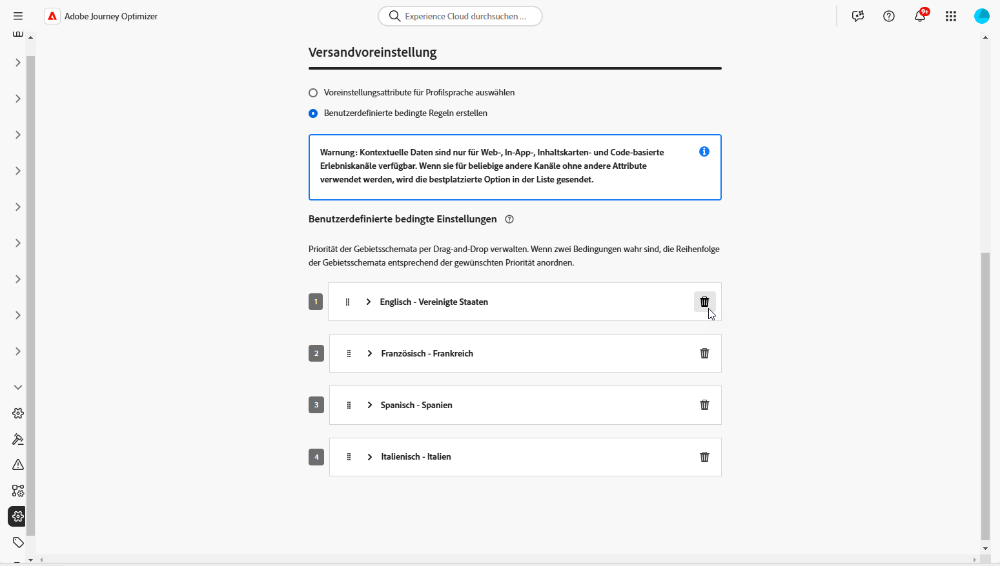

1. Klicken Sie auf **[!UICONTROL Senden]**, um Ihre **[!UICONTROL Spracheinstellungen]** zu erstellen.

<!--
1. Access the **[!UICONTROL Channel surfaces]** menu and create a new channel surface or select an existing one.

1. In the **[!UICONTROL Header parameters]** section, select the **[!UICONTROL Enable multilingual]** option.

1. Select your **[!UICONTROL Locales dictionary]** and add as many as needed.
-->

## Erstellen einer mehrsprachigen Kampagne {#create-multilingual-campaign}

Nach der Einrichtung Ihres mehrsprachigen Inhalts können Sie Ihre Kampagne gestalten und den Inhalt für jedes Ihrer ausgewählten Gebietsschemata anpassen.

1. Erstellen und konfigurieren Sie zunächst Ihre E-Mail-, SMS- oder Push-Benachrichtigungs-Kampagne entsprechend Ihren Anforderungen. [Weitere Informationen](../campaigns/create-campaign.md)

1. Wählen Sie im Menü **[!UICONTROL Aktionen]** die Option **[!UICONTROL Inhalt bearbeiten]**.

   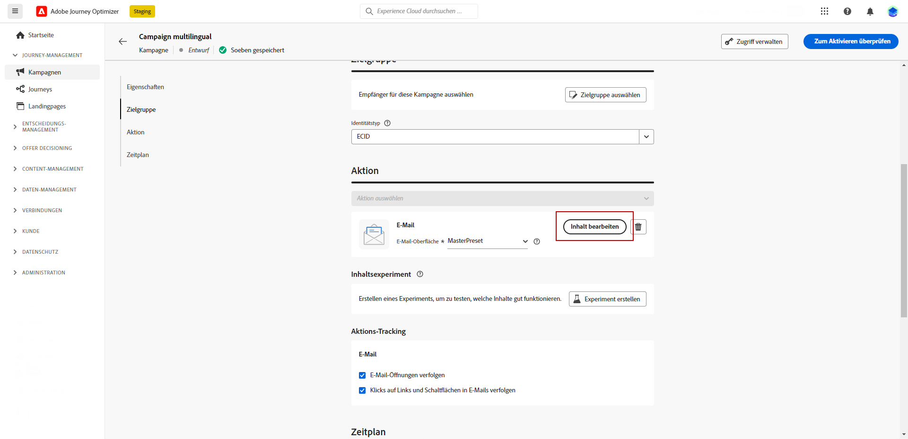

1. Erstellen oder importieren Sie Ihren ursprünglichen Inhalt und personalisieren Sie ihn nach Bedarf.

1. Nachdem der Hauptinhalt erstellt wurde, klicken Sie auf **[!UICONTROL Speichern]** und gehen Sie zurück zum Kampagnenkonfigurationsbildschirm.

   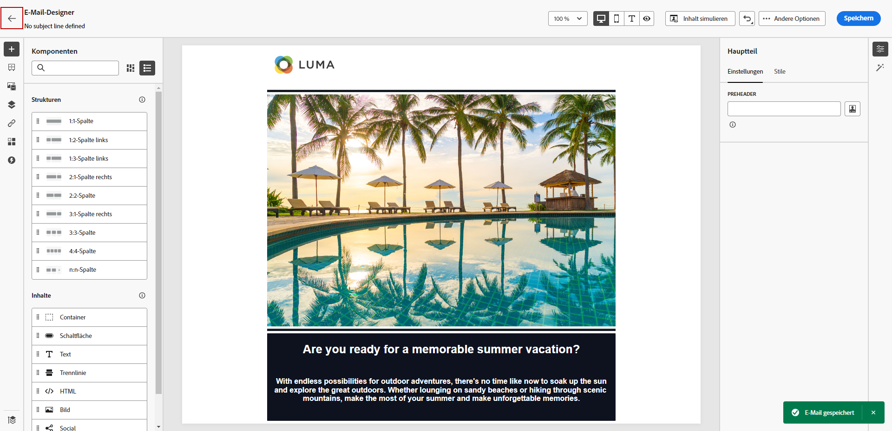

1. Klicken Sie auf **[!UICONTROL Sprachen hinzufügen]** und wählen Sie Ihre zuvor erstellten **[!UICONTROL Spracheinstellungen]** aus. [Weitere Informationen](#create-language-settings)

   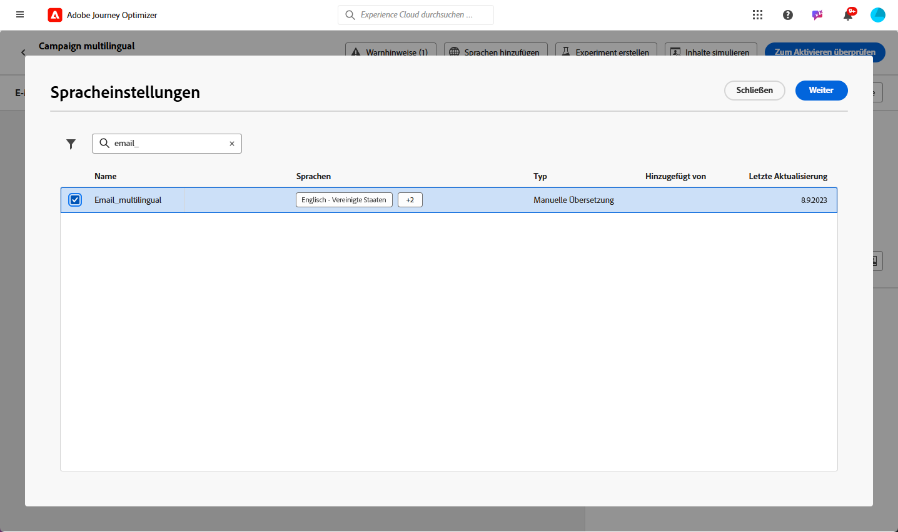

1. Öffnen Sie die erweiterten Einstellungen des Menüs **[!UICONTROL Gebietsschemata]** und wählen Sie **[!UICONTROL Hauptinhalt in alle Gebietsschemata kopieren]**.

   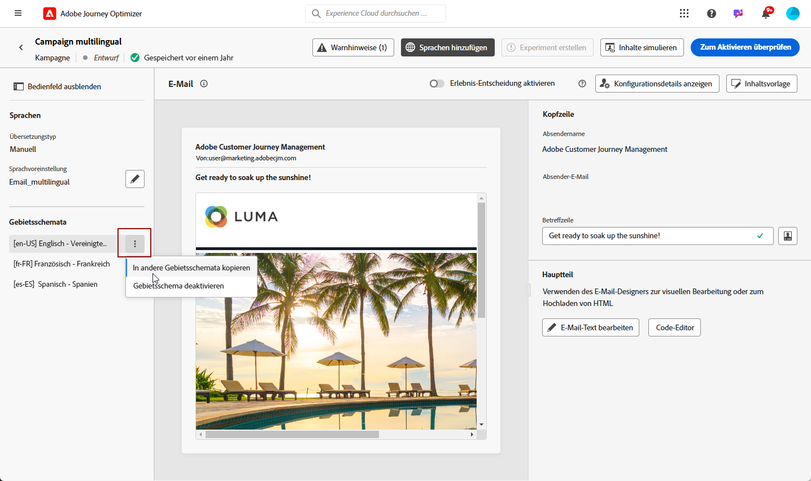

1. Nachdem Sie Ihren Hauptinhalt in alle ausgewählten **[!UICONTROL Gebietsschemata]**, dupliziert haben, öffnen Sie die einzelnen Gebietsschemata und klicken Sie auf **[!UICONTROL E-Mail-Text bearbeiten]**, um Ihren Inhalt zu übersetzen.

   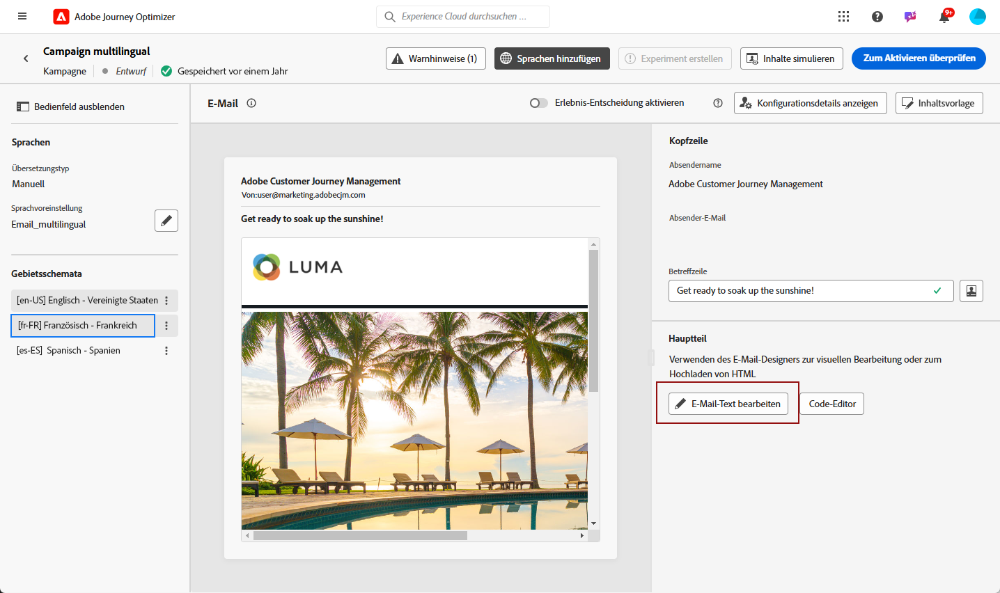

1. Sie können Gebietsschemata über das Menü **[!UICONTROL Weitere Aktionen]** des ausgewählten Gebietsschemas aktivieren und deaktivieren.

   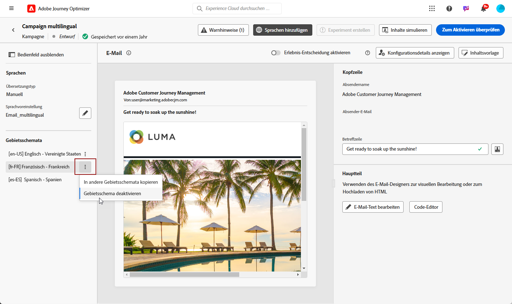

1. Um Ihre mehrsprachige Konfiguration zu deaktivieren, klicken Sie auf **[!UICONTROL Sprachen hinzufügen]** und wählen Sie die Sprache aus, die Sie als Landessprache beibehalten möchten.

   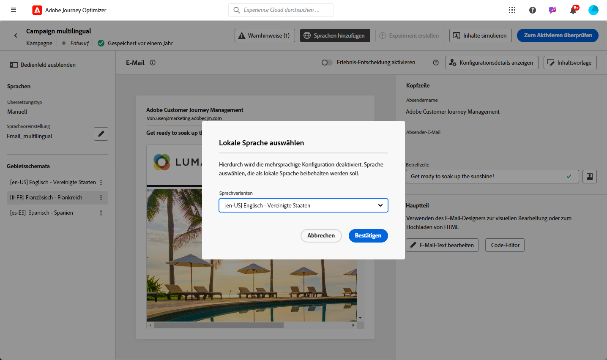

1. Klicken Sie auf **[!UICONTROL Zum Aktivieren überprüfen]**, um eine Zusammenfassung der Kampagne anzuzeigen.

   In der Zusammenfassung können Sie die Kampagne bei Bedarf ändern und überprüfen, ob ein Parameter falsch ist oder fehlt.

1. Durchsuchen Sie Ihre mehrsprachigen Inhalte, um das Rendering in den einzelnen Sprachen anzuzeigen.

   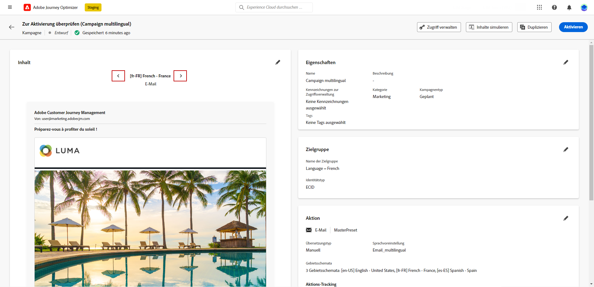

1. Vergewissern Sie sich, dass Ihre Kampagne korrekt konfiguriert ist, und klicken Sie dann auf **[!UICONTROL Aktivieren]**.

Ihre Kampagne ist jetzt aktiviert. Die in der Kampagne konfigurierte Nachricht wird sofort bzw. zum angegebenen Datum versendet. Beachten Sie, dass Ihre Kampagne nicht mehr geändert werden kann, sobald sie live ist. Um Inhalte wiederzuverwenden, können Sie Ihre Kampagne duplizieren.

Nach dem Versand können Sie die Wirkung Ihrer Kampagnen in den Kampagnenberichten ermitteln.

<!--
# Create a multilingual journey {#create-multilingual-journey}

1. Create your journey with a Delivery and personalize your content as needed.
1. From your delivery action, click Edit content.
1. Click Add languages.

-->
