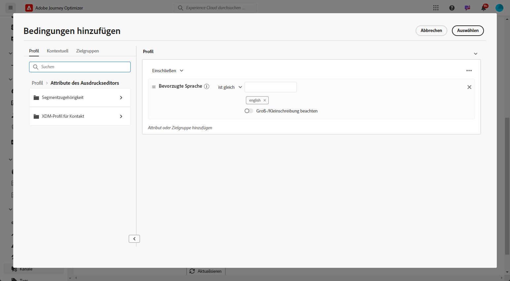

# Erstellen von mehrsprachigen Inhalten mit manueller Übersetzung {#multilingual-manual}

>[!IMPORTANT]
>
>Für den manuellen Fluss muss Benutzenden die Berechtigung **[!UICONTROL Spracheinstellungen verwalten]** gewährt werden.

Mithilfe des manuellen Flusses können Sie Inhalte mühelos direkt in Ihren Kampagnen und Journeys übersetzen. So erhalten Sie präzise Steuerungsmöglichkeiten und Anpassungsoptionen für Ihre mehrsprachigen Nachrichten. Darüber hinaus können Sie mit der Option „HTML importieren“ bereits vorhandene mehrsprachige Inhalte ganz einfach importieren.

Führen Sie die folgenden Schritte aus, um mehrsprachige Inhalte mithilfe der manuellen Übersetzung zu erstellen:

1. [Fügen Sie Ihren Anbieter hinzu (optional).](multilingual-provider.md)

1. [Fügen Sie Gebietsschemata hinzu (optional).](multilingual-locale.md)

1. [Erstellen Sie Spracheinstellungen.](#language-settings)

1. [Erstellen Sie einen mehrsprachigen Inhalt.](#create-multilingual-campaign)

## Erstellen Sie Spracheinstellungen. {#language-settings}

In diesem Abschnitt können Sie verschiedene Gebietsschemata zur Verwaltung Ihrer mehrsprachigen Inhalte festlegen. Sie können auch das Attribut auswählen, mit dem Sie nach Informationen zur Profilsprache suchen möchten

1. Öffnen Sie im Menü **[!UICONTROL Administration]** die Option **[!UICONTROL Kanal]** > **[!UICONTROL Allgemeine Einstellungen]**.

1. Klicken Sie im Menü **[!UICONTROL Spracheinstellungen]** auf **[!UICONTROL Spracheinstellungen erstellen]**.

   

1. Geben Sie den Namen Ihrer **[!UICONTROL Spracheinstellungen]** ein und wählen Sie **[!UICONTROL Manuelle Übersetzung]** aus.

1. Wählen Sie die mit diesen Einstellungen verknüpften **[!UICONTROL Gebietsschemata]**. Sie können maximal 50 Gebietsschemata hinzufügen.

   Wenn ein **[!UICONTROL Gebietsschema]** fehlt, können Sie es über das Menü **[!UICONTROL Übersetzung]** oder per API manuell im Voraus erstellen. Siehe [Erstellen eines neuen Gebietsschemas](multilingual-locale.md).

   

1. Wählen Sie eine **[!UICONTROL Fallback-Einstellung]** aus, um eine Backup-Option für den Fall zu definieren, dass ein Profil die für die Inhaltsbereitstellung erforderlichen Kriterien nicht erfüllt.

   Beachten Sie, dass die Kampagne oder Journey nicht gesendet wird, wenn keine Fallback-Option ausgewählt ist.

1. Wählen Sie Ihre Versandvoreinstellung aus den folgenden Optionen aus:

   * **[!UICONTROL Voreinstellungsattribute für Profilsprache auswählen]**
   * **[!UICONTROL Benutzerdefinierte bedingte Regeln erstellen]**

1. Wenn Sie **[!UICONTROL Voreinstellungsattribute für Profilsprache auswählen]** auswählen, wählen Sie das relevante Attribut über das Menü **[!UICONTROL Voreinstellungsattribute für Profilsprache]** aus, um nach Informationen zur Profilsprache zu suchen.

   

1. Wenn Sie **[!UICONTROL Benutzerdefinierte bedingte Regeln erstellen]** auswählen, wählen Sie das Gebietsschema aus, für das Sie Bedingungen erstellen möchten. Erstellen Sie anschließend Regeln basierend auf Faktoren wie Benutzerstandort, Sprachvoreinstellungen oder anderen kontextbezogenen Elementen.

   

1. Beginnen Sie mit der Erstellung von Bedingungen, indem Sie ein Attribut, ein Ereignis oder eine Zielgruppe hinzufügen, um Ihre Zielgruppe zu definieren.

   >[!IMPORTANT]
   >
   >Kontextbezogene Daten sind ausschließlich für die Kanäle „Web“, „In-App“, „Code-basiertes Erlebnis“ und „Inhaltskarten“ verfügbar. Wenn die Kampagne bzw. die Journey ohne zusätzliche Attribute für die Kanäle „E-Mail“, „SMS“, „Push-Benachrichtigung“ oder „Direkt-Mail“ verwendet, wird sie in der Sprache der ersten Option in der Liste versendet.

   

   +++Voraussetzungen für die Verwendung kontextueller Ereignisse in Ihren Bedingungen

   Wenn Benutzende Ihren Inhalt anzeigen, wird eine Personalisierungsanfrage zusammen mit dem Erlebnisereignis gesendet. Um kontextbezogene Daten in Ihren Bedingungen zu nutzen, müssen Sie zusätzliche Daten an die Payload der Personalisierungsanfrage anhängen. Dafür müssen Sie eine Regel in der Datenerfassung in Adobe Experience Platform erstellen, um Folgendes anzugeben: WENN eine Personalisierungsanfrage gesendet wird, DANN werden der Anfrage zusätzliche Daten hinzugefügt, die das Attribut so definieren, dass es mit dem Sprachfeld in Ihrem Schema übereinstimmt.

   >[!NOTE]
   >
   >Diese Voraussetzungen sind nur für die Kanäle „In-App“ und „Inhaltskarten“ erforderlich.

   1. Rufen Sie in der Datenerfassung in Adobe Experience Platform das Menü **[!UICONTROL Regeln]** auf und erstellen Sie eine neue Regel. Ausführliche Informationen zum Erstellen von Regeln finden Sie in der [!DNL Adobe Experience Platform] [Datenerfassungsdokumentation](https://experienceleague.adobe.com/de/docs/experience-platform/collection/e2e#create-a-rule){target="_blank"}

   2. Fügen Sie im Abschnitt **[!UICONTROL WENN]** der Regel ein Ereignis hinzu, das wie folgt konfiguriert wurde:

      

      * Wählen Sie die **[!UICONTROL Erweiterung]** aus, mit der Sie arbeiten.
      * Wählen Sie im Feld **[!UICONTROL Ereignistyp]** die Option „AEP-Anfrageereignis“ aus.
      * Wählen Sie im rechten Bereich „XDM-Ereignistyp entspricht Personalisierungsanfrage“ aus.
      * Klicken Sie zur Bestätigung auf die Schaltfläche **[!UICONTROL Änderungen beibehalten]**.

   3. Fügen Sie im Abschnitt **[!UICONTROL DANN]** der Regel eine Aktion hinzu, die wie folgt konfiguriert wurde:

      

      * Wählen Sie die **[!UICONTROL Erweiterung]** aus, mit der Sie arbeiten.
      * Wählen Sie im Feld **[!UICONTROL Aktionstyp]** die Option „Daten anhängen“ aus.
      * Stellen Sie im Abschnitt „JSON-Payload“ sicher, dass das Attribut, mit dem die zu verwendende Sprache abgerufen wird (im Beispiel unter „Sprache“), mit dem Namen des Attributs übereinstimmt, das in dem Schema angegeben ist, in das der Datenstrom Ihrer Datenerfassung fließt.

        ```JSON
        {
            "xdm":{
                "application":{
                    "_dc":{
                        "language":"{%%Language%%}"
                    }
                }
            }
        }
        ```

      * Klicken Sie auf die Schaltfläche **[!UICONTROL Änderungen beibehalten]**, um Ihre Regel zu bestätigen und zu speichern.

   +++

1. Verschieben Sie die Gebietsschemata per Drag-and-Drop in der Liste, um sie neu anzuordnen und ihre Priorität zu verwalten.

1. Klicken Sie zum Löschen eines Gebietsschemas auf das Papierkorbsymbol.

   

1. Klicken Sie auf **[!UICONTROL Senden]**, um Ihre **[!UICONTROL Spracheinstellungen]** zu erstellen.

Beachten Sie, dass Sie nach der Einrichtung Ihrer Sprachvoreinstellungen nicht mehr die Möglichkeit haben, diese zu bearbeiten.

<!--
1. Access the **[!UICONTROL channel configurations]** menu and create a new channel configuration or select an existing one.


1. In the **[!UICONTROL Header parameters]** section, select the **[!UICONTROL Enable multilingual]** option.

1. Select your **[!UICONTROL Locales dictionary]** and add as many as needed.
-->

## Erstellen Sie einen mehrsprachigen Inhalt. {#create-multilingual-campaign}

Nach der Einrichtung Ihrer mehrsprachigen Inhalte können Sie Ihre Kampagne oder Journey gestalten und die Inhalte für jedes Ihrer ausgewählten Gebietsschemata anpassen.

1. Erstellen und konfigurieren Sie zunächst Ihre E-Mail-, SMS- oder Push-Benachrichtigungs-[Kampagne](../campaigns/create-campaign.md) oder [Journey](../building-journeys/journey-action.md) entsprechend Ihren Anforderungen.

   >[!IMPORTANT]
   >
   >Wir empfehlen, pro Journey nur ein Übersetzungsprojekt einzuschließen.

1. Erstellen oder importieren Sie Ihren ursprünglichen Inhalt und personalisieren Sie ihn nach Bedarf.

1. Sobald Sie Ihre Inhalte erstellt haben, klicken Sie auf **[!UICONTROL Speichern]** und gehen Sie zurück zum Bildschirm der Kampagnenkonfiguration.

   

1. Klicken Sie auf **[!UICONTROL Sprachen hinzufügen]** und wählen Sie Ihre zuvor erstellten **[!UICONTROL Spracheinstellungen]** aus. [Weitere Informationen](#language-settings)

   

1. Wählen Sie aus dem Dropdown-Menü das gewünschte Gebietsschema aus, das auf den vorhandenen erstellten Inhalt angewendet werden soll.

1. Öffnen Sie die erweiterten Einstellungen des Menüs **[!UICONTROL Gebietsschemata]** und wählen Sie **[!UICONTROL In alle Gebietsschemata kopieren]**.

   

1. Nachdem Sie Ihren Inhalt in allen ausgewählten **[!UICONTROL Gebietsschemata]** dupliziert haben, öffnen Sie jedes einzelne Gebietsschema und klicken Sie auf **[!UICONTROL E-Mail-Text bearbeiten]**, um Ihren Inhalt zu übersetzen.

   

1. Sie können Gebietsschemata über das Menü **[!UICONTROL Weitere Aktionen]** des ausgewählten Gebietsschemas aktivieren und deaktivieren.

   

1. Um Ihre mehrsprachige Konfiguration zu deaktivieren, klicken Sie auf **[!UICONTROL Sprachen hinzufügen]** und wählen Sie die Sprache aus, die Sie als Landessprache beibehalten möchten.

   

1. Klicken Sie auf **[!UICONTROL Zum Aktivieren überprüfen]**, um eine Zusammenfassung der Kampagne anzuzeigen.

   In der Zusammenfassung können Sie die Kampagne bei Bedarf ändern und überprüfen, ob ein Parameter falsch ist oder fehlt.

1. Durchsuchen Sie Ihre mehrsprachigen Inhalte, um das Rendering in den einzelnen Sprachen anzuzeigen.

   

Jetzt können Sie Ihre Kampagne oder Journey aktivieren. Nach dem Versand können Sie die Wirkung Ihrer mehrsprachigen Journey oder Kampagnen in den Berichten ermitteln.

>[!IMPORTANT]
>
> Wenn Ihre Kampagne einer Genehmigungsrichtlinie unterliegt, müssen Sie eine Genehmigung anfordern, um Ihre mehrsprachige Kampagne oder Journey senden zu können. [Weitere Informationen](../test-approve/gs-approval.md)

<!--
# Create a multilingual journey {#create-multilingual-journey}

1. Create your journey with a Delivery and personalize your content as needed.
1. From your delivery action, click Edit content.
1. Click Add languages.

-->
