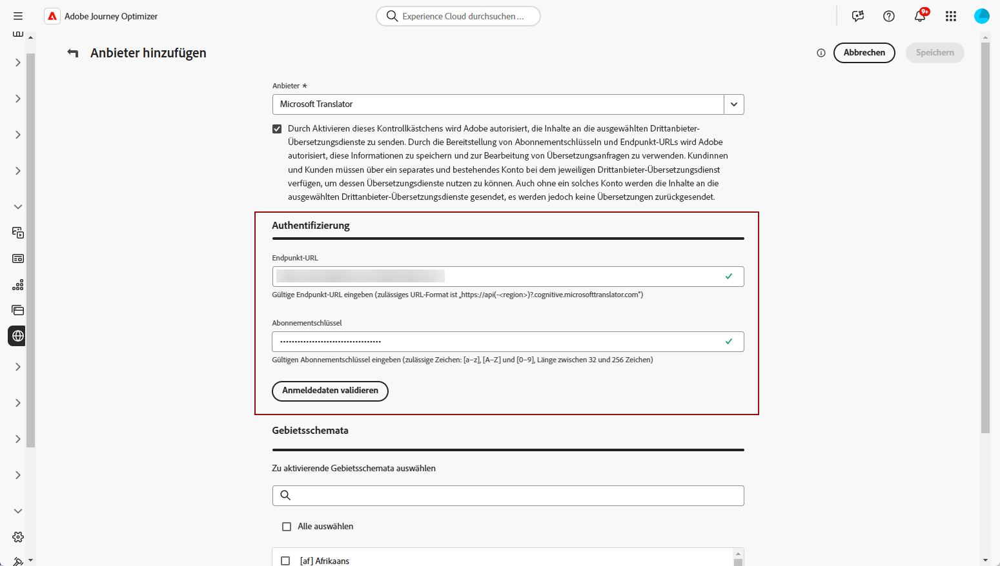

# Hinzufügen von Sprachdienstleistern {#multilingual-provider}

>[!IMPORTANT]
>
> Die Nutzung der Übersetzungsdienste von Übersetzungsanbietern unterliegt zusätzlichen Bedingungen des jeweiligen Anbieters. Übersetzungsdienste stehen den Benutzenden von Adobe Journey Optimizer als Lösungen von Drittanbietern über eine Integration zur Verfügung. Adobe kontrolliert keine Produkte von Drittanbietern und ist nicht für diese verantwortlich.

Adobe Journey Optimizer lässt sich mit Drittanbietern für Übersetzungen integrieren, die unabhängig von Adobe Journey Optimizer von Machine Translation-Übersetzungsdienste sowie Übersetzungsdienste von menschlichen Übersetzern anbieten.

Stellen Sie vor dem Hinzufügen Ihres ausgewählten Übersetzungsanbieters sicher, dass Sie ein Konto beim jeweiligen Anbieter erstellt haben.

1. Navigieren Sie im Menü **[!UICONTROL Content-Management]** zu **[!UICONTROL Übersetzung]**.

1. Greifen Sie auf die Registerkarte **[!UICONTROL Anbieter]** zu und klicken Sie auf **[!UICONTROL Anbieter hinzufügen]**.

   

1. Wählen Sie in der Dropdown-Liste **[!UICONTROL Anbieter]** den gewünschten Anbieter aus.

   >[!NOTE]
   >
   >Wenn Sie der Liste einen neuen **Anbieter** hinzufügen möchten, können Sie Ihren **Anbieter** bitten, die in [diesem Dokument](https://developer.adobe.com/gcs/partner/) beschriebenen Anweisungen zu befolgen, um das Onboarding abzuschließen.

   

1. Wenn Sie Microsoft Translator als Anbieter verwenden, geben Sie Ihren **[!UICONTROL Abonnementschlüssel]** und Ihre **[!UICONTROL Endpunkt-URL]** ein.

   

1. Wählen Sie die entsprechenden **unterstützten Gebietsschemata** aus.

   

1. Klicken Sie nach Abschluss der Konfiguration auf **[!UICONTROL Speichern]**, um die Einrichtung abzuschließen.
