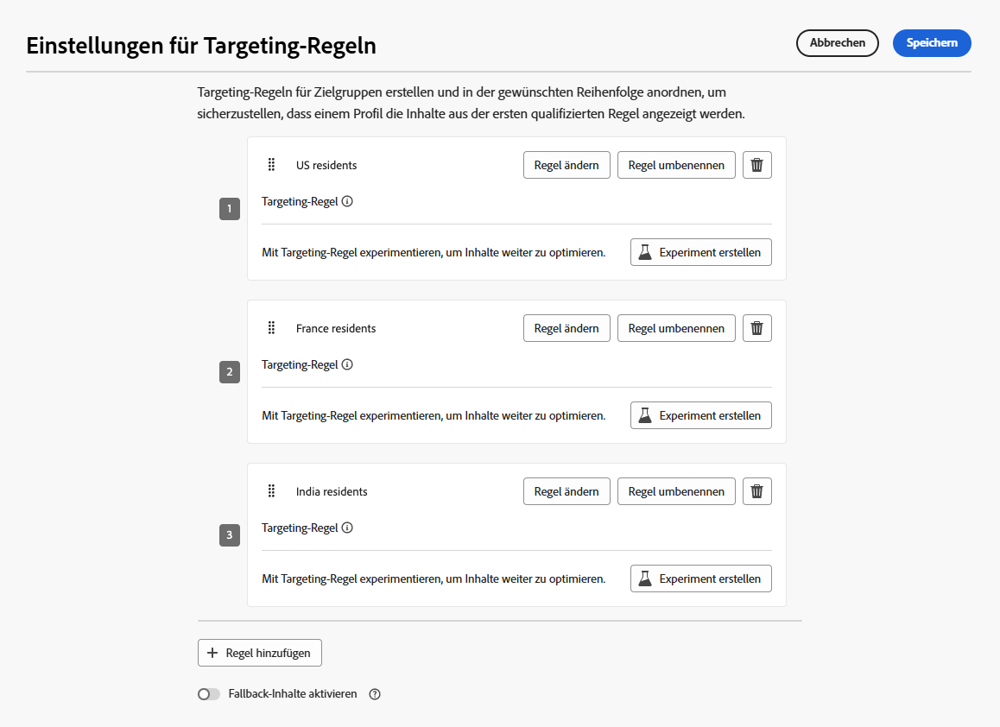
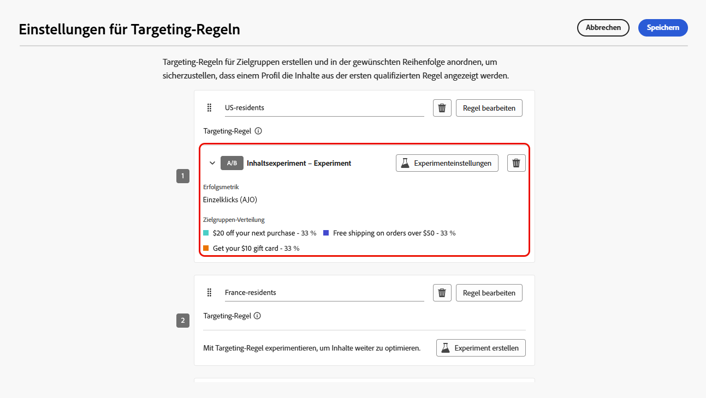
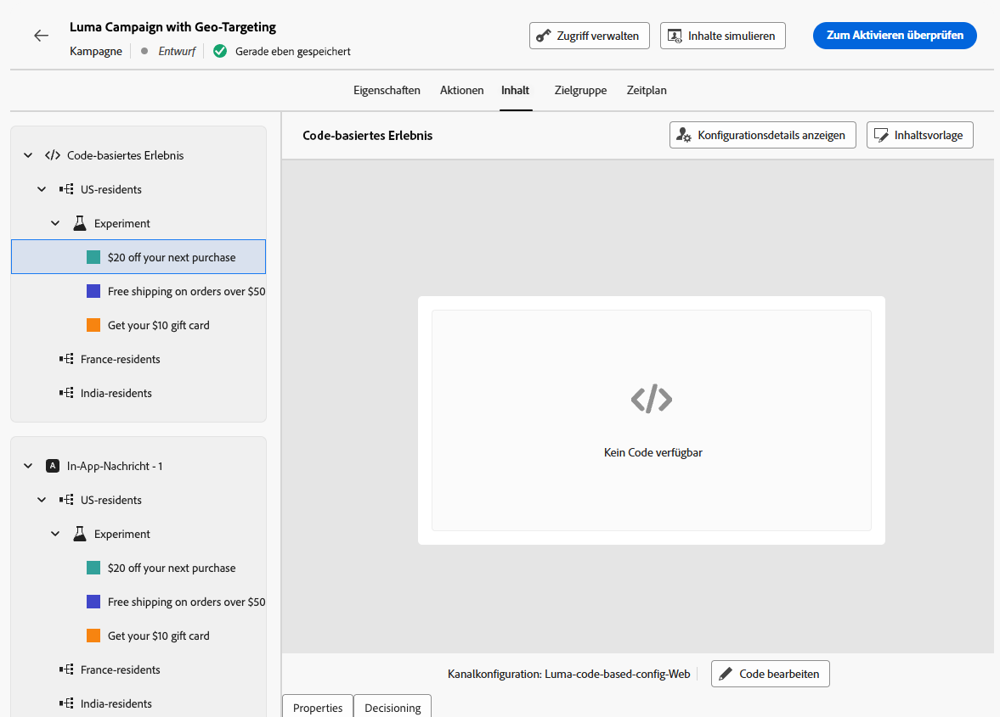

# Kombinieren von Targeting und Experimenten {#combination}

Mit Journey Optimizer können Sie auch Targeting und Experimente innerhalb einer einzigen Journey oder Kampagne kombinieren, um komplexere Strategien zu entwickeln.

Sie können Targeting nutzen, um verschiedene Varianten einzurichten, und für jede Variante Experimente verwenden, um die jeweiligen Inhalte weiter zu optimieren. Dadurch wird sichergestellt, dass Experimente spezifisch für jede Targeting-Regel sind und nicht verschiedene Varianten umfassen.

Sie können beispielsweise eine „Promotion mit 50 % Rabatt“ gegenüber einer „Geschenkkarte im Wert von 50 Dollar“ für Kundschaft in den USA testen und für Kundschaft in Europa einen anderen Test durchführen, z. B. „kostenloser Versand bei Bestellungen über 50 €“ gegenüber „20 % Rabatt auf ihren nächsten Kauf“.

Gehen Sie wie folgt vor, um Targeting und Experimente in einer Journey oder Kampagne zu kombinieren.

1. Erstellen Sie eine Journey oder eine Kampagne, in der Sie mehrere Targeting-Regeln definieren. [Weitere Informationen](optimization-targeting.md)

   {width=85%}

1. Erstellen Sie ein Experiment für die erste Targeting-Regel.

1. Entwerfen und konfigurieren Sie Ihr Inhaltsexperiment nach Bedarf. [Weitere Informationen](../content-management/content-experiment.md)

   {width=85%}

   Sobald das Experiment definiert ist, gilt es nur für die erste Targeting-Regel.

1. Kehren Sie zur Registerkarte **[!UICONTROL Aktionen]** zurück und wählen Sie **[!UICONTROL Inhalt bearbeiten]**.

1. Für die Gruppe, die in Ihrer ersten Targeting-Regel definiert ist, können Sie für jede Variante Ihres Experiments einen bestimmten Inhalt definieren.

   Wenn Sie Ihrer Journey oder Kampagne mehr als eine eingehende Aktion hinzugefügt haben, gilt für jede Aktion dieselbe Kombination aus Targeting und Experiment. Sie müssen jedoch für jede Variante von jeder Aktion einen spezifischen Inhalt definieren.

   {width=85%}

1. Gehen Sie für die anderen Targeting-Regeln genauso vor und entwerfen Sie den entsprechenden Inhalt für die einzelnen Varianten.

1. Speichern Sie Ihre Änderungen und [aktivieren](../campaigns/review-activate-campaign.md) Sie Ihre Journey oder Kampagne.

Sobald die Journey/Kampagne live ist, werden den Benutzenden der einzelnen Zielgruppen nach dem Zufallsprinzip die verschiedenen Inhaltsvarianten zugewiesen, die für ihre Gruppe definiert wurden.

<!--
## Reporting on Message optimization

E.g. explaining how a marketer can look at the report to determine which treatment (e.g. which message content) is performing the best for the targeting audience
-->

