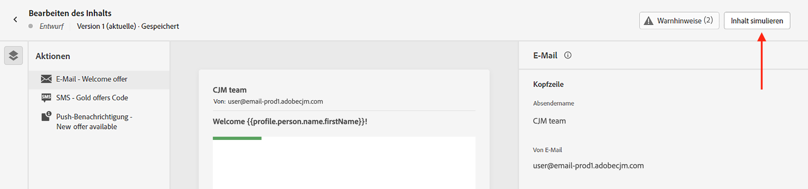

# Vorschau und Test Ihres Inhalts {#preview-test}

>[!CONTEXTUALHELP]
>id="ac_preview_testprofiles"
>title="Überprüfen des Inhalt-Renderings"
>abstract="Sobald Ihr Inhalt definiert wurde, können Sie mithilfe von Testprofilen eine Vorschau davon anzeigen und überprüfen, ob das Rendering je nach verwendetem Kanal korrekt ist."

>[!CONTEXTUALHELP]
>id="ajo_preview_simulate"
>title="Überprüfen des Inhalt-Renderings"
>abstract="Nachdem Ihr Inhalt definiert wurde, können Sie ihn in der Vorschau anzeigen und überprüfen, ob das Rendering entsprechend dem verwendeten Kanal korrekt ist."

## Mehr Informationen zu Vorschau und Test Ihres Inhalts {#about}

Sobald der Inhalt der definiert worden ist, können Sie ihn vor dem Senden der Nachricht mithilfe von Testprofilen in der [Vorschau](preview.md) ansehen. Dies ist ein entscheidender Schritt, um sicherzustellen, dass er präzise, aber auch frei von Fehlern ist, sowohl im Inhalt als auch in den Personalisierungseinstellungen.

Darüber hinaus können Sie auch [Testsendungen Ihrer E-Mail-Nachrichten an bestimmte Empfängerinnen und Empfänger oder Abonnentinnen bzw. Abonnenten zum Testen und Validieren senden](proofs.md) sowie ihr [Rendering in beliebten Desktop-, Mobile- und Web-basierten Clients überprüfen](rendering.md).

Alle diese Aktionen können mit der Schaltfläche **[!UICONTROL Inhalt simulieren]** durchgeführt werden, auf die Sie über den Bildschirm „Inhalt bearbeiten“ Ihrer Nachricht oder über die E-Mail- und Web-Designer für die E-Mail- bzw. Web-Kanäle zugreifen können.

>[!CAUTION]
>
>Bei der Vorschau einer Nachricht oder beim Versand von Testsendungen werden nur Profil-Personalisierungsdaten angezeigt. Personalisierung, die auf Kontextdaten wie Ereignisinformationen basiert, kann nur im Kontext einer Journey getestet werden. In [diesem Anwendungsbeispiel](../personalization/personalization-use-case.md) erfahren Sie, wie Sie die Personalisierung testen können.

➡️ [Erfahren Sie in diesem Video, wie Sie Ihre E-Mail in der Vorschau anzeigen und einen Testversand durchführen können](#video-preview).

## Voraussetzungen {#prerequisites}

Um Inhalte zu simulieren, müssen Sie über die Berechtigung **[!DNL Manage Simulate Content]** im Produktprofil **[!DNL Content Library Manager]** verfügen. [Weitere Informationen](../administration/ootb-product-profiles.md#content-library-manager).

Um Ihre Nachrichten in der Vorschau anzuzeigen, benötigen Sie außerdem Testprofile. [Hier erfahren Sie, wie Sie Testprofile erstellen](../audience/creating-test-profiles.md)

## Anleitungsvideo {#video-preview}

Hier erfahren Sie, wie Sie das E-Mail-Rendering für mehrere Posteingänge testen, Ihre personalisierten E-Mails mit Testprofilen in der Vorschau anzeigen und Testsendungen durchführen können.

>[!VIDEO](https://video.tv.adobe.com/v/334239?quality=12)
