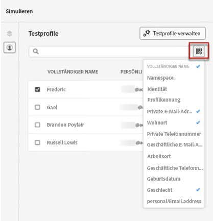
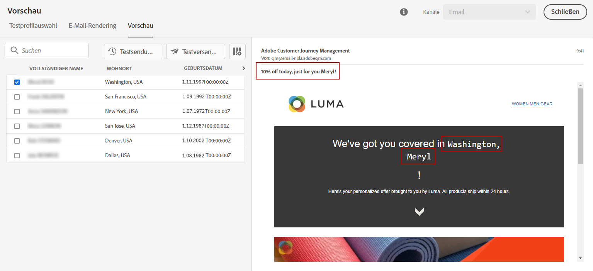

# Anzeigen des Inhalts in der Vorschau mithilfe von Testprofilen {#preview}

Nach der Auswahl von [Testprofilen](test-profiles.md) können Sie mit deren Daten eine Vorschau Ihres Inhalts anzeigen. Führen Sie folgende Schritte aus:

1. Klicken Sie im Bildschirm „Inhalt bearbeiten“ oder im E-Mail-Designer auf die Schaltfläche **[!UICONTROL Inhalt simulieren]** und wählen Sie **[!UICONTROL Inhalt simulieren]** aus.

1. Wählen Sie ein Testprofil aus. Überprüfen Sie die in den Spalten aufgeführten Werte. Verwenden Sie die Pfeile nach rechts oder links, um Daten zu durchsuchen.

   

   >[!NOTE]
   >
   >Um weitere Testprofile hinzuzufügen, wählen Sie **[!UICONTROL Testprofile verwalten]** aus. [Weitere Informationen](test-profiles.md)

1. Klicken Sie auf das Symbol **[!UICONTROL Daten auswählen]** über der Liste, um Spalten hinzuzufügen oder zu entfernen.

   Am Ende der Liste sehen Sie Personalisierungsfelder für die aktuelle Nachricht. Bei diesem Beispiel sind dies Ort, Vorname und Nachname des Profils. Wählen Sie diese Felder aus und stellen Sie sicher, dass diese Werte in Ihren Testprofilen definiert sind.

   

1. In der Nachrichtenvorschau werden die personalisierten Elemente durch die Daten der ausgewählten Testprofile ersetzt. Bei dieser Nachricht werden beispielsweise E-Mail-Inhalt und E-Mail-Betreff personalisiert:

   

1. Wählen Sie andere Testprofile aus, um Ihre E-Mail für jede Variante Ihrer Nachricht in der Vorschau anzuzeigen.

   >[!NOTE]
   >
   >Wenn in den Konfigurationsdetails ein Fehler gefunden wird, klicken Sie auf die Schaltfläche **[!UICONTROL Konfigurationsdetails anzeigen]**. [Weitere Informationen](../email/surface-personalization.md#check-configuration)

Beim Erstellen Code-basierter Erlebnisse können Sie eine Vorschau Ihrer personalisierten Inhalte direkt in Ihrem Browser oder auf Ihren Mobilgeräten anzeigen, um eine authentische Simulation zu sehen.  [Weitere Informationen](../code-based/test-code-based.md#preview-on-device)

>[!NOTE]
>
>Mit [!DNL Journey optimizer] können Sie verschiedene Varianten Ihrer Inhalte testen, indem Sie sie in der Vorschau anzeigen und einen Testversand mit Beispieleingabedaten durchführen, die aus einer CSV- oder JSON-Datei hochgeladen oder manuell hinzugefügt wurden. [Informationen zum Simulieren von Inhaltsvarianten](../test-approve/simulate-sample-input.md)
