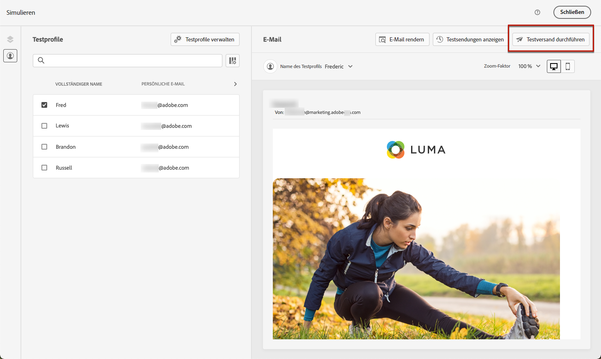
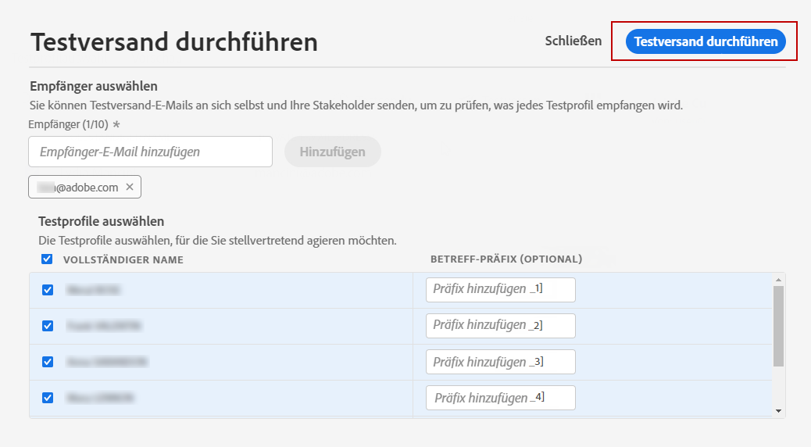

# Durchführen von Testsendungen mit Testprofildaten {#send-proofs}

Ein Testversand dient der Validierung einer Nachricht, bevor sie an die wichtigste Zielgruppe gesendet wird. Die Empfänger des Testversands sind für die Überprüfung der Nachricht verantwortlich: Darstellung, Inhalt, Personalisierungseinstellungen, Konfiguration.

>[!NOTE]
>
>Mit [!DNL Journey Optimizer] können Sie verschiedene Varianten Ihrer Inhalte testen, indem Sie sie in der Vorschau anzeigen und einen Testversand mit Beispieleingabedaten durchführen, die aus einer CSV- oder JSON-Datei hochgeladen oder manuell hinzugefügt wurden. [Informationen zum Simulieren von Inhaltsvarianten](../test-approve/simulate-sample-input.md)

## Wichtige Informationen {#must-read}

**Regeln zur Frequenzlimitierung** - Alle vorhandenen Regeln zur Frequenzlimitierung gelten für Testsendungen. Wenn Sie [Regeln zur Frequenzlimitierung](../conflict-prioritization/channel-capping.md) festgelegt haben (z. B. maximale Sendungen pro Profil), gelten diese Einschränkungen auch für den Versand von Testsendungen. Wenn ein Testprofil bereits das Häufigkeitslimit erreicht hat, werden die Testsendungen als abgeschlossen angezeigt, es wird jedoch keine E-Mail gesendet. Für wiederholte Tests sollten Sie bei Bedarf eindeutige Testprofile verwenden oder Häufigkeitsbegrenzungen für Proofing-Szenarien anpassen.

**Mirrorseite** - Im Testversand ist der Link zur Mirrorseite nicht aktiv. Er wird erst in den endgültigen Nachrichten aktiviert.

**Assets** - Assets und Bilder verfügen über bestimmte Barrierefreiheitsregeln:

* Assets/Images sind in bereitgestellten Inhalten oder Korrekturabzugsinhalten für bis zu 2 Jahre (730 Tage) seit ihrer ersten Veröffentlichung in einem Fragment/einer Inline-Nachricht verfügbar.
* Nach Ablauf dieses Zeitraums (jederzeit nach 730 Tagen) ist eine erneute Veröffentlichung erforderlich, um sie für weitere 2 Jahre verfügbar zu halten.
* Eine erneute Veröffentlichung innerhalb von 730 Tagen nach der ersten Veröffentlichung verlängert den Ablauf der Assets/Bilder nicht auf die nächsten 730 Tage.

## Durchführen eines Testversands {#send-proofs-steps}

Um E-Mail-Testsendungen mithilfe von Testprofildaten durchzuführen, müssen Sie zunächst [Testprofile](test-profiles.md) auswählen. Gehen Sie dann wie folgt vor:

1. Klicken Sie im Bildschirm **[!UICONTROL Simulieren]** auf die Schaltfläche **[!UICONTROL Testversand durchführen]**.

   

1. Geben Sie im Fenster **[!UICONTROL Testversand]** die E-Mail-Adresse Ihres Empfängers ein und klicken Sie auf **[!UICONTROL Hinzufügen]**, um den Testversand an sich selbst oder Mitglieder Ihrer Organisation zu senden.

   Beachten Sie, dass Sie bis zu zehn Empfänger für Ihren Testversand hinzufügen können.

   

1. Wählen Sie die **Testprofile** aus, die zur Personalisierung des Nachrichteninhalts verwendet werden.

   Die Anzahl der Testversandnachrichten, die jede Person erhält, entspricht der Anzahl der ausgewählten Testprofile. Wenn Sie beispielsweise fünf Empfänger-E-Mails hinzugefügt und zehn Testprofile ausgewählt haben, senden Sie fünfzig Testversandnachrichten. Jeder Empfänger erhält zehn davon.

1. Bei Bedarf können Sie der Betreffzeile des Testversands ein Präfix hinzufügen. Nur alphanumerische Zeichen und Sonderzeichen, wie etwa . - _ ( ) [ ], sind als Präfix für die Betreffzeile zulässig.

1. Klicken Sie auf **[!UICONTROL Testversand durchführen]**.

   

1. Um den Status zu prüfen, klicken Sie im Bildschirm **[!UICONTROL Simulieren]** auf die Schaltfläche **[!UICONTROL Testsendungen anzeigen]**.

   

Es wird empfohlen, nach jeder Änderung am Nachrichteninhalt Testsendungen durchzuführen.
