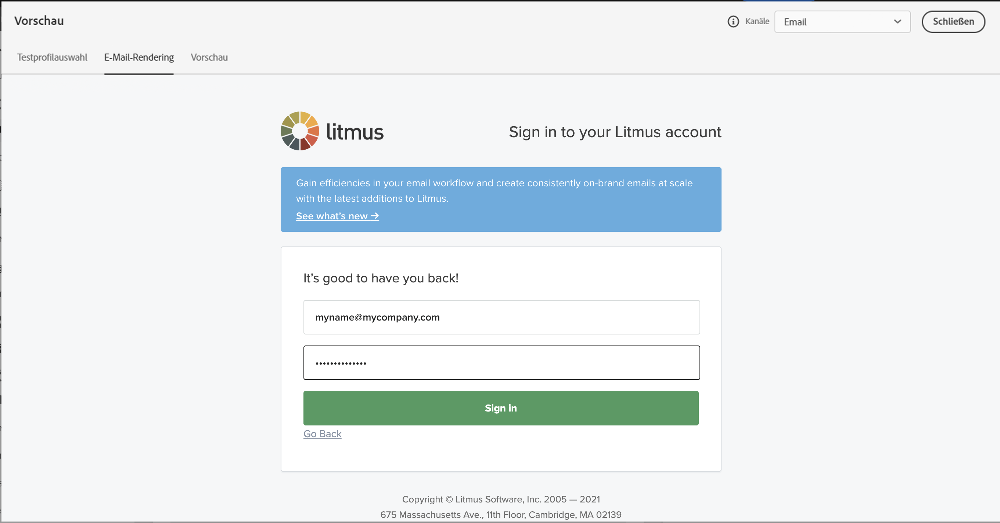
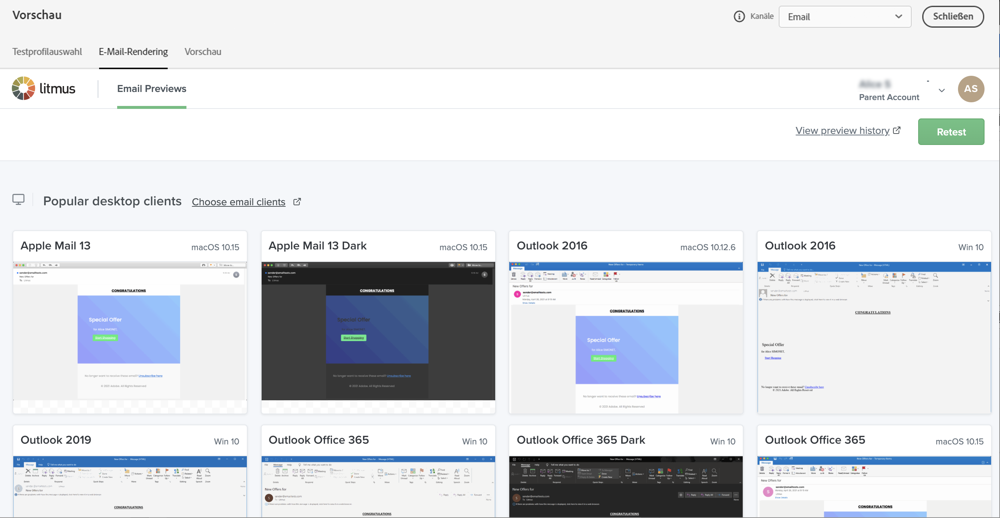

# Testen des E-Mail-Renderings {#email-rendering}

>[!BEGINSHADEBOX]

**Auf dieser Seite:** Erfahren Sie, wie Sie Ihr Litmus-Konto mit Adobe Journey Optimizer verbinden, um das E-Mail-Rendering auf gängigen Desktop-, Mobile- und Web-basierten Clients zu testen.

>[!ENDSHADEBOX]

Nutzen Sie Ihr **Litmus**-Konto in [!DNL Journey Optimizer], um das **E-Mail-Rendering** in populären E-Mail-Clients zu überprüfen. Auf diese Weise stellen Sie sicher, dass Ihr E-Mail-Inhalt in jedem Posteingang ansprechend aussieht und korrekt funktioniert.

Gehen Sie wie folgt vor, um das E-Mail-Rendering zu überprüfen:

1. Klicken Sie auf dem Bildschirm Inhalt bearbeiten Ihrer Nachricht oder in der E-Mail-Designer auf **[!UICONTROL Inhalt simulieren]** und wählen Sie dann **[!UICONTROL Inhalt simulieren (AEP-Profile)]** aus der Dropdown-Liste aus.

1. Wählen Sie die Schaltfläche **[!UICONTROL E-Mail rendern]** aus.

   

1. Klicken Sie auf **Verbinden Sie Ihr Litmus-Konto** im oberen rechten Bereich.

   

1. Geben Sie Ihre Anmeldedaten ein und melden Sie sich an.

   

1. Klicken Sie auf die Schaltfläche **Test ausführen**, um E-Mail-Vorschauen zu generieren.

1. Prüfen Sie Ihren E-Mail-Inhalt auf gängigen Clients für Desktop, mobile Geräte und Web.

   

>[!CAUTION]
>
>Durch die Verknüpfung Ihres **Litmus**-Kontos mit [!DNL Journey Optimizer] erteilen Sie Ihr Einverständnis, dass Testmeldungen an Litmus gesendet werden: Nach dem Versand werden diese E-Mails nicht mehr von Adobe verwaltet. Dementsprechend gelten für diese E-Mails die Litmus-Richtlinien zur Datenspeicherung, einschließlich der Personalisierungsdaten, die in diesen Testnachrichten enthalten sein können.
