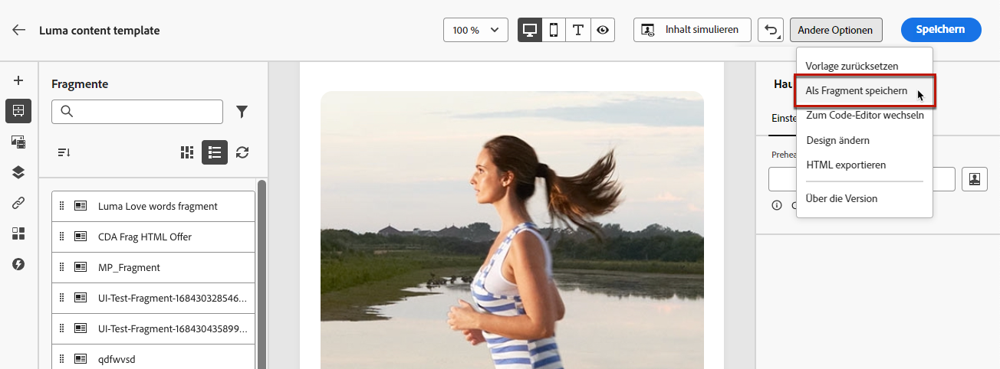
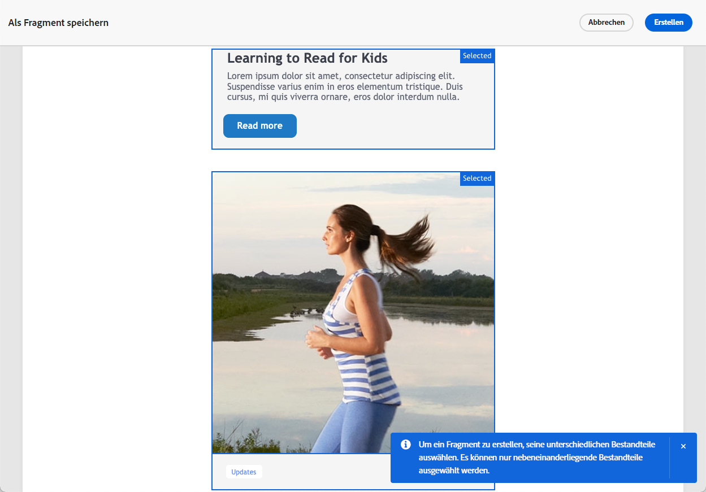
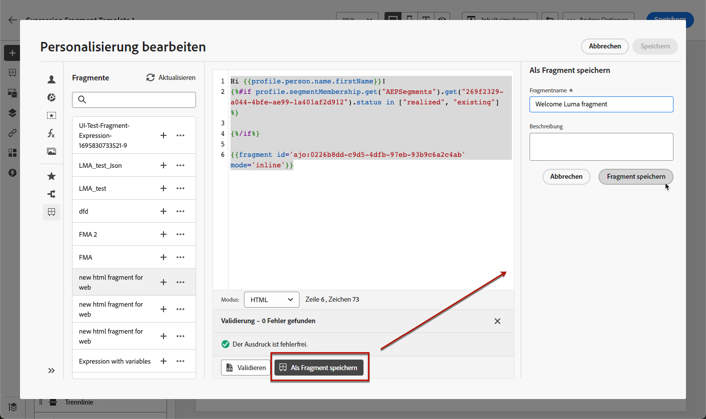

# Speichern von Inhalten als Fragment {#save-as-fragment}

Beim Bearbeiten von Inhalten in [!DNL Journey Optimizer] können Sie Ihren Inhalt ganz oder teilweise als Fragment speichern, um ihn später wiederzuverwenden. Sie können Inhalte entweder [über den E-Mail-Designer](#save-as-visual-fragment) oder [über den Ausdruckseditor](#save-as-expression-fragment) als Fragment speichern.

>[!NOTE]
>
>Beachten Sie, dass [kontextuelle Attribute](../personalization/personalization-build-expressions.md) in Fragmenten nicht unterstützt werden.
>
>Wenn in einer Journey oder einer Kampagne das Tracking aktiviert ist, werden Links, die in einem gespeicherten Fragment vorhanden sind und in einer Nachricht verwendet werden, ebenso wie alle anderen Links in der Nachricht nachverfolgt. [Weitere Informationen über Links und Tracking](../email/message-tracking.md)

## Speichern als visuelles Fragment {#save-as-visual-fragment}

Gehen Sie wie folgt vor, um Inhalte aus dem E-Mail-Designer als Fragment zu speichern:

1. Klicken Sie im [E-Mail-Designer](../email/get-started-email-design.md) oben rechts im Bildschirm auf die Ellipse.

1. Wählen Sie im Dropdown-Menü die Option **[!UICONTROL Als Fragment speichern]** aus.

   

   >[!NOTE]
   >
   >Visuelle Fragmente dürfen 100 KB nicht überschreiten.

1. Der Bildschirm **[!UICONTROL Als Fragment speichern]** wird angezeigt. Hier können Sie die Elemente auswählen, die in das Fragment aufgenommen werden sollen, einschließlich Personalisierungsfelder und dynamischer Inhalte.

   

   >[!CAUTION]
   >
   >Sie können nur nebeneinander liegende Abschnitte auswählen. Sie können keine leere Struktur und auch kein anderes Fragment auswählen.

1. Klicken Sie auf **[!UICONTROL Erstellen]** und geben Sie bei Bedarf den Namen und eine Beschreibung des Fragments ein.

1. Um dem Fragment benutzerdefinierte oder grundlegende Datennutzungs-Labels zuzuweisen, klicken Sie oben im Bildschirm auf die Schaltfläche **[!UICONTROL Zugriff verwalten]**. [Erfahren Sie mehr über die Zugriffssteuerung auf Objektebene (Object Level Access Control, OLAC)](../administration/object-based-access.md).

1. Wählen oder erstellen Sie Adobe Experience Platform-Tags im Feld **Tags**, um Ihre Vorlage für eine verbesserte Suche zu kategorisieren. [Weitere Informationen](../start/search-filter-categorize.md#tags)

1. Klicken Sie auf **[!UICONTROL Erstellen]**. Das Fragment wird der [Fragmentliste](#access-manage-fragments) mit dem Status **Entwurf** hinzugefügt. Es wird zu einem eigenständigen Fragment, das wie jedes andere visuelle Fragment aus dieser Liste verwendet werden kann.

   >[!NOTE]
   >
   >Änderungen an diesem neuen Fragment werden nicht auf die E-Mail oder Vorlage übertragen, aus der das Fragment hervorgegangen ist. Wenn der ursprüngliche Inhalt in dieser E-Mail oder Vorlage bearbeitet wird, wird das neue Fragment ebenfalls nicht geändert.

1. Um das Fragment in Ihren Journeys und Kampagnen verwenden zu können, müssen Sie es aktivieren. [Informationen zum Anzeigen der Vorschau und Veröffentlichen eines Fragments](../content-management/create-fragments.md#publish)

## Speichern als Ausdrucksfragment {#save-as-expression-fragment}

>[!CONTEXTUALHELP]
>id="ajo_perso_library"
>title="Speichern als Ausdrucksfragment"
>abstract="Mit dem Personalisierungseditor von [!DNL Journey Optimizer] können Sie Inhalte als Ausdrucksfragmente speichern. Diese Ausdrücke stehen dann zur Erstellung personalisierter Inhalte zur Verfügung."

Mit dem Personalisierungseditor von [!DNL Journey Optimizer] können Sie Inhalte als Ausdrucksfragmente speichern. Diese Ausdrücke stehen dann zur Erstellung personalisierter Inhalte zur Verfügung.

Gehen Sie wie folgt vor, um Inhalte als Ausdrucksfragment zu speichern.

1. Erstellen Sie über die Benutzeroberfläche des [Personalisierungseditors](../personalization/personalization-build-expressions.md) einen Ausdruck und klicken Sie dann auf **[!UICONTROL Als Fragment speichern]**.

   >[!NOTE]
   >
   >Ausdrücke dürfen 200 KB nicht überschreiten.

1. Geben Sie im rechten Bereich einen Titel und eine Beschreibung für den Ausdruck ein, damit Benutzende ihn leichter finden können.

   

1. Klicken Sie auf **[!UICONTROL Fragment speichern]**.

   <!--An expression fragment cannot be nested inside another fragment.-->

1. Das Fragment wird der [Fragmentliste](#access-manage-fragments) mit dem Status **Entwurf** hinzugefügt. Es wird zu einem eigenständigen Fragment, das wie jedes andere visuelle Fragment aus dieser Liste verwendet werden kann.

1. Um das Fragment in Ihren Journeys und Kampagnen verwenden zu können, müssen Sie es aktivieren. [Informationen zum Anzeigen der Vorschau und Veröffentlichen eines Fragments](../content-management/create-fragments.md#publish)
