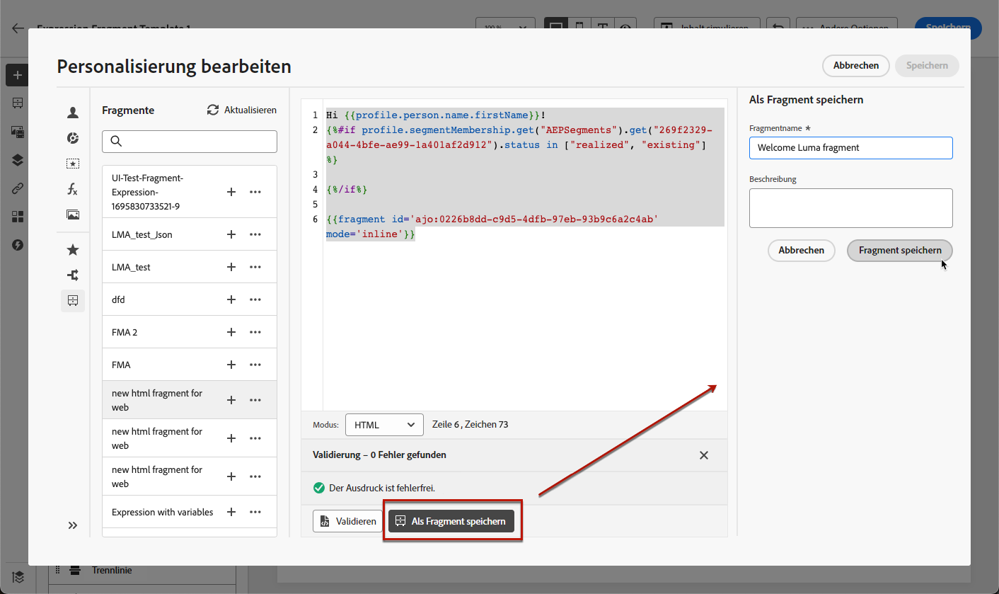

# Speichern von Inhalten als Fragment {#save-as-fragment}

Beim Bearbeiten von Inhalten in [!DNL Journey Optimizer] können Sie Ihren Inhalt ganz oder teilweise als Fragment speichern, um ihn später wiederzuverwenden.

## Speichern von Inhalten als visuelles Fragment {#save-as-visual-fragment}

Beim Entwurf einer [Inhaltsvorlage](content-templates.md) oder [E-Mail](../email/get-started-email-design.md) in Kampagnen oder Journeys können Sie einen Teil des Inhalts zur späteren Wiederverwendung als visuelles Fragment speichern. Gehen Sie dazu wie folgt vor.

1. Klicken Sie im [E-Mail-Designer](../email/get-started-email-design.md) oben rechts im Bildschirm auf die Ellipse.

1. Wählen Sie im Dropdown-Menü die Option **[!UICONTROL Als Fragment speichern]** aus.

   

1. Der Bildschirm **[!UICONTROL Als Fragment speichern]** wird angezeigt. Hier können Sie die Elemente auswählen, die Sie in Ihr Fragment aufnehmen möchten, darunter Personalisierungsfelder und dynamische Inhalte. Beachten Sie, dass kontextuelle Attribute in Fragmenten nicht unterstützt werden.

   >[!CAUTION]
   >
   >Sie können nur nebeneinander liegende Abschnitte auswählen. Sie können keine leere Struktur und auch kein anderes Fragment auswählen.

   

1. Klicken Sie auf **[!UICONTROL Erstellen]**. Füllen Sie die Fragmentdetails aus, d. h., geben Sie den Namen und (falls erforderlich) eine Beschreibung ein.

1. Um dem Fragment benutzerdefinierte oder zentrale Datennutzungskennzeichnungen zuzuweisen, wählen Sie **[!UICONTROL Zugriff verwalten]** aus. [Weitere Informationen zur Zugriffssteuerung auf Objektebene (OLAC)](../administration/object-based-access.md).

1. Wählen oder erstellen Sie Adobe Experience Platform-Tags im Feld **Tags**, um Ihre Vorlage für eine verbesserte Suche zu kategorisieren. [Weitere Informationen](../start/search-filter-categorize.md#tags)

1. Klicken Sie erneut auf **[!UICONTROL Erstellen]**. Das Fragment wird zur [Fragmentliste](#access-manage-fragments) hinzugefügt, auf die Sie über das spezielle [!DNL Journey Optimizer]-Menü zugreifen können.

   Es wird zu einem eigenständigen Fragment, für das [Zugriff](#access-manage-fragments), [Bearbeitung](#edit-fragments) und [Archivierung](#archive-fragments) wie für jedes andere Element in dieser Liste möglich sind.

Dieses Fragment kann nun beim Erstellen von [E-Mails](../email/get-started-email-design.md) oder [Inhaltsvorlagen](content-templates.md) in [!DNL Journey Optimizer] verwendet werden. [Weitere Informationen](../email/use-visual-fragments.md)

>[!NOTE]
>
>Änderungen an diesem neuen Fragment werden nicht auf die E-Mail oder Vorlage übertragen, aus der das Fragment hervorgegangen ist. Wenn der ursprüngliche Inhalt in dieser E-Mail oder Vorlage bearbeitet wird, wird das neue Fragment ebenfalls nicht geändert.

## Speichern von Inhalten als Ausdrucksfragment {#save-as-expression-fragment}

>[!CONTEXTUALHELP]
>id="ajo_perso_library"
>title="Speichern als Ausdrucksfragment"
>abstract="Mit dem Personalisierungseditor von [!DNL Journey Optimizer] können Sie Inhalte als Ausdrucksfragmente speichern. Diese Ausdrücke stehen dann zur Erstellung personalisierter Inhalte zur Verfügung."

Mit dem Personalisierungseditor von [!DNL Journey Optimizer] können Sie Inhalte als Ausdrucksfragmente speichern. Diese Ausdrücke stehen dann zur Erstellung personalisierter Inhalte zur Verfügung.

Gehen Sie wie folgt vor, um Inhalte als Ausdrucksfragment zu speichern.

1. Erstellen Sie über die Benutzeroberfläche des [Personalisierungseditors](../personalization/personalization-build-expressions.md) einen Ausdruck und klicken Sie dann auf **[!UICONTROL Als Fragment speichern]**.

1. Geben Sie im rechten Bereich einen Titel und eine Beschreibung für den Ausdruck ein, damit Benutzende ihn leichter finden können.

   

1. Klicken Sie auf **[!UICONTROL Fragment speichern]**.

   <!--An expression fragment cannot be nested inside another fragment.-->

1. Das Ausdrucksfragment wird zur [Fragmentliste](#access-manage-fragments) hinzugefügt. Jetzt können Sie damit personalisierte Inhalte erstellen.

>[!NOTE]
>
>Ausdrücke dürfen 200 KB nicht überschreiten.
