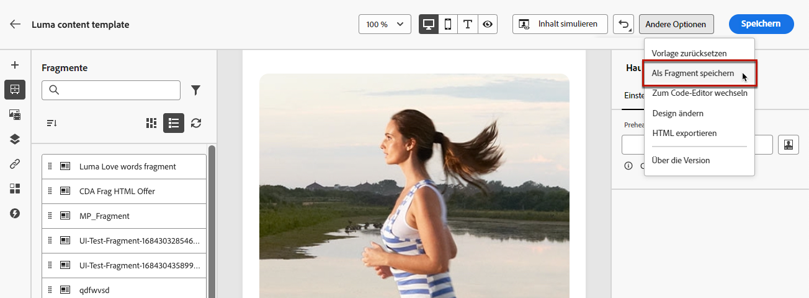
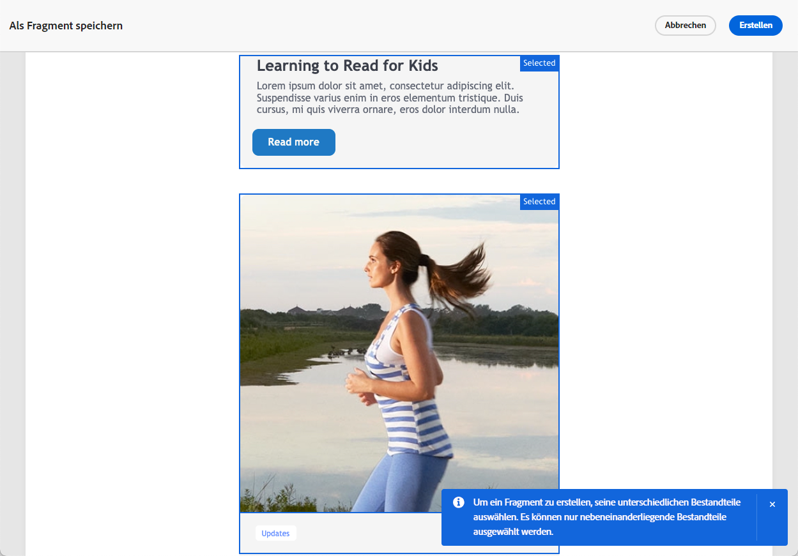

# Speichern von Inhalten als Fragment {#save-as-fragment}

Beim Bearbeiten von Inhalt in [!DNL Journey Optimizer], können Sie Ihren Inhalt ganz oder teilweise als Fragment speichern, um ihn später wiederzuverwenden. Sie können Inhalte entweder als Fragment speichern [in Email Designer](#save-as-visual-fragment)oder [im Ausdruckseditor](#save-as-expression-fragment).

## Speichern als visuelles Fragment {#save-as-visual-fragment}

Gehen Sie wie folgt vor, um Inhalt aus Email Designer als Fragment zu speichern:

1. Klicken Sie im [E-Mail-Designer](../email/get-started-email-design.md) oben rechts im Bildschirm auf die Ellipse.

1. Wählen Sie im Dropdown-Menü die Option **[!UICONTROL Als Fragment speichern]** aus.

   

1. Der Bildschirm **[!UICONTROL Als Fragment speichern]** wird angezeigt. Hier können Sie die Elemente auswählen, die Sie in Ihr Fragment aufnehmen möchten, darunter Personalisierungsfelder und dynamische Inhalte. Beachten Sie, dass kontextuelle Attribute in Fragmenten nicht unterstützt werden.

   

   >[!CAUTION]
   >
   >Sie können nur nebeneinander liegende Abschnitte auswählen. Sie können keine leere Struktur und auch kein anderes Fragment auswählen.

1. Klicks **[!UICONTROL Erstellen]** und geben Sie bei Bedarf den Fragmentnamen und die Beschreibung ein.

1. Um dem Fragment benutzerdefinierte oder Core-Datennutzungsbezeichnungen zuzuweisen, klicken Sie auf das **[!UICONTROL Zugriff verwalten]** im oberen Bereich des Bildschirms. [Weitere Informationen zur Zugriffssteuerung auf Objektebene (OLAC)](../administration/object-based-access.md).

1. Wählen oder erstellen Sie Adobe Experience Platform-Tags im Feld **Tags**, um Ihre Vorlage für eine verbesserte Suche zu kategorisieren. [Weitere Informationen](../start/search-filter-categorize.md#tags)

1. Klicken Sie auf **[!UICONTROL Erstellen]**. Das Fragment wird zum [Fragmentliste](#access-manage-fragments) mit dem **Entwurf** -Status. Es wird zu einem eigenständigen Fragment, das wie jedes andere visuelle Fragment aus dieser Liste verwendet werden kann.

   >[!NOTE]
   >
   >Änderungen an diesem neuen Fragment werden nicht auf die E-Mail oder Vorlage übertragen, aus der das Fragment hervorgegangen ist. Wenn der ursprüngliche Inhalt in dieser E-Mail oder Vorlage bearbeitet wird, wird das neue Fragment ebenfalls nicht geändert.

1. Um das Fragment in Ihren Journey und Kampagnen verwenden zu können, müssen Sie es aktivieren. [Erfahren Sie, wie Sie ein Fragment in der Vorschau anzeigen und veröffentlichen.](../content-management/create-fragments.md#publish)

>[!NOTE]
>
>Die Veröffentlichung von Fragmenten wird im Laufe von mehreren Tagen nach der Journey Optimizer-Version vom Juni schrittweise eingeführt. Einige Benutzer haben zwar sofort Zugriff, bei anderen kann es aber zu einer Verzögerung kommen, bevor sie in ihren Umgebungen verfügbar werden. Wenn diese Verbesserung noch nicht in Ihrer Umgebung verfügbar ist, beachten Sie bitte, dass Fragmente nicht zur Verwendung in Journey und Kampagnen veröffentlicht werden müssen.

## Speichern als Ausdrucksfragment {#save-as-expression-fragment}

>[!CONTEXTUALHELP]
>id="ajo_perso_library"
>title="Speichern als Ausdrucksfragment"
>abstract="Mit dem Personalisierungseditor von [!DNL Journey Optimizer] können Sie Inhalte als Ausdrucksfragmente speichern. Diese Ausdrücke stehen dann zur Erstellung personalisierter Inhalte zur Verfügung."

Mit dem Personalisierungseditor von [!DNL Journey Optimizer] können Sie Inhalte als Ausdrucksfragmente speichern. Diese Ausdrücke stehen dann zur Erstellung personalisierter Inhalte zur Verfügung.

Gehen Sie wie folgt vor, um Inhalte als Ausdrucksfragment zu speichern.

1. Erstellen Sie über die Benutzeroberfläche des [Personalisierungseditors](../personalization/personalization-build-expressions.md) einen Ausdruck und klicken Sie dann auf **[!UICONTROL Als Fragment speichern]**.

   >[!NOTE]
   >
   >Ausdrücke dürfen 200 KB nicht überschreiten.

1. Geben Sie im rechten Bereich einen Titel und eine Beschreibung für den Ausdruck ein, damit Benutzende ihn leichter finden können.

   

1. Klicken Sie auf **[!UICONTROL Fragment speichern]**.

   <!--An expression fragment cannot be nested inside another fragment.-->

1. Das Fragment wird zum [Fragmentliste](#access-manage-fragments) mit dem **Entwurf** -Status. Es wird zu einem eigenständigen Fragment, das als jedes andere Ausdrucksfragment aus dieser Liste verwendet werden kann.

1. Um das Fragment in Ihren Journey und Kampagnen verwenden zu können, müssen Sie es aktivieren. [Erfahren Sie, wie Sie ein Fragment in der Vorschau anzeigen und veröffentlichen.](../content-management/create-fragments.md#publish)

>[!NOTE]
>
>Die Veröffentlichung von Fragmenten wird im Laufe von mehreren Tagen nach der Journey Optimizer-Version vom Juni schrittweise eingeführt. Einige Benutzer haben zwar sofort Zugriff, bei anderen kann es aber zu einer Verzögerung kommen, bevor sie in ihren Umgebungen verfügbar werden. Wenn diese Verbesserung noch nicht in Ihrer Umgebung verfügbar ist, beachten Sie bitte, dass Fragmente nicht zur Verwendung in Journey und Kampagnen veröffentlicht werden müssen.
