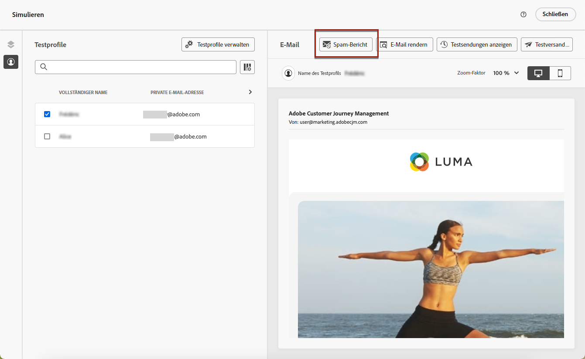
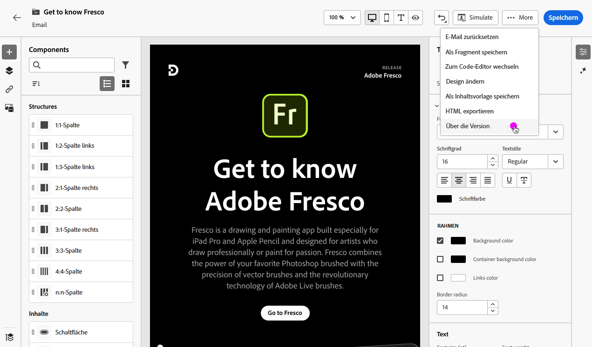
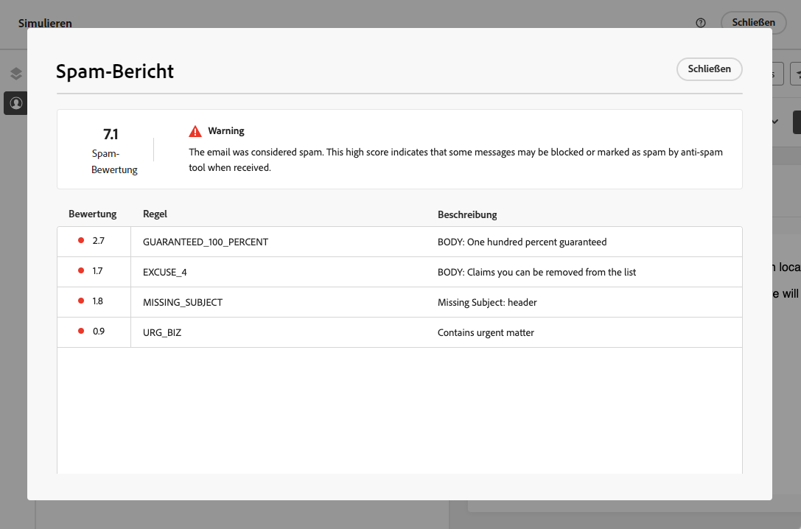
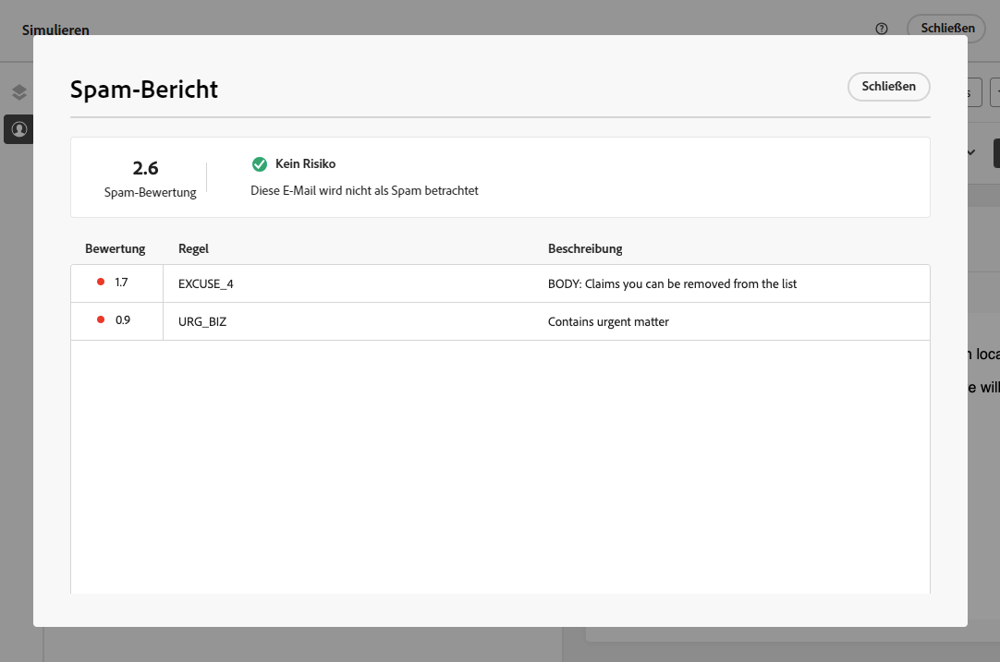
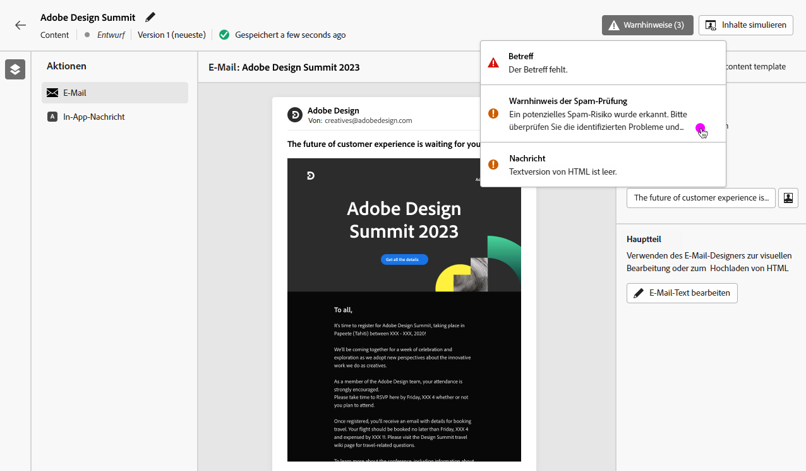

# Spam-Bericht verwenden {#spam-report}

>[!AVAILABILITY]
>
>Die Funktion für den Spam-Bericht ist derzeit als Beta-Version verfügbar, um nur Benutzer auszuwählen. Wenden Sie sich an die Kundenunterstützung von Adobe, um am Beta-Programm teilzunehmen.

[!DNL Journey Optimizer] ermöglicht Ihnen, die Leistung Ihres Inhalts gegen Spam-Filterung zu überprüfen und sicherzustellen, dass Ihre Nachrichten in den Postfächern Ihrer Kunden landen - nicht in Spam.

>[!CAUTION]
>
>* Diese Funktion ist derzeit nur für den E-Mail-Kanal verfügbar.
>
>* Zunächst kann die Spam-Berichtsanalyse nur für englischsprachige Inhalte durchgeführt werden.

Wenn Sie Inhalte bearbeiten oder in der Vorschau anzeigen, wird die **[!UICONTROL Spam-Bericht]** bietet eine Bewertung und Ratschläge zur Verbesserung der Bewertungen für jedes aufgelistete Element.

Auf diese Weise können Sie feststellen, ob eine Nachricht von den Anti-Spam-Tools, die bei Erhalt verwendet werden, als Spam eingestuft wird, und Maßnahmen ergreifen, falls dies nicht der Fall ist.

>[!CAUTION]
>
>Der Spam-Bericht enthält nur Hinweise und Warnungen. Beachten Sie, dass Sie nicht daran gehindert werden, Nachrichten zu senden, wenn der Spam-Bericht anzeigt, dass Ihr Inhalt als Spam gilt. Es ist Ihre Wahl, entsprechend dem Ergebnis und den vorgeschlagenen Verbesserungen zu handeln.

So verwenden Sie die **[!UICONTROL Spam-Bericht]** Gehen Sie wie folgt vor.

<!--For example spam scoring tool can tell that there are too many Images compared to the text. Retailers tend to do this even though the spam score gets worse because the content is more engaging.-->

<!--Michael, who is a marketer with NIKE works along with Tara from testing team to ensure that the emails being sent as part of the campaign/journey don't get categorised as SPAM.

They need an integration within AJO's marketing system to show how the curated content is doing against different SPAM compliance pillars like for SPAM trigger words, HTML Body content and layout, subject line etc.

They should be able to get scores for each individual items as shown by market standard SPAM filtering tools like Spam Assassin, Symantec etc.

They should also get suggestions on how to improve the score better to be confident that the messages don't get categorised as spam.-->

1. Aus dem **[!UICONTROL Simulieren]** klicken Sie auf das **[!UICONTROL Spam-Bericht]** Schaltfläche.

   

<!--
    You can also open the [Email Designer](../email/content-from-scratch.md), click the **[!UICONTROL More]** button and select **[!UICONTROL Check spam score]** from the menu.

    
-->

1. Eine Anti-Spam-Prüfung wird automatisch durchgeführt und die **[!UICONTROL Spam-Bericht]** zeigt die Ergebnisse an. Er zeigt die Leistung Ihres Inhalts in Bezug auf das Textlayout, die Struktur, die Bildgröße, ggf. Spam-Trigger-Wörter usw.

   

1. Überprüfen Sie die Bewertungen und Beschreibungen für jedes Element.

   Wenn der Wert größer als 5 ist, wird ein Warnhinweis angezeigt. Er weist darauf hin, dass manche Nachrichten beim Empfang von Anti-Spam-Tools blockiert oder als Spam gekennzeichnet werden können.

1. Basierend auf dieser Bewertung können Sie, wenn Sie der Ansicht sind, dass einige Elemente verbessert werden können, mithilfe der [Email Designer](../email/content-from-scratch.md) und nehmen Sie die erforderlichen Aktualisierungen vor.

1. Sobald Ihre Änderungen vorgenommen wurden, kehren Sie zum **[!UICONTROL Spam-Bericht]** angezeigt, um sicherzustellen, dass Ihr Ergebnis verbessert wurde.

   

<!--You can also check the message's alerts for warnings on potential risk of spam detection. Follow the steps below.

1. Click the **[!UICONTROL Alerts]** button on top right of the screen. [Learn more on email alerts](../email/create-email.md#check-email-alerts)

1. If **[!UICONTROL Spam checker alert]** is displayed, you should check your content for a potential risk of spam using the **[!UICONTROL Spam report]** feature as detailed above.

    
-->

