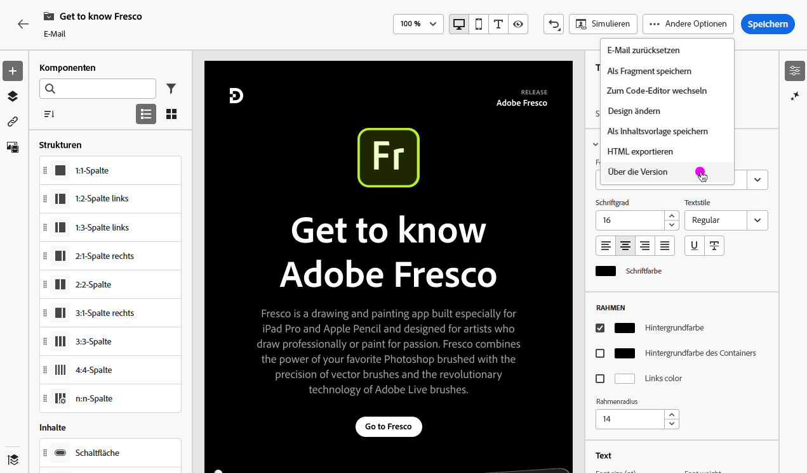

# E-Mail-Spam-Bericht {#spam-report}

>[!CONTEXTUALHELP]
>id="ajo_simulate_spam_report"
>title="E-Mail-Spam-Bericht"
>abstract="Mit dem Spam-Bericht können Sie die Spam-Bewertung Ihres E-Mail-Inhalts überprüfen. Dieser Wert gibt an, ob ISPs oder Mailbox-Anbieter Ihre Nachricht als Spam betrachten oder nicht. Dabei gilt: je niedriger der Wert, desto besser. Wenn Ihre Bewertung des E-Mail-Inhalts höher als 2 ist, sollten Sie die Probleme beheben, die zum Nichtbestehen der Tests geführt haben."

Sie können die Spam-Bewertung Ihres E-Mail-Inhalts in einem speziellen Spam-Bericht überprüfen. Mit [SpamAssassin](https://spamassassin.apache.org/){target="_blank"} kann Adobe Journey Optimizer Ihren E-Mail-Inhalt testen und ihm einen Wert zuweisen, der angibt, ob ISPs oder Postfachanbieter ihn als Spam betrachten oder nicht.

Wenn Sie Ihre E-Mail-Inhalte bearbeiten oder in der Vorschau anzeigen, können Sie über die Schaltfläche **[!UICONTROL Spam-Bericht]** für jedes einzelne Element, das aufgelistet wird, eine Bewertung und Hinweise zur Verbesserung der Bewertung abrufen.

Mit dieser Funktion können Sie feststellen, ob eine Nachricht beim Empfang von den verwendeten Anti-Spam-Tools als Spam eingestuft werden könnte, und in diesem Fall entsprechende Maßnahmen ergreifen. Viele Anbieter von E-Mail-Postfächern verwenden Tools als Teil ihres Spam-Filterverfahrens. Der Versand von E-Mails mit einer schlechten Punktzahl kann die Zustellbarkeit erheblich beeinträchtigen.

Um auf den **[!UICONTROL Spam-Bericht]** zuzugreifen, folgen Sie den nachstehenden Schritten.

1. Klicken Sie auf dem Bildschirm **[!UICONTROL Simulieren]** auf die Schaltfläche **[!UICONTROL Spam-Bericht]**.

   

<!--
    You can also open the [Email Designer](../email/content-from-scratch.md), click the **[!UICONTROL More]** button and select **[!UICONTROL Check spam score]** from the menu.

    
-->

1. Eine Anti-Spam-Prüfung wird automatisch durchgeführt und der **[!UICONTROL Spam-Bericht]** zeigt die Ergebnisse an. Er zeigt die Leistung Ihres Inhalts in Bezug auf das Text-Layout, die Struktur, die Bildgröße, ggf. Wörter, die Spam triggern usw.

   

1. Überprüfen Sie die Bewertungen und Beschreibungen für jedes Element.

   Dabei gilt: je niedriger der Wert, desto besser. Wenn der Wert größer als 5 ist, wird ein Warnhinweis angezeigt, der anzeigt, dass manche Nachrichten beim Empfang blockiert oder als Spam gekennzeichnet werden könnten. Es empfiehlt sich als Best Practice, einen Wert unter 2 zu erzielen.

   >[!NOTE]
   >
   >Der Spam-Wert wird über [SpamAssassin](https://spamassassin.apache.org/){target="_blank"} ermittelt und die Regeln gehören nicht Adobe. Weitere Informationen zu diesen Regeln finden Sie in der SpamAssassin-Dokumentation.
   >

1. Wenn Sie auf der Grundlage dieser Bewertung der Meinung sind, dass einige Elemente verbessert werden können, bearbeiten Sie Ihren Inhalt im [E-Mail-Designer](../email/content-from-scratch.md) und nehmen Sie die erforderlichen Aktualisierungen vor.

1. Sobald Sie Ihre Änderungen vorgenommen haben, kehren Sie zum Bildschirm **[!UICONTROL Spam-Bericht]** zurück, um sicherzustellen, dass sich Ihre Bewertung verbessert hat.

   

<!--You can also check the message's alerts for warnings on potential risk of spam detection. Follow the steps below.

1. Click the **[!UICONTROL Alerts]** button on top right of the screen. [Learn more about email alerts](../email/create-email.md#check-email-alerts)

1. If **[!UICONTROL Spam checker alert]** is displayed, you should check your content for a potential risk of spam using the **[!UICONTROL Spam report]** feature as detailed above.

    
-->
