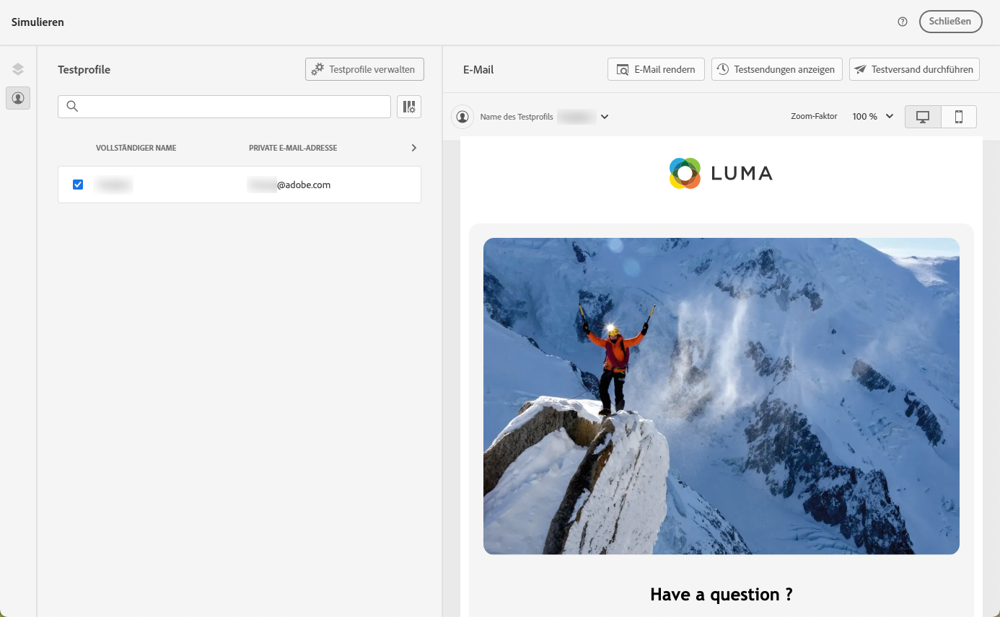
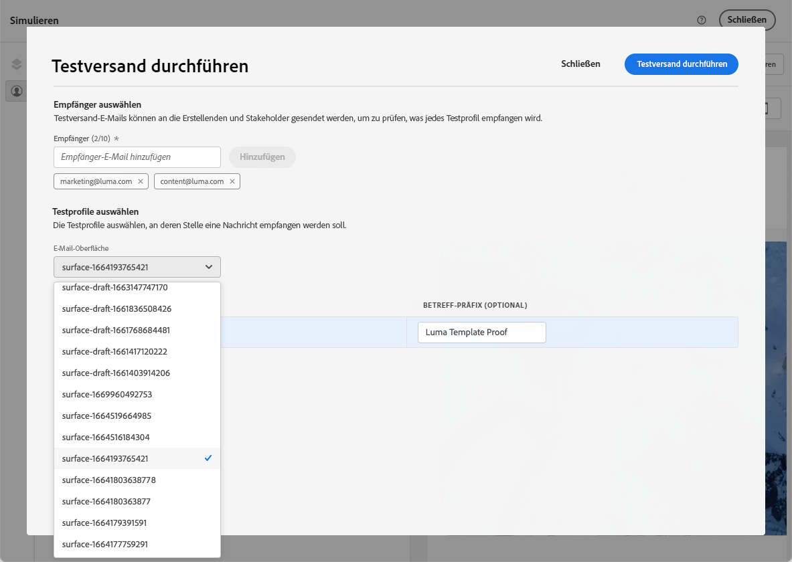

# Testen von E-Mail-Inhaltsvorlagen {#test-template}

Sie können das Rendering einiger Ihrer E-Mail-Vorlagen testen, unabhängig davon, ob diese von Grund auf neu oder aus vorhandenen Inhalten erstellt wurde. Gehen Sie dazu wie folgt vor.

1. Rufen Sie die Inhaltsvorlagenliste über das Menü **[!UICONTROL Content-Management]** > **[!UICONTROL Inhaltsvorlagen]** auf und wählen Sie eine beliebige E-Mail-Vorlage aus.

1. Klicken Sie in den **[!UICONTROL Vorlageneigenschaften]** auf **[!UICONTROL Inhalt bearbeiten]**.

1. Klicken Sie auf **[!UICONTROL Inhalt simulieren]** und wählen Sie ein Testprofil aus, um Ihr Rendering zu überprüfen. [Weitere Informationen](../content-management/preview-test.md)

   

1. Sie können einen Testversand durchführen, um Ihren Inhalt zu testen und ihn von einigen internen Benutzern genehmigen zu lassen, bevor Sie ihn in einer Journey oder Kampagne verwenden.

   * Klicken Sie dazu auf die Schaltfläche **[!UICONTROL Testversand durchführen]** und folgen Sie den Schritten, die in [diesem Abschnitt](../content-management/proofs.md) beschrieben werden.

   * Vor dem Testversand müssen Sie die [E-Mail-Konfiguration](../configuration/channel-surfaces.md) auswählen, die zum Testen Ihres Inhalts verwendet wird.

     

>[!CAUTION]
>
>Derzeit wird Tracking beim Testen von E-Mail-Inhaltsvorlagen nicht unterstützt, d. h. die Nachverfolgung von Ereignissen, UTM-Parametern und Landingpage-Links ist in den Testsendungen, die von einer Vorlage gesendet werden, nicht wirksam. [Verwenden Sie zum Testen des Trackings die Inhaltsvorlage](../email/use-email-templates.md) in einer E-Mail und führen Sie einen Testversand mit Testprofilen oder Beispieleingabedaten durch, die aus einer CSV- oder JSON-Datei hochgeladen oder manuell hinzugefügt wurden. [Erfahren Sie, wie Sie eine Vorschau der Inhalte anzeigen und die Inhalte testen](../content-management/preview-test.md)
