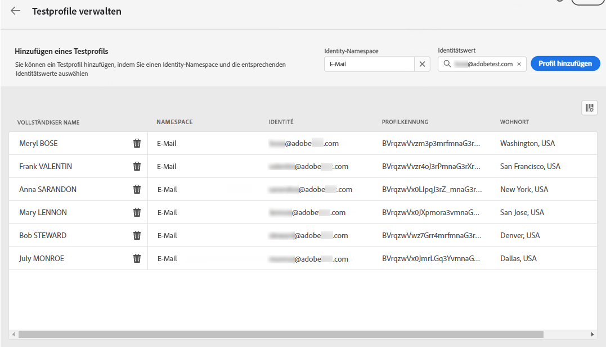

# Auswählen von Testprofilen {#select-test-profiles}

>[!CONTEXTUALHELP]
>id="ajo_preview_test_profiles"
>title="Verwenden Sie Testprofile, um Ihre Inhalte zu überprüfen"
>abstract="Verwenden Sie Testprofile, um Ihre Inhalte in der Vorschau anzuzeigen und zu testen. Wenn Sie personalisierte Felder hinzugefügt haben, können Sie anhand von Testprofildaten überprüfen, wie diese angezeigt werden."

Vor der Vorschau oder dem Testen Ihres Inhalts müssen Sie zunächst Testprofile auswählen, bei denen es sich um zusätzliche Empfängerinnen und Empfänger handelt, die nicht den definierten Kriterien für die Zielgruppenbestimmung entsprechen. [Hier erfahren Sie, wie Sie Testprofile erstellen](../audience/creating-test-profiles.md)

Gehen Sie wie folgt vor, um Testprofile auszuwählen:

1. Klicken Sie auf dem Bildschirm „Inhalt bearbeiten“ Ihrer Nachricht oder im E-Mail-Designer auf die Schaltfläche **[!UICONTROL Inhalt simulieren]**.

1. Klicken Sie auf die Schaltfläche **[!UICONTROL Testprofile verwalten]** und wählen Sie den Namespace aus, der zur Identifizierung von Testprofilen verwendet werden soll, indem Sie auf das Auswahlsymbol **[!UICONTROL Identity-Namespace]** klicken. [Weitere Informationen zu Identity-Namespaces von Adobe Experience Platform](../audience/get-started-identity.md).

   Im folgenden Beispiel verwenden wir den Namespace **E-Mail**.

   

1. Verwenden Sie das Suchfeld, um den Namespace zu finden, wählen Sie ihn aus und klicken Sie auf **[!UICONTROL Auswählen]**.

   

1. Geben Sie im Feld **[!UICONTROL Identitätswert]** den Wert (hier die E-Mail-Adresse) ein, um das Testprofil zu identifizieren, und klicken Sie auf **[!UICONTROL Profil hinzufügen]**.

   <!---->

1. Wenn Sie Ihrer Nachricht personalisierten Inhalt hinzugefügt haben, fügen Sie weitere Testprofile hinzu, damit Sie verschiedene Varianten der Nachricht anhand unterschiedlicher Profildaten testen können. Anschließend werden die hinzugefügten Profile unter den ausgewählten Feldern aufgelistet.

   

   Basierend auf den Personalisierungselementen der Nachricht werden in dieser Liste Daten zu den einzelnen Testprofilen in den entsprechenden Spalten angezeigt.
