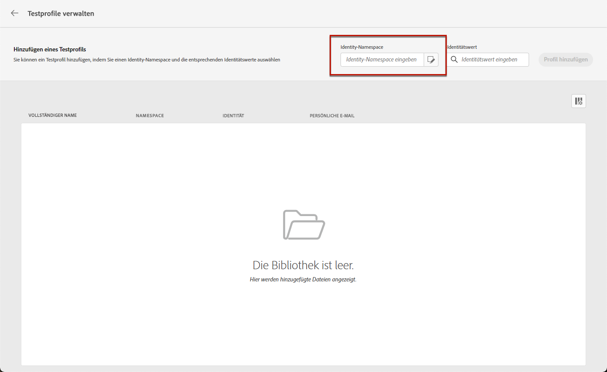

# Auswählen der Testprofile {#select-test-profiles}

>[!CONTEXTUALHELP]
>id="ajo_preview_test_profiles"
>title="Verwenden Sie Testprofile, um Ihren Inhalt zu überprüfen."
>abstract="Verwenden Sie Testprofile, um Ihre Inhalte in der Vorschau anzuzeigen und zu testen. Wenn Sie personalisierte Felder hinzugefügt haben, können Sie anhand von Testprofildaten prüfen, wie diese angezeigt werden."

Vor der Vorschau oder dem Testen Ihres Inhalts müssen Sie zunächst Testprofile auswählen, bei denen es sich um zusätzliche Empfänger handelt, die nicht den definierten Targeting-Kriterien entsprechen. [Hier erfahren Sie, wie Sie Testprofile erstellen](../audience/creating-test-profiles.md)

Gehen Sie wie folgt vor, um Testprofile auszuwählen:

1. Klicken Sie im Bildschirm &quot;Inhalt bearbeiten&quot;Ihrer Nachricht oder in Email Designer auf die Schaltfläche **[!UICONTROL Inhalt simulieren]** Schaltfläche.

1. Klicken Sie auf **[!UICONTROL Testprofile verwalten]** und wählen Sie den Namespace aus, der zur Identifizierung von Testprofilen verwendet werden soll, indem Sie auf **[!UICONTROL Identitäts-Namespace]** Auswahlsymbol. [Weitere Informationen zu Adobe Experience Platform-Identitäts-Namespaces](../audience/get-started-identity.md).

   Im folgenden Beispiel verwenden wir die **Email** Namespace.

   

1. Verwenden Sie das Suchfeld, um den Namespace zu lokalisieren, wählen Sie ihn aus und klicken Sie auf **[!UICONTROL Auswählen]**.

   

1. Geben Sie im Feld **[!UICONTROL Identitätswert]** den Wert (hier die E-Mail-Adresse) ein, um das Testprofil zu identifizieren, und klicken Sie auf **[!UICONTROL Profil hinzufügen]**.

   <!---->

1. Wenn Sie Ihrer Nachricht personalisierten Inhalt hinzugefügt haben, fügen Sie weitere Testprofile hinzu, damit Sie verschiedene Varianten der Nachricht anhand unterschiedlicher Profildaten testen können. Anschließend werden die hinzugefügten Profile unter den ausgewählten Feldern aufgelistet.

   

   Basierend auf den Personalisierungselementen der Nachricht werden in dieser Liste Daten zu den einzelnen Testprofilen in den entsprechenden Spalten angezeigt.
