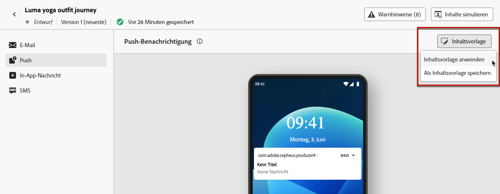
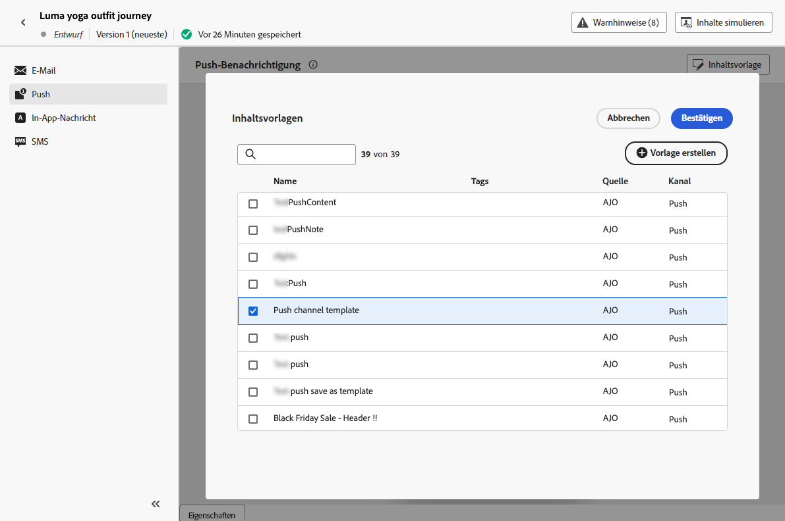

# Verwenden von Inhaltsvorlagen {#use-content-templates}

Beim Erstellen von Inhalten für einen beliebigen Kanal (außer Web) in [!DNL Journey Optimizer] können Sie eine benutzerdefinierte Vorlage verwenden, die Sie entweder:

* von Grund auf mit dem Menü **[!UICONTROL Inhaltsvorlagen]** erstellt haben. [Weitere Informationen](#create-template-from-scratch)

* oder mithilfe der Option **[!UICONTROL Als Inhaltsvorlage speichern]** aus vorhandenem Inhalt in einer Journey oder einer Kampagne gespeichert haben. [Weitere Informationen](#save-as-template)

Gehen Sie wie folgt vor, um mit der Erstellung Ihres Inhalts mit einer dieser Vorlagen zu beginnen.

1. Klicken Sie auf die Schaltfläche **[!UICONTROL Inhaltsvorlage]**, nachdem Sie in einer Kampagne oder Journey die Option **[!UICONTROL Inhalt bearbeiten]** ausgewählt haben.

1. Wählen Sie **[!UICONTROL Inhaltsvorlage anwenden]** aus.

   

1. Wählen Sie die gewünschte Vorlage aus der Liste aus. Es werden nur Vorlagen angezeigt, die mit dem ausgewählten Kanal und/oder Typ kompatibel sind.

   

   >[!NOTE]
   >
   >Von diesem Bildschirm aus können Sie auch eine neue Vorlage erstellen, indem Sie die entsprechende Schaltfläche verwenden und dadurch eine neue Registerkarte aufrufen.

1. Klicken Sie auf **[!UICONTROL Bestätigen]**. Die Vorlage wird auf Ihren Inhalt angewendet.

1. Bearbeiten Sie den Inhalt nach Bedarf weiter.

>[!NOTE]
>
>Um eine E-Mail anhand einer Inhaltsvorlage mit [E-Mail-Designer](../email/get-started-email-design.md) zu gestalten, folgen Sie den in [diesem Abschnitt](../email/use-email-templates.md) beschriebenen Schritten.
