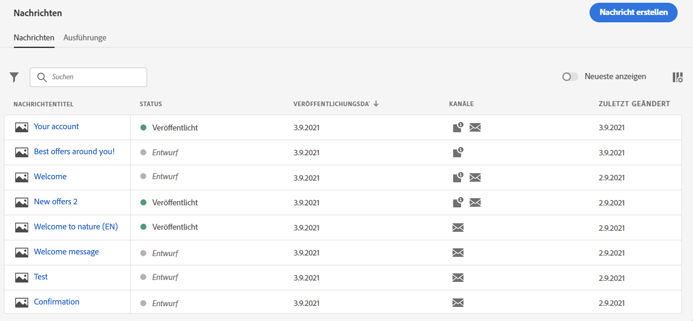
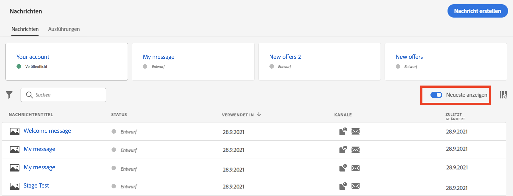
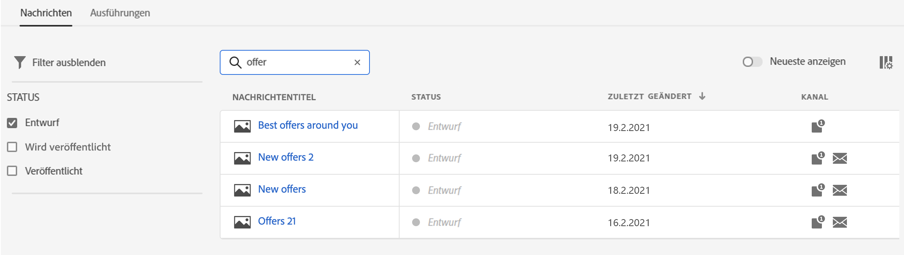
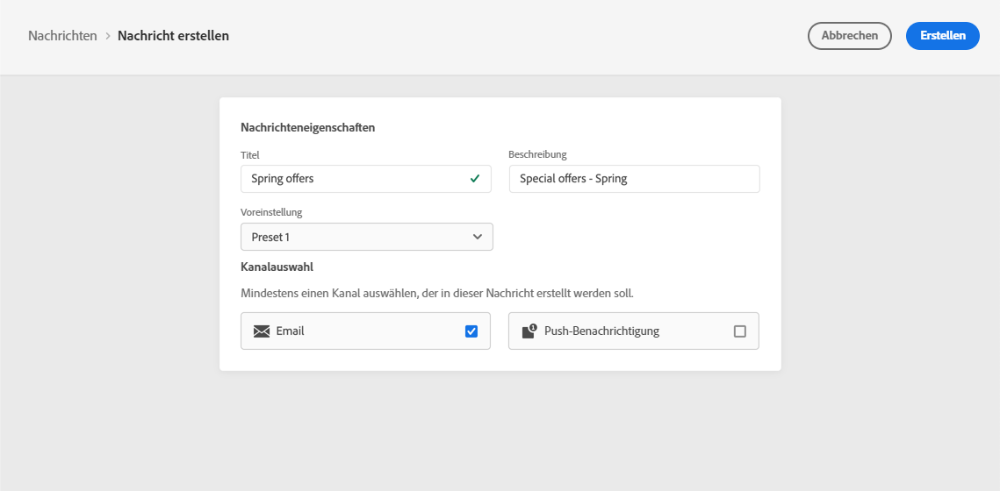
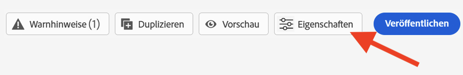
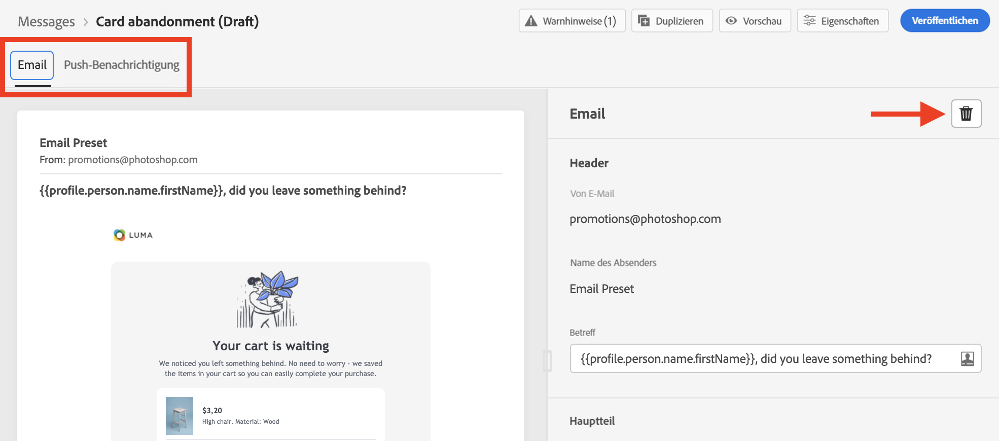
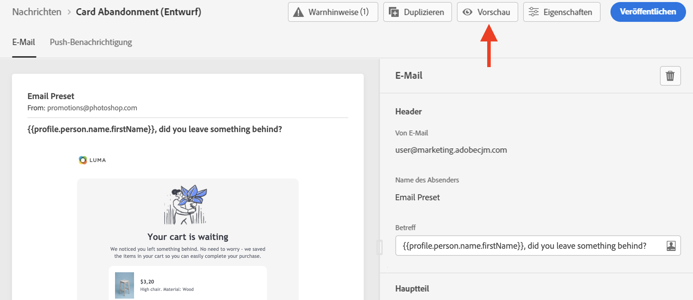
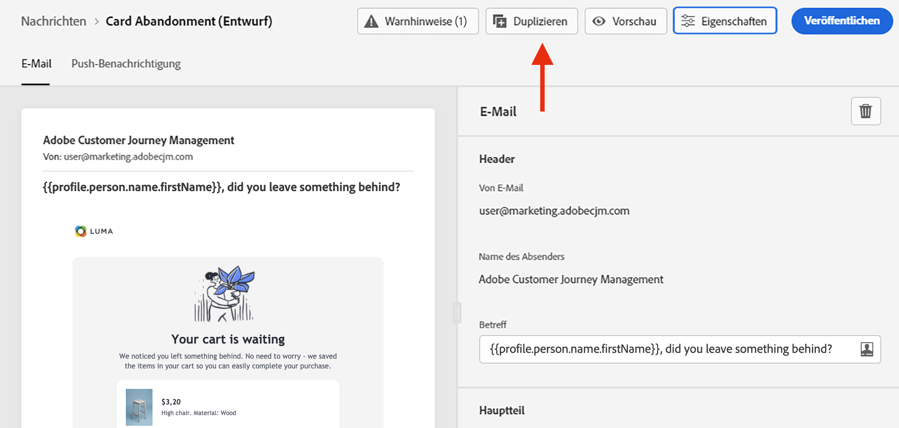
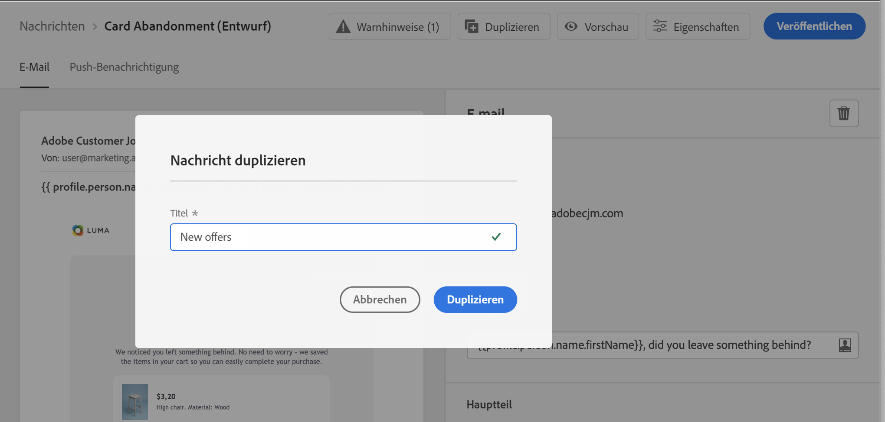
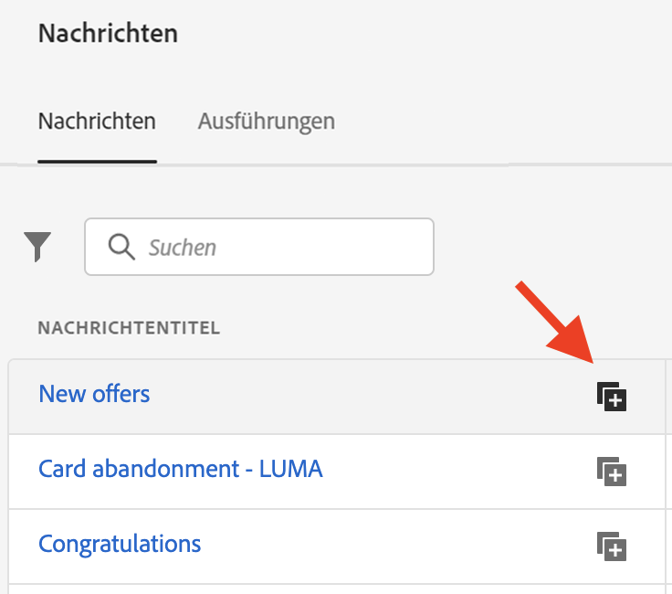

# Nachricht {#create-message} erstellen

Meldungen sind über den Tastaturbefehl **[!UICONTROL Nachrichten]** auf der linken Leiste verfügbar. Alle Nachrichten werden aufgelistet, sortiert nach Veröffentlichungsdatum (für veröffentlichte Nachrichten) oder Erstellungsdatum (für Nachrichtenentwürfe).

>[!NOTE]
>
>Jeder Benutzer kann auf Nachrichten zugreifen, Nachrichten erstellen, bearbeiten und veröffentlichen. Weitere Informationen zu Benutzerberechtigungen [in diesem Abschnitt ](permissions.md).

Verwenden Sie den Umschalter **[!UICONTROL Neuigkeiten anzeigen]**, um den Nachrichten, auf die Sie in den letzten 5 Tagen zugegriffen haben, direkte Links hinzuzufügen.

Verwenden Sie das Filtersymbol, um nur entworfene, veröffentlichte oder veröffentlichte Nachrichten anzuzeigen. Sie können auch auf der Meldungsbeschriftung suchen:

## Neue Nachricht erstellen

Gehen Sie wie folgt vor, um eine neue Nachricht zu erstellen:

1. Rufen Sie die Liste der Nachricht auf und klicken Sie dann auf **[!UICONTROL Nachricht erstellen]**.

1. Definieren Sie die Nachrichteneigenschaften.

   

   * Geben Sie einen **[!UICONTROL Titel]** (obligatorisch) und einen **[!UICONTROL Beschreibung]** ein.

   * Wählen Sie **[!UICONTROL Vorgabe]** aus, die für die Nachricht verwendet werden soll.

      Vorgaben enthalten alle Parameter, die erforderlich sind, damit eine E-Mail- und/oder Push-Benachrichtigung entsprechend Ihrer Marke gesendet werden kann. [Erfahren Sie mehr über das Branding](configuration/about-subdomain-delegation.md).

   * Wählen Sie die Kanal aus, die Sie für diese Meldung verwenden möchten: E-Mail- und/oder Push-Benachrichtigung. Sie müssen mindestens einen Kanal auswählen, um die Nachricht erstellen zu können.
   Beachten Sie, dass Sie jederzeit über die Schaltfläche **[!UICONTROL Eigenschaften]** auf den Titel, die Beschreibung und die Vorgabe der Nachricht zugreifen und diese ändern können.

   

1. Klicken Sie auf **[!UICONTROL Erstellen]**, um die Erstellung der Nachricht zu bestätigen. Ihre Nachricht wird in der Liste der Nachricht im Status **[!UICONTROL Entwurf]** hinzugefügt.

   Für jeden ausgewählten Kanal steht eine Registerkarte zur Verfügung. Verwenden Sie diese Registerkarten, um den Inhalt für jeden Kanal zu konfigurieren. Sie können eine Registerkarte entfernen, indem Sie sie markieren und auf der rechten Seite auf die Schaltfläche **[!UICONTROL Kanal löschen]** klicken.

   

   Sie können jetzt den Inhalt der Nachricht erstellen und Einstellungen anpassen. Ausführliche Informationen zur Konfiguration von E-Mail- und Push-Benachrichtigungen finden Sie in den folgenden Abschnitten:

   * [E-Mails konfigurieren](configure-email.md)
   * [Push-Benachrichtigungen konfigurieren](configure-push.md)

   >[!NOTE]
   >   
   >Sie können Ihre Nachrichten mit den Daten der Profile im Ausdruck-Editor personalisieren. Weitere Informationen zur Personalisierung finden Sie in [diesem Abschnitt](personalization/personalize.md).

1. Kontrollieren Sie das Rendering Ihrer Nachrichten und überprüfen Sie die Personalisierungseinstellungen mit den Test-Profilen, indem Sie den Abschnitt &quot;Vorschau&quot;auf der linken Seite verwenden. Weitere Informationen finden Sie in [diesem Abschnitt](preview.md).

   

1. Überprüfen Sie Warnungen im oberen Bereich des Editors.  Einige davon sind einfache Warnungen, andere können Sie daran hindern, die Nachricht zu veröffentlichen. Weiterführende Informationen finden Sie in diesem [Abschnitt](alerts.md).

1. Sie können Ihre Nachricht jetzt veröffentlichen, indem Sie auf die Schaltfläche **[!UICONTROL Veröffentlichen]** klicken oder sie als Entwurf beibehalten und später veröffentlichen. Weitere Informationen zum Veröffentlichen von Nachrichten finden Sie in [diesem Abschnitt](publish-manage-message.md).

## Duplikat einer Nachricht

Um eine Nachricht aus einer vorhandenen Nachricht zu erstellen, verwenden Sie die Schaltfläche **[!UICONTROL Duplikat]** in der Nachrichtenschnittstelle. Alle Einstellungen und Konfigurationen werden in die neue Nachricht kopiert

Sie können die Nachricht umbenennen, bevor Sie die Duplizierung bestätigen.

Eine Bestätigungsmeldung wird am unteren Rand des Fensters angezeigt, sobald die neue Nachricht erstellt wurde.

Sie können eine Nachricht auch über die Liste der Nachricht mit dem dedizierten Symbol Duplikat haben.

Es gilt der gleiche Bestätigungsprozess.
