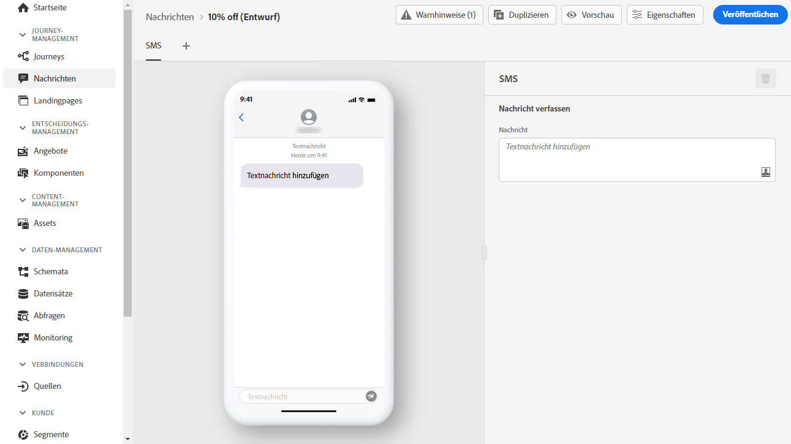
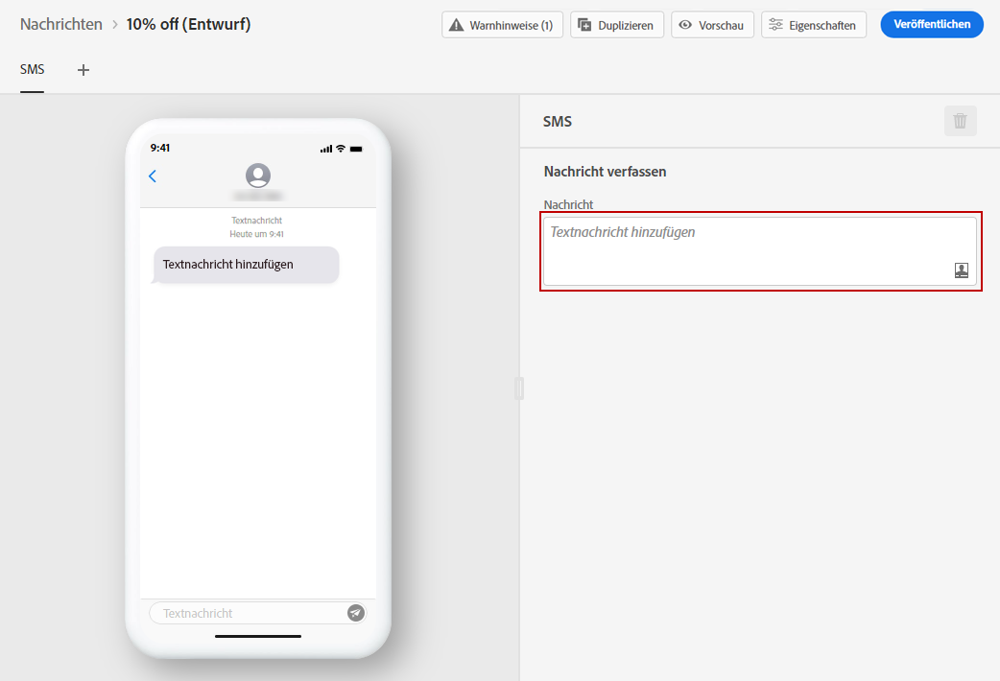

# SMS erstellen {#create-sms}

>[!CAUTION]
>
> Die Verwendung des SMS-Kanals ist derzeit nur für ausgewählte Benutzer verfügbar. Wenn Sie diese Funktion nutzen möchten, wenden Sie sich an Ihren Kundenbetreuer bei der Adobe.

Einmal [eine Nachricht erstellt haben](create-message.md), verwenden Sie die **[!UICONTROL SMS]** um die Einstellungen und den Inhalt für den SMS-Kanal zu definieren.

Gehen Sie wie folgt vor, um mit der Personalisierung Ihrer SMS zu beginnen:

1. Klicken Sie auf **[!UICONTROL Textnachricht hinzufügen]** -Feld, um den Ausdruckseditor zu öffnen.

   

1. Mit dem Ausdruckseditor können Sie Inhalt und Personalisierungsdaten definieren. Weitere Informationen zur Personalisierung im Ausdruckseditor finden Sie in [diesem Abschnitt](personalization/personalize.md).

   >[!NOTE]
   >
   > SMS-Nachrichten sind auf eine Länge von 160 Zeichen begrenzt.

   

1. Klicken **[!UICONTROL Speichern]** wenn Ihre personalisierte Nachricht fertig ist.

1. Klicken **[!UICONTROL Vorschau]** um zu visualisieren, wie Ihre SMS-Nachricht auf Mobilgeräten angezeigt wird. Weiterführende Informationen hierzu finden Sie in [diesem Abschnitt](preview.md).

1. Sobald Ihre Nachricht fertig ist, können Sie sie veröffentlichen, um sie für die Ausführung mit der **[!UICONTROL Veröffentlichen]** Schaltfläche. Durch diese Aktion wird die neue Version der Nachricht veröffentlicht, die für die nächsten Ausführungen in Ihren Journey verwendet wird.

Ihre SMS-Nachricht kann jetzt in einer Journey verwendet werden. [Erfahren Sie, wie Sie Journey erstellen](building-journeys/journey-gs.md).

**Verwandte Themen**

* [SMS-Kanal konfigurieren](configuration/sms-configuration.md)
* [Erstellen einer neuen Nachricht](create-message.md)
* [Hinzufügen einer Nachricht zu einer Journey](building-journeys/journeys-message.md)
