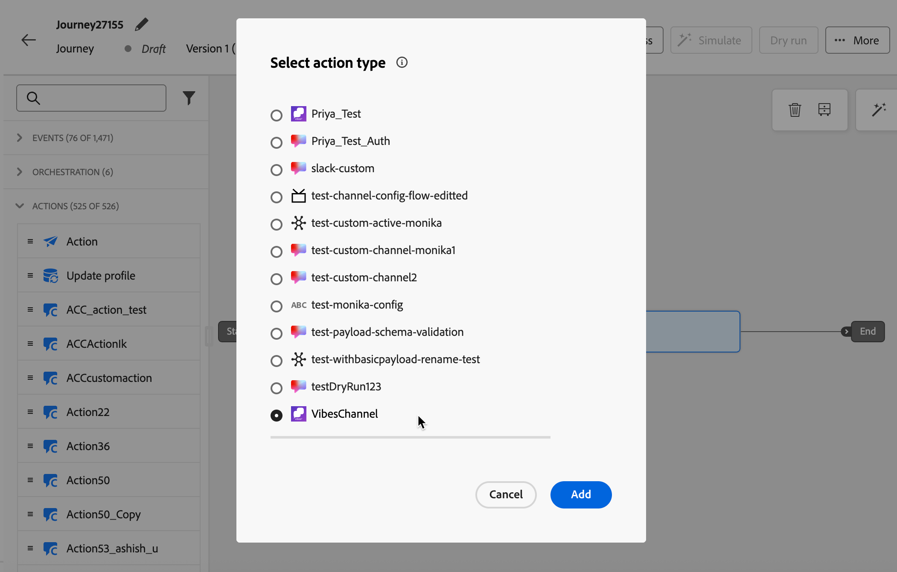

# Erstellen benutzerdefinierter Kanalerlebnisse {#create-custom-channel}

>[!AVAILABILITY]
>
>Diese Funktion ist nur eingeschränkt verfügbar. Wenden Sie sich an den Adobe-Support, um Zugriff zu erhalten.

In [!DNL Journey Optimizer] können Sie Nachrichten mithilfe benutzerdefinierter Kanäle in Kampagnen, Journey und orchestrierten Kampagnen versenden. Gehen Sie wie folgt vor, um Ihr benutzerdefiniertes Kanalerlebnis einzurichten.

>[!NOTE]
>
>Bevor Sie ein benutzerdefiniertes Kanalerlebnis erstellen, stellen Sie sicher, dass von Ihrem Administrator ein benutzerdefinierter Kanal konfiguriert wurde. [Weitere Informationen](configure-custom-channel.md)

## Hinzufügen einer benutzerdefinierten Aktion über eine Journey oder eine Kampagne {#create-custom-channel-experience}

>[!CONTEXTUALHELP]
>id="ajo_journey_action_custom_channel"
>title="Benutzerdefinierte Kanalaktion"
>abstract="Eine benutzerdefinierte Kanalaktion sendet eine Nachricht an Profile, wenn sie diesen Schritt des Journey erreichen. Die Bezeichnung identifiziert die Aktivität auf der Journey-Arbeitsfläche und die Aktion verweist auf eine benutzerdefinierte Kanalkonfiguration, die den Endpunkt, die Payload und die Anmeldeinformationen definiert, die zum Versand der Nachricht verwendet werden. Der Abschnitt **Optimierung** kann Inhaltsexperimente oder Zielgruppenbestimmungsregeln enthalten, und der Abschnitt **Zeitüberschreitung oder Fehler** kann einen alternativen Pfad definieren, wenn die Aktion fehlschlägt."
>additional-url="https://experienceleague.adobe.com/de/docs/journey-optimizer/using/orchestrate-journeys/about-journey-building/journey-action#add-action" text="Erste Schritte mit benutzerdefinierten Kanälen"


>[!BEGINTABS]

>[!TAB Hinzufügen eines benutzerdefinierten Kanals zu einer Journey]

Benutzerdefinierte Kanäle werden im Abschnitt **[!UICONTROL Aktionen]** der Journey-Arbeitsfläche angezeigt, die nach ihrem Anzeigenamen und ihrem benutzerdefinierten Symbol aufgeführt sind, wie in Channel Builder definiert.

So fügen Sie eine benutzerdefinierte Kanalaktion zu einer Journey hinzu:

1. [Erstellen einer Journey](../building-journeys/journey-gs.md)

1. Beginnen Sie Ihre Journey mit einem [Ereignis](../building-journeys/general-events.md) oder einer Aktivität vom Typ [Zielgruppe lesen](../building-journeys/read-audience.md).

1. Ziehen Sie eine Aktivität **[!UICONTROL Aktion]** per Drag-and-Drop aus dem Abschnitt **[!UICONTROL Aktionen]** der Palette. Weitere Informationen über die [Aktionsaktivität](../building-journeys/journey-action.md).

1. Wählen **[!UICONTROL in der]**-Liste „Aktion“ den gewünschten benutzerdefinierten Kanal aus. Benutzerdefinierte Kanäle werden durch den Namen und das Symbol aufgelistet, die im Kanal Builder zugewiesen sind.

   {width="80%"}

1. Fügen Sie Ihrer Aktion einen Titel hinzu, klicken Sie im rechten Bereich auf **[!DNL Configure action]** und wählen Sie die **[!UICONTROL Kanalkonfiguration]** aus. [Erfahren Sie, wie Sie eine benutzerdefinierte Kanalkonfiguration erstellen](custom-channel-configuration.md#create-channel-config)

1. Klicken Sie im Abschnitt **[!UICONTROL Nachricht]** auf **[!UICONTROL Inhalt bearbeiten]**, um den Payload-Editor zu öffnen und Ihre Nachricht zu erstellen. [Erfahren Sie, wie Sie Inhalte erstellen](#author-content)

1. Schließen Sie den Journey-Ablauf ab, indem Sie bei Bedarf zusätzliche Schritte hinzufügen, und veröffentlichen Sie dann die Journey. [Weitere Informationen](../building-journeys/journey-gs.md)

>[!TAB Erstellen einer benutzerdefinierten Kanalkampagne]

So verwenden Sie einen benutzerdefinierten Kanal in einer Kampagne:

1. [Erstellen einer Kampagne](../campaigns/create-campaign.md).

1. Kampagnentyp auswählen:

   * **[!UICONTROL Geplant - Marketing]** - Wird sofort oder an einem bestimmten Datum ausgeführt. Konzipiert für Marketing-Nachrichten, konfiguriert über die Benutzeroberfläche.
   * **[!UICONTROL API-ausgelöst - Marketing/Transaktion]** - Wird über einen API-Aufruf ausgeführt. Entwickelt für ereignisausgelöstes Messaging (z. B. Bestellbestätigungen oder Zurücksetzen von Passwörtern). [Weitere Informationen](../campaigns/api-triggered-campaigns.md)

1. Schließen Sie die Kampagneneinrichtung ab: Kampagneneigenschaften[ &quot;](../audience/about-audiences.md)&quot; und [Zeitplan](../campaigns/create-campaign.md#schedule).

1. Wählen **[!UICONTROL im Abschnitt]** den benutzerdefinierten Kanal aus der Kanalauswahl aus. Alle benutzerdefinierten Kanäle, die in Ihrer Sandbox konfiguriert sind, werden neben nativen Kanälen angezeigt.

   {width="80%"}

1. Wählen oder erstellen Sie die **[!UICONTROL Kanalkonfiguration]**, die verwendet werden soll. [Erfahren Sie, wie Sie eine Kanalkonfiguration erstellen](custom-channel-configuration.md#create-channel-config)

1. Optional können Sie **[!UICONTROL Aktions-Tracking]** aktivieren, um automatisch Links in Ihrer Nachrichten-Payload zu verfolgen (erfordert eine für benutzerdefinierte Kanäle konfigurierte Subdomain). [Erfahren Sie, wie Sie eine Subdomain für benutzerdefinierte Kanäle delegieren](custom-channel-subdomains.md#subdomain-delegation)

1. Im Abschnitt **[!UICONTROL Optimierung]** haben Sie folgende Möglichkeiten:

   * **[!UICONTROL Erstellen von Zielgruppenregeln]** um verschiedene Nachrichten an verschiedene Segmente Ihrer Audience zu senden. [Weitere Informationen](../campaigns/create-campaign.md#targeting)
   * Klicken Sie **[!UICONTROL Experiment erstellen]**, um A/B-Tests für Ihre benutzerdefinierten Kanalnachrichten durchzuführen. [Weitere Informationen](../campaigns/create-campaign.md#content-experiment)

1. Klicken Sie **[!UICONTROL Inhalt bearbeiten]**, um den Payload-Editor zu öffnen und Ihre Nachricht zu erstellen. [Erfahren Sie, wie Sie Inhalte erstellen](#author-content)

1. Kampagne überprüfen und aktivieren [Weitere Informationen](../campaigns/create-campaign.md)

<!--
>[!TAB Add a custom channel to an orchestrated campaign]

Custom channels appear in the channel selection list in the orchestrated Campaigns canvas, below the native channels, with their custom icon and display name.

To add a custom channel in an orchestrated campaign:

1. Open or create an orchestrated campaign.

1. In the canvas, add a channel action node and select your custom channel from the list.

1. Select the **[!UICONTROL Channel configuration]** to use. Ensure the configuration includes the **[!UICONTROL Execution details]** section required for orchestrated campaigns.

1. Click **[!UICONTROL Edit content]** to open the payload editor and author your message. [Learn how to author content](#author-content)
-->

>[!ENDTABS]

## Erstellen benutzerdefinierter Kanalinhalte {#author-content}

Der Inhaltseditor spiegelt die Payload-Struktur wider, die Sie beim Konfigurieren des benutzerdefinierten Kanals definiert haben. Klicken Sie **[!UICONTROL Code bearbeiten]**, um den Payload-Editor zu öffnen und den Nachrichteninhalt einzugeben.

{width="80%"}

Es werden die Felder angezeigt, die Sie erstellen und personalisieren können. Sie können den Personalisierungseditor von [!DNL Journey Optimizer] mit allen Personalisierungs- und Bearbeitungsfunktionen nutzen. [Weitere Informationen](../personalization/personalization-build-expressions.md)

>[!NOTE]
>
>Es werden nur JSON-Payloads unterstützt. Wenn Ihre benutzerdefinierte Kanal-Payload nicht JSON ist, können Sie einen JSON-Wrapper verwenden, um Ihren Inhalt einzukapseln. Wenn Ihre Payload beispielsweise XML ist, können Sie sie in ein JSON-Objekt wie das folgende einschließen:
>
>```json
>{
>   "payload": "<xml>...</xml>"
>}
>```

### Payload personalisieren {#personalize}

Die vollständigen Personalisierungsfunktionen von [!DNL Journey Optimizer] sind im Payload-Editor verfügbar:

* **Profilattribute** - Fügen Sie beliebige XDM-Profilattribute ein, z. B. `{{profile.person.name.firstName}}` oder eine benutzerdefinierte Identität wie eine Benutzer-ID der Messaging-Plattform, die in einem benutzerdefinierten Namespace gespeichert ist.
* **Kontextuelle Attribute** - Verwenden Sie Journey-Ereignisattribute oder kontextuelle Kampagnendaten, die zum Versandzeitpunkt aufgelöst wurden.
* **Hilfsfunktionen** - Formatieren Sie Werte mithilfe integrierter Zeichenfolgen-, Datums- oder arithmetischer Funktionen. [Weitere Informationen](../personalization/functions/helpers.md)
* **Ausdrucksfragmente** - Wiederverwenden freigegebener Personalisierungslogik über mehrere Kanäle und Kampagnen hinweg. [Weitere Informationen](../content-management/customizable-fragments.md)

>[!CAUTION]
>
>Derzeit findet keine Validierung der Payload zum Zeitpunkt der Bearbeitung statt. Mit der Funktion **[!UICONTROL Inhalt simulieren]** können Sie überprüfen, ob Ihre Payload ein wohlgeformtes JSON ist und ob alle Personalisierungsausdrücke für Ihre Testprofile korrekt aufgelöst werden. [Weitere Informationen](test-custom-channel.md#simulate-content)

### Beispiel-Payload {#example-payload}

Das folgende Beispiel zeigt eine JSON-Payload mit Profilpersonalisierung für einen benutzerdefinierten Nachrichtenkanal<!--(to be replaced with a meaningful realistic example)-->:

```json
{
  "recipient_id": "{{profile.mobilePhone.number}}",
  "message_text": "Hello {{profile.person.name.firstName}}, your order {{context.journey.events.0.commerce.order.purchaseID}} has been confirmed.",
  "channel": "my-custom-channel",
  "image": {
    "id": "{{profile.preferences.imageId | default('default-image-001')}}"
  }
}
```

### Verfolgen von Links in der Payload {#track-links}

Um einen getrackten Link in Ihre benutzerdefinierte Kanal-Payload einzuschließen, sodass Klicks automatisch verfolgt und in den Reporting-Dashboards des Kanals sichtbar sind, umschließen Sie die URL mit der folgenden Handlebar-Syntax:

```
{{url trackedUrl='' originalUrl='https://example.com/' type='TRACKED'}}
```

* `originalUrl` - Die Ziel-URL, an die Sie den Empfänger weiterleiten möchten.
* `trackedUrl` - Lassen Sie dieses Feld leer; [!DNL Journey Optimizer] füllt es zum Versandzeitpunkt automatisch mit der Tracking-fähigen Umleitungs-URL.
* `type` - Muss auf `TRACKED` gesetzt werden.

>[!NOTE]
>
>Für das Linktracking ist eine Subdomain erforderlich, die für benutzerdefinierte Kanäle konfiguriert ist. [Erfahren Sie, wie Sie eine Subdomain für benutzerdefinierte Kanäle delegieren](custom-channel-subdomains.md#subdomain-delegation)

**Beispiel - getrackter Link in einer LINE-Payload:**

```json
{
  "to": "{{profile.mobilePhone.number}}",
  "messages": [
    {
      "type": "text",
      "text": "Hello! Check out our latest offer: {{url trackedUrl='' originalUrl='https://example.com/' type='TRACKED'}}"
    }
  ]
}
```

<!--
### Strict JSON mode {#strict-json}

The editor supports a **[!UICONTROL Strict JSON]** toggle:

* **Strict JSON: Off (default)** – The editor accepts any payload content, including personalization helpers and functions that may temporarily produce non-JSON syntax. A warning is displayed at the **Review to Activate** step if the payload is not well-formed JSON, prompting you to simulate and proof before publishing.
* **Strict JSON: On** – The editor validates that the payload is well-formed JSON as you type. At the **Review to Activate** step, [!DNL Journey Optimizer] validates the payload against the channel schema and flags missing required fields or type mismatches as errors that must be resolved before activation.
-->

## Aktivieren des benutzerspezifischen Kanalerlebnisses {#activate}

>[!IMPORTANT]
>
>Vorschau und Test der benutzerdefinierten Kanal-Payload vor der Aktivierung. [Weitere Informationen](test-custom-channel.md)
>
>Wenn für Ihre Kampagne oder Ihren Journey eine Validierungsrichtlinie gilt, müssen Sie vor der Aktivierung eine Validierung anfordern. [Weitere Informationen](../test-approve/gs-approval.md)

* **Von einer Journey** - Klicken Sie **[!UICONTROL Veröffentlichen]** im oberen rechten Bereich. Der Journey wird live geschaltet und ruft Ihren externen Endpunkt auf, um Profile zu qualifizieren.
* **Von einer Kampagne** - Klicken Sie auf **[!UICONTROL Zum Aktivieren überprüfen]**, überprüfen Sie Ihre Einstellungen und klicken Sie dann auf **[!UICONTROL Aktivieren]**. Die Kampagne nimmt den **[!UICONTROL Live]**-Status an (oder **[!UICONTROL Geplant]** wenn ein künftiges Startdatum definiert wurde).
