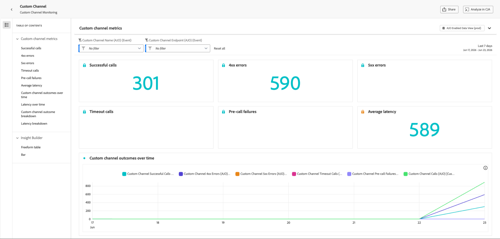

# Überwachen benutzerdefinierter Kanäle {#monitor-custom-channel}

Sobald ein benutzerdefinierter Kanal erstellt und aktiviert wurde, können Sie [seinen Lebenszyklus verwalten](create-custom-channel.md#access-channel-builder) und die Versandleistung über die [!DNL Journey Optimizer] überwachen.

## Nutzen von Kampagnen- und Journey-Berichten {#reporting}

[!DNL Journey Optimizer] bietet vordefinierte Berichte für benutzerdefinierte Kanäle.

Die folgenden Metriken sind für benutzerdefinierte Kanäle sowohl in Live- (24 Stunden) als auch in globalen (CJA) Berichten verfügbar.<!--TBC and add or replace with CJA link when available-->

| Metrik | Beschreibung |
|--------|-------------|
| **Zustellversuche** | Gesamtzahl der an den externen Endpunkt gesendeten Nachrichten. |
| **Erfolgreiche Sendungen** | Nachrichten, für die der Endpunkt eine HTTP 2xx-Antwort zurückgegeben hat. |
| **Zielgruppenprofile** | Anzahl der erreichten eindeutigen Profile. |
| **Klicks** | Anzahl der nachverfolgten Link-Klicks in der Payload. Erfordert die Delegierung einer Subdomain für benutzerdefinierte Kanäle. |
| **Fehler/Fehler** | Anzahl fehlgeschlagener Versandversuche, Aufschlüsselung nach Fehlerursache. |

Erfahren Sie mehr über [Live-](../reports/live-report.md) und [globale Berichte](../reports/report-gs-cja.md). Weitere Informationen zu Reporting-Funktionen finden Sie [dieser Dokumentation](../reports/report-cja-manage.md).

<!--
### Journey reports {#journey-reports}

To view delivery data for a custom channel action in a journey:

1. Open the journey from the **[!UICONTROL Journeys]** list.
1. Click **[!UICONTROL View report]** in the top-right area.
   * **[!UICONTROL Live report]** – Data for the last 24 hours.
   * **[!UICONTROL All time]** – Full lifetime data via Customer Journey Analytics (CJA).

### Campaign reports {#campaign-reports}

To view delivery data for a custom channel campaign:

1. Open the campaign from the **[!UICONTROL Campaigns]** list.
1. Click **[!UICONTROL Reports]** in the top-right area.

The campaign report includes execution count, successful deliveries, errors, and click data (if link tracking is enabled).
-->

## Monitoring der Versandleistung {#monitoring}

Zusätzlich zu den Kampagnen- und Journey-Berichten bietet [!DNL Journey Optimizer] ein dediziertes Dashboard zur Kanalüberwachung. Greifen Sie über **[!UICONTROL Administration]** > **[!UICONTROL Kanäle]** > **[!UICONTROL Kanal-Builder]** > **[!UICONTROL Überwachung benutzerdefinierter Kanäle]** darauf zu.

{width="100%"}

Mit diesem Dashboard können Sie die Zuverlässigkeit und Leistung der API-Aufrufe überwachen, die [!DNL Journey Optimizer] beim Versand von benutzerdefinierten Kanalnachrichten an Ihre externen Endpunkte sendet. Damit können Sie Integrationsprobleme, Latenzen und Einschränkungsbeschränkungen schnell identifizieren.

Das Dashboard **[!UICONTROL Überwachung benutzerdefinierter Kanäle]** funktioniert wie andere Echtzeitberichte in [!DNL Journey Optimizer]. Sie können einen Zeitraum auswählen, nach Kanal oder Endpunkt filtern und einen Drilldown durchführen, um die Kampagnen und Journey anzuzeigen, die auf den einzelnen benutzerdefinierten Kanälen basieren. [Weitere Informationen](../reports/report-cja-manage.md)

### Benutzerdefinierte Kanalmetriken {#monitoring-kpis}

Der Abschnitt **[!UICONTROL Benutzerdefinierte Kanalmetriken]** bietet eine konsolidierte Ansicht der Betriebssicherheit und Zuverlässigkeit Ihrer benutzerdefinierten Kanalaufrufe.

{width="100%"}

+++ Weitere Informationen zu benutzerdefinierten Kanalmetriken

* **[!UICONTROL Erfolgreiche Aufrufe]**: Gesamtzahl der HTTP-Aufrufe, die eine gültige Antwort ohne Fehler zurückgegeben haben.

* **[!UICONTROL 4xx/5xx-Fehler]**: Anzahl fehlgeschlagener Aufrufe aufgrund von Client-seitigen (4xx) oder Server-seitigen (5xx) Fehlern, wobei Konfigurationsprobleme oder Endpunktfehler hervorgehoben werden.

* **[!UICONTROL Zeitüberschreitungsaufrufe]**: Anzahl der Aufrufe, die fehlgeschlagen sind, weil sie die maximale Antwortzeit überschritten haben. Dies hilft bei der Ermittlung von Latenz- oder Leistungsproblemen mit externen Endpunkten.

* **[!UICONTROL Fehler vor dem Aufruf]**: Anzahl der benutzerdefinierten Kanalsendungen, die fehlgeschlagen sind, bevor der HTTP-Aufruf jemals an den externen Endpunkt gesendet wurde. Diese Fehler treten in der [!DNL Journey Optimizer]-eigenen Infrastrukturschicht auf - nicht in Ihrem externen System. Es gibt drei Kategorien:

  | Kategorie | Beschreibung |
  |----------|-------------|
  | **Authentifizierungsfehler** (`AUTH_*`) | [!DNL Journey Optimizer] OAuth-Token oder -Anmeldeinformationen, die zum Aufrufen des Endpunkts erforderlich sind, konnten nicht abgerufen oder aktualisiert werden. Überprüfen Sie, ob die mit der Kanalkonfiguration verknüpften API-Anmeldeinformationen gültig sind und nicht abgelaufen sind. |
  | **Fehler beim Anforderungsgenerieren** (`REQUEST_GENERATION_ERROR`) | [!DNL Journey Optimizer] konnte keine gültige HTTP-Anfrage erstellen - z. B. weil eine URL-Vorlage nicht aufgelöst werden konnte oder ein erforderliches Personalisierungsfeld fehlte. |
  | **HTTP-Analysefehler** (`HTTP_PARSE_ERROR`) | [!DNL Journey Optimizer] erhielt eine Antwort vom Endpunkt, konnte sie jedoch nicht in eine verwendbare Struktur parsen. |

  >[!TIP]
  >
  >Fehler bei der Vorab-Abfrage weisen auf ein Problem auf der [!DNL Journey Optimizer] Seite oder in der Kanalkonfiguration hin und nicht auf ein Problem mit Ihrem externen Endpunkt. Lesen Sie zunächst die API-Anmeldeinformationen und die erforderlichen Payload-Felder, um die Fehlerbehebung zu starten.

* **[!UICONTROL Durchschnittliche Latenz]**: Durchschnittliche End-to-End-Antwortzeit (in Millisekunden) für alle HTTP-Aufrufe, einschließlich erfolgreicher Aufrufe, Fehler und Zeitüberschreitungen.

<!--
* **[!UICONTROL Capped calls]**: Number of calls that were blocked due to capping limits, ensuring downstream systems are not overloaded.

* **[!UICONTROL Average RPS]**: Number of requests per second processed by the custom channel over the selected time range.

* **[!UICONTROL Average successful latency]**: Average end-to-end response time (in milliseconds) for successful calls only, excluding failed requests and timeouts.

* **[!UICONTROL Average queue time]**: Average time (in milliseconds) calls spent waiting in the execution queue before being sent. This only applies to throttled endpoints, where [!DNL Journey Optimizer] queues calls when the throughput limit is reached.
-->

+++

### Ergebnisse benutzerdefinierter Kanäle im Zeitverlauf {#outcomes-overtime}

{width="100%"}

Das Diagramm **[!UICONTROL Ergebnisse benutzerdefinierter Kanäle im]**) zeigt den KPI-Trend der HTTP-Aufrufe über den ausgewählten Zeitraum an. Die Granularität der Zeitreihe hängt vom ausgewählten Zeitbereich ab:

* Bei einem 7-Tage-Bericht zeigt jeder Datenpunkt die KPIs für einen Tag an.
* Für einen Zeitraum von 1 Tag zeigt das Diagramm die KPIs pro Stunde an.
* Für einen Zeitraum von 1 Stunde zeigt das Diagramm die KPIs pro Minute an.

### Latenz im Zeitverlauf {#latency-overtime}

{width="100%"}

Das **[!UICONTROL Latenz im Zeitverlauf]** Diagramm visualisiert den Trend der Latenzmetriken über den ausgewählten Zeitraum. Diese Zeitreihenansicht ermöglicht es Ihnen, Leistungsmuster zu verfolgen, Spitzenlatenzzeiten zu identifizieren und die Auswirkungen von Optimierungen oder Systemänderungen im Laufe der Zeit zu überwachen.

### Benutzerdefinierte Ergebnisaufschlüsselung des Kanals {#outcome-breakdown}

{width="100%"}

Die Tabelle **[!UICONTROL Benutzerdefinierte Kanalergebnisaufschlüsselung]** bietet eine hierarchische Aufschlüsselung der HTTP-Aufrufmetriken - von den Gesamtmetriken pro Endpunkt auf der obersten Ebene über Metriken pro benutzerdefiniertem Kanal unter Verwendung dieses Endpunkts bis hin zu den Kampagnen und Journey, die auf ihnen auf der untersten Ebene basieren.

### Latenzaufschlüsselung {#latency-breakdown}

Die **[!UICONTROL Latenzaufschlüsselung]** Tabelle bietet eine detaillierte Aufschlüsselung der Latenzmetriken über Ihre benutzerdefinierten Kanäle hinweg. In dieser Ansicht können Sie ermitteln, bei welchen Endpunkten oder Kanälen Leistungsprobleme auftreten, sodass Sie Latenzengpässe effektiv ermitteln und beheben können.

### Insight Builder {#insight-builder}

Verwenden Sie den **[!UICONTROL Insight Builder]** um benutzerdefinierte Visualisierungen und Dashboards basierend auf den benutzerdefinierten Kanalmetriken zu erstellen. Mit diesem Tool können Sie mehrere KPIs kombinieren, Filter anwenden und maßgeschneiderte Ansichten erstellen, die Ihren Überwachungs- und Reporting-Anforderungen entsprechen. [Weitere Informationen](../reports/report-cja-manage.md#insight-builder)

## Fehlerbehebung {#troubleshooting}

Wenn Sie auf Probleme mit Ihrem benutzerdefinierten Kanal stoßen, sind in der folgenden Tabelle häufige Symptome, mögliche Ursachen und empfohlene Lösungen aufgeführt.

| Symptom | Mögliche Ursache | Lösung |
|---------|----------------|------------|
| **HTTP 401/403-Fehler** | Authentifizierungsfehler - Anmeldeinformationen sind abgelaufen oder falsch. | Aktualisieren Sie die Anmeldeinformationen unter **[!UICONTROL Administration]** > **[!UICONTROL Kanäle]** > **[!UICONTROL API-Anmeldeinformationen]**. |
| **HTTP 429-Fehler** | Der externe Endpunkt drosselt Anfragen von [!DNL Journey Optimizer]. | Überprüfen Sie die Ratenbeschränkungen Ihres Endpunkts. Verringern Sie die Drosselungseinstellung in der Richtlinienkonfiguration von Channel Builder. |
| **HTTP 5xx-Fehler** | Externes System ist ausgefallen oder gibt Server-Fehler zurück. | Überprüfen Sie das Zustands-Dashboard Ihres externen Systems. Konfigurieren Sie Fehlerpfade für die Aktionsaktivität Journey, um vorübergehende Fehler kontrolliert zu behandeln. |
| **Nicht aufgelöste Personalisierungs-Token** | Ausdruck verweist auf ein Attribut, das im Profil nicht vorhanden ist. | Überprüfen Sie, ob der XDM-Attributpfad korrekt ist. Fügen Sie einen Standardwert für Fallback hinzu: `{{profile.person.name.firstName \| default("Valued Customer")}}`. |
| **Fehler bei der erforderlichen Feldüberprüfung** | Ein erforderliches Payload-Feld hat zum Zeitpunkt der Bearbeitung keinen Wert. | Stellen Sie sicher, dass alle erforderlichen Felder im Inhaltseditor ausgefüllt sind. Alternativ können Sie die erforderliche Einschränkung im Kanal-Builder entfernen, wenn das Feld wirklich optional ist. |

<!--
## Related resources {#related}

* [Get started with custom channels](get-started-custom-channel.md)
* [Configure a custom channel](custom-channel-configuration.md)
* [Global report overview](../reports/report-gs-cja.md)
* [Journey live report](../reports/live-report.md
-->